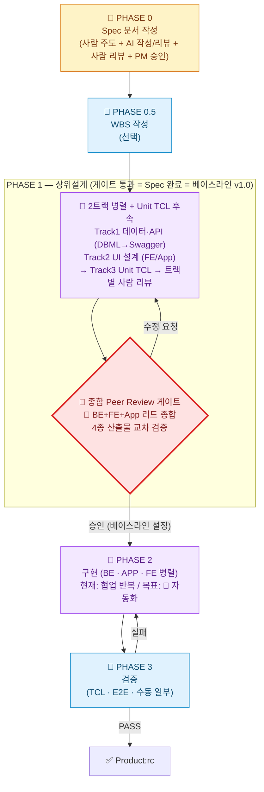

# Agentic Dev Chain — 팀 개발자 브리핑 (TO-BE 요약)

**한 줄 목적**: 문토 개발팀이 `Agentic Dev Chain` 의 TO-BE 프로세스를 *10~15 분* 안에 파악하고 본인 업무에 어떻게 적용할지 알 수 있게 한다.

**대상**: 문토 개발자 · 리드 · 코치
**기준 일자**: 2026-05-20 (TO-BE 3차 보강 반영)
**상세 가이드**: 본 브리핑은 *요약본*이다. 전체 다이어그램·표·근거는 별도 문서 **`2026-05-harness-TO-BE.md`** (TO-BE 프로세스 가이드) 를 참고한다. AS-IS 의 문제 진단은 **`2026-05-harness-AS-IS.md`** 에서 다룬다. 학습 로드맵은 **`2026-05-harness-learning-guide.md`** 에 있다.

---

## 1. 한 페이지 요약 — 무엇이 어떻게 바뀌나

### 핵심 메시지

> **사람이 핵심만 정확히 잡으면, AI 가 살을 붙이고, 구현·테스트는 24 시간 무인으로 돈다.**
> 사람 개입은 *줄이는 것* 이 목적이 아니라, *꼭 필요한 곳에 집중* 시키는 것이 목적이다.

### TO-BE 가 AS-IS 대비 추가/강화한 것 (요점 9 가지)

| # | 무엇이 새로 박혔나 | 왜 |
| --- | --- | --- |
| 1 | **Spec 의 범위 = SRS + DBML + Swagger + UI + Unit TCL** | Spec 끝 = 문서 끝 이 아니라 *상위설계까지 합의된 시점*. 잘 분석된 Spec 은 상위설계까지 다루는 것이 SW 공학 표준 |
| 2 | **PHASE 1 종합 Peer Review 게이트 = 베이스라인 v1.0 설정** | 통과 이후 4 종 산출물을 동결. 누가 마음대로 못 바꿈, 변경은 §9 절차 |
| 3 | **PHASE 0 사람 리뷰가 AI 형식 리뷰와 별도로 필수** | AI 가 잡는 것(형식·표준) ≠ 사람이 잡는 것(비즈니스 모순·도메인 함정). 둘 다 필요 |
| 4 | **PHASE 1 이 2 트랙 병렬 + Unit TCL 후속 구조** | Track1 데이터/API (DBML→Swagger), Track2 UI, 두 트랙 확정 후 Track3 TCL |
| 5 | **사람 핵심 개입 체크리스트 명시** | 사람 일을 줄이려는 게 아니라 *어디가 사람 필수인지 명확히* 함 |
| 6 | **베이스라인 변경 관리 절차 (CCB) 신설** | 베이스라인 이후 변경은 영향도 평가 → CCB 결정 → 베이스라인 갱신 → AI 정합성 재검증 |
| 7 | **AI 시대 행동 패턴을 막는 4 가지 검증 메커니즘** | *"AI 가 썼으니 내 책임 아님 / 모르는 용어 그냥 넘기기 / 1 안 통과"* 3 가지 함정을 막는 ① 책임 전환 원칙 ② 자기점검 체크리스트 ③ Glossary 의무화 ④ 대안 검토 강제 *(§3 강조 박스 참조)* |
| 8 | **PHASE 2 무인 실행 모드 (오케스트레이션 루프)** | 야간 무인 구현·검증·PR 생성을 위한 운영 규칙. **무인화 범위는 PHASE 2 구현·검증·PR 생성까지** — PHASE 0/1 사람 게이트와 PR 머지는 무인화 비대상. 검증은 *오케스트레이터가 판정* (에이전트 자기 보고 X), 베이스라인 산출물 불변 |
| 9 | **Implementation Plan (구현계획서, IP) — PHASE 1 의 마지막 활동** *(NEW)* | Spec 이 완벽해도 *"Task 1 번 구현해"* 라고만 지시하면 매 Task 마다 *어느 Repo · 어느 파일 · 어느 섹션 · 어느 TCL 케이스* 를 사람이 다시 설명해야 한다 → 무인 자동화 불가능. **IP = Spec 을 무인 실행 가능한 형태로 변환한 단일 문서.** Task별 *Spec 참조 경로 4 요소 · DoD · 의존성 DAG · Repo 매핑* 사전 박음. 멀티 Repo 베이스라인(Repo n 개의 SHA 묶음) 도 IP 헤더가 잠금 |

### 우리 팀이 *오늘부터* 다르게 해야 할 일 — 6 줄

1. **SRS 끝났다고 개발 시작 금지.** DBML · Swagger · UI · TCL 까지 합의 + 종합 게이트 통과 후에만 PHASE 2 진입.
2. **AI 가 쓴 Spec 은 사람이 한 번 더 본다.** AI 형식 리뷰(`munto-spec-review`) 통과 ≠ 사람 리뷰 통과.
3. **Swagger 사람 리뷰는 BE + FE/App 같이.** 계약은 양쪽이 동시에 봐야 누락이 잡힌다.
4. **AI 가 쓴 문서를 통과시켰다면 — *당신이 쓴 것이다.*** *"AI 가 그렇게 적어서요"* 는 변명으로 인정되지 않는다. 모르는 용어는 *반드시* 질문해 확인하고, 핵심 결정은 *반드시* 대안과 비교한다. *(§3 강조 박스 참조)*
5. **무인 루프가 만든 PR 도 *사람이* 머지한다.** *CI 그린 = 자동 머지* 금지. 머지 시점에 *통과 = 인수* 원칙이 그대로 적용된다 (PR 머지자가 책임자). 무인 루프가 베이스라인 산출물 수정이 필요하다고 멈췄으면 §9 변경 관리로 위임.
6. **베이스라인 v1.0 다음 단계는 IP 작성이다.** Spec 이 끝났다고 바로 *"BE-1 구현해"* 라고 던지지 않는다. Task 별 *Spec 참조 경로 · DoD · 의존성 · Repo 매핑* 을 IP 한 장에 박은 뒤에야 PHASE 2 (유인이든 무인이든) 가 시작된다. *멀티 Repo (BE+FE+APP+harness) 프로젝트는 IP 가 곧 단일 진입점이다.*

---

## 2. 팀 공용 용어 — 같은 단어로 같은 것을 가리키자

| 용어 | 의미 | 잘못된 사용 예 → 바른 사용 예 |
| --- | --- | --- |
| **Agentic Dev Chain** | 문토의 AI 기반 개발 자동화 *방법론·총칭* | "munto-dev-assistant 프로세스" → "**Agentic Dev Chain 프로세스**" |
| **`munto-dev-assistant`** | 위 방법론을 구현한 *Agent 설정 레포* 이름. 파일·경로 가리킬 때만 사용 | "Dev Assistant 가 정의한 원칙" → "**`munto-dev-assistant` 레포의 스킬**" / "**Agentic Dev Chain 원칙**" |
| **Spec (팀 정의)** | SRS/One Pager + DBML + Swagger + UI + Unit TCL **모두 합의된 상태** | "SRS 다 썼으니 Spec 끝" → "**4 종 산출물 + 종합 Peer Review 통과 = Spec 완료**" |
| **베이스라인 (Baseline)** | PHASE 1 게이트 통과 시점에 동결된 *Spec v1.0*. 이후 변경은 §4.8 절차. **멀티 Repo 환경에서는 *Repo n 개의 Spec commit SHA n 개의 묶음*이며, IP 헤더가 이 묶음을 잠근다** | "Spec 확정" 같은 모호한 표현 → "**베이스라인 v1.0 설정 완료**" |
| **Implementation Plan (구현계획서, IP)** | PHASE 1 의 *마지막 활동*. Spec 을 *무인 실행 가능한 형태로 변환한 단일 문서*. Task 별 *Spec 참조 경로 4 요소 · DoD · 의존성 DAG · Repo 매핑* 포함. PHASE 2 (유인/무인 §4.9) 의 *유일한 입력*. **저장 위치: `munto-dev-assistant/projects/{프로젝트명}/ImplementationPlan.md`** *(프로젝트 폴더 + 고정 파일명. 옵션 서브폴더 `sessions/`·`decisions/`·`attachments/`·`spec-stubs/` 는 필요할 때만. Spec 은 BE/FE 각자 Repo 에 baseline 으로, IP 는 멀티 Repo 를 가로지르는 단일 진입점 — TO-BE §4.3 IP-0 / IP-9 참조)* | "그냥 Task 리스트" → "**IP v1.x — `munto-dev-assistant/projects/{프로젝트명}/ImplementationPlan.md` (프로젝트 폴더 1 개)**" |
| **분석 아키텍트** | PHASE 0·1 에서 사람 역할(요구 수집·정렬·검증·게이트 진행)을 책임지는 *역할명*. PM/BE 리드 겸직 가능 | "기획자가 알아서" → "**이 프로젝트 분석 아키텍트는 ○○○**" (킥오프 시 명시 지정) |
| **CCB (Change Control Board)** | 베이스라인 이후 변경 의사결정 체계. 규모에 따라 *리드 1 인 ~ 전체 리드 동기 회의* 가변 운영 | "Spec 좀 바꿔도 되죠?" → "**§4.8 절차 통해 변경 요청 등록**" |

> **명명 원칙**: 외부 발표·회의·문서 머리말에서는 *"Agentic Dev Chain"*. Git 클론·경로 표기 등 구체적 산출물을 가리킬 때만 *"`munto-dev-assistant`"*. 둘은 동의어가 아니다.

---

## 3. 7 개 핵심 원칙 (압축)

본 TO-BE 는 다음 7 가지를 기둥으로 설계되었다. 자세한 근거·예시는 TO-BE 가이드 §2.3.

| # | 원칙 | 한 줄 요약 |
| --- | --- | --- |
| ① | **Spec 정확성 우선 — *정확함 ≠ 자세함*** | AI 가 구현할 수 있는 수준이면 충분. 자세한 건 Sub스펙으로 |
| ② | **Phase → Task → Sub스펙 분해** | 큰 프로젝트는 Main Spec(인터페이스만) + Sub스펙(컴포넌트별)로. 인터페이스 정의가 병렬 개발의 핵심 |
| ③ | **사람 입력 → AI 살붙임 → 사람 확인 (3 단 필수)** | 모호하면 AI 가 추측하지 말고 *먼저 사람에게 질문* (대화식) |
| ④ | **사람 개입 "최소화 + 핵심 명확화"** | 사람 필수 일은 줄이지 않고 *명시*, 나머지는 AI 자율 |
| ⑤ | **AI 자율 작업도 완전 자동화 지향** | 스킬·규칙·서브에이전트·컨벤션 + AI/사람 Review 방법까지 가이드에 박아둠 |
| ⑥ | **테스트 완전 자동화 지향 (Unit · E2E · UI)** | UI 자동화 남은 숙제는 TO-BE §3.6 참고 |
| ⑦ | **24 시간 무인 실행 인프라 (준비 중)** | Spec 완결 → 야간 무인 실행이 ①~⑥ 의 귀결 |

> **Why-What-How 의 균형** — Spec 은 *What* 만이 아니다. **Why 가 없는 Spec 위에는 좋은 아키텍처를 설계할 수 없다.** AI 가 구현 시 *"왜 이렇게?"* 를 물을 때 답할 수 있도록, 사람 핵심 입력에 *Why* 가 반드시 들어가야 한다.

---

## ⚠️ AI 시대 가장 위험한 3 가지 함정과 4 가지 막는 메커니즘 *(전 개발자 필독)*

> **왜 이 절이 별도로 박혀 있나** — TO-BE 의 7 개 핵심 원칙은 *시스템·도구·프로세스* 차원의 처방이다. 그러나 **AI 도입 이후 실제 현장에서 발생하는 결함의 상당수는 *개발자의 행동 패턴* 에서 나온다**. 시스템이 아무리 좋아도, 사람이 다음 3 가지 함정에 빠지면 모든 게 무의미해진다.
>
> *(상세 진단은 AS-IS §5, 처방 상세는 TO-BE §3.2 · §3.4 · §4.7.2 · §4.7.3 참고)*

### 진단 — AS-IS 에서 실제로 일어나고 있는 3 가지 함정

| # | 함정 | 현장 사례 |
| --- | --- | --- |
| ① | **"AI 가 썼으니 내 책임 아님" 신드롬** | Swagger 리뷰 통과 후 PHASE 2 에서 *"BE 는 PageRequest 0-base, FE 는 1-base 로 구현"* — 둘 다 description 을 *읽지 않고* 통과시킴 |
| ② | **"모르는 용어 그냥 넘기기"** — 학습 회피와 이해 없는 통과 | AI 가 DBML 에 적은 *`UNIQUE` 제약* 의 이유를 누구도 묻지 않고 통과 → 6 개월 뒤 비즈니스 변경 시 큰 마이그레이션 비용 |
| ③ | **"1 안 통과"** — 대안 검토 회피와 *AI 제안 = 최선* 환상 | AI 가 제안한 *OAuth2 + JWT* 1 안 통과 → 트래픽 증가 후 *우리 규모엔 서버 세션 + Redis 가 적합* 임을 발견, 재작업 |

> **핵심 통찰**: *시스템이 사람을 만든다. 인간은 시스템의 결로 흐른다. AI 도입은 이 흐름을 가속한다.* 이건 도덕 문제가 아니라 **설계 문제**다. 행동 교정만으로는 풀리지 않으며, 시스템 보강(아래 4 가지)이 전제다.

### 처방 — TO-BE 가 박은 4 가지 검증 메커니즘

| # | 메커니즘 | 누가·언제·어떻게 | 어디 박혔나 |
| --- | --- | --- | --- |
| ① | **AI 출력 책임 전환 원칙** *— "통과 = 인수"* | 리뷰어가 PASS 선언 시 **본인이 직접 작성한 것과 동일한 책임**. *"AI 가 썼으니까"* 면책 금지. 리뷰어 실명 + 통과 일시 + 검토 섹션을 SRS 변경 이력에 기록 | TO-BE §3.2 · §3.4 |
| ② | **리뷰어 자기점검 체크리스트 5 개** | PASS 선언 *전* 리뷰어가 본인에게 던지고 명시적으로 답해야 하는 5 개 질문: 이해 · 모순 · Why · 누락 · 대안 점검. **체크 못 하면 통과 보류** | TO-BE §3.2 · §3.4 |
| ③ | **Glossary(용어집) 의무화 + 모르는 용어 발견 시 질문 강제** | 모든 Spec 산출물에 Glossary 부록. 리뷰어가 모르는 용어 → Glossary 조회 → 정의 없으면 작성자에게 질문 → Glossary 보강 → 재리뷰. *모른다고 말하는 비용 < 모르는 척 통과시킨 비용 × 100* | TO-BE §4.7.2 |
| ④ | **대안 검토 강제** *("AI 가 골랐겠지" 환상 차단)* | 핵심 아키텍처 결정에 *대안 검토 박스* 의무화: 고려 대안 ≥ 2 + 장단점·운영 비용·확장성 + 채택안 + 채택/기각 사유 + 재검토 조건. **AI 가 자동 1 차 작성, reviewer 가 누락 결함으로 잡음** | TO-BE §4.7.3 |

### 리뷰어를 위한 5 개 자기점검 질문 *(외워 두면 좋다)*

PASS 도장 *직전*에 본인에게 던지고 답이 *"YES"* 가 나오지 않으면 통과 보류:

1. **이해**: 이 Spec 의 *모든 용어·약어*를 내가 설명할 수 있는가? 못하면 Glossary 확인 → 정의 없으면 작성자에게 질문
2. **모순**: 같은 항목을 다른 섹션에서 *다르게* 서술하지 않았는가?
3. **Why**: 핵심 기능마다 *"왜 이렇게 결정했는지"*가 적혀 있거나, 내가 답할 수 있는가?
4. **누락**: 비슷한 도메인 함정이 이 Spec 에서 다뤄지고 있는가?
5. **대안**: 핵심 아키텍처 결정에 *고려한 대안 N 개*와 *각 대안의 트레이드오프*가 있는가?

### "AI 가 골랐겠지" 함정 깨기 — 리뷰어가 작성자에게 던질 질문 3 종 세트

- *"이 결정에서 *기각된 대안*은 무엇인가? 왜 기각됐는가?"*
- *"이 결정이 6 개월 뒤 *재검토되어야 할 조건*은 무엇인가?"*
- *"같은 결정을 *AI 없이 처음부터 다시 하라면* 같은 답이 나오겠는가? 그 이유는?"*

### 함정 ④ *(추가 — 무인 실행 시대)* — *"오케스트레이터가 통과시켰으니까 OK"* 신드롬

24 시간 무인 실행 루프(§4 의 PHASE 2 무인 모드, TO-BE §4.9) 가 들어오면 새 함정 하나가 생긴다.

| 함정 | 시스템 차원 차단 |
| --- | --- |
| **"무인 루프가 만든 PR 인데 CI 그린이니 자동 머지하자"** — 머지 시점의 사람 책임을 *오케스트레이터 통과* 로 대체하는 패턴 | ① 자동 머지 *금지* — 무인 PR 도 *사람이* 직접 머지 / ② 머지 = 인수 — *"AI 가 짰으니"* 면책 금지 / ③ 머지 전 자기점검 5 개 질문(이해·모순·Why·누락·대안) 동일 수행 / ④ 무인 루프는 베이스라인 산출물(SRS·DBML·Swagger·UI·TCL) 을 *직접 수정하지 않는다* — 변경 필요 발견 시 BLOCKER → §9 변경 관리로 위임 |

> **핵심 메시지**: 무인화는 *통과 = 인수* 원칙을 약화하는 도구가 아니라, 사람이 *진짜 결정에만 집중*하도록 만드는 도구다. *오케스트레이터의 PASS 는 머지 자격이 아니라 머지 후보일 뿐이다.*

### 함정 ⑤ *(추가 — IP 도입 후 가장 흔할 위험)* — *"Spec 만 잘 쓰면 AI 가 알아서 구현하겠지"* 신드롬

Spec 이 완벽해도 *Task 1 개당 사람이 매번 "어디 보고 뭘 만들지" 설명해야 하면* 무인 자동화는 처음부터 불가능하다. IP 가 없으면 가장 흔하게 두 패턴이 나타난다.

| 함정 | 시스템 차원 차단 |
| --- | --- |
| **"Spec 다 썼으니 *BE-1 구현해* 라고 던지면 끝"** — 매 Task 마다 *어느 Repo · 어느 파일 · 어느 섹션 · 어느 TCL 케이스 · 어느 의존 Task* 를 사람이 다시 설명. AI 컨텍스트 전달 비용이 폭증해 무인 루프 자체가 시동 불가 | ① **IP 작성을 PHASE 1 의 마지막 활동으로 의무화** (TO-BE §4.3 끝) — IP 없이 PHASE 2 진입 불가 / ② IP 의 *Task 카드* 가 *Spec 참조 4 요소 (`{repo}/{path}#{anchor}@{sha}`) · DoD · 의존성* 을 사전 박음 / ③ **IP 자체에 사람 리뷰 게이트** — IP 가 잘못되면 무인 루프가 24 시간 잘못된 방향으로 돈다. IP 통과자 = *통과 = 인수* |
| **"멀티 Repo 라 Spec 이 BE/FE 어디 있는지 매번 물어봐야 함"** — 같은 기능의 Spec 위치가 사람마다 다르게 기억됨. 6 개월 뒤 *"이거 어디 적었더라"* | ④ **IP 헤더가 *Repo + 기준 commit SHA 묶음* = 멀티-소스 베이스라인** / ⑤ Spec 작성 3 방식 매트릭스 (① 기존 수정 디폴트 / ② Sub스펙 누적 / ③ 별도 repo 예외) 가 *어디에 적을지* 매번 명시 |

> **핵심 메시지**: *Spec 은 What·Why, IP 는 How·Where·Who.* 둘은 한 쌍이며 **IP 가 빠진 Spec 은 AI 한테는 *"잘 정리된 휴지조각"***이다. 무인 실행의 *유일한 입력*은 IP 다.

---

## 4. 프로세스 한눈에 — 전체 흐름



> **다이어그램 범례** — 🤖 AI 자동 (사람은 트리거만) / 👤 사람 (사람이 직접 작성·결정) / 🔄 협업 반복 (AI 만들고 사람 검토 루프, 장기적으로 🤖 로 이전 목표) / 🚧 게이트 (사람 명시적 PASS/REJECT 결정)
>
> Phase 별 상세 다이어그램(세로형)은 TO-BE 가이드 §3.2~§3.6 참고.

---

## 5. 사람이 꼭 해야 하는 일 — 체크리스트

> 본 목록 외 영역은 AI 가 자율 진행한다. 본 목록 외에서 사람이 매번 AI 결과를 손대고 있다면 *AI 자동화 가이드가 부족하다는 신호*다.

| Phase | 단계 | 사람이 꼭 해야 하는 일 | 절대 생략 불가 이유 |
| --- | --- | --- | --- |
| **PHASE 0** | 입력 | **비즈니스 전략 · 문제 정의 · 핵심 아키텍처** 를 사람이 먼저 입력 (SRS §1.2 · §2.1 · §2.2) | 문서화되지 않은 조직 의사결정·맥락은 AI 가 추론 불가 |
| **PHASE 0** | 작성 중 | **AI 가 묻는 모호 지점에 대화식 응답** | AI 가 추측으로 메우면 핵심이 어긋남 |
| **PHASE 0** | 검토 | AI 작성 SRS 의 **핵심 전략·핵심 아키텍처** 적정성 사람 리뷰 (AI 도움 가능, 통과 판단은 사람) | AI 리뷰는 형식·표준까지만 잡음 |
| **PHASE 0** | 승인 | 🚧 **기획/PM 비즈니스 검증 승인** | 형식 통과 ≠ 제품 검증 |
| **PHASE 1** | DBML | BE 개발자가 **엔티티 · 관계 · 인덱스 · 정규화 적정성** 꼼꼼히 사람 리뷰 | 데이터 모델 결정은 운영 비용·확장성에 장기 영향 |
| **PHASE 1** | Swagger | **BE 생산자 + FE/App 소비자 입회** 꼼꼼히 사람 리뷰 | 계약 양쪽이 동시에 봐야 누락 발견 |
| **PHASE 1** | UI 설계 | FE/App 리드 사람 리뷰 (와이어프레임·상태·접근성) | 현재 UI 자동화 스킬 부재, 사람이 주도 |
| **PHASE 1** | TCL | 도메인 개발자가 **누락 케이스 · 경계값 · 실패 시나리오** 보강 | AI 가 놓친 도메인 함정을 사람이 채움 |
| **PHASE 1** | 🚧 게이트 | **BE + FE + App 리드 종합 교차 검증 + 베이스라인 v1.0 설정 결정** | 트랙 간 정합성·Spec 완료 결정 |
| **PHASE 1** | 마지막 | **Implementation Plan (IP) 작성 + IP 사람 리뷰** — Task 별 *Spec 참조 4 요소·DoD·의존성 DAG·Repo 매핑* 사전 박기. 작은 프로젝트는 리더 1 인 자기점검, 멀티 Repo·다도메인은 BE+FE 리드 입회 | IP 가 잘못되면 무인 루프가 24 시간 잘못된 방향으로 돈다. IP 통과 = 인수 (§3 함정 ⑤) |
| **PHASE 2** | (목표) | **개입 없음** — 현재는 협업 반복 단계마다 검토. *IP 의 Task 카드 단위로* 진행 | 자동화 진척에 따라 가이드 보강으로 줄여간다 |
| **PHASE 2 (무인 모드)** | PR 머지 | 무인 루프가 만든 PR 도 **사람이 직접 머지**. 머지 전 자기점검 5 개 질문 + PR 본문(트리거·검증 결과·영향 범위) 확인. *CI 그린 = 자동 머지* 금지 | 머지 = 인수. *"AI 가 짰으니"* 면책 금지. 베이스라인 산출물 수정 필요 발견 시 BLOCKER → §9 변경 관리로 위임 |
| **PHASE 3** | 수동 | 수동 테스트 항목 수행 + 실패 시 Jira 이슈 등록 | 자동화 불가 영역 |
| **변경 발생 시** | CCB | 분석 아키텍트가 영향도 평가 → 규모별 의사결정 (소: 리드 1 인 / 중: 비동기 1~2 일 / 대: 전체 동기 회의 + 메이저 버전) | 베이스라인 변경은 4 종 산출물 모두 영향 |
| **모든 사람 리뷰 단계** | 자기점검 | 리뷰어가 PASS 도장 *전* **자기점검 5 개 질문**(이해·모순·Why·누락·대안)에 명시적으로 답하기 + **모르는 용어는 *반드시* Glossary 조회 → 없으면 작성자 질문** | AI 작성물의 *형식적 통과* 차단. 모르는 용어 그냥 넘기면 6 개월 뒤 *"왜 이렇게 만들었는지 아무도 모르는 시스템"* |
| **AI 작성물 통과 시** | 책임 인수 | 통과시킨 리뷰어 **실명 + 통과 일시 + 검토 섹션** 을 SRS 변경 이력에 기록 → *"AI 가 썼으니까"* 면책 금지 | "통과 = 인수" 원칙. AI 작성물에 대한 책임은 통과시킨 사람에게 있다 |

> **분석 아키텍트 = PHASE 0·1 사람 칸의 책임자.** PM 1 인 겸직 · BE 리드 겸직 · 별도 분석가 어느 형태든 무방하지만, **킥오프 시 1 명을 명시적으로 지정**하고 본인 이름을 위 단계에 박는다.

---

## 6. AI 가 자율 처리하는 일 — Review 방법까지 포함

| 산출물 | AI 자율 작성·검증 | 가이드·도구 |
| --- | --- | --- |
| **SRS / One Pager** | `munto-spec-writer` 작성 + `munto-spec-review` 형식 리뷰 + `spec-reviewer` 서브에이전트 | TO-BE 가이드 §4.7 |
| **DBML** | `dbml-writer` 작성 + `dbml-reviewer` 컨벤션·관계 검증 | TO-BE 가이드 §4.7 |
| **Swagger** | `swagger-writer` 작성 + `design-consistency-reviewer` 로 DBML↔Swagger 정합성 검증 | TO-BE 가이드 §4.7 |
| **Unit TCL** | `unit-tcl-writer` (현재 BE 중심, FE/App 보조) | TO-BE 가이드 §3.4 |
| **변경 영향도 분석** | `design-consistency-reviewer` 가 변경 후 정합성 재검증 | TO-BE 가이드 §4.8 |
| **코드 (BE/App/FE)** | `dev-chain-backend` · `dev-chain-mobile` · `dev-chain-frontend` (현재는 🔄 협업, 목표 🤖) | 각 도메인 스킬 |
| **검증** | `dev-chain-verify` (TCL · E2E · 수동 일부) | TO-BE 가이드 §3.6 |

> **사람 Review 보조 프롬프트 패턴** — AI 결과 검토 시 다음 패턴 활용:
> - **가설 검증**: *"이 [산출물] 에서 [가정] 이 [영역] 과 충돌하는지 봐줘"*
> - **누락 점검**: *"이 [산출물] 에서 [도메인] 케이스가 빠진 게 있는지 봐줘"*
> - **일관성 검증**: *"이 [산출물] 의 [필드] 가 [다른 산출물] 과 일관된지 봐줘"*

---

## 7. SRS·설계 문서 작성 4 팁 — 표기 규약

본 4 가지는 *"적게 쓰되 핵심 빠지지 않게"* (원칙 ①) 를 실무에서 지키게 만드는 표기 규약이다. **`munto-spec-writer` · `dbml-writer` · `swagger-writer` 가 각 산출물 작성 시 동일하게 강제**한다.

| 팁 | 표기 | 언제 쓰나 | 안티패턴 |
| --- | --- | --- | --- |
| **TBD** | `TBD: <짧은 설명> + 미결 이유 + 결정 책임자 + 마감 시점` | 핵심이지만 *현재 결정 불가* — 비워두면 임의 추정 위험 | 의미 없는 "추후 결정" |
| **N/A** vs **None** | `N/A` (해당 없음) / `None` (있어야 하지만 없음) | 항목 자체가 적용 불가 ↔ 적용되지만 현재 비어 있음 | 빈칸 · `-` · "없음"만 적기 |
| **Will Not Do** | 별도 섹션 또는 `(Out of Scope)` | 이해관계자가 *기대할 수 있지만 안 할* 항목 — 안 하는 이유 + 어디로 이관되는지 명시 | "필요 시 추가" 같은 회피 표현 |
| **논의 기록 (Decision Log)** | SRS 부록 또는 문단 끝 인용 박스 | 의견 갈렸던 항목 — 일시·참석자·옵션 A/B·채택 사유·폐기 사유 | 결정만 남기고 근거 삭제 |

> 빈칸·"-"·"없음" 만 적힌 항목은 `munto-spec-review` 가 결함으로 잡는다. *왜 비었는지* 가 항상 있어야 한다.

### 7.1 Glossary(용어집) 의무화 — *"모르는 용어 그냥 넘기기"* 차단

모든 Spec 산출물(SRS 부록 · DBML 주석 · Swagger description)에 **Glossary 부록 의무화**. AI 시대에 가장 위험한 행동 중 하나가 *모르는 용어를 그냥 넘기는 것*이다 — 6 개월 뒤 *"왜 이렇게 만들었는지 아무도 모르는 시스템"* 의 시작은 *"모르는 용어를 그냥 넘긴 그 회의"* 다.

| 항목 | 운영 |
| --- | --- |
| **포함 대상** | ① 도메인 용어(예: *"소셜링", "호스트", "Munto Pay"*) ② 팀 안에서 정의가 갈리는 기술 용어(예: *"soft delete", "idempotency key"*) ③ 약어·외래어(예: *"PG", "CCB", "TBD"*) ④ AI 가 사용했지만 *왜 골랐는지 즉시 알기 어려운 것* |
| **각 항목 정보** | 용어 / 한 줄 정의 / 우리 프로젝트에서의 *구체적* 의미 / 헷갈리기 쉬운 유사 용어와의 차이 |
| **에이전트 강제** | `munto-spec-writer` 가 본문 비표준 용어 자동 등록 → `munto-spec-review` 가 누락을 결함으로 잡음 |

> **Glossary 가 비어 있으면 안 된다.** *"정의가 필요한 게 없습니다"* 라는 답은 *작성자가 본인이 모르는 용어가 무엇인지 모른다* 는 신호다. AI 보조로 본문에서 *최소 5 개* 는 뽑아야 한다. 신규 입사자에게 *"모르는 용어 30 분 안에 뽑아보라"* — 거기 안 적힌 게 진짜 Glossary 후보.

### 7.2 대안 검토 강제 — *"AI 가 골랐겠지"* 환상 차단

**AI 는 *최선의 답*이 아니라 *가장 빠른 답·가장 흔한 패턴·가장 안전한 답*을 준다.** 핵심 의사결정에 **대안 검토 박스 의무화**:

```
[결정 항목] <한 줄 요약>

[고려한 대안 — 최소 2 개]
1. <대안 A 이름> — 장점 / 단점 / 운영 비용·확장성·성능
2. <대안 B 이름> — 장점 / 단점 / 운영 비용·확장성·성능

[채택안] <A / B / 다른 것>
[채택 사유] <우리 프로젝트의 어떤 컨텍스트(트래픽·팀·일정·예산·도메인) 때문에 이게 최선인지>
[기각 사유] <기각된 대안이 *왜* 우리에게 안 맞는지>
[재검토 조건] <이 결정을 *다시 봐야 할* 상황 — 예: 트래픽 10배, 팀 인원 변경>
```

**대상**: SRS 핵심 아키텍처 결정 · DBML 주요 엔티티 구조 · Swagger 주요 계약 패턴(인증·페이지네이션·에러 응답 등). `munto-spec-writer` 가 1 차 자동 작성, `dbml-reviewer` 등이 누락 결함으로 잡음.

---

## 8. 사람 리뷰 운영 5 원칙 — 형식 게이트가 아닌 진짜 결함을 잡는 리뷰

| # | 원칙 | 실무 적용 |
| --- | --- | --- |
| 1 | **1 회 원칙** | 완성도 높은 SRS 를 1 회 정밀 리뷰. "대충 적고 여러 번" 패턴은 집중도 ↓ |
| 2 | **사전 배포 — 분량·이해관계자 비례 (AI 시대 가변)** | One Pager 1 일 / 일반 SRS 2~3 일 / 큰 SRS 5~7 일 / 보안·법무·접근성 특별 리뷰어 +2 일 |
| 3 | **사전 정독 필수 (AI 보조 권장)** | 회의·코멘트 작성 *전에* 정독. AI 요약·하이라이트·가설 검증 사용 권장. 즉석 리뷰 금지 |
| 4 | **부분 리뷰 가이드 명시** | 누가 어느 섹션 봐야 하는지 SRS 본문(예: `1.6 Intended Audience`)에 명시. 모두가 전체 볼 필요 없음 |
| 5 | **특별 리뷰어** | 보안·법무·접근성 등 특정 영역 전문가는 프로젝트 참여 여부와 무관하게 해당 섹션 리뷰. 분석 아키텍트가 호출 |

> **AI 시대에도 줄어들지 않는 시간 — 명시적으로 보호한다**
> - **사고와 통찰 (Incubation)**: 도메인 함정·미문서화 맥락은 자고 일어나야 떠오른다. **최소 1 박** 은 큰 SRS 에서도 그대로 둔다.
> - **비동기 의견 수렴**: 리뷰어가 본업 병행. 이해관계자 수에 비례한 *달력 시간* 은 AI 가 못 줄인다.
> - *"AI 가 ① 정독을 단축한 만큼 ② 사고에 더 쓰라"* — 단축된 시간을 *리뷰 가속* 이 아니라 *리뷰 깊이* 에 투자한다.

> **AI 시대 추가 3 가지 메커니즘** *(§3 강조 박스 참조)*
>
> 위 5 원칙 + 아래 3 가지를 *항상 함께* 적용한다.
>
> | # | 메커니즘 | 한 줄 요약 |
> | --- | --- | --- |
> | **+1** | **AI 출력 책임 전환 원칙** | PASS 도장 = 본인이 작성한 것과 동일한 책임. 리뷰어 실명·일시·검토 섹션 기록 |
> | **+2** | **리뷰어 자기점검 5 개 질문** | PASS *전* 본인에게 답: 이해·모순·Why·누락·대안. 못 답하면 통과 보류 |
> | **+3** | **모르는 용어 발견 시 질문 강제** | Glossary 조회 → 없으면 작성자 질문 → Glossary 보강 → 재리뷰. *모른다는 사실을 숨기지 말기* |
>
> 5 원칙이 *리뷰 운영 방법* 이라면, +3 메커니즘은 *리뷰어 자신의 책임 인수* 다. **둘은 분리되지 않는다 — 운영만 갖춰도, 책임 회피하면 형식적 통과로 변질된다.**

---

## 9. 베이스라인 이후 변경은 어떻게 — §4.8 변경 관리 (요약)

### 9.1 언제 변경 관리 절차가 필요한가

| 분류 | 절차 필요? | 예 |
| --- | --- | --- |
| 베이스라인 전 (PHASE 0·1 진행 중) | ❌ — 자유 수정 | Spec 초안, Swagger 작성 중 필드 변경 |
| 베이스라인 후 · 사소한 수정 | ⚠️ 경량 절차 | 오타·문구 다듬기 (코드·계약 무관) |
| 베이스라인 후 · 코드·계약 영향 | ✅ **본 절차 필수** | DBML 컬럼 변경, Swagger 엔드포인트 변경, NFR 변경 |
| 베이스라인 후 · 신규 기능 추가 | ✅ 절차 + **Sub스펙** | 메인 흐름 외 기능 추가 → 별도 Sub스펙 |
| **IP (구현계획서) 변경** | ✅ **본 절차 필수** | IP 도 베이스라인 산출물. Task 추가·삭제·재배열·DoD 변경·의존성 DAG 변경 모두 본 절차. *Spec 베이스라인 변경 시 IP 도 함께 동기화 의무* |
| **무인 실행 루프(§4 PHASE 2 무인 모드) 가 변경 필요 발견** | ✅ **본 절차 필수** | 루프가 BLOCKER 로 정지 → Jira 이슈 자동 등록 → 본 절차 진입. 무인 루프는 베이스라인 산출물·IP 를 *직접 수정하지 않는다* |

### 9.2 변경 절차 (간단 흐름)

`변경 요청 등록 (사람) → AI 1차 영향도 분석 (자동) → 분석 아키텍트 검토 (사람) → CCB 결정 (사람) → 베이스라인 갱신 → 영향 산출물 일괄 갱신 → AI 정합성 재검증 → 베이스라인 v1.x 확정`

### 9.3 규모별 CCB

| 규모 | 의사결정자 | 운영 |
| --- | --- | --- |
| 소 (단일 산출물·도메인) | 도메인 리드 1 인 | Slack + 분석 아키텍트 통보 |
| 중 (2~3 산출물·2 도메인) | 분석 아키텍트 + 영향 도메인 리드 | 비동기 1~2 일 |
| 대 (베이스라인 메이저 영향·일정·비용) | 분석 아키텍트 + 모든 리드 + PM | 동기 회의 + 메이저 버전 업 (v2.0) |

> **Munto 현실 적용**: 별도 회의체를 만들지 않고, *분석 아키텍트가 사무국 역할*. 변경 요청은 Jira 이슈(예: `SPEC-CHANGE` 라벨) 등록 → 위 규모 분류에 따라 결정 → 결정 기록은 SRS *변경 이력* + §7 의 *논의 기록* 패턴.

### 9.4 베이스라인 버저닝

- **v1.0 → v1.1 (마이너)**: 단일 산출물 수정, 코드 영향 작음, 하위 호환 유지
- **v1.x → v2.0 (메이저)**: 하위 호환 깨짐, 다도메인 영향, 일정·비용 영향 → *PHASE 1 종합 게이트 재실행*

---

## 10. 우리 팀이 즉시 시작할 Action Items

### 10.1 개인 차원 (각 개발자)

| # | 액션 | 언제까지 |
| --- | --- | --- |
| 1 | TO-BE 가이드 `2026-05-harness-TO-BE.md` 의 §1·§2·§3.1 (한 페이지) **정독** | 이번 주 |
| 2 | 본인이 *분석 아키텍트* 역할을 할 가능성이 있는 프로젝트가 있는지 확인 | 이번 주 |
| 3 | 진행 중인 SRS 가 있다면 §1.2·§2.1·§2.2 가 **사람이 직접 쓴 부분인지** 자기점검 | 즉시 |
| 4 | Swagger 리뷰 요청 시 *FE/App 소비자도 같이 호출*하는 습관 들이기 | 즉시 |
| 5 | **AI 작성 Spec 리뷰 시 자기점검 5 개 질문**(이해·모순·Why·누락·대안)을 *항상* 던지는 습관 들이기. 못 답하면 통과 보류 *(§3 강조 박스)* | 즉시 |
| 6 | **모르는 용어 발견 시 무조건 질문하기.** *"AI 가 썼으니 맞겠지"* 금지. Glossary 없으면 작성자에게 정의 요청 → Glossary 보강 요구 | 즉시 |
| 7 | 본인이 AI 작성 Spec 의 PASS 도장을 찍었다면 **"내가 쓴 것"** 으로 간주. 6 개월 뒤 *"왜 이렇게?"* 에 답할 의무 인식 | 즉시 |

### 10.2 팀 차원 (리드·코치)

| # | 액션 | 담당 후보 |
| --- | --- | --- |
| 1 | **분석 아키텍트 지정** 을 신규 프로젝트 킥오프 체크리스트에 추가 | 각 도메인 리드 |
| 2 | Jira 에 `SPEC-CHANGE` 라벨 신설 + 운영 가이드 위키화 | PM |
| 3 | `munto-spec-writer` · `munto-spec-review` 스킬 본문에 4 팁(TBD/N/A vs None/Will Not Do/논의 기록) **체크리스트로 반영** 검토 | 하네스 담당 |
| 4 | `design-consistency-reviewer` 서브에이전트에 **§9 변경 영향도 분석 템플릿** 반영 검토 | 하네스 담당 |
| 5 | 어댑터 정합성 검증 `bash scripts/check-adapters.sh` 를 PR CI 에 추가 | 인프라 |
| 6 | 분기별 `harness-diagnostics` Audit 정기 실행 | 분석 아키텍트 |
| 7 | **`munto-spec-writer` · `dbml-writer` 에 *Glossary 자동 등록 + 대안 검토 박스 자동 생성*** 기능 반영 *(§7.1·§7.2)* | 하네스 담당 |
| 8 | **`munto-spec-review` 가 Glossary 누락·대안 검토 박스 누락을 결함으로 잡도록** 체크리스트 보강 | 하네스 담당 |
| 9 | **사람 리뷰 PASS 시 리뷰어 실명·일시·검토 섹션 기록 양식** 표준화 (SRS 변경 이력 섹션 또는 Jira 코멘트) | 분석 아키텍트 + PM |
| 10 | 워크숍 1 회 — **§3 *AI 시대 가장 위험한 3 가지 함정* 강조 박스**를 30 분 내부 공유 세션 진행 | 코치 |
| 11 | **DEVT-135 무인 실행 루프 구현 시 TO-BE §4.9 의 7 개 절(적용 매트릭스 · 트리거 · 검증 주체 분리 · 베이스라인 불변 · 사람 게이트 우회 금지 · 안전 기본값 · 단계적 도입) 을 운영 기준선으로 박기** | 하네스 담당 + 인프라 |
| 12 | **무인 PR 머지 책임자 표기 양식 표준화** + **Kill Switch (Slack 명령 / Workflow Cancel) 운영 문서화** | PM + 인프라 |

### 10.3 보조 스킬 백로그 (개발 프로세스 외)

- **`munto-doc-review-helper` (가칭)**: 외부 분석 보고서·OnePager·기획서 등 *표준화되지 않은 문서* 의 핵심을 잡고 사람 리뷰를 보조하는 대화식 스킬. 상세는 TO-BE 가이드 §5.

---

## 11. AS-IS vs TO-BE — 핵심 변화 한 장 요약

| 항목 | AS-IS (`AGENTS.md` 기준) | Agentic Dev Chain (TO-BE) |
| --- | --- | --- |
| **총칭(이름)** | 불명확. "Development Chain" / "munto-dev-assistant" 혼용 | **`Agentic Dev Chain`** = 방법론 / **`munto-dev-assistant`** = 구현 레포 |
| **Spec 완료 정의** | 불명확 (SRS 끝 = Spec 끝?) | **SRS + 2 트랙 상위설계 + Unit TCL + 종합 Peer Review = Spec 완료 = 베이스라인 v1.0** |
| **SRS 작성 흐름** | `munto-spec-writer` 한 번에 풀 작성 가능 | 사람이 §1.2·§2.1·§2.2 먼저 → AI 확장 (풀 자동 비권장) |
| **SRS 검증** | AI 형식 리뷰만 | AI 형식 → **작성자/개발자 사람 리뷰(생략 불가)** → **기획/PM 사람 승인** 3 단 게이트 |
| **상위설계 구조** | DBML·Swagger·TCL **동시 팬아웃** | **2 트랙 병렬 + Unit TCL 후속** — Track1 데이터/API, Track2 UI, Track3 TCL |
| **DBML / Swagger 순서** | 같은 메시지에 병렬 생성 | **DBML 사람 확정 후 Swagger 시작** (선후 의존) |
| **Swagger 사람 리뷰 참여자** | 명시 없음 | **BE 생산자 + FE/App 소비자 입회 필수** |
| **Peer Review 게이트 위치** | 별도 단계로 모호 | **PHASE 1 의 마지막 단계로 명확히** (별도 PHASE 아님) |
| **사람 개입 정책** | 단계별 산발적 | **사람 필수 일 + 분석 아키텍트 8 활동을 한 장에 체크리스트** |
| **AI 자동화 가이드 체계** | 스킬·규칙 존재하나 작성 원칙 미정리 | **4 종(스킬·규칙·서브에이전트·컨벤션) + 작성 원칙 + Review 방법** 명시 |
| **베이스라인 개념** | 없음 — Spec 끝 시점 모호 | **PHASE 1 게이트 통과 = 베이스라인 v1.0 설정** 명시 |
| **변경 관리** | 없음 — 누가 언제든 수정 가능, 영향도 추적 안 됨 | **§4.8 CCB 절차 + AI 1차 영향도 분석 템플릿 + 베이스라인 버저닝(v1.x / v2.0)** |
| **SW 공학 정렬도** | 임의 — SW 공학 표준 용어·원칙 참조 없음 | **국내 SW 스펙 작성 표준에 명시적 정렬** (Spec/설계 경계·정확성·분해·13 가지 출처·8 활동·5 원칙·4 팁·베이스라인 등) |
| **AI 작성물 책임 소재** | 모호 — *"AI 가 썼다"* 가 사실상 면책 사유로 작동 | **"통과 = 인수" 원칙** — 리뷰어 PASS 도장 = 본인 작성과 동일 책임. 리뷰어 실명·일시·검토 섹션 기록 의무 |
| **Glossary(용어집)** | 없음 — 모르는 용어가 본문에 그대로 사용되어도 통과 | **모든 Spec 산출물에 Glossary 부록 의무화.** 에이전트 자동 등록 + reviewer 누락 결함 처리. *"모르는 용어 발견 시 질문 강제"* |
| **대안 검토 강제** | 없음 — AI 1 안 통과 패턴 일반화 | **핵심 결정에 대안 검토 박스 의무화** (대안 ≥ 2 + 장단점·운영 비용 + 채택/기각 사유 + 재검토 조건). *"AI 가 골랐겠지" 환상 차단* |
| **행동 패턴 인식·차단** | 무관심 — *시스템 결함만* 다룸, 사람 행동 패턴은 *각자 알아서* | **AI 시대 3 가지 함정 (`AS-IS §5`)을 명시적으로 진단 + 4 가지 검증 메커니즘 (`TO-BE §3.2·§3.4·§4.7.2·§4.7.3`)으로 시스템 차원 차단** |
| **무인 야간 실행** | 없음 (사람이 시작·종료) | **PHASE 2 무인 실행 모드 (오케스트레이션 루프, TO-BE §4.9)** — OpenClaw / GitHub Actions 등. 무인화 범위 = PHASE 2 구현·자체 검증·PR 생성까지. PHASE 0/1 사람 게이트와 PR 머지는 무인화 비대상 (*통과 = 인수* 보존). 검증은 오케스트레이터가 판정. 베이스라인 산출물 불변. 변경 필요 시 BLOCKER → §9 위임. DEVT-135 구현 트랙 |
| **Task 단위 컨텍스트 전달** | 매 Task 마다 사람이 *Spec 어느 부분·어느 Repo·어느 의존* 을 직접 설명 → 무인 자동화 불가능 | **Implementation Plan (IP, TO-BE §4.3 끝)** — Task 별 *Spec 참조 4 요소 (`{repo}/{path}#{anchor}@{sha}`) · DoD · 의존성 DAG · Repo 매핑* 사전 박음. 무인 루프의 *유일한 입력* |
| **멀티 Repo Spec 매핑** | Repo 마다 흩어진 `docs/specs/` 위치·버전이 IP 없이 암묵적 — 누가 어느 SHA 를 봤는지 추적 불가 | **IP 헤더의 *Repo + 기준 commit SHA 묶음* = 멀티-소스 베이스라인** |
| **분산 Spec 작성 3 방식 정책** | 어디에 적을지 합의 없음 — 같은 기능의 Spec 이 BE/FE 양쪽에 다르게 적힘 | **TO-BE §4.3 IP-7 매트릭스** — ① 기존 Spec 수정 *(디폴트)* / ② Sub스펙 누적 / ③ 별도 repo *(예외 — PHASE 3 후 원본 통합 의무)* |
| **Spec→구현 세션 운영** | 항상 별도 세션·별도 사람 — 컨텍스트 손실 큼 | **디폴트 없음. 판단 기준 4 개**(Repo 수·Task 수·기간·인원). 작은 프로젝트는 *세션 통합* 으로 베이스라인 전달 손실 0, 큰 프로젝트는 *세션 분리 + IP 가 인계 컨텍스트* |

---

## 12. 함께 보면 좋은 문서·자료

> 본 브리핑은 TO-BE 의 *요약본*이다. 깊이 있는 이해가 필요하면 다음을 본다. 모두 `munto-dev-assistant-report` 레포 안에 있다.

| 문서 | 어디서 보나 | 무엇이 들어있나 |
| --- | --- | --- |
| **TO-BE 프로세스 가이드** | `reports/2026-05-harness-TO-BE.md` | 전체 다이어그램·단계별 사용법·표 (본 브리핑의 원본) |
| **AS-IS 분석 노트** | `reports/2026-05-harness-AS-IS.md` | 현재 하네스 구조·비판·문제 인식 |
| **학습 가이드** | `reports/2026-05-harness-learning-guide.md` | `munto-dev-assistant` 학습 로드맵·준비도 평가 |
| **SRS 작성 표준** | `munto-dev-assistant/document/spec-standard.md` | 섹션별 작성 지침 (특히 §1.2 Product Scope) |
| **SRS v3.3 템플릿** | `munto-dev-assistant/document/spec-templates/SRS_v3.3_template.md` | 섹션별 한글·표준 SRS 유도 문 |
| **One Pager 템플릿** | `munto-dev-assistant/document/spec-templates/OnePager_v1.0_template.md` | 경량 Spec 템플릿 |
| **AGENTS.md (진입점)** | `munto-dev-assistant/AGENTS.md` | 스킬·규칙 목록과 금지 규칙 |
| **어댑터 검증** | `munto-dev-assistant/scripts/check-adapters.sh` | 어댑터 정합성 자동 검증 |

> **Notion 게시 시**: 위 문서들도 Notion 페이지로 옮기는 경우, 이 브리핑 본문의 *경로 표기* 를 *각 페이지 링크* 로 일괄 치환한다. 본 문서는 의도적으로 *상대경로 링크를 쓰지 않고 텍스트로만 표기* 했다 (Notion·구글 docs 어디로 옮겨도 깨지지 않게).

---

## 변경 이력

| 일자 | 내용 |
| --- | --- |
| 2026-05-14 | 통합 분석 원고에서 *팀 공유 브리핑*으로 분리 작성 |
| 2026-05-14 ~ 05-18 | Spec 정의 (= SRS + 상위설계 + Peer Review) 팀 규약 반영, AS-IS·TO-BE·학습 가이드 3 문서로 분리 |
| 2026-05-15 | `spec-standard.md` §1.2 예시를 도메인 중립 형식으로 개편, §1.2 Product Scope 교육 메모 반영 |
| **2026-05-20** | **TO-BE 3 차 보강 (D-1 ~ D-10) 반영 전면 재작성**. ① 본 브리핑 목적을 *TO-BE 요약본*으로 재정의 ② Notion 등 외부 게시 대비 상대경로 링크 모두 제거, 문서명 텍스트 표기로 통일 ③ 새 구조: 한 페이지 요약 / 팀 공용 용어 / 7 개 핵심 원칙 / 전체 흐름 다이어그램 / 사람 필수 체크리스트 / AI 자율 작업 / 4 팁 표기 규약 / 리뷰 5 원칙 + AI 시대 가변 / 베이스라인 변경 관리 / Action Items / AS-IS vs TO-BE 한 장. ④ 분석 아키텍트·베이스라인·CCB·메이저/마이너 버저닝 등 신규 용어 통합 정리 ⑤ 우리 팀이 *오늘부터 다르게 해야 할 일* 3 줄 헤드라인 추가 |
| **2026-05-20** | **AI 시대 가장 위험한 3 가지 함정과 4 가지 막는 메커니즘 — 브리핑 핵심 강조 반영** *(AS-IS §5 진단 + TO-BE §3.2·§3.4·§4.7.2·§4.7.3 처방 동기화)* — ① **§1 한 페이지 요약 보강**: TO-BE 가 추가한 것 6 가지 → **7 가지** (행 7 *"AI 시대 행동 패턴 차단 4 가지 메커니즘"* 추가), 오늘부터 다르게 해야 할 일 3 줄 → **4 줄** (*"AI 작성물을 통과시켰다면 — 당신이 쓴 것이다"* 메시지 추가). ② **§3 끝에 ⚠️ 별도 강조 박스 신설** — 핵심 절. 3 가지 함정 진단 표 (① "AI 가 썼으니 내 책임 아님" / ② "모르는 용어 그냥 넘기기" / ③ "1 안 통과") + 현장 사례 + 4 가지 메커니즘 처방 표 (① 책임 전환 / ② 자기점검 5 개 / ③ Glossary + 용어 질문 강제 / ④ 대안 검토 강제) + **5 개 자기점검 질문 외우기용** + **"AI 가 골랐겠지" 함정 깨기 — 리뷰어 질문 3 종 세트**. *"이건 도덕 문제가 아니라 설계 문제다"* 메시지. ③ **§5 사람 체크리스트** 표에 2 개 행 추가 — *모든 사람 리뷰 단계 자기점검* / *AI 작성물 통과 시 책임 인수 기록*. ④ **§7 4 팁 끝에 §7.1 Glossary 의무화 + §7.2 대안 검토 강제** 박스 신설 — 대안 검토 박스 양식 포함. ⑤ **§8 리뷰 5 원칙 끝에 AI 시대 추가 3 가지 메커니즘 박스** — *"5 원칙이 운영 방법이라면 +3 메커니즘은 리뷰어 자신의 책임 인수"*. ⑥ **§10 Action Items 보강** — 개인 차원 7 개로 확장 (자기점검·모르는 용어 질문·책임 인식), 팀 차원 10 개로 확장 (Glossary 자동 등록·리뷰 결함 보강·실명 기록 표준화·30 분 워크숍). ⑦ **§11 비교 표에 4 개 행 추가** — *AI 작성물 책임 소재 / Glossary / 대안 검토 강제 / 행동 패턴 인식·차단*. **핵심 메시지: AI 작성 Spec 을 통과시킨 사람은 본인이 작성한 것과 동일한 책임을 진다.** |
| **2026-05-21** | **PHASE 2 무인 실행 모드 (TO-BE §4.9) 동기화** *(DEVT-135 구현 트랙 연계)* — ① **§1 한 페이지 요약 보강**: TO-BE 7 → **8 가지** (행 8 *"PHASE 2 무인 실행 모드"* 추가), 오늘부터 다르게 4 → **5 줄** (줄 5 *"무인 루프 PR 도 사람이 머지 = 인수"* 추가). ② **§3 끝에 함정 ④** *"오케스트레이터가 통과시켰으니까 OK"* 신드롬 박스 신설 — 자동 머지 금지 / 머지 = 인수 / 자기점검 5 개 / 베이스라인 산출물 불변. *"오케스트레이터의 PASS 는 머지 자격이 아니라 머지 후보일 뿐이다"*. ③ **§5 사람 체크리스트**에 *PHASE 2 (무인 모드) — PR 머지* 행 추가. ④ **§9 변경 관리 9.1 표**에 *무인 루프 변경 필요 발견* 행 추가. ⑤ **§10.2 팀 차원**에 2 개 항목 추가 — *DEVT-135 구현 시 TO-BE §4.9 7 개 절을 운영 기준선으로* + *무인 PR 머지 책임자 표기 + Kill Switch 운영 문서화*. ⑥ **§11 비교 표 *무인 야간 실행* 행 보강** — 무인화 범위·검증 주체 분리·베이스라인 불변·BLOCKER 위임 명시. **핵심 메시지: 무인화는 *통과 = 인수* 원칙을 약화하는 도구가 아니라, 사람이 *진짜 결정에만 집중*하도록 만드는 도구다.** |
| **2026-05-22** | **Implementation Plan (구현계획서, IP) 도입 동기화** *(TO-BE §4.3 끝 신설 — Spec → 무인 실행 사이 누락 고리 해결)* — ① **§1 한 페이지 요약 보강**: TO-BE 8 → **9 가지** (행 9 *Implementation Plan*), 오늘부터 다르게 5 → **6 줄** (줄 6 *베이스라인 v1.0 다음 단계는 IP 작성*). ② **§2 팀 공용 용어**에 *Implementation Plan (구현계획서, IP)* 행 추가 + *베이스라인* 정의에 *멀티 Repo SHA 묶음* 추가. ③ **§3 끝에 함정 ⑤** *"Spec 만 잘 쓰면 AI 가 알아서"* 신드롬 박스 신설 — IP 없이 Task 던지기 / 멀티 Repo Spec 위치 매번 찾기 2 패턴 + 시스템 차원 차단 5 가지. *"Spec 은 What·Why, IP 는 How·Where·Who — IP 가 빠진 Spec 은 AI 한테는 잘 정리된 휴지조각"* 메시지. ④ **§5 사람 체크리스트**에 *PHASE 1 마지막 — IP 작성 + IP 사람 리뷰* 행 추가, *PHASE 2 (목표)* 행에 *IP Task 카드 단위로 진행* 보강. ⑤ **§9 변경 관리 9.1 표**에 *IP 변경* 행 추가, 무인 루프 행에 *IP 도 직접 수정 X* 추가. ⑥ **§11 비교 표에 4 행 추가** — *Task 단위 컨텍스트 전달 / 멀티 Repo Spec 매핑 / 분산 Spec 작성 3 방식 정책 / Spec→구현 세션 운영*. **핵심 메시지: Spec 이 완벽해도 Task 마다 컨텍스트를 매번 설명해야 하면 무인화는 불가능. IP 는 Spec 을 무인 실행 가능한 형태로 변환한 단일 문서다.** |
| **2026-05-27** | **IP 저장 단위 *단일 파일 → 프로젝트 폴더* 전환 동기화** *(TO-BE §4.3 IP-0 폴더 구조 전환 + IP-9 *동시 프로젝트 운영·세션 관리* 신설에 대응)* — §2 팀 공용 용어의 *Implementation Plan (구현계획서, IP)* 행 1 곳 갱신: ① 저장 위치 표기 *`munto-dev-assistant/projects/{프로젝트명}.ip.md` → `munto-dev-assistant/projects/{프로젝트명}/ImplementationPlan.md`* (프로젝트 폴더 + 고정 파일명). ② 옵션 서브폴더 4 종 (`sessions/`·`decisions/`·`attachments/`·`spec-stubs/`) 명시 — *필요할 때만*. ③ TO-BE 참조에 *IP-9* 추가. ④ *바른 사용 예* 셀도 동일 표기로 갱신. *멀티 프로젝트 동시 운영 시의 워크스페이스/cwd/세션 규칙 상세는 TO-BE §4.3 IP-9 와 `ip-standard.md` §동시 프로젝트 운영·세션 관리 (요약) 참조.* **핵심 메시지: IP 가 폴더가 된 이유는 무인 모드 세션 로그·Decision Log·③ 별도 repo Spec STUB·Figma 캡처 등 *IP 본문 외 부속 산출물* 이 누적되기 때문이다.** |
