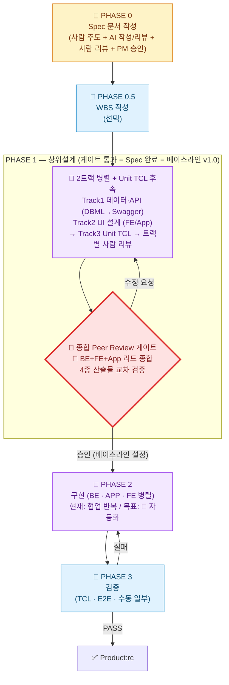

# Agentic Dev Chain — 팀 개발자 브리핑 (TO-BE 요약)

**한 줄 목적**: 문토 개발팀이 `Agentic Dev Chain` 의 TO-BE 프로세스를 *10~15 분* 안에 파악하고 본인 업무에 어떻게 적용할지 알 수 있게 한다.

**대상**: 문토 개발자 · 리드 · 코치
**기준 일자**: 2026-05-20 (TO-BE 3차 보강 반영)
**상세 가이드**: 본 브리핑은 *요약본*이다. 전체 다이어그램·표·근거는 별도 문서 **`2026-05-harness-TO-BE.md`** (TO-BE 프로세스 가이드) 를 참고한다. AS-IS 의 문제 진단은 **`2026-05-harness-AS-IS.md`** 에서 다룬다. 학습 로드맵은 **`2026-05-harness-learning-guide.md`** 에 있다.

---

## 1. 한 페이지 요약 — 무엇이 어떻게 바뀌나

### 핵심 메시지

> **사람이 핵심만 정확히 잡으면, AI 가 살을 붙이고, 구현·테스트는 24 시간 무인으로 돈다.**
> 사람 개입은 *줄이는 것* 이 목적이 아니라, *꼭 필요한 곳에 집중* 시키는 것이 목적이다.

### TO-BE 가 AS-IS 대비 추가/강화한 것 (요점 6 가지)

| # | 무엇이 새로 박혔나 | 왜 |
| --- | --- | --- |
| 1 | **Spec 의 범위 = SRS + DBML + Swagger + UI + Unit TCL** | Spec 끝 = 문서 끝 이 아니라 *상위설계까지 합의된 시점*. 잘 분석된 Spec 은 상위설계까지 다루는 것이 SW 공학 표준 |
| 2 | **PHASE 1 종합 Peer Review 게이트 = 베이스라인 v1.0 설정** | 통과 이후 4 종 산출물을 동결. 누가 마음대로 못 바꿈, 변경은 §4.8 절차 |
| 3 | **PHASE 0 사람 리뷰가 AI 형식 리뷰와 별도로 필수** | AI 가 잡는 것(형식·표준) ≠ 사람이 잡는 것(비즈니스 모순·도메인 함정). 둘 다 필요 |
| 4 | **PHASE 1 이 2 트랙 병렬 + Unit TCL 후속 구조** | Track1 데이터/API (DBML→Swagger), Track2 UI, 두 트랙 확정 후 Track3 TCL |
| 5 | **사람 핵심 개입 체크리스트 명시** | 사람 일을 줄이려는 게 아니라 *어디가 사람 필수인지 명확히* 함 |
| 6 | **베이스라인 변경 관리 절차 (CCB) 신설** | 베이스라인 이후 변경은 영향도 평가 → CCB 결정 → 베이스라인 갱신 → AI 정합성 재검증 |

### 우리 팀이 *오늘부터* 다르게 해야 할 일 — 3 줄

1. **SRS 끝났다고 개발 시작 금지.** DBML · Swagger · UI · TCL 까지 합의 + 종합 게이트 통과 후에만 PHASE 2 진입.
2. **AI 가 쓴 Spec 은 사람이 한 번 더 본다.** AI 형식 리뷰(`munto-spec-review`) 통과 ≠ 사람 리뷰 통과.
3. **Swagger 사람 리뷰는 BE + FE/App 같이.** 계약은 양쪽이 동시에 봐야 누락이 잡힌다.

---

## 2. 팀 공용 용어 — 같은 단어로 같은 것을 가리키자

| 용어 | 의미 | 잘못된 사용 예 → 바른 사용 예 |
| --- | --- | --- |
| **Agentic Dev Chain** | 문토의 AI 기반 개발 자동화 *방법론·총칭* | "munto-dev-assistant 프로세스" → "**Agentic Dev Chain 프로세스**" |
| **`munto-dev-assistant`** | 위 방법론을 구현한 *Agent 설정 레포* 이름. 파일·경로 가리킬 때만 사용 | "Dev Assistant 가 정의한 원칙" → "**`munto-dev-assistant` 레포의 스킬**" / "**Agentic Dev Chain 원칙**" |
| **Spec (팀 정의)** | SRS/One Pager + DBML + Swagger + UI + Unit TCL **모두 합의된 상태** | "SRS 다 썼으니 Spec 끝" → "**4 종 산출물 + 종합 Peer Review 통과 = Spec 완료**" |
| **베이스라인 (Baseline)** | PHASE 1 게이트 통과 시점에 동결된 *Spec v1.0*. 이후 변경은 §4.8 절차 | "Spec 확정" 같은 모호한 표현 → "**베이스라인 v1.0 설정 완료**" |
| **분석 아키텍트** | PHASE 0·1 에서 사람 역할(요구 수집·정렬·검증·게이트 진행)을 책임지는 *역할명*. PM/BE 리드 겸직 가능 | "기획자가 알아서" → "**이 프로젝트 분석 아키텍트는 ○○○**" (킥오프 시 명시 지정) |
| **CCB (Change Control Board)** | 베이스라인 이후 변경 의사결정 체계. 규모에 따라 *리드 1 인 ~ 전체 리드 동기 회의* 가변 운영 | "Spec 좀 바꿔도 되죠?" → "**§4.8 절차 통해 변경 요청 등록**" |

> **명명 원칙**: 외부 발표·회의·문서 머리말에서는 *"Agentic Dev Chain"*. Git 클론·경로 표기 등 구체적 산출물을 가리킬 때만 *"`munto-dev-assistant`"*. 둘은 동의어가 아니다.

---

## 3. 7 개 핵심 원칙 (압축)

본 TO-BE 는 다음 7 가지를 기둥으로 설계되었다. 자세한 근거·예시는 TO-BE 가이드 §2.3.

| # | 원칙 | 한 줄 요약 |
| --- | --- | --- |
| ① | **Spec 정확성 우선 — *정확함 ≠ 자세함*** | AI 가 구현할 수 있는 수준이면 충분. 자세한 건 Sub스펙으로 |
| ② | **Phase → Task → Sub스펙 분해** | 큰 프로젝트는 Main Spec(인터페이스만) + Sub스펙(컴포넌트별)로. 인터페이스 정의가 병렬 개발의 핵심 |
| ③ | **사람 입력 → AI 살붙임 → 사람 확인 (3 단 필수)** | 모호하면 AI 가 추측하지 말고 *먼저 사람에게 질문* (대화식) |
| ④ | **사람 개입 "최소화 + 핵심 명확화"** | 사람 필수 일은 줄이지 않고 *명시*, 나머지는 AI 자율 |
| ⑤ | **AI 자율 작업도 완전 자동화 지향** | 스킬·규칙·서브에이전트·컨벤션 + AI/사람 Review 방법까지 가이드에 박아둠 |
| ⑥ | **테스트 완전 자동화 지향 (Unit · E2E · UI)** | UI 자동화 남은 숙제는 TO-BE §3.6 참고 |
| ⑦ | **24 시간 무인 실행 인프라 (준비 중)** | Spec 완결 → 야간 무인 실행이 ①~⑥ 의 귀결 |

> **Why-What-How 의 균형** — Spec 은 *What* 만이 아니다. **Why 가 없는 Spec 위에는 좋은 아키텍처를 설계할 수 없다.** AI 가 구현 시 *"왜 이렇게?"* 를 물을 때 답할 수 있도록, 사람 핵심 입력에 *Why* 가 반드시 들어가야 한다.

---

## 4. 프로세스 한눈에 — 전체 흐름

> **다이어그램 범례** — 🤖 AI 자동 (사람은 트리거만) / 👤 사람 (사람이 직접 작성·결정) / 🔄 협업 반복 (AI 만들고 사람 검토 루프, 장기적으로 🤖 로 이전 목표) / 🚧 게이트 (사람 명시적 PASS/REJECT 결정)
>
> Phase 별 상세 다이어그램(세로형)은 TO-BE 가이드 §3.2~§3.6 참고.

---

## 5. 사람이 꼭 해야 하는 일 — 체크리스트

> 본 목록 외 영역은 AI 가 자율 진행한다. 본 목록 외에서 사람이 매번 AI 결과를 손대고 있다면 *AI 자동화 가이드가 부족하다는 신호*다.

| Phase | 단계 | 사람이 꼭 해야 하는 일 | 절대 생략 불가 이유 |
| --- | --- | --- | --- |
| **PHASE 0** | 입력 | **비즈니스 전략 · 문제 정의 · 핵심 아키텍처** 를 사람이 먼저 입력 (SRS §1.2 · §2.1 · §2.2) | 문서화되지 않은 조직 의사결정·맥락은 AI 가 추론 불가 |
| **PHASE 0** | 작성 중 | **AI 가 묻는 모호 지점에 대화식 응답** | AI 가 추측으로 메우면 핵심이 어긋남 |
| **PHASE 0** | 검토 | AI 작성 SRS 의 **핵심 전략·핵심 아키텍처** 적정성 사람 리뷰 (AI 도움 가능, 통과 판단은 사람) | AI 리뷰는 형식·표준까지만 잡음 |
| **PHASE 0** | 승인 | 🚧 **기획/PM 비즈니스 검증 승인** | 형식 통과 ≠ 제품 검증 |
| **PHASE 1** | DBML | BE 개발자가 **엔티티 · 관계 · 인덱스 · 정규화 적정성** 꼼꼼히 사람 리뷰 | 데이터 모델 결정은 운영 비용·확장성에 장기 영향 |
| **PHASE 1** | Swagger | **BE 생산자 + FE/App 소비자 입회** 꼼꼼히 사람 리뷰 | 계약 양쪽이 동시에 봐야 누락 발견 |
| **PHASE 1** | UI 설계 | FE/App 리드 사람 리뷰 (와이어프레임·상태·접근성) | 현재 UI 자동화 스킬 부재, 사람이 주도 |
| **PHASE 1** | TCL | 도메인 개발자가 **누락 케이스 · 경계값 · 실패 시나리오** 보강 | AI 가 놓친 도메인 함정을 사람이 채움 |
| **PHASE 1** | 🚧 게이트 | **BE + FE + App 리드 종합 교차 검증 + 베이스라인 v1.0 설정 결정** | 트랙 간 정합성·Spec 완료 결정 |
| **PHASE 2** | (목표) | **개입 없음** — 현재는 협업 반복 단계마다 검토 | 자동화 진척에 따라 가이드 보강으로 줄여간다 |
| **PHASE 3** | 수동 | 수동 테스트 항목 수행 + 실패 시 Jira 이슈 등록 | 자동화 불가 영역 |
| **변경 발생 시** | CCB | 분석 아키텍트가 영향도 평가 → 규모별 의사결정 (소: 리드 1 인 / 중: 비동기 1~2 일 / 대: 전체 동기 회의 + 메이저 버전) | 베이스라인 변경은 4 종 산출물 모두 영향 |

> **분석 아키텍트 = PHASE 0·1 사람 칸의 책임자.** PM 1 인 겸직 · BE 리드 겸직 · 별도 분석가 어느 형태든 무방하지만, **킥오프 시 1 명을 명시적으로 지정**하고 본인 이름을 위 단계에 박는다.

---

## 6. AI 가 자율 처리하는 일 — Review 방법까지 포함

| 산출물 | AI 자율 작성·검증 | 가이드·도구 |
| --- | --- | --- |
| **SRS / One Pager** | `munto-spec-writer` 작성 + `munto-spec-review` 형식 리뷰 + `spec-reviewer` 서브에이전트 | TO-BE 가이드 §4.7 |
| **DBML** | `dbml-writer` 작성 + `dbml-reviewer` 컨벤션·관계 검증 | TO-BE 가이드 §4.7 |
| **Swagger** | `swagger-writer` 작성 + `design-consistency-reviewer` 로 DBML↔Swagger 정합성 검증 | TO-BE 가이드 §4.7 |
| **Unit TCL** | `unit-tcl-writer` (현재 BE 중심, FE/App 보조) | TO-BE 가이드 §3.4 |
| **변경 영향도 분석** | `design-consistency-reviewer` 가 변경 후 정합성 재검증 | TO-BE 가이드 §4.8 |
| **코드 (BE/App/FE)** | `dev-chain-backend` · `dev-chain-mobile` · `dev-chain-frontend` (현재는 🔄 협업, 목표 🤖) | 각 도메인 스킬 |
| **검증** | `dev-chain-verify` (TCL · E2E · 수동 일부) | TO-BE 가이드 §3.6 |

> **사람 Review 보조 프롬프트 패턴** — AI 결과 검토 시 다음 패턴 활용:
> - **가설 검증**: *"이 [산출물] 에서 [가정] 이 [영역] 과 충돌하는지 봐줘"*
> - **누락 점검**: *"이 [산출물] 에서 [도메인] 케이스가 빠진 게 있는지 봐줘"*
> - **일관성 검증**: *"이 [산출물] 의 [필드] 가 [다른 산출물] 과 일관된지 봐줘"*

---

## 7. SRS·설계 문서 작성 4 팁 — 표기 규약

본 4 가지는 *"적게 쓰되 핵심 빠지지 않게"* (원칙 ①) 를 실무에서 지키게 만드는 표기 규약이다. **`munto-spec-writer` · `dbml-writer` · `swagger-writer` 가 각 산출물 작성 시 동일하게 강제**한다.

| 팁 | 표기 | 언제 쓰나 | 안티패턴 |
| --- | --- | --- | --- |
| **TBD** | `TBD: <짧은 설명> + 미결 이유 + 결정 책임자 + 마감 시점` | 핵심이지만 *현재 결정 불가* — 비워두면 임의 추정 위험 | 의미 없는 "추후 결정" |
| **N/A** vs **None** | `N/A` (해당 없음) / `None` (있어야 하지만 없음) | 항목 자체가 적용 불가 ↔ 적용되지만 현재 비어 있음 | 빈칸 · `-` · "없음"만 적기 |
| **Will Not Do** | 별도 섹션 또는 `(Out of Scope)` | 이해관계자가 *기대할 수 있지만 안 할* 항목 — 안 하는 이유 + 어디로 이관되는지 명시 | "필요 시 추가" 같은 회피 표현 |
| **논의 기록 (Decision Log)** | SRS 부록 또는 문단 끝 인용 박스 | 의견 갈렸던 항목 — 일시·참석자·옵션 A/B·채택 사유·폐기 사유 | 결정만 남기고 근거 삭제 |

> 빈칸·"-"·"없음" 만 적힌 항목은 `munto-spec-review` 가 결함으로 잡는다. *왜 비었는지* 가 항상 있어야 한다.

---

## 8. 사람 리뷰 운영 5 원칙 — 형식 게이트가 아닌 진짜 결함을 잡는 리뷰

| # | 원칙 | 실무 적용 |
| --- | --- | --- |
| 1 | **1 회 원칙** | 완성도 높은 SRS 를 1 회 정밀 리뷰. "대충 적고 여러 번" 패턴은 집중도 ↓ |
| 2 | **사전 배포 — 분량·이해관계자 비례 (AI 시대 가변)** | One Pager 1 일 / 일반 SRS 2~3 일 / 큰 SRS 5~7 일 / 보안·법무·접근성 특별 리뷰어 +2 일 |
| 3 | **사전 정독 필수 (AI 보조 권장)** | 회의·코멘트 작성 *전에* 정독. AI 요약·하이라이트·가설 검증 사용 권장. 즉석 리뷰 금지 |
| 4 | **부분 리뷰 가이드 명시** | 누가 어느 섹션 봐야 하는지 SRS 본문(예: `1.6 Intended Audience`)에 명시. 모두가 전체 볼 필요 없음 |
| 5 | **특별 리뷰어** | 보안·법무·접근성 등 특정 영역 전문가는 프로젝트 참여 여부와 무관하게 해당 섹션 리뷰. 분석 아키텍트가 호출 |

> **AI 시대에도 줄어들지 않는 시간 — 명시적으로 보호한다**
> - **사고와 통찰 (Incubation)**: 도메인 함정·미문서화 맥락은 자고 일어나야 떠오른다. **최소 1 박** 은 큰 SRS 에서도 그대로 둔다.
> - **비동기 의견 수렴**: 리뷰어가 본업 병행. 이해관계자 수에 비례한 *달력 시간* 은 AI 가 못 줄인다.
> - *"AI 가 ① 정독을 단축한 만큼 ② 사고에 더 쓰라"* — 단축된 시간을 *리뷰 가속* 이 아니라 *리뷰 깊이* 에 투자한다.

---

## 9. 베이스라인 이후 변경은 어떻게 — §4.8 변경 관리 (요약)

### 9.1 언제 변경 관리 절차가 필요한가

| 분류 | 절차 필요? | 예 |
| --- | --- | --- |
| 베이스라인 전 (PHASE 0·1 진행 중) | ❌ — 자유 수정 | Spec 초안, Swagger 작성 중 필드 변경 |
| 베이스라인 후 · 사소한 수정 | ⚠️ 경량 절차 | 오타·문구 다듬기 (코드·계약 무관) |
| 베이스라인 후 · 코드·계약 영향 | ✅ **본 절차 필수** | DBML 컬럼 변경, Swagger 엔드포인트 변경, NFR 변경 |
| 베이스라인 후 · 신규 기능 추가 | ✅ 절차 + **Sub스펙** | 메인 흐름 외 기능 추가 → 별도 Sub스펙 |

### 9.2 변경 절차 (간단 흐름)

`변경 요청 등록 (사람) → AI 1차 영향도 분석 (자동) → 분석 아키텍트 검토 (사람) → CCB 결정 (사람) → 베이스라인 갱신 → 영향 산출물 일괄 갱신 → AI 정합성 재검증 → 베이스라인 v1.x 확정`

### 9.3 규모별 CCB

| 규모 | 의사결정자 | 운영 |
| --- | --- | --- |
| 소 (단일 산출물·도메인) | 도메인 리드 1 인 | Slack + 분석 아키텍트 통보 |
| 중 (2~3 산출물·2 도메인) | 분석 아키텍트 + 영향 도메인 리드 | 비동기 1~2 일 |
| 대 (베이스라인 메이저 영향·일정·비용) | 분석 아키텍트 + 모든 리드 + PM | 동기 회의 + 메이저 버전 업 (v2.0) |

> **Munto 현실 적용**: 별도 회의체를 만들지 않고, *분석 아키텍트가 사무국 역할*. 변경 요청은 Jira 이슈(예: `SPEC-CHANGE` 라벨) 등록 → 위 규모 분류에 따라 결정 → 결정 기록은 SRS *변경 이력* + §7 의 *논의 기록* 패턴.

### 9.4 베이스라인 버저닝

- **v1.0 → v1.1 (마이너)**: 단일 산출물 수정, 코드 영향 작음, 하위 호환 유지
- **v1.x → v2.0 (메이저)**: 하위 호환 깨짐, 다도메인 영향, 일정·비용 영향 → *PHASE 1 종합 게이트 재실행*

---

## 10. 우리 팀이 즉시 시작할 Action Items

### 10.1 개인 차원 (각 개발자)

| # | 액션 | 언제까지 |
| --- | --- | --- |
| 1 | TO-BE 가이드 `2026-05-harness-TO-BE.md` 의 §1·§2·§3.1 (한 페이지) **정독** | 이번 주 |
| 2 | 본인이 *분석 아키텍트* 역할을 할 가능성이 있는 프로젝트가 있는지 확인 | 이번 주 |
| 3 | 진행 중인 SRS 가 있다면 §1.2·§2.1·§2.2 가 **사람이 직접 쓴 부분인지** 자기점검 | 즉시 |
| 4 | Swagger 리뷰 요청 시 *FE/App 소비자도 같이 호출*하는 습관 들이기 | 즉시 |

### 10.2 팀 차원 (리드·코치)

| # | 액션 | 담당 후보 |
| --- | --- | --- |
| 1 | **분석 아키텍트 지정** 을 신규 프로젝트 킥오프 체크리스트에 추가 | 각 도메인 리드 |
| 2 | Jira 에 `SPEC-CHANGE` 라벨 신설 + 운영 가이드 위키화 | PM |
| 3 | `munto-spec-writer` · `munto-spec-review` 스킬 본문에 4 팁(TBD/N/A vs None/Will Not Do/논의 기록) **체크리스트로 반영** 검토 | 하네스 담당 |
| 4 | `design-consistency-reviewer` 서브에이전트에 **§4.8 변경 영향도 분석 템플릿** 반영 검토 | 하네스 담당 |
| 5 | 어댑터 정합성 검증 `bash scripts/check-adapters.sh` 를 PR CI 에 추가 | 인프라 |
| 6 | 분기별 `harness-diagnostics` Audit 정기 실행 | 분석 아키텍트 |

### 10.3 보조 스킬 백로그 (개발 프로세스 외)

- **`munto-doc-review-helper` (가칭)**: 외부 분석 보고서·OnePager·기획서 등 *표준화되지 않은 문서* 의 핵심을 잡고 사람 리뷰를 보조하는 대화식 스킬. 상세는 TO-BE 가이드 §5.

---

## 11. AS-IS vs TO-BE — 핵심 변화 한 장 요약

| 항목 | AS-IS (`AGENTS.md` 기준) | Agentic Dev Chain (TO-BE) |
| --- | --- | --- |
| **총칭(이름)** | 불명확. "Development Chain" / "munto-dev-assistant" 혼용 | **`Agentic Dev Chain`** = 방법론 / **`munto-dev-assistant`** = 구현 레포 |
| **Spec 완료 정의** | 불명확 (SRS 끝 = Spec 끝?) | **SRS + 2 트랙 상위설계 + Unit TCL + 종합 Peer Review = Spec 완료 = 베이스라인 v1.0** |
| **SRS 작성 흐름** | `munto-spec-writer` 한 번에 풀 작성 가능 | 사람이 §1.2·§2.1·§2.2 먼저 → AI 확장 (풀 자동 비권장) |
| **SRS 검증** | AI 형식 리뷰만 | AI 형식 → **작성자/개발자 사람 리뷰(생략 불가)** → **기획/PM 사람 승인** 3 단 게이트 |
| **상위설계 구조** | DBML·Swagger·TCL **동시 팬아웃** | **2 트랙 병렬 + Unit TCL 후속** — Track1 데이터/API, Track2 UI, Track3 TCL |
| **DBML / Swagger 순서** | 같은 메시지에 병렬 생성 | **DBML 사람 확정 후 Swagger 시작** (선후 의존) |
| **Swagger 사람 리뷰 참여자** | 명시 없음 | **BE 생산자 + FE/App 소비자 입회 필수** |
| **Peer Review 게이트 위치** | 별도 단계로 모호 | **PHASE 1 의 마지막 단계로 명확히** (별도 PHASE 아님) |
| **사람 개입 정책** | 단계별 산발적 | **사람 필수 일 + 분석 아키텍트 8 활동을 한 장에 체크리스트** |
| **AI 자동화 가이드 체계** | 스킬·규칙 존재하나 작성 원칙 미정리 | **4 종(스킬·규칙·서브에이전트·컨벤션) + 작성 원칙 + Review 방법** 명시 |
| **베이스라인 개념** | 없음 — Spec 끝 시점 모호 | **PHASE 1 게이트 통과 = 베이스라인 v1.0 설정** 명시 |
| **변경 관리** | 없음 — 누가 언제든 수정 가능, 영향도 추적 안 됨 | **§4.8 CCB 절차 + AI 1차 영향도 분석 템플릿 + 베이스라인 버저닝(v1.x / v2.0)** |
| **SW 공학 정렬도** | 임의 — SW 공학 표준 용어·원칙 참조 없음 | **국내 SW 스펙 작성 표준에 명시적 정렬** (Spec/설계 경계·정확성·분해·13 가지 출처·8 활동·5 원칙·4 팁·베이스라인 등) |
| **무인 야간 실행** | 없음 (사람이 시작·종료) | **OpenClaw 등 24 시간 무인 실행 서비스** 구현 요소로 추가 검토 |

---

## 12. 함께 보면 좋은 문서·자료

> 본 브리핑은 TO-BE 의 *요약본*이다. 깊이 있는 이해가 필요하면 다음을 본다. 모두 `munto-dev-assistant-report` 레포 안에 있다.

| 문서 | 어디서 보나 | 무엇이 들어있나 |
| --- | --- | --- |
| **TO-BE 프로세스 가이드** | `reports/2026-05-harness-TO-BE.md` | 전체 다이어그램·단계별 사용법·표 (본 브리핑의 원본) |
| **AS-IS 분석 노트** | `reports/2026-05-harness-AS-IS.md` | 현재 하네스 구조·비판·문제 인식 |
| **학습 가이드** | `reports/2026-05-harness-learning-guide.md` | `munto-dev-assistant` 학습 로드맵·준비도 평가 |
| **SRS 작성 표준** | `munto-dev-assistant/document/spec-standard.md` | 섹션별 작성 지침 (특히 §1.2 Product Scope) |
| **SRS v3.3 템플릿** | `munto-dev-assistant/document/spec-templates/SRS_v3.3_template.md` | 섹션별 한글·표준 SRS 유도 문 |
| **One Pager 템플릿** | `munto-dev-assistant/document/spec-templates/OnePager_v1.0_template.md` | 경량 Spec 템플릿 |
| **AGENTS.md (진입점)** | `munto-dev-assistant/AGENTS.md` | 스킬·규칙 목록과 금지 규칙 |
| **어댑터 검증** | `munto-dev-assistant/scripts/check-adapters.sh` | 어댑터 정합성 자동 검증 |

> **Notion 게시 시**: 위 문서들도 Notion 페이지로 옮기는 경우, 이 브리핑 본문의 *경로 표기* 를 *각 페이지 링크* 로 일괄 치환한다. 본 문서는 의도적으로 *상대경로 링크를 쓰지 않고 텍스트로만 표기* 했다 (Notion·구글 docs 어디로 옮겨도 깨지지 않게).

---

## 변경 이력

| 일자 | 내용 |
| --- | --- |
| 2026-05-14 | 통합 분석 원고에서 *팀 공유 브리핑*으로 분리 작성 |
| 2026-05-14 ~ 05-18 | Spec 정의 (= SRS + 상위설계 + Peer Review) 팀 규약 반영, AS-IS·TO-BE·학습 가이드 3 문서로 분리 |
| 2026-05-15 | `spec-standard.md` §1.2 예시를 도메인 중립 형식으로 개편, §1.2 Product Scope 교육 메모 반영 |
| **2026-05-20** | **TO-BE 3 차 보강 (D-1 ~ D-10) 반영 전면 재작성**. ① 본 브리핑 목적을 *TO-BE 요약본*으로 재정의 ② Notion 등 외부 게시 대비 상대경로 링크 모두 제거, 문서명 텍스트 표기로 통일 ③ 새 구조: 한 페이지 요약 / 팀 공용 용어 / 7 개 핵심 원칙 / 전체 흐름 다이어그램 / 사람 필수 체크리스트 / AI 자율 작업 / 4 팁 표기 규약 / 리뷰 5 원칙 + AI 시대 가변 / 베이스라인 변경 관리 / Action Items / AS-IS vs TO-BE 한 장. ④ 분석 아키텍트·베이스라인·CCB·메이저/마이너 버저닝 등 신규 용어 통합 정리 ⑤ 우리 팀이 *오늘부터 다르게 해야 할 일* 3 줄 헤드라인 추가 |
