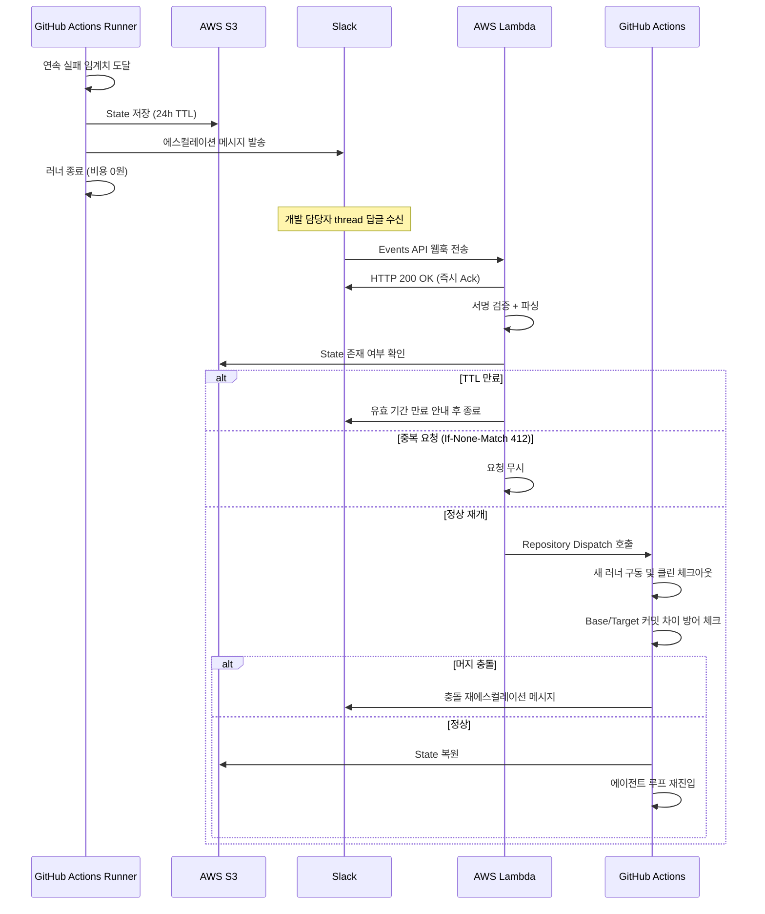

# munto-dev-assistant의 무중단 에이전트 루프 체계에 에스컬레이션 기반 비동기 Stateful 루프 체계 추가

분류: SRS
작성자: 김세현
최초 작성일: 2026년 6월 5일 오후 12:13
최근 수정일: 2026년 6월 5일 오후 4:01
문서 상태: Active
생성 일시: 2026년 6월 5일 오후 12:13
최종 편집자: 김세현

## **Project Name**

munto-dev-assistant의 무중단 에이전트 루프 체계에 에스컬레이션(Escalation) 기반 비동기 Stateful 에이전트 루프 체계 추가

## **Date**

2026-05

## **Submitter Info**

김세현

## **Project Description**

기존 무인 에이전트 루프 설계([DEVT-135](https://munto.atlassian.net/browse/DEVT-135))는 연속 실패 임계치 도달 시 그대로 종료되어 이후 작업을 이어갈 수단이 없습니다. 본 문서는 임계치 도달 시 현재 작업 상태를 저장하고 GitHub Actions 러너를 즉시 종료한 뒤, 담당 개발자가 Slack으로 지시를 보내면 새 러너를 구동하여 에이전트 루프를 재개하는 구조를 구축합니다. 이를 통해 러너 대기 비용 없이 개발자가 언제 어디서나 Slack으로 작업 흐름을 제어할 수 있습니다.

## **Business and Marketing Justification**

**고성능 러너 공회전 비용 원천 차단**: Claude Code 등 대형 에이전트 구동용 러너는 분당 요금이 높습니다. 유저 피드백 대기 시간 동안 프로세스를 종료함으로써 해당 구간의 러너 비용을 0원으로 만듭니다.

**운영 엔지니어링 리소스 낭비 방지**: 멱등성 보장 및 S3 Lifecycle 도입을 통해 중복 빌드 비용 및 임시 데이터 적재에 따른 관리 공수를 제거합니다.

## **Risk Assessment & Mitigation**

**위험 요인 1: Slack thread 답글 중복 전송에 따른 중복 러너 구동 리스크**

대응 방안 [S3 조건부 쓰기 기반 멱등성 처리]: 인메모리 캐싱을 배제하고, S3 Put Object 시 `If-None-Match: "*"` 조건부 쓰기를 사용합니다. 동일 event_id로 오브젝트가 이미 존재하면 S3가 즉시 `412 Precondition Failed`를 반환하므로, 조회 후 저장하는 Read-then-Write 패턴의 Race Condition 없이 원자적 중복 차단이 보장됩니다.

**위험 요인 2: 사용자의 확인 지연(최대 24시간) 동안 Target 브랜치 파편화(Diverge) 리스크**

대응 방안 [브랜치 동기화 전략]: 사용자가 Slack으로 재개를 승인하는 시점에 다음 순서로 처리합니다.

- 재개 시점에 base 브랜치와 target 브랜치의 커밋 차이가 N개(기본값: 20)를 초과하는 경우, 병합 시도 없이 즉시 Slack 종료 알림을 발송하고 작업자가 로컬에서 직접 처리하도록 유도합니다.
- 위 조건을 통과한 경우 base 브랜치의 최신 커밋을 target 브랜치로 `git merge`(기본 전략) 실행합니다.
- 머지 충돌(Conflict) 발생 시 프로세스를 즉시 종료하지 않고, S3의 기존 State를 보존한 채 `conflictResolutionRequired` 상태 코드를 담아 Slack으로 재에스컬레이션합니다. 개발자가 로컬에서 충돌을 해결한 뒤 Slack thread에 "충돌 해결함"을 입력하면, 에이전트가 S3에서 기존 State를 복원하여 멈췄던 지점부터 재개합니다.

**위험 요인 3: 중계 핸들러 장애 시 에스컬레이션 상태의 작업 고립(SPOF) 리스크**

대응 방안 [SPOF 방지 및 관측 가능성]: 서버리스 환경(AWS Lambda, SLA 99.95%) 기반으로 가용성을 확보하되, Lambda 에러 핸들러에서 처리 실패 발생 시 즉시 팀 Slack 인프라 채널로 직접 알림을 발송합니다. 4인 팀 규모에서 SQS DLQ·CloudWatch Alarm 등의 별도 모니터링 인프라는 운영 부담 대비 효용이 낮아 배제합니다.

**위험 요인 4: 유저 확인 지연으로 인한 자원 방치 및 보안 노출**

대응 방안 [TTL 및 서명 검증]: 에스컬레이션 상태는 최대 24시간만 유지(S3 수명주기 연동)하며, Slack에서 들어오는 요청은 Slack Signing Secret(HMAC SHA256) 검증을 필수로 수행합니다. TTL 만료 후 사용자가 답글을 보낼 경우, event_id 파일과 State 파일이 모두 삭제된 상태이므로 Lambda는 State 파일 존재 여부를 먼저 확인하여 없을 경우 러너 구동 없이 즉시 "에스컬레이션 유효 기간(24시간)이 만료되어 복구할 수 없습니다"라는 안내 메시지를 Slack에 발송하고 종료합니다.

**위험 요인 5: 에스컬레이션-재개 무한 반복 리스크**

대응 방안 [최대 Resume 횟수 제한]: 에스컬레이션 → 사용자 재개 → 재실패 → 에스컬레이션의 무한 반복을 방지하기 위해 동일 Task에 대한 Resume 횟수를 최대 3회로 제한합니다. 초과 시 작업을 영구 중단하고 Slack으로 최종 실패 알림을 발송합니다.

## **Resource and Scheduling Details**

**필요 자원 (Resources)**

- 필요 인력: 개발자 1명 (전담)
- State 저장소 단일화: AWS S3 단일 저장소 채택, S3 Object Lifecycle 정책(Expiration: 1 day) 강제 적용
- Slack Bot (chat.postMessage + Events API) 및 AWS Lambda 인프라
- 인증 자격 증명: GitHub Repository Secrets를 통한 GitHub App(또는 PAT) 보안 관리 (Secrets Manager 불필요)

**추정 일정 (Scheduling): 총 2주 소요**

- 1주차: S3 기반 Stateful 저장/복원 로직 개발, 가변 임계치 파라미터 셋업 및 Root Cause 감지 로직 구현 → 완료 기준: S3 저장→복원 Happy Path 로컬 테스트 통과 + 필수 필드 누락 시 Default Value 반환 정책 수립 + Root Cause 감지 단위 테스트 통과 + Target 브랜치 클린 체크아웃 검증
- 2주차: 멱등성 및 브랜치 머지 전략이 포함된 Slack 중계 핸들러 구현, 양방향 인증(Slack 서명 및 GitHub PAT) 적용 및 E2E 통합 테스트 → 완료 기준: E2E 시나리오(에스컬레이션 발생 → Slack thread 답글 → 새 러너 재개) 통과

## **Technical Description**

**1) 오케스트레이션 상세 워크플로우**

```
[1. 작업 개시] GitHub Actions 구동
       ↓
 ┌───> [2. 자율 루프] 에이전트 실행 ➔ 코드 변경 ➔ 검증 실행
 │       ↓
 │     [3. 결과 판정]
 │       ├─ (성공) ──> [4-A. 정상 종료] Slack 성공 알림 및 PR 링크 전송 ➔ 완료!
 │       └─ (실패) ──> 연속 실패 횟수(가변 Threshold) 확인
 │                       ├─ (임계치 미만) ➔ 에러 로그 분석 후 자율 재시도 [2번 루프 회귀]
 │                       │                  단, Resume 누적 횟수가 max_resume(기본값: 3)에 도달한 경우 자율 루프 진입 없이 영구 종료 처리합니다.
 │                       └─ (임계치 도달) ➔ 🚨 자율 해결 불가, [4-B. 에스컬레이션] 진입
 │
 └─> [4-B. 에스컬레이션 단계 (인간 개입)]
       ① State 저장: 현재 작업 브랜치, Diff, 로그를 패키징하여 [AWS S3]에 저장 (24시간 TTL 자동 삭제 정책 적용).
          저장되는 State 오브젝트는 다음 JSON 스키마를 따릅니다:
          ```json
          {
            "targetBranch": "feature/auth-refactor",
            "baseCommitSha": "a1b2c3d4e5f6...",
            "task": "현재 수행 중인 Task 설명",
            "attemptCount": 3,
            "failureReason": "integration test failed — userAuth module import error",
            "triedSolutions": ["mock 수정", "fixture 수정"],
            "failedLogsSummary": "3회 시도 중 매번 동일한 ImportError 발생. 모듈 경로 문제로 추정.",
            "agentInternalThought": "fixture 교체와 mock 수정을 시도했으나 근본 원인인 패키지 설치 누락을 해결하지 못한 것으로 보임.",
            "workspaceShortTermMemory": "직전 루프에서 확인한 파일 구조·의존성 관계 등 재개 시 참조할 짧은 컨텍스트 스냅샷",
            "userInstruction": ""
          }
          ```
          userInstruction 필드는 에스컬레이션 발생 시 빈 문자열로 초기화하고, 사용자 Slack 답글 수신 시 채워넣어 루프 재진입 시 에이전트에 전달한다.
       ② 러너 종료: GitHub Actions 즉시 종료 (대기 비용 0원).
       ③ Slack 발송: 폰 Slack 메시지로 상태 요약 및 thread 답글 안내 메시지 전송.
       ④ 유저 피드백 수신 (중계 핸들러 / AWS Lambda):
          - [즉시 Ack] Lambda 진입 직후 Slack에 HTTP 200 OK 즉시 반환 (Slack 3초 타임아웃 초과 방지)
          - 이후 처리(서명 검증·멱등성 체크·GitHub 호출)는 비동기로 실행
          - [Inbound 보안] Slack Signing Secret 서명 검증
          - [파싱] thread reply 텍스트에서 "재시도" / "중단" / 자유 지시어 판별
          - [멱등성] S3 If-None-Match 조건부 쓰기를 통한 event_id 중복 요청 원자적 차단
          - [장애 방지] 실패 시 Lambda 에러 핸들러에서 팀 Slack 인프라 채널로 즉시 알림
       ⑤ 브랜치 동기화 및 워크플로우 재개:
          - [Outbound 보안] GitHub Repository Secrets에 보관된 GitHub PAT/App 자격 증명을 활용하여 GitHub Repository Dispatch API 인증 호출
          - 새로운 러너 구동 후 Target 브랜치를 클린 체크아웃 (미커밋 파일·빌드 아티팩트 없는 상태 보장)
          - [재진입 직전 방어 체크] Base와 Target의 커밋 차이 및 머지 가능 여부를 재확인하여 통과한 경우에만 `git merge` 실행 (충돌 시 재에스컬레이션)
          - S3에서 복원한 이전 State와 유저의 가이드를 결합하여 [2번 루프] 재진입.
```

**2) 에스컬레이션 단계 시퀀스 다이어그램**



**3) 핵심 테크니컬 스펙 명세**

**① 가변 임계치 (Dynamic Threshold)** 연속 실패 임계치를 하드코딩하지 않고, 워크플로우 실행 시 사람이 지정하는 최대 재시도 횟수(기본값: 3회)로 결정합니다. 미입력 시 기본값이 적용됩니다.

**② 동일 Root Cause 조기 감지** 연속 실패의 오류 메시지에서 동일한 Root Cause가 반복 감지될 경우, 잔여 재시도 횟수와 무관하게 즉시 에스컬레이션으로 전환합니다. AI 에이전트가 생성하는 로그는 실행마다 미세하게 문자가 달라질 수 있으므로 단순 문자열 비교 대신, 에러 로그 마지막 3줄 Stack Trace에서 Regex로 Exception 타입·파일 경로를 추출하거나 Jaccard 유사도 비교를 사용합니다. 해당 감지 로직은 1주차 가변 임계치 파라미터 셋업 시 함께 구현 및 검증합니다.

**③ S3 단일 스토리지 + TTL** 에이전트 컨텍스트 아카이빙 및 멱등성 검증용 식별자 저장소로 AWS S3를 단일 사용합니다. 에스컬레이션 컨텍스트(브랜치·Diff·로그)는 24시간, Audit Trail은 30일 후 자동 삭제되도록 Lifecycle Rule을 분리 적용합니다.

**④ Audit Trail** 에스컬레이션 발생·사용자 응답·재개·성공/실패 각 이벤트를 `audit/{task-id}/{timestamp}.json`으로 이벤트별 개별 오브젝트에 기록합니다. 이를 통해 '누가 언제 어떤 지시로 재시도했는가'를 사후 추적할 수 있습니다.

Slack 에스컬레이션 메시지 구조:

일반 에스컬레이션:

```
🚨 자율 수정 3회 실패 — 에스컬레이션
[오류 타입] 통합 테스트
[로그 요약] 'userAuth' module import error in test_login.py...

이 스레드에 답글로 지시해주세요:
  • "재시도" — 추가 지시 없이 3회 더 시도
  • "중단" — 작업 종료
  • 그 외 텍스트 — 입력 내용을 지시어로 반영 후 재시도
```

머지 충돌 에스컬레이션:

```
⚠️ 머지 충돌 발생 — 수동 해결 필요
[브랜치] feature/xxx ← main (충돌 파일: src/auth/login.ts)

로컬에서 충돌을 해결한 뒤 아래 순서대로 진행해주세요:
  1. 로컬에서 충돌 해결 후 Remote Target 브랜치에 Push 완료
  2. Push 완료 후 이 스레드에 "충돌 해결함" 입력
  ※ Push 전에 입력하면 에이전트가 최신 커밋을 가져오지 못합니다.
```