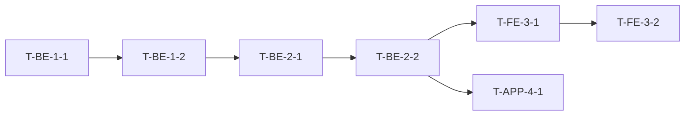

# 문토 Implementation Plan (구현계획서, IP) 작성 표준

> 문토 개발팀이 사용하는 **Implementation Plan (구현계획서, 이하 IP)** 의 작성 지침입니다.
> IP 는 *검증된 Spec 을 24 시간 무인 자동화가 가능한 실행 명세로 변환한 단일 문서*입니다.
> 본 표준의 항목 구조는 변경·추가·삭제할 수 없습니다.

**관련 문서**

- 상위 표준: [`spec-standard.md`](./spec-standard.md) — SRS·Engineering One Pager 작성 표준
- 보강 검토안: [`dev-chain-design-update-proposal.md`](./dev-chain-design-update-proposal.md) — 기존 `dev-chain-design` 스킬에 IP 자동 초안 생성 단계 신설 검토안
- 신규 스킬 초안: [`skills/dev-chain-implementation-plan/SKILL.md`](./skills/dev-chain-implementation-plan/SKILL.md)
- TO-BE 참조: `reports/2026-05-harness-TO-BE.md` §4.3 (IP-0 ~ IP-9)

---

## 목차

- [IP 가 무엇인가, 왜 필요한가](#ip-가-무엇인가-왜-필요한가)
- [작성 시점과 위치](#작성-시점과-위치)
- [저장 위치와 파일명 규약](#저장-위치와-파일명-규약)
- [동시 프로젝트 운영·세션 관리 (요약)](#동시-프로젝트-운영세션-관리-요약)
  - [세션 파일 (`sessions/`) 저장 정책 (요약)](#세션-파일-sessions-저장-정책-요약)
- [문서 구조 — 8 개 필수 섹션](#문서-구조--8-개-필수-섹션)
- [Task 단위 기준](#task-단위-기준)
- [멀티 Repo Spec 참조 4 요소](#멀티-repo-spec-참조-4-요소)
- [Task 의존성 DAG](#task-의존성-dag)
- [Definition of Done (DoD)](#definition-of-done-dod)
- [단일 세션 vs 세션 분리 4 기준](#단일-세션-vs-세션-분리-4-기준)
- [Spec 작성 3 방식과의 매핑](#spec-작성-3-방식과의-매핑)
- [IP 자체의 사람 리뷰 — "통과 = 인수" 원칙](#ip-자체의-사람-리뷰--통과--인수-원칙)
- [무인 실행 루프 (PHASE 2 무인 모드) 와의 인터페이스](#무인-실행-루프-phase-2-무인-모드-와의-인터페이스)
- [변경 관리·버전](#변경-관리버전)
- [완료 체크리스트](#완료-체크리스트)
- [Appendix A. 예시 — paid-socialing-v2/ImplementationPlan.md (요약)](#appendix-a-예시--paid-socialing-v2implementationplanmd-요약)
- [Appendix B. IP 가 *아닌 것*](#appendix-b-ip-가-아닌-것)

---

## IP 가 무엇인가, 왜 필요한가

| 비교 항목 | Spec (SRS · DBML · Swagger · UI · TCL) | Implementation Plan (IP) |
|----------|------|-----|
| **답하는 질문** | *무엇을 만들 것인가 (What·Why)* | *어떻게·어떤 순서로·어디부터 보고 만들 것인가 (How·When·Where)* |
| **위계** | *제품* 산출물 — 제품과 함께 버저닝됨 | *프로젝트* 산출물 — 한 프로젝트의 *구현 계획* |
| **단위** | 도메인·엔티티·기능 단위 | Task 단위 (AI 가 1 회 실행으로 처리 가능한 크기) |
| **베이스라인** | v1.0 동결 시점 = 기능 동의 완료 | v1.0 = *무인 실행 시작 가능* 한 상태 |
| **저장 위치** | 해당 *제품 Repo* (BE/FE/APP) 의 `docs/specs/` | **`munto-dev-assistant/projects/{프로젝트명}/ImplementationPlan.md`** *(프로젝트 폴더 안에 고정 파일명. 부속 산출물은 같은 폴더의 옵션 서브폴더. 아래 [저장 위치와 파일명 규약](#저장-위치와-파일명-규약) 참조)* |

**IP 가 없을 때 실제로 발생하는 문제** *(AS-IS §4.15·§5.4)*

- Spec 이 완벽해도, *"Task 1 번 구현해"* 한 번에 사람이 *어디 보고·뭘 만들고·언제 끝났음을 판정할지* 를 매번 1~2 시간씩 설명해야 함.
- AI 가 *어느 엔티티부터 만들지·다른 Task 결과를 전제로 하는지* 를 몰라 잘못된 순서로 시작.
- 24 시간 무인 자동화는 *시작조차 못함* — 무인 루프의 *입력 형식* 이 정의되지 않았기 때문.
- *AI 자동화 시간 절약이 사람의 컨텍스트 재구성 시간으로 상쇄.*

**IP 가 메우는 5 가지 공백**

1. Task 단위의 정의 (AI 1 회 실행 단위)
2. Task → Spec 참조 경로 (4 요소 표기로 기계 판독 가능)
3. Task 간 의존성 그래프 (DAG)
4. Task 완료 정의 (DoD — 기계 검증 가능)
5. 위 4 가지의 **단일 진입점** (한 문서)

---

## 작성 시점과 위치

- IP 는 **PHASE 1 의 마지막 활동** 입니다 *(별도 PHASE 번호 없음 — Spec 베이스라인 v1.0 직후, PHASE 2 시작 전)*.
- 입력: Spec 4 종 산출물 베이스라인 v1.0 + 기존 Repo 의 `docs/specs/` + 멀티 Repo Spec 인덱스 *(⚠️ 인덱스 실체 산출물은 현재 미박힘 — TO-BE §4.7.5 작성 백로그 (3) 참조. 인덱스 도입 전까지는 *사람 분석 아키텍트가 수동으로 관여 Repo·경로 식별*)*
- 출력: 단일 IP 문서 → PHASE 2 (유인 모드 / 무인 모드 모두) 의 *유일한 실행 입력*

```
PHASE 0 (기획)
   ↓
PHASE 1 (Spec — SRS·DBML·Swagger·UI·TCL)
   ↓
PHASE 1 마지막 — IP 작성 + IP 사람 리뷰  ★ 본 표준이 적용되는 단계
   ↓
PHASE 2 (구현 — 유인/무인 모드 모두 IP 가 유일한 입력)
   ↓
PHASE 3 (검증)
```

---

## 저장 위치와 파일명 규약

> **단일 파일이 아닌 *프로젝트 폴더*** — 멀티 프로젝트 동시 운영(아래 *동시 프로젝트 운영*) · 무인 실행 모드 · ③ 별도 repo Spec 방식 도입으로 *IP 본문 외 부속 산출물* 이 누적된다. 단일 `.ip.md` 파일은 *어디에 둘지 모호한 부속 산출물* 을 양산하므로 *프로젝트 폴더가 기본 단위* 다.

| 항목 | 정책 |
|------|------|
| **저장 레포** | **`munto-dev-assistant`** *(반드시 이 레포)* |
| **저장 폴더** | `projects/` |
| **프로젝트 단위** | `projects/{프로젝트명}/` (폴더). `{프로젝트명}` = *kebab-case 영문, 50 자 이내, 메이저 버전(v2) 만 폴더명에 표기* |
| **IP 본문 파일명** | **`ImplementationPlan.md`** (폴더 안 *고정명*. 프로젝트명 prefix 없음 — 폴더가 이미 식별자 역할) |
| **버전 관리** | 같은 파일에서 본문 헤더에 v 표기 (`v1.0 → v1.1 → v1.2`). **메이저 변경(v2.0)** = *새 폴더* — `projects/{프로젝트명}-v2/ImplementationPlan.md` (파일명은 같음, 폴더로 분기) |
| **인덱스** | `munto-dev-assistant/projects/README.md` 에 활성 프로젝트 목록·상태·담당자·최신 버전 표기 |

### 프로젝트 폴더 구조 (필수 1 + 옵션 5)

```
munto-dev-assistant/projects/
├── README.md                            # 활성 프로젝트 인덱스 (전체)
└── {프로젝트명}/                          # 프로젝트 1 개당 1 폴더
    ├── ImplementationPlan.md            # 필수 — IP 본문 (단일 진실 공급원, 아래 8 섹션 고정)
    ├── README.md                        # 옵션 — 프로젝트 현재 상태·Slack 채널·세션 인덱스·다음 작업자
    ├── sessions/                        # 옵션 — 무인 모드 세션 로그·일일 요약·BLOCKER 기록
    │   ├── YYYY-MM-DD-daily-summary.md
    │   └── YYYY-MM-DD-blocker-{id}.md
    ├── decisions/                       # 옵션 — 대안 검토 박스 누적본 (Decision Log)
    ├── attachments/                     # 옵션 — Figma 캡처·아키텍처 다이어그램·외부 자료
    └── spec-stubs/                      # 옵션 — ③ 별도 repo Spec 방식의 STUB·임시 사본
```

> **무인 모드를 안 쓰는 작은 프로젝트는 `ImplementationPlan.md` 하나만 두면 된다.** 옵션 서브폴더는 *필요할 때만* 생성. 빈 옵션 폴더를 미리 만들지 않는다.

### 왜 BE/FE 가 아닌 `munto-dev-assistant` 인가

> **핵심**: IP 는 Spec 과 *다른 위계* 의 문서이며, *멀티 Repo 를 가로지르는 단일 진입점* 이다.

| 후보 위치 | 적합도 | 사유 |
|----------|------|------|
| BE Repo (`docs/`) | ❌ | FE 변경 Task 가 어색. BE 가 끝나도 FE Task 가 남아 *프로젝트 종료 시점* 이 BE 만으로 결정되지 않음. |
| FE Repo (`docs/`) | ❌ | 반대 이유. APP 까지 묶이면 더 어색. |
| BE + FE 양쪽에 복제 | ❌ | 한쪽 갱신 누락 시 *서로 다른 진실* — Spec 분산 문제(§4.16) 의 IP 판. |
| 별도 *프로젝트 메타 레포* 신설 | △ | 가능. 그러나 *Repo 신설 비용·CI 설정·접근 권한* 이 새로 발생. |
| **`munto-dev-assistant/projects/`** | ✅ | **이미 Agentic Dev Chain 의 운영 레포** — 무인 실행 루프·스킬·서브에이전트가 모두 여기 있음. IP 는 *루프의 입력* 이므로 *루프 정의와 같은 곳* 에 두는 것이 자연스러움. 또한 *모든 Munto 프로젝트 워크스페이스에 항상 포함되는 유일한 레포* 이므로 멀티 Repo 환경의 단일 진입점으로 안정적. |

### Spec 의 저장 위치와의 비교 (혼동 금지)

- **Spec** (SRS·DBML·Swagger·UI·TCL) = 해당 *제품 Repo* (BE/FE/APP) 의 `docs/specs/` — *SCM baseline 철학에 따라 제품과 함께 버저닝*.
- **IP** = `munto-dev-assistant/projects/{프로젝트명}/ImplementationPlan.md` — *프로젝트 단위 메타 산출물, 멀티 Repo 를 가로지르는 단일 진입점*.

### 동시 프로젝트 운영·세션 관리 (요약)

> **AI 도구의 세션 격리는 *cwd / 워크스페이스* 가 단위다.** 같은 cwd 에서 프로젝트 2 개를 번갈아 작업하면 *세션이 물리적으로 섞이고 컨텍스트가 누수* 된다. 격리는 반드시 *도구 레벨* 에서 한다.

| 항목 | 정책 |
|------|------|
| **격리 단위** | 1 프로젝트 = 1 워크스페이스 = 1 세션 트랙. 프로젝트 N 개 동시 진행 = 워크스페이스 N 개 |
| **워크스페이스 구성** | `munto-dev-assistant/workspace/{프로젝트명}.code-workspace` — 해당 프로젝트가 건드리는 Repo 묶음 + `munto-dev-assistant` (항상 포함). 워크스페이스 이름 = IP 폴더 이름 |
| **메타 작업 cwd** (Spec·IP·오케스트레이션) | `munto-dev-assistant/projects/{프로젝트명}/` — IP 본문 옆에서 시작, 세션 목록이 *프로젝트별로 자연 격리* |
| **구현 작업 cwd** | 각 제품 Repo (`munto-backend`·`munto-frontend`·`munto-mobile` 등) |
| **세션 인계 단일 컨텍스트** | `ImplementationPlan.md` + `README.md` (활성 세션 인덱스) — 인수자에게 다른 설명 불요 |
| **상세 절차** | TO-BE §4.3 IP-9 (Claude Code · Cursor 별 명령 / 인계 6 단계 / 안티 패턴 5 종) |

**핵심 안티 패턴 (반드시 피할 것):**

- ❌ 한 IDE 윈도우에서 워크스페이스 *전환* 하며 두 프로젝트 작업 → 채팅 컨텍스트 누수
- ❌ 같은 cwd 에서 `claude --continue` 로 다른 프로젝트 재개 → 이전 프로젝트 컨텍스트 유입
- ❌ 루트(`munto-dev-assistant/`)에서 모든 프로젝트의 메타 작업 수행 → 세션 목록 식별 불가
- ❌ IP 폴더에 *제품 코드* 보관 → Repo 경계 오염
- ❌ 워크스페이스 파일 미공유 (개인 로컬에만) → 인수자가 *어떤 Repo 묶음인지 모름*

### 세션 파일 (`sessions/`) 저장 정책 (요약)

> **상위 원리 — TO-BE §2.3 ⑧ *Spec ↔ 구현의 컨텍스트 단절 원칙*** *(요약)*:
> - **PHASE 0~1 (Spec 작성)** = *세션 컨텍스트 적극 보존* — 작성자 N 명의 추론·검토·대안이 다음 작성 세션·리뷰어·ip-writer 에게 흘러야 함. 본 절의 *Spec 작성 세션 표* 가 이 정책.
> - **PHASE 2~3 (구현·검증)** = *컨텍스트 단절* — 구현 개발자의 입력 = *IP + Spec 만*. *본 절의 PHASE 2 세션 표는 오케스트레이터·Owner 모니터링용* — *구현 개발자가 읽거나 박는 파일이 아님*. 구현 개발자는 *각 제품 Repo* 에서 작업, 본인 로컬 `~/.claude/` 세션만 사용 (TO-BE §4.4 *구현 개발자 운영* 박스 참조).
>
> **AI 도구 raw 세션 ≠ `sessions/` 폴더의 요약 마크다운** — 전자는 `~/.claude/`·`~/.cursor/` 에 *개인 로컬* 자동 보존 (백업 불필요). 후자는 *팀 공유 영구 기록* 으로 *별도 작성*.
>
> 표는 *PHASE 0~1 (Spec 작성) 4 종* + *PHASE 2 (구현 운영) 4 종* 으로 구성. PHASE 별로 *대칭* 이다. cwd 가 `projects/{프로젝트명}/` 일 때만 자동 동작 (권장, 의무 X).

**PHASE 0~1 — Spec 작성 세션** *(상세: TO-BE §4.7.4. 파일명에 `{author-id}` (작성자 식별 문자열) 포함 — 작성자별 분리로 race condition·merge conflict 0. Munto 권장 = Slack 멘션 핸들, 사용자 명시 입력 기반)*

| 파일 | 트리거 | 자동/수동 | 커밋 |
|------|--------|----------|------|
| `spec-session-{YYYY-MM-DD}-{author-id}.md` | `munto-spec-writer` 스킬 호출 시 매번 | **자동 (a)** — 스킬 자체가 박음 | `main` 직접 push, 리뷰 불요 |
| `spec-review-{YYYY-MM-DD}-{문서명}-{author-id}.md` | `munto-spec-review` 스킬 호출 시 매번 | **자동 (a)** — 스킬 자체가 박음 | `main` 직접 push, 리뷰 불요 |
| `spec-handover-{YYYY-MM-DD}-{from}-to-{to}.md` | Spec 작성 중 사람 인계 시 | 수동 | `main` 직접 push, 인수자 Slack ack |
| **`spec-baseline-handoff.md`** | Spec baseline v1.0 동결 시점 (PHASE 1 GATE 통과 직후) | **수동 의무** — Owner 사람 작성 (*프로젝트당 1 회, `{author-id}` 불요*) | `main` 직접 push, **Owner + 분석 아키텍트 ack 의무** |

> `spec-baseline-handoff.md` 는 *유일한 사람 의무 산출물* — **ip-writer 가 IP 초안 생성 시 *Spec 본문보다 본 파일을 먼저 읽는다***. 누락 시 `munto-spec-review` 가 🔴 BLOCKER 로 차단.

**PHASE 2 — 구현 운영 세션** *(상세: TO-BE §4.9.7. **대상 독자 = 오케스트레이터·Owner·인계자 — 구현 개발자 X**)*

| 파일 | 유인 모드 | 무인 모드 | 트리거 | 커밋 |
|------|----------|----------|--------|------|
| `YYYY-MM-DD-daily-summary.md` | 수동 (선택) | **자동 의무** ✅ | 매일 09:00 KST | `main` 직접 push, 리뷰 불요 |
| `YYYY-MM-DD-phase-{n}-summary.md` | 수동 (선택) | **자동 의무** ✅ | Phase 완료 시 | `main` 직접 push, 리뷰 불요 |
| `YYYY-MM-DD-blocker-{id}.md` | 수동 (선택) | **자동 의무** ✅ | BLOCKER 발생 시 즉시 | `main` 직접 push, 해소 시 같은 파일 끝에 append |
| `YYYY-MM-DD-handover-{from}-to-{to}.md` | 인계 시 수동 | 인계 시 수동 | 사람 인계 시 (§IP-9 인계 6 단계) | 인수자 Slack ack |

> **`ImplementationPlan.md` 와의 비대칭**: IP 본문 변경 = §4.8 CCB 의무 (PR + 리뷰). `sessions/` 파일 = *append-only 운영 기록*, PR 없이 직접 push 허용. 이 비대칭은 *`sessions/` 폴더 안에서만* 적용.
>
> **현 시점 운영**:
> - PHASE 0~1 (a) 자동 저장: *적용 대기 본문* 만 `-report/munto-dev-assistant/skills/munto-spec-{writer,review}/SKILL.md` 에 박혀 있음. 운영 레포 (`munto-dev-assistant/.agents/skills/common/docs/`) 일괄 이관 시점에 활성.
> - PHASE 0~1 (c) Hook 자동 캡처: *적용 대기 견본* 만 `-report/munto-dev-assistant/.claude-hooks-proposal.json` 에 박혀 있음. 별도 PR 로 적용.
> - PHASE 2 (자동 의무 행): 무인 오케스트레이터 미구현 (DEVT-135 완료 전). 무인 모드 진입 시점에 활성.
> - 현재는 *유인 모드 + 수동 작성 (선택)* 만 가능.

---

## 문서 구조 — 8 개 필수 섹션

IP 는 아래 **8 개 섹션 고정 구조** 입니다. 섹션 번호·제목 변경 금지.

```
1. Project Header (프로젝트 헤더)
2. Spec Index (스펙 인덱스 — 4 요소 표기)
3. Phase Breakdown (Phase 분해)
4. Task Cards (Task 카드 — 9 필드 고정)
5. Dependency DAG (의존성 그래프)
6. DoD Mapping (TCL 케이스 ID 매핑)
7. Operating Mode (유인 / 무인 모드 선택과 안전 기본값)
8. Change History (변경 이력)
```

### 1. Project Header (프로젝트 헤더)

```markdown
# {프로젝트명} — Implementation Plan

| 항목 | 값 |
|------|------|
| 프로젝트명 | paid-socialing-v2 |
| Owner | @grace.gyu |
| 작성 시작 | 2026-05-22 |
| **현재 버전** | **v1.0 (baselined 2026-05-25)** |
| 관련 Spec 베이스라인 | BE v3.4 / FE v2.7 / APP v1.9 |
| Operating Mode 디폴트 | 유인 (PHASE 2 진행 중 무인 전환 시 별도 결정) |
| Slack 채널 | #dev-paid-socialing |
| 무인 모드 Kill Switch | (해당 시) GitHub Action `kill-loop` 워크플로 |
```

### 2. Spec Index (스펙 인덱스 — 4 요소 표기)

> 본 프로젝트가 *참조하는 모든 Spec* 의 목록입니다. Task 카드의 `spec_refs[]` 는 모두 이 인덱스의 행을 가리킵니다.

```markdown
| ID | Repo | 경로 | 베이스라인 SHA | 비고 |
|----|------|------|--------------|------|
| S-BE-1 | munto-backend | docs/specs/paid-socialing/SRS.md | a1b2c3d | v3.4 동결 |
| S-BE-2 | munto-backend | docs/specs/paid-socialing/DBML.dbml | a1b2c3d | v3.4 동결 |
| S-FE-1 | munto-frontend | docs/specs/paid-socialing/SRS.md | e4f5g6h | v2.7 동결 |
| S-FE-2 | munto-frontend | docs/specs/paid-socialing/swagger.yaml | e4f5g6h | v2.7 동결 |
| S-APP-1 | dating-mobile | docs/specs/paid-socialing/SRS.md | i7j8k9l | v1.9 동결 |
```

### 3. Phase Breakdown (Phase 분해)

> Phase 는 *큰 묶음 단위* — BE 구현 / FE 구현 / APP 구현 / 통합 검증 등. 일반적으로 3~7 개.

```markdown
| Phase ID | 제목 | 목표 | 예상 기간 | 책임 도메인 |
|---------|------|------|----------|------------|
| P1 | BE 도메인 모델 | Entity·DB 마이그레이션·Service 골격 | 3 일 | BE |
| P2 | BE API | Controller·DTO·인증·테스트 | 2 일 | BE |
| P3 | FE 페이지 | Model·Repository·ViewModel·View | 4 일 | FE |
| P4 | APP 화면 | Model·BLoC·Screen | 4 일 | APP |
| P5 | E2E 통합 | TCL 시나리오 검증 | 1 일 | QA |
```

### 4. Task Cards (Task 카드 — 9 필드 고정)

> Task 는 *AI 가 1 회 실행으로 무리 없이 끝낼 단위* 입니다 ([Task 단위 기준](#task-단위-기준) 참조).
> 모든 Task 는 아래 **9 필드 고정 카드** 로 적습니다. 필드 추가·삭제 금지.

```markdown
### Task T-BE-1-1 — User 엔티티에 paidSocialing 필드 추가

| 필드 | 값 |
|------|------|
| id | T-BE-1-1 |
| title | User 엔티티에 paidSocialing 필드 추가 + 마이그레이션 |
| repo | munto-backend |
| spec_refs[] | S-BE-1 §4.2.3, S-BE-2 §User |
| depends_on[] | (없음 — 시작 Task) |
| outputs[] | prisma/migrations/20260525_add_paid_socialing.sql, src/modules/user/user.entity.ts |
| dod[] | UT-BE-001, UT-BE-002 (TCL 케이스 ID) + `pnpm test -- user.entity.spec.ts` 통과 |
| estimate | 1.5h |
| risk | 마이그레이션 롤백 시 데이터 손실 여부 확인 |
```

### 5. Dependency DAG (의존성 그래프)

> Mermaid 또는 표 형식. *순환 의존 금지*. 같은 레벨의 Task 는 *병렬 실행 가능* 으로 간주.

```markdown

```

### 6. DoD Mapping (TCL 케이스 ID 매핑)

> 각 Task 의 `dod[]` 가 *어떤 TCL 케이스를 자동/수동으로 검증하는지* 의 매핑 표.

```markdown
| Task ID | DoD TCL 케이스 | 자동/수동 | 검증 명령 |
|---------|---------------|----------|----------|
| T-BE-1-1 | UT-BE-001, UT-BE-002 | 자동 | `pnpm test -- user.entity.spec.ts` |
| T-BE-2-1 | UT-BE-101, UT-BE-102 | 자동 | `pnpm test -- user.controller.spec.ts` |
| T-FE-3-2 | UT-FE-301 (자동) + MT-FE-005 (수동) | 혼합 | 자동 + Storybook 시각 회귀 |
```

### 7. Operating Mode (유인 / 무인 모드)

```markdown
| 항목 | 값 |
|------|------|
| 기본 모드 | 유인 (Task 단위 PR → 사람 머지) |
| 무인 전환 조건 | (조건 기술 — 예: P1·P2 완료 + Kill Switch 검증 후) |
| 무인 모드 안전 기본값 | DB 마이그레이션 자동 적용 금지 / 외부 API 변경 자동 머지 금지 / Cost cap 일 100 K 토큰 |
| BLOCKER 정의 | 의존 Task 미완료 / TCL 자동 검증 실패 / 외부 API 변경 감지 |
| Slack 알림 정책 | Phase 완료 / BLOCKER 발생 / 일일 요약 (00:00) |
```

### 8. Change History (변경 이력)

```markdown
| 일자 | 버전 | 내용 |
|------|------|------|
| 2026-05-22 | v0.1 | 초안 작성 |
| 2026-05-25 | v1.0 | 사람 리뷰 통과 — baseline 설정 |
| 2026-06-02 | v1.1 | T-BE-2-3 분리 추가 (DoD 보강) |
```

---

## Task 단위 기준

Task 는 **AI 가 1 회 실행으로 무리 없이 완료할 단위** 입니다. 아래 5 개 기준을 *모두* 만족해야 적정 단위입니다.

| 기준 | 적정값 | 너무 크면 / 너무 작으면 |
|------|--------|-----------------------|
| **PR 크기** | 변경 줄 수 100~300 줄 *(TO-BE §4.3 IP-2 와 동일 기준)* | 1,000 줄 초과 → 리뷰 어려움 · BLOCKER 위험. 50 줄 미만 → Task 개수 폭증 |
| **단일 책임** | 한 Task 는 한 가지 책임 (엔티티 1 개 / API 1 개 / 컴포넌트 1 개) | 여러 책임 묶음 → 의존성 꼬임. 책임 쪼개기 → 컨텍스트 전달 비용 증가 |
| **LLM 실행 시간** | 한 세션에서 30 분~2 시간 내 | 6 시간 초과 → 컨텍스트 윈도우 초과 위험 |
| **외부 의존** | 외부 API 변경·인프라 변경은 *반드시 분리* | 코드 변경과 묶이면 자동 롤백 어려움 |
| **롤백 단위** | Task 1 개 = 1 개의 git revert 로 안전 복원 가능 | 여러 Task 의 변경이 섞이면 부분 롤백 불가 |

**판정 기준** — Task 카드의 `estimate` 가 *4 시간 초과* 이거나 `outputs[]` 가 *3 개 초과* 이면 *Task 를 더 쪼갤 신호*.

---

## 멀티 Repo Spec 참조 4 요소

Task 카드의 `spec_refs[]` 는 반드시 **4 요소 표기** 로 적습니다.

```
{repo}/{path}#{anchor}@{baseline-sha}
```

| 요소 | 의미 | 예시 |
|------|------|------|
| `{repo}` | 참조 Spec 이 위치한 레포 | `munto-backend` |
| `{path}` | 레포 내 파일 경로 | `docs/specs/paid-socialing/SRS.md` |
| `{anchor}` | 문서 내 위치 (헤딩 ID·라인 범위) | `#4.2.3` 또는 `#L120-L145` |
| `{baseline-sha}` | 베이스라인 시점 git SHA | `a1b2c3d` |

**전체 예시**

```
munto-backend/docs/specs/paid-socialing/SRS.md#4.2.3@a1b2c3d
```

**왜 4 요소가 필요한가**

- *Repo* 없으면 멀티 Repo 환경에서 모호.
- *path* 없으면 같은 Repo 내 여러 Spec 중 어느 것인지 불명.
- *anchor* 없으면 *문서 전체를 다시 읽으라* 는 요청과 같음 → AI 컨텍스트 비용 폭증.
- *SHA* 없으면 *Spec 이 변경된 후* 의 Task 가 잘못된 컨텍스트로 실행됨.

**Spec Index 활용**

매 Task 카드에서 4 요소를 반복하면 길어지므로, `Spec Index` (섹션 2) 에 미리 ID 를 부여하고 Task 카드에서는 *`S-BE-1 §4.2.3` 형식*으로 줄여 적습니다. SHA 는 Spec Index 의 행에 한 번만 기록.

> **⚠️ 멀티 Repo Spec 인덱스 실체 산출물은 현재 미박힘** — *각 IP 의 §2 Spec Index 표* 는 *IP 단위 인덱스* 일 뿐, *팀 전체* 가 공유하는 *멀티 Repo Spec 인덱스* (= *어느 Repo 의 어느 docs/ 경로에 어떤 Spec 이 있는지* 의 마스터 목록) 는 아직 작성되지 않았습니다. 인덱스 도입 전까지는 *분석 아키텍트가 IP 작성 시 수동으로 관여 Repo·경로 식별* + *각 IP §2 Spec Index 표* 에 *4 요소 전체 표기*. 본 인프라 작성 백로그는 *TO-BE §4.7.5* 참조.

---

## Task 의존성 DAG

| 규칙 | 설명 |
|------|------|
| **순환 의존 금지** | A → B → A 식의 순환은 무인 루프가 무한 루프에 빠짐. *Spec 보강* 으로 해결. |
| **암묵 의존 금지** | "DB 마이그레이션은 당연히 먼저" 같은 *암묵 가정 금지* — `depends_on[]` 에 명시. |
| **병렬 가능성 표시** | 같은 레벨의 Task 는 *병렬 실행* 으로 간주. PHASE 2 무인 모드의 *병렬도* 결정 근거. |
| **외부 의존 분리** | 외부 API·인프라 변경은 별도 *외부 Task* 로 노드 추가 (담당자: 사람). |

**시각화 — Mermaid 권장**

DAG 가 10 개 노드를 넘어가면 *Phase 단위 서브그래프* 로 나누어 표기.

---

## Definition of Done (DoD)

### DoD 의 3 요건

1. **TCL 케이스 ID 매핑** — `dod[]` 에 *반드시 TCL 케이스 ID 를 1 개 이상* 적는다. *"동작 확인"* 같은 모호한 표현 금지.
2. **기계 판정 가능** — 가능하면 *명령어로 자동 판정* (예: `pnpm test -- *.spec.ts`). 수동 검증은 *수동* 표기.
3. **롤백 조건 정의** — DoD 미달 시 *어디까지 자동 롤백* 인지 명시.

### 자동 DoD 와 수동 DoD 의 비율

- 무인 모드에서 굴리려면 *해당 Task 의 DoD 가 100 % 자동* 이어야 함.
- 수동 DoD 가 1 개라도 있으면 *유인 모드 전용 Task* 로 표시 (`mode: manual`).

---

## 단일 세션 vs 세션 분리 4 기준

> Spec 작성 ~ 구현을 *한 에이전트 세션* (Claude Code 등) 에서 묶어 진행할지, *분리* 할지 판단하는 4 기준.

| 기준 | 단일 세션 권장 | 세션 분리 권장 |
|------|--------------|--------------|
| **Repo 개수** | 1~2 개 | 3 개 이상 |
| **Task 개수** | 20 개 이하 | 21 개 이상 |
| **예상 기간** | 1~2 주 | 3 주 이상 |
| **참여 인원** | 리더 1 명이 Spec~구현 책임 | 2 명 이상 + PM 분리 |

- **디폴트는 정하지 않습니다.** 위 4 기준을 *매 프로젝트마다 IP Header 에서 평가* 하여 결정.
- 단일 세션의 장점: *컨텍스트 전달 비용 최소화 · Spec 의도가 구현에 직접 반영.*
- 세션 분리의 장점: *컨텍스트 윈도우 한계 회피 · 도메인별 전문성 활용.*

---

## Spec 작성 3 방식과의 매핑

> Munto 의 실제 프로젝트는 대부분 *기존 서비스 수정·추가* 이므로, Spec 작성 방식이 3 가지로 갈립니다. IP 의 `Spec Index` 에서 어떻게 표기하는지가 다릅니다.

| 방식 | 사용 시기 | 설명 | 장점 | 단점 | IP 의 Spec Index 표기 |
|------|----------|------|------|------|---------------------|
| **① 기존 Spec 수정** *(디폴트)* | 작은 변경 — 필드 추가·조항 수정 | BE/FE 의 `docs/specs/...` 기존 문서를 직접 수정 | *baseline 일관* — 제품과 함께 버저닝 | 큰 수정은 *diff 가 흩어져* 리뷰 어려움 | 기존 파일의 새 SHA 만 기록 |
| **② Sub스펙 누적** | 작은 신규 기능 — 호스트 Repo `docs/specs/{기능명}/` 에 추가 | 신규 Sub스펙 파일 추가 (기존 문서는 그대로) | 변경 범위 명확 · 리뷰 쉬움 | 시간이 지나면 *Sub스펙 누적*으로 검색 어려움 | 신규 파일 SHA 기록 + *Sub스펙 ↔ 모스펙 연결 표기* 의무 |
| **③ 별도 repo Spec** *(예외)* | 대규모 신규 — 여러 Repo 동시 영향 + Spec 자체가 커서 호스트 Repo 에 두기 어려움 | 별도 `project-specs/` repo 에 임시로 모은 후 구현 | *프로젝트 단위 헬리콥터 뷰* 확보 | **구현 완료 후 원본 Repo 로 통합 의무** — 통합 누락 시 영원히 임시로 남음 | 임시 SHA + ***통합 마감 Task* 가 반드시 IP 에 포함되어야 함** |

> **디폴트는 ①.** ② 는 *호스트 Repo 안에서* 가능한 경우의 차선책. ③ 은 *불가피한 경우의 예외* 이며 `T-MIGRATE-SPEC-FINAL` Task 가 강제됨 *(TO-BE §4.3 IP-7 과 동일 정책)*.

**③ 방식 사용 시 강제 조건**

- IP 에 **`T-MIGRATE-SPEC-FINAL` Task 가 반드시 포함** 되어야 함 (제목: *별도 repo Spec 을 원본 BE/FE Repo 로 통합*).
- 이 Task 의 DoD 는 *원본 Repo 의 PR 머지* 까지 포함.
- 이 Task 가 누락된 IP 는 *사람 리뷰 통과 불가*.

---

## IP 자체의 사람 리뷰 — "통과 = 인수" 원칙

IP 는 **무인 실행 루프의 유일한 입력**입니다. 따라서 IP 자체에 대한 사람 리뷰가 가장 중요한 게이트입니다.

### 리뷰어 자기점검 — IP 통과 직전 7 가지 질문

> 1. **Task Card 9 필드 모두 채워졌는가?** (빈 필드·`TBD` 0 개)
> 2. **Spec Index 의 모든 SHA 가 실제 베이스라인 SHA 인가?** (`HEAD` 가 아닌 동결 SHA)
> 3. **Task 카드 `spec_refs[]` 가 모두 Spec Index 의 ID 를 가리키는가?** (4 요소 표기 검증)
> 4. **`depends_on[]` 에 순환 의존이 없는가?** (DAG 가 실제로 DAG 인가)
> 5. **모든 Task 의 `dod[]` 가 TCL 케이스 ID 를 1 개 이상 가지는가?** (모호한 표현 0 개)
> 6. **③ 별도 repo Spec 방식이라면, `T-MIGRATE-SPEC-FINAL` Task 가 포함되어 있는가?**
> 7. **Operating Mode (§7) 의 무인 모드 안전 기본값과 Kill Switch 가 명시되어 있는가?**

- 7 가지 중 단 1 개라도 *"아니오 / 모름"* 이 있으면 **통과 보류**.
- 사람 리뷰 통과 시점 = *IP v1.0 baseline 설정 시점*.
- 통과시킨 사람이 *인수자 (acceptor-of-record)* — 변경 이력에 명시.

> **핵심**: IP 가 통과되면, *그 시점부터 무인 루프가 시작 가능* 하다. 즉 *IP 통과 = 24 시간 자동화 진입 권한 부여*. 가벼이 통과시키지 말 것.

---

## 무인 실행 루프 (PHASE 2 무인 모드) 와의 인터페이스

> 본 절은 IP 가 *루프에 어떻게 입력되는지* 의 인터페이스 정의입니다. 루프 자체의 구현·운영은 별도 문서 (TO-BE §4.9) 참조.

| 항목 | 정의 |
|------|------|
| **유일한 입력** | IP 의 단일 파일 |
| **루프 단위** | Task Card 1 개 = 루프 1 회 |
| **루프 순서** | Dependency DAG 의 위상 정렬 결과 |
| **자동 정지 조건** | 의존 Task BLOCKER / DoD 자동 검증 실패 / Cost cap 초과 / 외부 API 변경 감지 / Kill Switch |
| **사람 알림 시점** | Phase 완료 / BLOCKER 발생 / 일일 요약 (00:00) |
| **사람 결정 시점** | BLOCKER 해결 / PR 머지 (안전 기본값: *사람 머지* 디폴트) |

---

## 변경 관리·버전

| 변경 유형 | 절차 |
|----------|------|
| **Task Card 1 개 분리·세분화 (DoD 동일)** | IP minor 버전 (v1.1) — Owner 단독 결정 가능 |
| **DoD 변경** | Spec 베이스라인 변경에 해당 — Spec CCB 절차 선행 후 IP minor (v1.2) |
| **Phase 추가·삭제** | IP major 버전 (v2.0) — *사람 리뷰 재실행* 필수 (별도 폴더 신설: `projects/{프로젝트명}-v2/ImplementationPlan.md`) |
| **Spec Index SHA 변경** | 해당 Spec 의 베이스라인이 변경되었음을 의미 — Spec CCB 절차 선행 후 IP 갱신 |
| **무인 모드 진입 시점 변경** | Header 의 Operating Mode 만 변경 — 사람 리뷰 불요 |

---

## 완료 체크리스트

IP 작성 완료 시 아래 모두 체크되어야 합니다.

- [ ] 저장 위치가 `munto-dev-assistant/projects/{프로젝트명}/ImplementationPlan.md` 인가 (프로젝트 폴더 + 고정 파일명)
- [ ] 폴더명이 규칙(영문 소문자·하이픈·메이저 버전만)을 따르는가
- [ ] `projects/README.md` 인덱스에 추가했는가
- [ ] (옵션 폴더를 만들었다면) `sessions/`·`decisions/`·`attachments/`·`spec-stubs/` 중 *실제로 사용하는 것만* 생성했는가 (빈 폴더 금지)
- [ ] 8 개 섹션 모두 포함되었는가 (제목·번호 변경 없음)
- [ ] Project Header 의 관련 Spec 베이스라인 (BE/FE/APP) 이 모두 동결 v1.x 인가
- [ ] Spec Index 의 모든 SHA 가 *동결 SHA* 인가 (HEAD 아님)
- [ ] 모든 Task Card 가 9 필드 고정 양식인가 (빈 필드·`TBD` 없음)
- [ ] 모든 Task 의 `spec_refs[]` 가 Spec Index ID 를 가리키는가
- [ ] DAG 에 순환 의존이 없는가
- [ ] 모든 Task 의 `dod[]` 가 TCL 케이스 ID 1 개 이상을 포함하는가
- [ ] ③ 별도 repo Spec 방식이면 `T-MIGRATE-SPEC-FINAL` Task 가 포함되었는가
- [ ] Operating Mode 의 무인 모드 안전 기본값·Kill Switch 가 명시되어 있는가
- [ ] *IP 사람 리뷰 7 가지 질문* 을 모두 *예* 로 통과시켰는가
- [ ] 인수자 (acceptor-of-record) 가 Change History 에 기록되었는가

---

## Appendix A. 예시 — `paid-socialing-v2/ImplementationPlan.md` (요약)

```markdown
# paid-socialing-v2 — Implementation Plan

(섹션 1) Project Header
| Owner | @grace.gyu |
| 현재 버전 | v1.0 (baselined 2026-05-25) |
| 관련 Spec 베이스라인 | BE v3.4 (sha a1b2c3d) / FE v2.7 (sha e4f5g6h) |

(섹션 2) Spec Index
| S-BE-1 | munto-backend | docs/specs/paid-socialing/SRS.md | a1b2c3d |
| S-FE-1 | munto-frontend | docs/specs/paid-socialing/SRS.md | e4f5g6h |

(섹션 3) Phase Breakdown
| P1 | BE 도메인 모델 | 3 일 | BE |
| P2 | BE API | 2 일 | BE |
| P3 | FE 페이지 | 4 일 | FE |

(섹션 4) Task Cards
### T-BE-1-1 — User 엔티티에 paidSocialing 필드 추가
| id | T-BE-1-1 |
| repo | munto-backend |
| spec_refs[] | S-BE-1 §4.2.3 |
| depends_on[] | (없음) |
| outputs[] | prisma/migrations/..., src/modules/user/user.entity.ts |
| dod[] | UT-BE-001, UT-BE-002 + `pnpm test` 통과 |
| estimate | 1.5h |
| risk | 마이그레이션 롤백 시 데이터 손실 |

(섹션 5) DAG — mermaid
(섹션 6) DoD Mapping — TCL 표
(섹션 7) Operating Mode — 유인 디폴트
(섹션 8) Change History
```

> 전체 견본: [`projects/_template/ImplementationPlan.md`](./projects/_template/ImplementationPlan.md) — 8 섹션 / 9 필드 Task 카드 / 7 가지 자동 점검 / 완료 체크리스트 *완전 양식* + 작성 가이드 주석. 새 프로젝트는 `projects/_template/` 전체를 복사하여 시작합니다. 폴더 사용법은 [`projects/_template/README.md`](./projects/_template/README.md), 활성 프로젝트 인덱스는 [`projects/README.md`](./projects/README.md) 참조.

---

## Appendix B. IP 가 *아닌 것*

| 혼동되는 것 | IP 와의 차이 |
|------------|------------|
| **WBS** | WBS 는 *공수·일정 추정* 이 주 목적. IP 는 *AI 실행 명세* 가 주 목적. WBS 는 Phase 단위에서 멈춰도 됨; IP 는 Task 카드까지 채워야 함. |
| **칸반 보드** | 칸반은 *상태 추적*. IP 는 *실행 명세*. IP 의 Task 가 칸반의 카드로 이동되는 식. |
| **Issue tracker (Jira)** | Jira 는 *티켓 단위 협업 도구*. IP 는 *Task 의 기계 판독 가능한 명세*. Jira 티켓이 IP Task 와 1:1 매핑될 수는 있으나, IP 가 *원본* 이다. |
| **Spec (SRS·DBML·Swagger)** | Spec 은 *What·Why*. IP 는 *How·When·Where*. IP 는 Spec 을 *참조* 하지 *복제* 하지 않는다. |

---

## 변경 이력

| 일자 | 내용 |
|------|------|
| 2026-05-22 | 신규 작성 — TO-BE §4.3 IP-0 ~ IP-8 을 *작성 표준 문서* 형식으로 정리. spec-standard.md 와 동일 레벨에 위치 |
| 2026-05-22 | **IP 관련 4 종 문서 일관성 점검 반영** — ① §Task 단위 5 기준의 **PR 크기** *200~500 줄 → 100~300 줄* (TO-BE §4.3 IP-2 와 통일). ② §Spec 작성 3 방식 표에 *디폴트(①)/예외(③)* 표기 추가 (TO-BE §4.3 IP-7 과 동일 정책). 본 점검의 다른 수정 사항은 TO-BE 변경 이력 (2026-05-22 IP 관련 일관성 점검) 참조 |
| 2026-05-27 | **저장 단위 *단일 파일 → 프로젝트 폴더* 전환 + §동시 프로젝트 운영·세션 관리 요약 신설** (TO-BE §4.3 IP-0/IP-9 신·개정 동기화) — ① §저장 위치와 파일명 규약 표 전면 교체: *`{프로젝트명}.ip.md` → `{프로젝트명}/ImplementationPlan.md`* (IP 본문 파일명을 폴더 안 *고정명* 으로, 프로젝트명 prefix 제거 — 폴더가 식별자 역할). 폴더 구조 = *필수 1 (`ImplementationPlan.md`) + 옵션 5* (`README.md`·`sessions/`·`decisions/`·`attachments/`·`spec-stubs/`) — *옵션은 필요할 때만, 빈 폴더 금지*. 메이저 변경(v2.0) = *새 폴더* (`{프로젝트명}-v2/`). ② §동시 프로젝트 운영·세션 관리 (요약) 신설 — *1 프로젝트 = 1 워크스페이스 = 1 세션 트랙* 원칙, 메타/구현 cwd 분리, 5 종 안티 패턴. 상세는 TO-BE §4.3 IP-9 위임. ③ 영향 행 동시 갱신: §Spec vs IP 표(저장 위치 셀)·§Spec 의 저장 위치와의 비교·§변경 관리·버전(v2.0 = 새 폴더)·§완료 체크리스트(저장 경로 + 빈 옵션 폴더 금지 항목 추가)·Appendix A 헤더·템플릿 위치. ④ TO-BE 참조 범위 *IP-0 ~ IP-8 → IP-0 ~ IP-9*. ⑤ 목차에 *동시 프로젝트 운영·세션 관리* 항목 추가 |
| 2026-05-27 | **부속 산출물 신설 — IP 견본 폴더 + 활성 프로젝트 인덱스** *(본 표준의 *완료 체크리스트* 와 SKILL.md *자동 검증* 이 의무로 박은 `projects/README.md` 인덱스 + Appendix A 끝에 *추후 제공 예정* 으로 예고된 견본을 *실제 파일*로 동시 신설)* — ① `projects/_template/ImplementationPlan.md` 신설 — 8 섹션 / 9 필드 Task 카드 (2 개 예시) / ③ 별도 repo Spec 방식 `T-MIGRATE-SPEC-FINAL` Task 주석 양식 / 5 DAG mermaid / 6 DoD Mapping / 7 Operating Mode (Kill Switch 의무) / 8 Change History (인수자 컬럼 포함) + 작성 후 *사람 리뷰 7 가지 질문* 자기점검 + 완료 체크리스트 14 항목 *완전 양식*. ② `projects/_template/README.md` 신설 — 새 프로젝트 시작 절차 (cp -R + 치환 + 인덱스 등록 + 워크스페이스 파일) + 옵션 폴더 5 종 생성 시점 정리. ③ `projects/README.md` 인덱스 양식 신설 — 활성/보류/아카이브 3 단계 표 + 8 개 컬럼 정의 (프로젝트명·Owner·현재 버전·Operating Mode·관련 Repo·Slack 채널·마지막 갱신·비고) + 컬럼별 갱신 책임 명시. ④ Appendix A 끝 *추후 제공 예정* 줄을 *실제 견본 링크* 로 갱신. 본 부속 산출물 3 개로 표준 문서가 *자기충족적* 이 됨 — 사람·ip-writer 모두 *복사 시작* 가능 |
| 2026-05-27 | **§작성 시점과 위치·§멀티 Repo Spec 참조 4 요소 — *멀티 Repo Spec 인덱스 미박힘* cross-link 2 곳 추가** *(TO-BE §4.7.5 작성 백로그 신설에 동기화)* — ① §작성 시점과 위치 L69 *입력 = 멀티 Repo Spec 인덱스* 줄에 *⚠️ 인덱스 실체 산출물 미박힘 + 현재는 분석 아키텍트 수동* 경고 추가, TO-BE §4.7.5 (3) cross-link. ② §멀티 Repo Spec 참조 4 요소 *Spec Index 활용* 끝에 *팀 전체 인덱스* 와 *IP 단위 인덱스* 의 구분 박스 신설, 현재는 *IP §2 Spec Index 표에 4 요소 전체 표기* 가 필요함을 명시. **핵심 메시지: 본 표준이 *입력으로 가정한 인덱스* 가 아직 박혀 있지 않다는 사실을 본 문서가 *솔직히 신호* 해야 사람이 수동 보완할 수 있다.** |
| 2026-05-27 | **세션 식별자 토큰 `{slack-handle}` → `{author-id}` 일괄 변경 + 자동 추출 정책 폐기** *(TO-BE §4.7.4 (4) 동기화 — 사용자 본인 환경 검증 결과 자동 추출 3 단계가 모두 의도값과 어긋남)* — ① PHASE 0~1 표 6 곳 토큰 일괄 치환. ② 표 도입부에 `{author-id}` 정의 보강 (= 팀이 합의한 작성자 식별 문자열, Munto 권장 = Slack 멘션 핸들, *사용자 명시 입력 기반*). 자세한 사유·입력 정책은 TO-BE §4.7.4 (4) 위임. **핵심 메시지: 식별자 이름은 *Slack 한정* 이 아니라 *팀 합의 식별자* — 자동 추출은 환경 의존적 실패율 높아 *사용자 명시 입력* 으로 단순화** |
| 2026-05-27 | **§세션 파일 (`sessions/`) 저장 정책 (요약) — *상위 원리 박스* + *작성자별 파일 분리* + *PHASE 2 대상 독자* 명시** *(TO-BE §2.3 ⑧ *Spec ↔ 구현 컨텍스트 단절 원칙* 신설에 동기화)* — ① **상위 원리 박스 신설** — TO-BE §2.3 ⑧ 요약 (PHASE 0~1 = 보존, PHASE 2~3 = 단절). *구현 개발자의 cwd = 각 제품 Repo, sessions/ 와 무관* 명시 + TO-BE §4.4 *구현 개발자 운영* 박스 cross-link. ② **PHASE 0~1 표 — 작성자별 파일명 갱신 (옵션 α)**: `spec-session-{date}.md` → `spec-session-{date}-{author-id}.md`, `spec-review-{date}-{doc}.md` → `spec-review-{date}-{doc}-{author-id}.md`. 멀티 작성자 race·merge conflict 0 명시. baseline-handoff 는 *프로젝트당 1 회 Owner 단독* 이므로 handle 불요 명시. ③ **PHASE 2 표 — *대상 독자 = 오케스트레이터·Owner·인계자, 구현 개발자 X*** 명시. ④ `_template/ImplementationPlan.md` §7 셀 — PHASE 0~1 행에 *작성자별 분리* + handle 추출 cross-link 추가. PHASE 2 행에 *대상 독자 = 오케스트레이터·Owner, 구현 개발자 X* 명시. *구현 개발자의 sessions/ 관계* 별도 4 번째 행 신설 (읽지 않음·박지 않음 + cwd = 각 제품 Repo + 유일 예외 = handover). ⑤ `_template/README.md` §3 — 표 셀 + raw 세션 박스 모두 갱신: 작성자별 파일명 + handle 추출 cross-link + *구현 개발자는 본 폴더와 무관* 박스 신설 (TO-BE §2.3 ⑧ + §4.4 cross-link). **핵심 메시지: 본 정책의 *상위 원리* 가 본 표에 박혀야 IP/Spec 단일 진실이 깨지지 않는다.** |
| 2026-05-27 | **§세션 파일 (`sessions/`) 저장 정책 (요약) — PHASE 0~1 Spec 작성 세션 4 종 매트릭스 추가** *(TO-BE §4.7.4 신설에 동기화)* — ① 기존 4 행 (PHASE 2 구현 운영) 위에 *PHASE 0~1 (Spec 작성) 4 종 매트릭스* 신설 (`spec-session-{date}.md` / `spec-review-{date}-{doc}.md` / `spec-handover-{date}-*.md` / **`spec-baseline-handoff.md` = 사람 의무**). 둘은 *PHASE 별 대칭 구조*. ② 표 도입부에 *cwd 권장 = `projects/{프로젝트명}/`* 명시 (의무 X, IP-9 와 일관). ③ **현 시점 운영 박스 확장** — PHASE 0~1 (a) 자동 저장은 *적용 대기 본문* 만 `-report/munto-dev-assistant/skills/munto-spec-{writer,review}/SKILL.md` 에 박혀 있고 운영 레포 미적용. (c) Hook 트랙은 `.claude-hooks-proposal.json` 견본만 박힘, 별도 PR. 현재는 *유인 모드 + 수동 작성 (선택)* 만 가능. ④ `_template/ImplementationPlan.md` §7 Operating Mode 표 — *세션 파일 저장 정책* 셀을 *PHASE 0~1* 행과 *PHASE 2* 행으로 분리, *본 IP 의 spec-baseline-handoff 인계 파일* 행 신설 (없으면 §8 Change History 에 *컨텍스트 신뢰도 낮음* 명시 의무). ⑤ `_template/README.md` §3 sessions/ 행 — *PHASE 0~1 자동 (a)* + *baseline-handoff 사람 의무* + *PHASE 2 자동 의무 3 종* 통합 설명. 박스에 *PHASE 0~1 (a) 자동 트랙*·*(c) Hook 트랙* 안내 추가. **핵심 메시지: Spec 작성 세션 정보는 자동으로 저장된다 — 단, `spec-baseline-handoff.md` 만큼은 Owner 의 사람 책임. 자동화로 메우면 본 정책의 목적이 무력화.** |
| 2026-05-27 | **§세션 파일 (`sessions/`) 저장 정책 (요약) 신설** *(TO-BE §4.9.7 동기화 — IP-9 도입 후 남은 정책 공백 메움)* — ① §"동시 프로젝트 운영·세션 관리 (요약)" 끝에 *세션 파일 저장 정책 (요약)* 박스 신설 — 4 종 파일 × 모드 × 자동/수동 매트릭스 + Git 커밋 정책 (`main` 직접 push, 리뷰 불요) + IP 본문과의 비대칭(IP = CCB 의무 / sessions/ = append-only). **AI 도구 raw 세션 ≠ sessions/ 마크다운** 핵심 구분 명시. 현 운영 (DEVT-135 완료 전 = 작성 의무 0) 명시. ② 목차에 본 소절 추가. ③ 상세 정책(최소 양식·기술 구현 책임자·아카이브·안티 패턴 5 종)은 TO-BE §4.9.7 위임. ④ `_template/ImplementationPlan.md` §7 Operating Mode 표의 *세션 로그 위치* 셀을 *세션 파일 저장 정책* 셀로 확장 (3 종 파일 + 인계용 4 번째 파일 + cross-link). ⑤ `_template/README.md` §3 옵션 폴더별 생성 시점 표의 `sessions/` 행 보강 (자동/수동 매트릭스 cross-link + raw 세션 구분 박스) |
