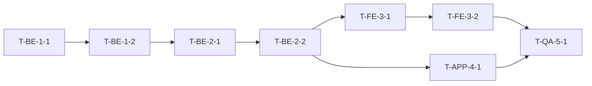

<!--
이 파일은 IP (Implementation Plan, 구현계획서) 의 *공식 견본* 입니다.

새 프로젝트 시작 시 사용법:
1. 이 폴더(`_template/`) 전체를 복사: `cp -R projects/_template projects/{프로젝트명}/`
2. 새 폴더의 `ImplementationPlan.md` 를 열고 본문의 `{프로젝트명}` · `{...}` 플레이스홀더를 모두 치환
3. 옵션 서브폴더(`sessions/`·`decisions/`·`attachments/`·`spec-stubs/`)는 *실제로 사용할 것만* 생성 — 빈 폴더 사전 생성 금지
4. `projects/README.md` 인덱스 표에 새 행 추가
5. 작성 완료 후 §"IP 사람 리뷰 7 가지 질문" (이 파일 맨 끝) 을 모두 *예* 로 통과시키고 v1.0 으로 변경

표준 문서:
- `../../ip-standard.md` — 8 섹션 / 9 필드 / 5 기준 / 4 요소 / DoD 3 요건 상세
- `../../skills/dev-chain-implementation-plan/SKILL.md` — ip-writer/ip-reviewer 자동 생성 절차
- `../../../reports/2026-05-harness-TO-BE.md` §4.3 IP-0 ~ IP-9 — 정책 원본

본 견본의 모든 `<!-- ... -->` 주석은 *작성 가이드* 이므로 실제 IP 작성 후 *모두 삭제* 합니다.
-->

# {프로젝트명} — Implementation Plan

> 본 문서는 *Spec 을 무인 실행 가능한 형태로 변환한 단일 진실 공급원* 입니다.
> 8 섹션 / 섹션 번호·제목 변경 금지. 모든 *9 필드 Task 카드* 의 필드 추가·삭제 금지.

---

## 1. Project Header (프로젝트 헤더)

| 항목 | 값 |
|------|------|
| 프로젝트명 | {프로젝트명} <!-- kebab-case 영문, 50자 이내, 메이저 버전(v2) 만 표기. 예: paid-socialing-v2 --> |
| Owner | @{slack-handle} <!-- 작성 책임자 1 명. 분석 아키텍트와 별도일 수 있음 --> |
| 분석 아키텍트 | @{slack-handle} <!-- PHASE 0·1 의 사람 책임자. Owner 와 같을 수 있음 --> |
| 작성 시작 | YYYY-MM-DD |
| **현재 버전** | **v0.1 (초안)** <!-- 사람 리뷰 7 질문 통과 후 v1.0 으로 변경. baseline 동결일 표기 --> |
| 관련 Spec 베이스라인 | BE v{X.Y} / FE v{X.Y} / APP v{X.Y} <!-- 미해당 컴포넌트는 "—" 로 명시 (생략 금지) --> |
| 관련 Repo | munto-backend, munto-frontend, … <!-- 본 IP 가 건드리는 모든 Repo. §IP-9 워크스페이스 구성 근거 --> |
| Operating Mode 디폴트 | 유인 <!-- 기본은 유인. 무인 모드 진입은 §7 Operating Mode 에서 조건 명시 --> |
| Slack 채널 | #{channel-name} <!-- 본 프로젝트 전용 채널. BLOCKER·세션 인계 알림 채널 --> |
| 무인 모드 Kill Switch | (해당 시) {GitHub Action 워크플로명 또는 Slack 슬래시 명령} |
| 동시 진행 메모 | 워크스페이스 = `munto-dev-assistant/workspace/{프로젝트명}.code-workspace` <!-- §IP-9 격리 단위 --> |

---

## 2. Spec Index (스펙 인덱스 — 4 요소 표기)

> 본 프로젝트가 *참조하는 모든 Spec* 의 목록입니다. Task 카드의 `spec_refs[]` 는 모두 이 인덱스의 행을 가리킵니다.
> 4 요소 = `{repo}/{path}#{anchor}@{baseline-sha}`. SHA 는 *반드시 동결 SHA* (HEAD 금지).

| ID | Repo | 경로 | 베이스라인 SHA | 비고 |
|----|------|------|----------------|------|
| S-BE-1 | munto-backend | docs/specs/{기능명}/SRS.md | xxxxxxx | v{X.Y} 동결 |
| S-BE-2 | munto-backend | docs/specs/{기능명}/DBML.dbml | xxxxxxx | v{X.Y} 동결 |
| S-BE-3 | munto-backend | docs/specs/{기능명}/swagger.yaml | xxxxxxx | v{X.Y} 동결 |
| S-BE-4 | munto-backend | docs/specs/{기능명}/UnitTCL.md | xxxxxxx | v{X.Y} 동결 |
| S-FE-1 | munto-frontend | docs/specs/{기능명}/SRS.md | xxxxxxx | v{X.Y} 동결 |
| S-APP-1 | dating-mobile | docs/specs/{기능명}/SRS.md | xxxxxxx | v{X.Y} 동결 |

<!--
Spec 작성 3 방식 (ip-standard.md §"Spec 작성 3 방식과의 매핑" 참조):
- ① 기존 Spec 수정 (디폴트): 기존 파일의 새 SHA 만 기록
- ② Sub스펙 누적: 신규 파일 SHA + Sub스펙↔모스펙 연결 표기 의무
- ③ 별도 repo Spec (예외): 임시 SHA + §4 Task Cards 에 T-MIGRATE-SPEC-FINAL 반드시 포함
-->

---

## 3. Phase Breakdown (Phase 분해)

> Phase 는 *큰 묶음 단위* (BE 도메인 / BE API / FE 페이지 / APP 화면 / E2E 통합). 일반적으로 3~7 개.

| Phase ID | 제목 | 목표 | 예상 기간 | 책임 도메인 |
|---------|------|------|----------|------------|
| P1 | {Phase 제목} | {달성 목표 1 문장} | {N}일 | BE \| FE \| APP \| QA |
| P2 | … | … | … | … |
| P3 | … | … | … | … |

---

## 4. Task Cards (Task 카드 — 9 필드 고정)

> Task 는 *AI 가 1 회 실행으로 무리 없이 끝낼 단위* (PR 100~300 줄 / 단일 책임 / 30 분~2 시간 / 외부 의존 분리 / Task 1 개 = 1 git revert).
> 모든 Task 는 아래 **9 필드 고정 카드** 로 적습니다. 필드 추가·삭제 금지. 빈 필드·`TBD` 금지.

<!-- ─────────────────────────────────────────────────────────────── -->

### Task T-{DOMAIN}-{PHASE}-{SEQ} — {Task 제목 한 문장}

| 필드 | 값 |
|------|------|
| id | T-BE-1-1 <!-- 형식: T-{도메인:BE\|FE\|APP\|QA}-{Phase 번호}-{Phase 내 순번} --> |
| title | {Task 제목 — 명사형, 무엇을 만들/바꿀지 한 문장} |
| repo | munto-backend <!-- 단일 Repo 1 개. 멀티 Repo 변경이면 Task 를 분리 --> |
| spec_refs[] | S-BE-1 §4.2.3, S-BE-2 §User <!-- Spec Index ID + anchor. SHA 는 Spec Index 에서 한 번만 기록 --> |
| depends_on[] | (없음 — 시작 Task) <!-- 또는 T-BE-1-1, T-BE-1-2 등. 암묵 의존 금지(예: "DB 마이그레이션 먼저는 당연" 같은 표현 금지 — 명시) --> |
| outputs[] | prisma/migrations/{YYYYMMDD}_{name}.sql, src/modules/user/user.entity.ts <!-- 3 개 초과 시 Task 분리 신호 --> |
| dod[] | UT-BE-001, UT-BE-002 (TCL 케이스 ID) + `pnpm test -- user.entity.spec.ts` 통과 <!-- TCL ID 1 개 이상 의무. "동작 확인" 같은 모호 표현 금지 --> |
| estimate | 1.5h <!-- 4h 초과 시 Task 분리 신호 --> |
| risk | {위험 시나리오 1~2 문장 — 롤백 조건 포함} |

<!-- ─────────────────────────────────────────────────────────────── -->

### Task T-BE-1-2 — {다음 Task 제목}

| 필드 | 값 |
|------|------|
| id | T-BE-1-2 |
| title | … |
| repo | munto-backend |
| spec_refs[] | S-BE-1 §4.2.4 |
| depends_on[] | T-BE-1-1 |
| outputs[] | src/modules/user/user.service.ts |
| dod[] | UT-BE-003 + `pnpm test -- user.service.spec.ts` 통과 |
| estimate | 2h |
| risk | … |

<!--
③ 별도 repo Spec 방식인 경우, 아래와 같이 *반드시* 통합 마감 Task 를 IP 의 마지막에 포함:

### Task T-MIGRATE-SPEC-FINAL — 별도 repo Spec 을 원본 BE/FE Repo 로 통합

| 필드 | 값 |
|------|------|
| id | T-MIGRATE-SPEC-FINAL |
| title | project-specs/{프로젝트명}/ 의 Spec 을 munto-backend/docs/specs/, munto-frontend/docs/specs/ 로 이관 |
| repo | munto-backend, munto-frontend (예외 — 2 개 Repo) |
| spec_refs[] | (해당 프로젝트의 모든 S-* 항목) |
| depends_on[] | (모든 다른 Task 완료 후) |
| outputs[] | munto-backend/docs/specs/{기능명}/, munto-frontend/docs/specs/{기능명}/, project-specs/ 측 STUB 정리 |
| dod[] | 양 Repo 의 docs/specs/ 에 동일 SHA 가 commit 됨 + 원본 임시 위치는 STUB 만 남음 |
| estimate | 1h |
| risk | 통합 누락 시 별도 repo Spec 이 영원히 임시로 남음 |
-->

---

## 5. Dependency DAG (의존성 그래프)

> Mermaid 또는 표 형식. *순환 의존 금지*. 같은 레벨의 Task 는 *병렬 실행 가능* 으로 간주.
> DAG 가 10 개 노드를 넘어가면 *Phase 단위 서브그래프* 로 나누어 표기.

---

## 6. DoD Mapping (TCL 케이스 ID 매핑)

> 각 Task 의 `dod[]` 가 *어떤 TCL 케이스를 자동/수동으로 검증하는지* 의 매핑 표.
> 무인 모드로 진입할 Task 는 *자동 DoD 100%* 여야 함. 수동 DoD 가 1 개라도 있으면 `mode: manual` 표기.

| Task ID | DoD TCL 케이스 | 자동/수동 | 검증 명령 |
|---------|---------------|----------|----------|
| T-BE-1-1 | UT-BE-001, UT-BE-002 | 자동 | `pnpm test -- user.entity.spec.ts` |
| T-BE-2-1 | UT-BE-101, UT-BE-102 | 자동 | `pnpm test -- user.controller.spec.ts` |
| T-FE-3-2 | UT-FE-301 (자동) + MT-FE-005 (수동) | 혼합 | `pnpm test -- *.spec.ts` + Storybook 시각 회귀 |

---

## 7. Operating Mode (유인 / 무인 모드 선택과 안전 기본값)

| 항목 | 값 |
|------|------|
| 기본 모드 | 유인 <!-- 디폴트. Task 단위 PR → 사람 머지 --> |
| 무인 전환 조건 | (조건 기술 — 예: P1·P2 완료 + Kill Switch 검증 후 P3 부터 무인) |
| 무인 모드 안전 기본값 | DB 마이그레이션 자동 적용 금지 / 외부 API 변경 자동 머지 금지 / Cost cap 일 {N}K 토큰 / PR 자동 머지 금지 (사람 머지 = 인수) |
| BLOCKER 정의 | 의존 Task 미완료 / TCL 자동 검증 실패 / 외부 API 변경 감지 / 비용 cap 초과 |
| Kill Switch | {GitHub Action 워크플로명 또는 Slack 슬래시 명령} <!-- *반드시* 명시. 미명시 시 무인 모드 진입 금지 --> |
| Slack 알림 정책 | Phase 완료 / BLOCKER 발생 / 일일 요약 (09:00 KST) <!-- TO-BE §4.9.6 정책 --> |
| 세션 파일 저장 정책 (PHASE 2 — 구현 운영) | **대상 독자 = 오케스트레이터·Owner — *구현 개발자 X*** (TO-BE §2.3 ⑧ + §4.4 *구현 개발자 운영* 박스). **무인 모드 = 자동 의무 3 종** (`sessions/YYYY-MM-DD-daily-summary.md` / `…-phase-{n}-summary.md` / `…-blocker-{id}.md`) — 오케스트레이터가 자동 생성·`main` 직접 push. 유인 모드 = 선택. 사람 인계 시 `…-handover-{from}-to-{to}.md` 수동 작성. *상세는 TO-BE §4.9.7 참조* |
| 세션 파일 저장 정책 (PHASE 0~1 — Spec 작성) | **자동 (a) 2 종 — 작성자별 파일 분리** (`sessions/spec-session-{date}-{slack-handle}.md` / `spec-review-{date}-{doc}-{slack-handle}.md`) = `munto-spec-writer`·`munto-spec-review` 스킬 호출 시 자동 박힘. *멀티 작성자 race·merge conflict 0*. `spec-handover-{date}-{from}-to-{to}.md` = Spec 작성 중 사람 인계 시 수동. **`spec-baseline-handoff.md` = PHASE 1 GATE 통과 시 Owner 사람 작성 의무** (*프로젝트당 1 회, `{slack-handle}` 불요*) — *ip-writer 가 IP 초안 생성 시 우선 참조*. 누락 시 `munto-spec-review` 가 🔴 BLOCKER. *상세는 TO-BE §4.7.4 참조* |
| 본 IP 의 *Spec baseline 인계 파일* | `projects/{프로젝트명}/sessions/spec-baseline-handoff.md` — *본 IP v0.1 작성 시 ip-writer 가 우선 참조한 컨텍스트 출처*. *없으면 §8 Change History v0.1 행에 "spec-baseline-handoff 없이 작성 — 컨텍스트 신뢰도 낮음" 명시 의무* |
| 구현 개발자의 sessions/ 관계 | **읽지 않음·박지 않음** (TO-BE §2.3 ⑧ + §4.4). 본인의 진행 로그 = *로컬 `~/.claude/` + PR description*. 본인의 cwd = *각 제품 Repo* (이 IP 가 가리키는 `{repo}` 들), *`projects/{프로젝트명}/` 가 아님*. 유일 예외 = 인계 발생 시 `handover-*.md` 수동 작성 |

---

## 8. Change History (변경 이력)

| 일자 | 버전 | 인수자 | 내용 |
|------|------|--------|------|
| YYYY-MM-DD | v0.1 | — | 초안 작성 (ip-writer) |
| YYYY-MM-DD | v1.0 | @{slack-handle} | **사람 리뷰 7 질문 통과 — baseline 설정** |
| YYYY-MM-DD | v1.1 | @{slack-handle} | T-{X}-{Y} 분리 추가 (DoD 보강) |

<!--
변경 유형별 절차 (ip-standard.md §변경 관리·버전 참조):
- Task Card 1 개 분리·세분화 (DoD 동일) → IP minor (v1.1) — Owner 단독 결정 가능
- DoD 변경 → Spec CCB 절차 선행 후 IP minor (v1.2)
- Phase 추가·삭제 → IP major (v2.0) — 사람 리뷰 재실행 + 별도 폴더 신설 (projects/{프로젝트명}-v2/)
- Spec Index SHA 변경 → Spec CCB 선행 후 IP 갱신
- 무인 모드 진입 시점 변경 → §7 Operating Mode 만 변경, 사람 리뷰 불요
-->

---

## (참고) IP 사람 리뷰 7 가지 질문 — v1.0 baseline 전 자기점검

> 본 7 가지 질문을 *모두 예* 로 통과시킨 후 §8 Change History 에 *인수자* 기록 + v1.0 으로 변경.
> 단 1 개라도 *아니오 / 모름* 이면 통과 보류, 보강 후 재리뷰.

1. **Task Card 9 필드 모두 채워졌는가?** (`TBD` 0 개, 빈 필드 0 개)
2. **Spec Index 의 모든 SHA 가 *동결 SHA* 인가?** (`HEAD` 아님)
3. **모든 Task 의 `spec_refs[]` 가 Spec Index ID 를 가리키는가?** (4 요소 표기 검증)
4. **`depends_on[]` 에 순환 의존이 없는가?** (DAG 가 실제로 DAG 인가)
5. **모든 Task 의 `dod[]` 가 TCL 케이스 ID 를 1 개 이상 가지는가?** (모호한 표현 0 개)
6. **③ 별도 repo Spec 방식이라면, `T-MIGRATE-SPEC-FINAL` Task 가 포함되어 있는가?**
7. **§7 Operating Mode 의 무인 모드 안전 기본값과 Kill Switch 가 명시되어 있는가?**

---

## (참고) 완료 체크리스트

- [ ] 저장 위치가 `munto-dev-assistant/projects/{프로젝트명}/ImplementationPlan.md` 인가
- [ ] 폴더명이 규칙(영문 소문자·하이픈·메이저 버전만)을 따르는가
- [ ] `projects/README.md` 인덱스에 추가했는가
- [ ] (옵션 폴더를 만들었다면) `sessions/`·`decisions/`·`attachments/`·`spec-stubs/` 중 *실제로 사용하는 것만* 생성했는가 (빈 폴더 금지)
- [ ] 8 개 섹션 모두 포함되었는가 (제목·번호 변경 없음)
- [ ] §1 Project Header 의 관련 Spec 베이스라인 (BE/FE/APP) 이 모두 동결 v1.x 인가
- [ ] §2 Spec Index 의 모든 SHA 가 *동결 SHA* 인가 (HEAD 아님)
- [ ] 모든 Task Card 가 9 필드 고정 양식인가 (빈 필드·`TBD` 없음)
- [ ] 모든 Task 의 `spec_refs[]` 가 Spec Index ID 를 가리키는가
- [ ] §5 DAG 에 순환 의존이 없는가
- [ ] 모든 Task 의 `dod[]` 가 TCL 케이스 ID 1 개 이상을 포함하는가
- [ ] ③ 별도 repo Spec 방식이면 `T-MIGRATE-SPEC-FINAL` Task 가 포함되었는가
- [ ] §7 Operating Mode 의 무인 모드 안전 기본값·Kill Switch 가 명시되어 있는가
- [ ] *IP 사람 리뷰 7 가지 질문* 을 모두 *예* 로 통과시켰는가
- [ ] 인수자 (acceptor-of-record) 가 §8 Change History 에 기록되었는가

---

<!-- 본 견본의 모든 가이드 주석은 실제 작성 후 모두 삭제하세요. -->
