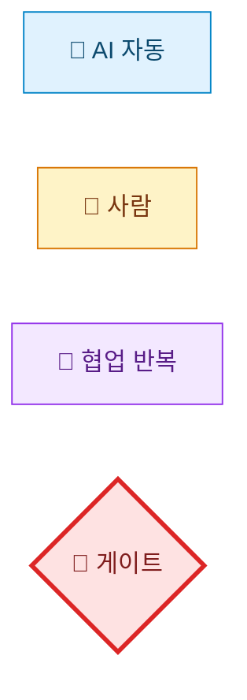
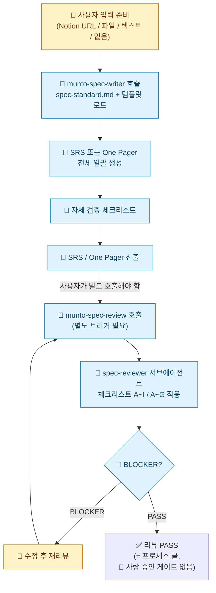
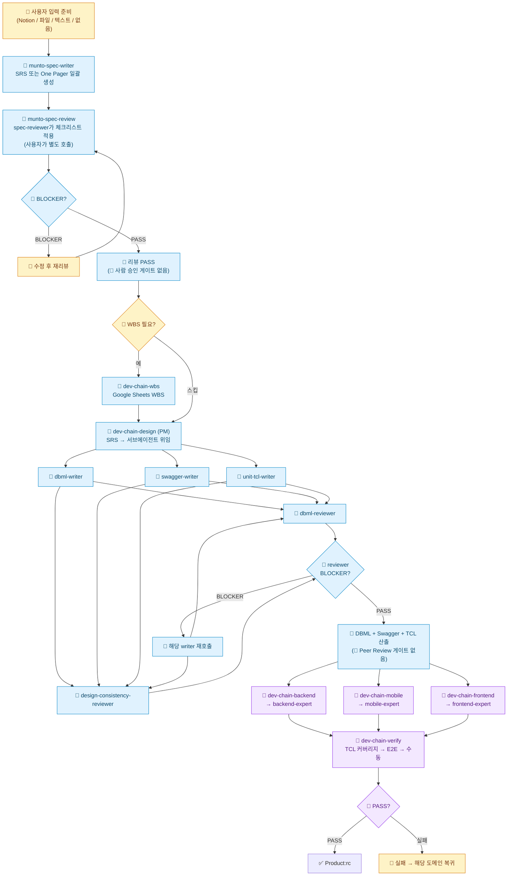

# Munto Dev Assistant 하네스 — AS-IS 분석

> **이 문서의 범위**: `munto-dev-assistant` 레포에 **현재 실제로 구현·기술되어 있는 것**만을 설명하고, 그 한계를 파악한다. 개선 제안·프로세스 가이드는 담지 않는다.

**분석 일자**: 2026-05-14  
**분석 범위**: `munto-dev-assistant` 내 `.agents/`, `.claude/`, `.cursor/`, `.codex/`, `scripts/`, `AGENTS.md`, 대표 스킬·에이전트.

---

## 1. 레포지토리가 하는 일 (한 줄 요약)

문토 조직에서 **Claude · Cursor · Codex** 등이 **같은 스킬·규칙·(일부) 커맨드**를 공유하도록, **원본은 `.agents/` 단일 레포**에 두고 플랫폼별 폴더는 **래퍼(어댑터)** 만 두는 **에이전트 하네스** 저장소다.

---

## 2. 구성 원리 (구조 파악)

### 2.1 단일 진실 공급원

| 레이어         | 역할                                                                                                          |
| -------------- | ------------------------------------------------------------------------------------------------------------- |
| **`.agents/`** | 스킬(`skills/**/SKILL.md`), 규칙(`rules/**/*.md`), 서브에이전트 원본(`agents/*.md`), 커맨드 원본(`commands/`) |
| **`.claude/`** | Claude용 스킬/에이전트/커맨드 래퍼                                                                            |
| **`.cursor/`** | `.mdc` → `.agents/rules` 연결 규칙 래퍼                                                                       |
| **`.codex/`**  | Codex 스킬·에이전트 래퍼(`source`, `spawn_agent` 절차)                                                        |

원칙: **수정은 `.agents/`에서만.** 래퍼 경로는 `scripts/check-adapters.sh`로 검증 가능.

### 2.2 디렉터리 맵 (기억용)

```
.agents/
├── skills/     (common|mobile|frontend|backend/…)
├── rules/
├── agents/     서브에이전트 원본
└── commands/

.claude/ .cursor/ .codex/  → 각각 어댑터
document/                   SRS 템플릿 등
workspace/                  멀티 루트 .code-workspace
scripts/
```

### 2.3 스킬 vs 규칙 vs 커맨드

- **스킬**: 워크플로·트리거·체크리스트·도구 순서(예: SSM 후 DB).
- **규칙**: 코드/문서 작성 제약(NestJS·Flutter 등). Cursor globs로 매핑.
- **커맨드**: 툴 권한 한정 등 **슬래시 커맨드**가 필요할 때만(수가 적도록 유지 정책).

### 2.4 서브에이전트

위임 계약은 `.agents/agents/*.md`에 명시. **Cursor는 서브에이전트 개념 미지원**(AGENTS.md 기준) → 동일 스킬이라도 플랫폼별 체감 차이 발생.

### 2.5 외부 도구 의존

Jira(acli), GWS(`gws`), DB(SSM+MCP 등), Notion MCP 등 스킬 전제 도구 다수.

---

## 3. 현재 전체 프로세스 (AGENTS.md + 스킬 기준 AS-IS)

`AGENTS.md`의 Development Chain은 "기획/SRS"를 시작점으로 적고 있지만, 실제로 하네스에는 **SRS/One Pager를 작성·리뷰하는 스킬**(`munto-spec-writer`, `munto-spec-review`)이 존재한다. 이를 포함한 전체 AS-IS 프로세스를 정리한다.

### 3.0 다이어그램 범례 (Legend)

각 노드는 **누가 일을 수행하는가**에 따라 4가지로 분류한다. 색·아이콘이 동시에 표시되며, 한 채널이 깨져도 다른 채널이 의미를 살린다.

| 아이콘 | 색 | 의미 | 예시 |
|--------|-----|------|------|
| 🤖 | 옅은 파랑 | **AI 자동** — 사람은 트리거만 하고, 실행 중 사람 개입 없음 | `munto-spec-writer` 호출, `dbml-writer`, reviewer 자동 분류 |
| 👤 | 옅은 노랑 | **사람** — 사람이 직접 작성·결정. 결과물의 책임이 사람에게 있는 경우 | 입력 준비, BLOCKER 수정, WBS 필요 여부 판단 |
| 🔄 | 옅은 보라 | **협업 반복** — AI가 만들고 사람이 검토·수정 요청을 반복하는 *루프* 작업 | `dev-chain-backend/mobile/frontend` (현재 상태), 수동 체크리스트 |
| 🚧 | 옅은 빨강 (굵은 테두리) | **게이트** — 사람이 명시적으로 *PASS/REJECT*를 결정하는 의사결정 지점 | (AS-IS에는 거의 없음 — §4.1·4.2 비판 참조) |



> **분류 원칙**: 사람이 호출(trigger)만 하고 AI가 자율 완료하면 🤖이다. AI가 만든 결과를 사람이 *여러 번 검토·수정 요청*하는 패턴이 본질이면 🔄이다. AS-IS 다이어그램에서 🚧이 거의 보이지 않는다는 사실 자체가 **§4.1~4.2 비판(사람 승인 게이트 없음)** 의 시각적 증거다.

### 3.1 SRS/One Pager 작성·리뷰 프로세스 (AS-IS)

하네스에 존재하는 두 스킬이 SRS/One Pager의 작성과 리뷰를 담당한다.

#### `munto-spec-writer` — 실제 동작

1. `document/spec-standard.md` + 문서 유형별 템플릿 로드
2. 입력 소스 판별: Notion URL(`notion-fetch`) / 로컬 파일 / 텍스트 설명 / **입력 없음(대화형 수집)**
3. 문서 유형 자동 판별 (SRS vs One Pager), 불분명 시 질문
4. **SRS 전체 또는 One Pager 전체를 한 번에 작성** — 섹션별·단계별 분할 작성 기능 없음
5. 자체 검증 체크리스트 실행 (항목 구조·1.2 서술형·2.4↔7장 매핑 등)

**스킬에 없는 것:**

- "1.2·2.1·2.2를 사람이 먼저 쓰고 오라"는 **선행 조건 없음**
- 섹션별 분할 작성·단계별 인간 확인 **강제 없음**
- 입력 품질이 낮아도 **거부·경고 없이 생성 진행**

#### `munto-spec-review` — 실제 동작

1. `spec-standard.md` 로드 + 대상 문서 가져오기
2. 문서 유형 자동 판별 (SRS vs One Pager)
3. **PM 모드**: `spec-reviewer` 서브에이전트에 체크리스트 적용 위임
4. 체크리스트 적용: SRS는 A~I (구조·기호·스코프·일관성·DB·API·측정·TBD·링크), One Pager는 A~G
5. BLOCKER / WARNING / SUGGESTION 분류 리포트 출력

**스킬에 없는 것:**

- **비즈니스 방향·조직 의사결정에 대한 검증 없음** — 형식·표준 대비 검수만
- **리뷰 통과 후 사람 승인 단계 없음** — PASS하면 바로 끝
- **"Spec 완료"라는 게이트와 연결 없음** — 후속 단계(`dev-chain-design` 등)와 자동 연결 안 됨

#### SRS/리뷰 AS-IS 다이어그램



> 주의: `munto-spec-writer` 완료 후 `munto-spec-review`는 **자동으로 이어지지 않는다.** 사용자가 별도로 리뷰를 요청해야 한다.

### 3.2 AGENTS.md에 적힌 Development Chain 흐름

```
기획/SRS
   ↓
0. [WBS]    dev-chain-wbs      → Google Sheets WBS 작성 (간단한 기능은 스킵 가능)
   ↓
1. [설계]   dev-chain-design   → DBML + Swagger + TCL 생성
   ↓
2. [개발]   아래 중 해당 도메인 선택 (병렬 가능)
   ├── dev-chain-backend   → Entity → Service → Controller → Unit Test
   ├── dev-chain-mobile    → Model → API → Repository → BLoC/Riverpod → Screen/View → Unit Test
   └── dev-chain-frontend  → Model → Repository → ViewModel → View → Page → Unit Test
   ↓
3. [검증]   dev-chain-verify   → TCL 기반 Unit Test + E2E + 수동 체크리스트
```

### 3.3 전체 AS-IS 다이어그램 (SRS 작성·리뷰 포함)



> 다이어그램에 **🚧(게이트)** 가 나타나지 않는 것이 핵심 관찰: AS-IS에는 *사람 명시 승인 단계*가 사실상 없다. PHASE 2 도메인 구현(`dev-chain-backend/mobile/frontend`)은 의도상 🤖이지만 현재 **🔄 협업 반복**으로 운영되고 있어 그대로 표시했다. 이 두 가지가 **TO-BE에서 가장 큰 변화 지점**이다.

### 3.4 AGENTS.md에 적힌 에이전트 행동 원칙

1. **설계 없이 개발 시작 금지**: Swagger와 TCL이 없으면 개발 스킬 실행 불가.
2. **완료 보고 없이 다음 단계 진행 금지**: 각 스킬의 완료 체크리스트를 통과해야 다음 단계로 이동.
3. **단계 순서 역행 금지**: 검증에서 발견된 문제는 해당 도메인 스킬로 돌아가 수정.
4. **설계 산출물 보존**: 생성된 DBML, Swagger, TCL은 후속 스킬에서 반드시 참조.
5. **레거시 코드 수정 범위 제한**: 요청하지 않은 기존 코드 수정 금지.

### 3.5 각 스킬이 실제로 하는 것 요약

| 스킬 | 입력 | 산출물 | 서브에이전트 | 비고 |
| --- | --- | --- | --- | --- |
| `munto-spec-writer` | 기획 문서 / Notion / 텍스트 / **없음** | SRS 또는 One Pager (마크다운) **전체 일괄 생성** | 없음 | `spec-standard.md` + 템플릿 로드. **선행 조건·단계 분할 없음.** 입력 부족 시 대화형 수집은 하지만 거부하지 않음 |
| `munto-spec-review` | SRS / One Pager | BLOCKER/WARNING/SUGGESTION 리포트 | `spec-reviewer` (PM 모드) | 체크리스트 A~I (SRS) / A~G (One Pager). **형식·표준 검수만**, 비즈니스 검증 불가. **리뷰 후 사람 승인 단계 없음** |
| `dev-chain-wbs` | SRS | Google Sheets WBS | 없음 | `gws` CLI 사용 |
| `dev-chain-design` | SRS | DBML + Swagger + Unit TCL | `dbml-writer`, `swagger-writer`, `unit-tcl-writer`, `dbml-reviewer`, `design-consistency-reviewer` (PM 모드, 팬아웃/팬인) | 3개 writer 병렬 필수 |
| `dev-chain-backend` | Swagger + TCL | Entity → Service → Controller → Unit Test 코드 | `backend-expert` (PM 모드) | `dating-backend` 표준, `munto-backend` 참조 |
| `dev-chain-mobile` | Swagger + TCL + Figma | Model → API → Repo → State → Screen → Test 코드 | `mobile-expert` (PM 모드) | `dating-mobile`(BLoC), `munto-mobile`(Riverpod) |
| `dev-chain-frontend` | Swagger + TCL + Figma | Model → Repo → ViewModel → View → Page → Test 코드 | `frontend-expert` (PM 모드) | `munto-frontend` |
| `dev-chain-verify` | TCL + 구현 완료 보고 | 검증 보고서 (Unit/E2E/수동 체크리스트) | 없음 | 실패 시 해당 도메인 스킬로 복귀 |

### 3.6 보조 스킬 (개발 체인 외 업무 도구)

| 카테고리        | 스킬                                      | 트리거 예시                                |
| --------------- | ----------------------------------------- | ------------------------------------------ |
| **이슈 관리**   | `munto-create-issue` · `munto-read-issue` | "Jira 이슈 만들어줘" · "DEVT-123 조회해줘" |
| **PR 생성**     | `munto-create-pr`                         | "PR 만들어줘"                              |
| **DB 조회**     | `munto-read-db`                           | "프로덕션 데이터 확인해줘" (SSM 먼저)      |
| **문서 읽기**   | `munto-read-document`                     | "이 노션 문서 요약해줘"                    |
| **스탠드업**    | `munto-standup`                           | "오늘 할 일 정리해줘"                      |
| **이메일**      | `munto-check-email`                       | "메일 브리핑해줘"                          |
| **QA TCL**      | `qa-tcl-writer`                           | "QA TCL 만들어줘" (릴리즈 회귀용)          |
| **하네스 진단** | `harness-diagnostics`                     | "harness 진단해줘"                         |

---

## 4. 비판: 현재 프로세스의 문제점

### 4.1 `munto-spec-writer` — 풀 자동 작성에 아무 장벽이 없다

- 스킬 자체에 **선행 조건이 없다.** "1.2·2.1·2.2를 사람이 먼저 쓰고 오라"는 강제도, 입력 품질이 낮을 때 거부하는 로직도 없다.
- 입력이 아예 없어도(`입력이 부족한 경우 → 필수 정보를 대화형으로 수집`) 대화형 질문 몇 개로 **SRS 전체를 한 번에 생성**한다. 섹션별 분할 작성 기능이 없다.
- 개발자가 "SRS 전체 써줘"라고 하면 에이전트는 그냥 쓴다. **작성자가 범위·목적을 깊게 고민하지 않고 AI 출력에 매몰될 위험**이 크다.
- 스킬에 자체 검증 체크리스트가 있지만, 이는 **형식 검증**(항목 구조·매핑)이지 **"사람이 핵심을 먼저 썼는가"를 확인하는 것이 아니다.**

**요구사항 출처 가이드도 없다 — 사람이 빈약한 입력을 줘도 막을 수 없다**

- SW 공학 표준에 따르면, 요구사항은 **내부(전략·OKR·기존 시스템·이해관계자·제약) + 사용자·시장(인터뷰·로그·VOC·경쟁) + 외부(도메인 전문가·표준·외부 API·시장 트렌드)** **총 13 가지 출처**에서 수집해야 한다.
- 그런데 `munto-spec-writer` 와 `spec-standard.md` 어디에도 **"이 13 가지 출처를 사전에 훑고 입력하라"** 는 체크리스트가 없다.
- 결과: 작성자가 *Slack 회의록 1 개* 만 들고 와서 `munto-spec-writer` 를 호출하면, AI 는 *13 가지 중 1 가지만 반영된 SRS* 를 만들어낸다. **AI 는 자력으로 다른 출처를 알 수 없다.**
- 빠진 출처(특히 *법무·보안 제약*, *경쟁 제품*, *기존 코드·DB 스키마*)는 PHASE 1·2 에서 발견되어 **베이스라인 재설정 비용**으로 되돌아온다.

### 4.2 `munto-spec-review` — 형식 검수만, 비즈니스 검증·사람 승인 없음 + 사람 리뷰 운영 가이드도 없음

**기존 비판 — 형식·비즈니스 검증 비대칭**

- 체크리스트 A~I(SRS)는 **항목 구조, 기호 정의, 스코프 서술형 여부, 섹션 매핑, DB/API 스키마, 측정 가능성, TBD, 링크** 등 **형식·표준 정합성**만 검증한다.
- **"이 스펙의 방향이 비즈니스에 맞는가"**, **"문서화되지 않은 조직 의사결정과 부합하는가"**는 검증 범위 밖이다.
- 리뷰 PASS 후 **사람(기획/PM) 승인 단계가 없다.** 형식 통과하면 프로세스가 그냥 끝난다.

**추가 비판 — 사람 리뷰가 *실제로 진행될 때* 따라야 할 운영 가이드도 없다**

설령 위 누락을 *팀 합의로 보강* 해서 사람 리뷰를 끼워 넣더라도, **사람 리뷰가 형식적 회의로 변질되는 것을 막을 가이드가 어디에도 없다**. SW 공학 표준에서 정립한 *리뷰 5 원칙* 이 모두 빠져 있다:

| # | 원칙 | AS-IS 의 결함 |
| --- | --- | --- |
| 1 | **1 회 정밀 리뷰 원칙** | "여러 번 가볍게 리뷰" 패턴이 묵인됨 — 집중도 ↓ → 진짜 결함을 놓침 |
| 2 | **사전 배포 (분량·이해관계자 비례)** | 회의 직전 SRS 를 던지면 즉석 리뷰가 됨 → *읽지도 않고* 통과 |
| 3 | **사전 정독 필수 (AI 보조 권장)** | 정독 의무가 없으니, 회의 자리에서 처음 보고 의견 내는 패턴 발생 |
| 4 | **부분 리뷰 가이드 명시** (누가 어느 섹션) | 모두가 전체 리뷰 부담 → 부담 회피로 *형식 PASS* |
| 5 | **특별 리뷰어** (보안·법무·접근성) | 도메인 전문가 호출 절차 없음 → 보안·법무 결함을 PHASE 2 에서 발견 |

- 결과: *"리뷰 받았다"* 라는 도장만 찍히고, 실제로는 *작성자만 본 문서가 통과* 하는 경우가 생긴다. AS-IS 의 리뷰 부재는 *프로세스* 만이 아니라 *리뷰 운영 매뉴얼 자체* 의 부재이기도 하다.

### 4.3 SRS 작성과 리뷰가 자동으로 연결되지 않는다

- `munto-spec-writer`로 SRS를 생성해도, `munto-spec-review`는 **별도 트리거**가 필요하다. 자동으로 이어지지 않는다.
- 작성만 하고 리뷰를 하지 않는 것이 가능하며, 이를 막는 프로세스 장치가 없다.
- AGENTS.md의 Development Chain에서도 SRS 작성·리뷰 단계가 **명시적으로 표현되어 있지 않다.** "기획/SRS"라는 시작점만 있고, 그 SRS가 어떤 품질 검증을 거쳤는지는 규정하지 않는다.

### 4.4 설계(DBML·Swagger) 후 Peer Review 게이트가 없다

- `dev-chain-design`이 DBML·Swagger·TCL을 만들면, AGENTS.md 흐름상 **바로 `dev-chain-backend` 등 구현 스킬로 넘어간다.**
- **개발자 Peer Review**라는 단계가 AGENTS.md에 없다. 에이전트가 만든 설계를 사람이 검토하지 않고 바로 구현으로 넘어갈 수 있는 구조다.
- `dbml-reviewer`·`design-consistency-reviewer`는 **자동 정합성 검증**일 뿐, 사람의 판단(아키텍처·비즈니스 적합성)을 대체하지 못한다.

### 4.5 Spec 정의가 모든 차원에서 불분명하다 — 범위·경계·완료 시점 3 종 세트

기존 비판은 *"Spec 끝 시점이 모호"* 하나만 다뤘으나, 실제로는 **3 종 세트가 모두 빠져 있다**. SW 공학 표준은 Spec 의 정의를 (a) *무엇이 Spec 인가/아닌가*, (b) *Spec 과 설계의 경계*, (c) *Spec 의 동결 시점(베이스라인)* 세 차원으로 규정한다. AS-IS 는 세 차원이 모두 부재하다.

#### (a) "Spec 인 것 / 아닌 것" 의 구분 가이드가 없다 *(SW 공학 표준 §2.6)*

SW 공학 표준은 *프로젝트 관리·일정·교육 계획·사용자 매뉴얼·인력 교육* 등은 **Spec 에 들어가면 안 된다** 고 규정한다. 이유는 *"이런 항목이 들어가면 일정·인원이 바뀔 때마다 Spec 도 수정해야 해서 Spec 의 권위(베이스라인)가 무너진다"*.

- AS-IS 의 `spec-standard.md`·`munto-spec-writer` 어디에도 *"이런 건 Spec 에 넣지 마라"* 라는 In/Out 가이드가 없다.
- 결과: 작성자가 *프로젝트 일정·인원 배치·교육 계획*까지 SRS 에 적어 두는 일이 발생할 수 있고, 이후 일정 변동마다 SRS 가 흔들린다.

#### (b) "Spec 과 설계의 경계" 정의가 없다 *(SW 공학 표준 §2.8)*

SW 공학 표준은 *"Spec = What, 설계 = How 로 칼로 무 자르듯 구분하는 것은 오해"* 라고 명시한다. **잘 분석된 Spec 은 상위 설계 영역(인터페이스·아키텍처)까지 다루는 것이 정상**이다.

- AS-IS 는 `munto-spec-writer`(텍스트 Spec) 와 `dev-chain-design`(DBML·Swagger·TCL) 이 **완전히 별개 스킬·별개 단계**로 구현되어 있다.
- 두 스킬 사이에 *"DBML·Swagger 는 Spec 의 일부냐, 설계냐"* 에 대한 팀 합의·문서가 없다.
- 결과: *"SRS 다 썼으니 Spec 끝"* 으로 오인하는 사람도, *"DBML 까지 만들었으니 Spec 끝"* 으로 보는 사람도, *"코드 완성 = Spec 끝"* 으로 보는 사람도 같은 팀 안에 공존한다. **같은 용어로 다른 시점을 가리키게 된다.**

#### (c) "Spec 동결 시점(베이스라인)" 정의가 없다 *(SW 공학 표준 §6.8 → 본격 비판은 §4.13)*

- AS-IS 에는 *"이 시점부터 Spec 은 동결되고, 이후 변경은 통제된다"* 는 베이스라인 개념이 전혀 없다.
- 결과: 누구든 언제든 SRS·DBML·Swagger 를 수정할 수 있고, 그 변경이 다른 산출물·코드에 미친 영향이 추적되지 않는다.
- 베이스라인이 없으면 *"우리 지금 어느 버전의 Spec 보고 있는 거예요?"* 라는 질문이 자주 나오고, 다도메인 협업 시 *"BE 는 v1.0 기준, FE 는 v0.9 기준"* 같은 어긋남이 발생한다.
- **상세 비판은 §4.13 (변경 관리 부재) 참조.**

#### 종합

위 (a)(b)(c) 세 가지가 누락된 결과, AS-IS 의 Spec 정의는 *"무엇이 들어가는지·어디까지인지·언제 끝나는지"* 가 모두 불명확하다. *"기획/SRS"* 라는 한 단어로 압축된 AGENTS.md 의 시작점은 **사람마다 다른 그림을 떠올리게 만든다**.

### 4.6 SRS 작성 표준의 가이드·표기 규약이 부족하다 — 1.2 예시 + 4 가지 표기 규약 부재

#### (a) 기존 비판 — 1.2 예시가 오히려 나쁜 지침이었다

- 기존 ✅ 예시가 **추천·베이지안 점수**라는 특정 도메인에 고정되어 있어, 이를 복사한 SRS는 **형식만 맞고 내용은 타 팀 과제 설명** 같은 스펙이 되기 쉬웠다.
- 1.2 Product Scope가 해야 할 역할(**문제→목표→책임·경계 서술**)이 아니라, **In/Out Scope 나열 금지**라는 형식 제약만 강조하는 데 그쳤다.

#### (b) 추가 비판 — SRS·설계 문서 작성 4 가지 표기 규약이 어디에도 없다 *(SW 공학 표준 §6.3 · §6.4 · §6.5)*

SW 공학 표준은 *"적게 쓰되 핵심 빠지지 않게"* 를 실무에서 지키게 하는 **4 가지 표기 규약** 을 정립한다. 본 4 가지가 AS-IS 에는 모두 빠져 있어, **빈칸·"-"·"없음" 만 적힌 SRS 가 리뷰를 통과**할 수 있다.

| 표기 규약 | SW 공학 표준의 용도 | AS-IS 의 결함 |
| --- | --- | --- |
| **`TBD: <설명> + 미결 이유 + 결정 책임자 + 마감 시점`** | 핵심이지만 *현재 결정 불가* 한 항목 — 비워두면 AI/개발자가 임의 추정 위험 | `spec-standard.md` 의 TBD 체크리스트는 *존재 여부* 만 확인. *미결 이유·책임자·마감* 같은 메타 정보 의무화 없음 |
| **`N/A` (해당 없음) vs `None` (있어야 하지만 없음)** | 항목 *적용 불가* ↔ 적용되지만 *현재 비어 있음* 의 구분 — 누락인지 무관인지 판단 가능하게 함 | 두 표기의 *구분 자체* 가 정의되지 않음. 그래서 빈칸·`-`·`없음` 만 적혀도 리뷰가 *의미 없는 빈칸* 인지 *의도적 N/A* 인지 구분 못 함 |
| **`Will Not Do` / `(Out of Scope)`** | 이해관계자가 *기대할 수 있지만 안 할* 항목 — 명시 안 하면 *"왜 안 했냐"* 가 반복 질의됨 | 1.2 Product Scope 의 "Out Scope" 항목 외에는 *"이건 안 한다"* 를 명시할 자리가 없음. 안 하는 이유·이관처 정보도 없음 |
| **논의 기록 (Decision Log)** | 의견 갈렸던 항목의 *최종 결정 근거·반대 의견*을 같이 남김 — 6 개월 뒤에도 이유 추적 가능 | SRS 어디에도 *논의 기록* 섹션·표기 규약 없음. 결정만 남고 *근거가 휘발됨* → 6 개월 후 *"왜 이렇게 결정했더라?"* 가 반복 |

- 결과: AI 가 비결정 항목을 만나면 `TBD` 로 명시하고 *사람에게 질문* 하는 대신, *그냥 추측해서 채움*. 사람도 빈칸을 그대로 두고 리뷰를 통과시킴. **"형식만 채워진 SRS"** 의 구조적 원인 중 하나가 표기 규약 부재다.

### 4.7 Cursor에서 품질 격차

- `dev-chain-design`·`munto-spec-review` 등이 **서브에이전트 병렬 위임**을 전제로 설계되었으나, **Cursor는 서브에이전트 개념 미지원**이다.
- 동일 스킬을 Cursor에서 쓰면 팬아웃/팬인 패턴이 작동하지 않아 **설계 의도 대비 품질 격차**가 발생한다.

### 4.8 어댑터 드리프트 CI 미부착

- 래퍼가 가리키는 `.agents/` 경로가 깨져도 **빌드가 돌지 않으므로** 놓치기 쉽다.
- `scripts/check-adapters.sh`가 존재하지만 **CI/PR 파이프라인에 붙어 있지 않다.** 로컬에서만 수동 실행.

### 4.9 무인 야간 실행에는 거리가 있다

- "Spec 완결 후 밤새 자동 개발·테스트"라는 비전을 가지려면, **오케스트레이션·CI/CD·플랫폼 런타임·안전 장치**(샌드박스, 비밀 분리, 승인 게이트) 레이어가 필요하다.
- 현재 하네스는 **사람이 시작·종료**해야 하며, **실패 시 알림·롤백·중단 조건** 같은 야간 플레이북이 없다.

### 4.10 Spec 작성 분량 철학이 없다 — *AI 가 *What* 만 채운 장황 SRS 양산 위험* *(SW 공학 표준 §6.5 · §8.1 · §9.11)*

SW 공학 표준은 *Spec 의 적정 상세도는 프로젝트 성격에 따라 다르며* (쉬운/어려운, 같은 팀/다른 팀, 외주 여부 등), Spec 은 **Why · What · How 의 균형**을 가져야 한다고 규정한다. 특히 **"Why 가 없는 Spec 위에는 좋은 아키텍처를 설계할 수 없다"** 가 핵심 원칙이다.

| 빠진 것 | 결과 |
| --- | --- |
| **"정확함 ≠ 자세함"** 원칙 — 적정 상세도 가이드 (Case A/B/C) | AI 가 가능한 한 *많이 채우려는* 경향과 맞물려, *읽지도 못할 분량의 SRS* 가 양산됨 |
| **Spec 작성 종료 시그널** (요구사항 더 못 나옴 / 우선순위 낮은 게 자꾸 나옴) | "언제 멈춰야 할지" 가이드 부재 — 계속 늘어남 |
| **Why-What-How 분량 비중** 가이드 (Spec 은 What 이 가장 많지만 *Why 도 상당량 필요*) | AI 가 *What* (기능 목록·DTO 명세) 만 빵빵하게 채운 SRS 가 만들어짐. 비전·전략·이유가 빠짐 |
| **Why 의 강제** | AI 가 PHASE 2 구현 시 *"왜 이렇게?"* 를 물을 답이 SRS 에 없음 → 추측 구현 → 비즈니스 의도와 어긋남 |

- AS-IS 의 `munto-spec-writer` 는 *모든 SRS 섹션을 균등하게 채우는* 패턴이고, `munto-spec-review` 는 *형식·매핑* 만 본다. **분량이 충분한지·Why 가 있는지·언제 멈춰야 하는지**는 둘 다 검증하지 않는다.
- 결과: *"형식은 완벽한데 정작 왜 만드는지 모르겠는 SRS"* 가 통과한다.

### 4.11 큰 프로젝트 분해 메커니즘이 없다 — *단일 SRS 가 거대해지거나 도중 분기 못함* *(SW 공학 표준 §6.12)*

SW 공학 표준은 *큰 프로젝트는 Main Spec 1 개 + Sub스펙 N 개* 로 분해해야 한다고 규정한다. 핵심은 *"Main Spec 에서 컴포넌트 간 인터페이스를 먼저 정의하면 → Sub스펙 병렬 작성 가능 → 개발도 병렬 가능"*. **인터페이스 정의가 병렬 개발의 성패를 가른다**.

| 빠진 것 | 결과 |
| --- | --- |
| **Phase → Task → Sub스펙 분해** 가이드 | 큰 프로젝트도 단일 SRS 로 적게 됨 → SRS 가 거대해져 *읽기·리뷰·유지보수 모두 불가* |
| **Main Spec 에서 인터페이스만 먼저 정의** 원칙 | DBML·Swagger 가 늦게 결정되어, BE·FE·App 이 *서로 다른 가정으로 동시에 개발 → 통합 시 대규모 재작업* |
| **Sub스펙 트리거** (자세히 적으면 분량 폭발 / 독립 팀 할당 / 후순위 Task) | "이 부분은 나중에" 라는 판단을 할 메커니즘이 없음 → 미정 사항을 *어쩔 수 없이* 추측으로 메움 |
| **Sub스펙 작성 시점 자유 원칙** | 모든 것을 *처음에 다 적으려는* 부담 → SRS 작성이 *영원히 안 끝남* |

- AS-IS 는 `dev-chain-wbs` 가 *Google Sheets WBS* 를 만들긴 하지만, 이는 **태스크 분해 (스케줄)** 이지 **Spec 분해 (Main + Sub)** 가 아니다.
- 결과: 큰 프로젝트는 *단일 거대 SRS* 또는 *비공식 N 개 작은 SRS* (인터페이스 정합성 보장 없음) 둘 중 하나로 진행됨.

### 4.12 PHASE 0·1 의 사람 책임자(분석 아키텍트)가 명시되지 않는다 *(SW 공학 표준 §4)*

SW 공학 표준은 PHASE 0·1 의 *사람 책임자*를 **분석 아키텍트(Analyst-Architect)** 로 명명하고, 다음 **8 가지 활동**을 누군가가 반드시 수행해야 한다고 규정한다: ① 요구사항 수집 ② 이해관계자 정렬 ③ 분석·우선순위화 ④ Spec 작성 주도 ⑤ AI 작성물 비즈니스 검증 ⑥ 상위설계 가드 ⑦ 종합 게이트 진행 ⑧ 변경 관리.

| 빠진 것 | 결과 |
| --- | --- |
| **분석 아키텍트 역할 정의** (PM/BE 리드 겸직 가능) | 누가 PHASE 0·1 의 *사무국*인지 모호 — *"기획자가 알아서 하겠지"* / *"BE 리드가 보겠지"* 같은 책임 회피 발생 |
| **킥오프 시 분석 아키텍트 1 명 지정** 절차 | 프로젝트마다 책임자가 *암묵적*. 책임 공백 시 *요구사항 누락·이해관계자 충돌* 이 발생해도 *해결할 사람이 없음* |
| **8 가지 활동의 매핑** | 누가 어떤 활동을 책임지는지 모름 → 8 가지 중 일부가 *전혀 수행되지 않음* (특히 ② 이해관계자 정렬, ⑤ 비즈니스 검증, ⑧ 변경 관리) |

- AS-IS 의 `AGENTS.md` 와 모든 스킬에 *역할명* 자체가 없다. *"누가 사람 책임자인가"* 가 정의되지 않으니, *PHASE 0·1 의 사람 칸* 이 비어 있는 상태로 프로세스가 돌아간다.
- 결과: 사람 개입이 필요한 지점에서 *누구도 들어가지 않는* 공백이 발생. 이 공백을 PHASE 2 (구현) 단계에서 발견하면 비용이 폭증한다.

### 4.13 베이스라인·변경 관리 메커니즘이 전혀 없다 *(SW 공학 표준 §6.8 · §6.12 · §9.11)*

§4.5 (c) 에서 짚은 *베이스라인 부재* 가 가장 큰 영향을 미치는 영역이 **변경 관리**다. SW 공학 표준은 *베이스라인 = Spec 의 동결 시점* 이며, 베이스라인 이후 변경은 **CCB (Change Control Board) 절차**를 따라야 한다고 규정한다.

| 빠진 것 | 결과 |
| --- | --- |
| **베이스라인 설정 시점** (Spec 동결) | 누가 언제든 SRS·DBML·Swagger 수정 가능 → *다른 팀이 작업 중이던 가정이 사라짐* |
| **변경 영향도 분석 절차** (어느 산출물·코드·테스트 영향?) | 작은 변경처럼 보이는 *DBML 컬럼 추가*가 Swagger·TCL·BE·FE·App 모두에 영향. 추적이 안 되면 *통합 시 정합성 깨짐 발견* |
| **CCB 의사결정자 가변 운영** (소: 리드 1 인 / 중: 비동기 1~2 일 / 대: 전체 동기 회의) | 변경 결정이 *Slack 한 마디로 끝남* 또는 *너무 무거운 회의* 둘 중 극단으로 빠짐 |
| **베이스라인 버저닝** (v1.0 → v1.1 마이너 / v1.x → v2.0 메이저) | *"우리 지금 어느 Spec 버전 보고 있는 거예요?"* 가 반복 — 메이저 변경도 마이너처럼 처리됨 |
| **변경 후 정합성 재검증** (`design-consistency-reviewer` 재실행) | 변경이 다른 산출물과 일관성 깨졌는지 *검증 절차 없음* → 베이스라인이 *서서히 망가짐* |
| **변경 사유·근거 기록** (논의 기록) | *"왜 이 컬럼 추가했더라?"* 가 6 개월 후 답이 안 됨 → 동일 변경이 *원복·재변경* 반복 |

- AS-IS 는 베이스라인·변경 관리 절차가 *0 개* 다. AGENTS.md 의 *"단계 순서 역행 금지"* 가 유일하게 변경에 가까운 원칙이지만, 이는 *"검증 단계에서 발견된 문제는 해당 도메인 스킬로 돌아가 수정"* 일 뿐 *베이스라인 변경 통제* 와는 다른 차원이다.
- 결과: AS-IS 의 산출물들은 *항상 변동 중* 인 상태로 PHASE 2·3 으로 흘러가며, 도메인 간 *어긋남 발견 → 수정 → 또 다른 어긋남 발견* 의 사이클이 무한 반복될 수 있다.

### 4.14 SW 공학 표준 정렬도가 전혀 없다 *(메타 수준의 문제)*

위 §4.10 ~ §4.13 의 공통 원인이자 가장 본질적인 문제는, **AS-IS 가 SW 공학 표준의 어떤 원칙·용어도 의도적으로 따르지 않는다** 는 점이다.

| 빠진 것 | 결과 |
| --- | --- |
| **표준 용어 (Spec / Baseline / CCB / Analyst-Architect / Sub-Spec)** | 팀 내에서 *각자 다른 용어* 사용 → 회의에서 같은 말을 하는데 서로 다른 것을 의미 |
| **표준 원칙 (정확함 ≠ 자세함 / Why-What-How / 분해 / 변경 통제)** | 원칙 없는 *임의 결정* — 한 팀은 *자세하게*, 다른 팀은 *대충*. 일관성 없음 |
| **외부 자료 활용 가능성** | SW 공학 책·논문·블로그를 보더라도 *우리 프로세스와 매핑 안 됨* → 외부 학습이 *우리 일에 도움 안 됨* |
| **신규 입사자 온보딩 비용** | 우리 팀 *고유 용어·관행* 을 처음부터 학습해야 함. 업계 경험이 *재활용되지 않음* |
| **AI 에이전트의 SW 공학 지식 활용** | LLM 은 SW 공학 표준 용어로 학습됨. AS-IS 의 비표준 용어를 쓰면 *AI 가 가장 잘 아는 영역의 도움을 받지 못함* |

- 이 문제는 *기능적 결함* 이 아니라 *프로세스 메타 차원* 의 문제다. *AS-IS 가 작동하지 않는다* 는 게 아니라, *AS-IS 가 외부와 단절되어 있다* 는 게 핵심.
- TO-BE 는 이 문제를 *모든 절에 SW 공학 표준 §X.Y 참조 표기* 와 *표준 용어 채택*으로 해결한다. AS-IS 는 이런 정렬이 *전혀* 없다.

### 4.15 Spec → 구현 사이 *컨텍스트 전달 매개* 가 없다 — 무인 자동화가 원천 불가능 *(가장 결정적인 누락)*

> **이 절의 위치**: §4.10 ~ §4.14 가 *Spec 자체의 결함*이라면, §4.15 ~ §4.16 은 *Spec 이 잘 작성되었을 때조차도 발생하는 결함*이다. AS-IS 의 가장 큰 누락 고리이자, *24 시간 무인 자동화* 가 작동하지 못하는 본질적 원인이다.

AS-IS 에는 **Spec 과 구현 사이의 매개 산출물이 정의되어 있지 않다.** 즉, Spec (SRS·DBML·Swagger·UI·TCL) 이 완벽해도, *"Task 1 번 구현해"* 라고 던지는 순간 매번 *어디 보고·뭘 만들고·어떻게 끝났음을 판정하는지* 를 사람이 다시 설명해야 한다.

| 빠진 것 | 결과 |
| --- | --- |
| **Task 단위 정의** | *AI 가 1 회 실행으로 무리 없이 끝낼 단위* 의 기준이 없음 → Task 가 너무 크면 BLOCKER, 너무 작으면 폭증 |
| **Task → Spec 참조 경로 매핑** | 각 Task 마다 *Spec 의 어느 부분을 봐야 하는지* 가 매번 사람의 머릿속에만 있음 → AI 입력으로 변환 불가 |
| **Task 간 의존성 그래프 (DAG)** | 어느 Task 가 어느 Task 의 결과를 전제로 하는지가 *암묵적* → 무인 루프가 잘못된 순서로 돌면 50 % 실패 |
| **Task 완료 정의 (DoD)** | *"끝났음"* 판정이 *기계 판정 가능한 형태*로 정의되지 않음 → 자동 검증 불가 → §4.9 무인 야간 실행이 원천 불가 |
| **단일 진입점 (한 문서)** | 위 4 가지를 *한 곳에 묶은 문서*가 없음 → AI 세션마다 사람이 *컨텍스트를 재구성해 전달* |

**현장 사고 패턴 예시**

> *"SRS 와 Swagger 다 잘 작성하고 `dev-chain-backend` 호출했는데, AI 가 *어느 엔티티부터 만들어야 할지·Auth Service 가 User Entity 에 의존하는지· 마이그레이션을 언제 돌려야 하는지* 를 알지 못해서, 매 Task 마다 사람이 1~2 시간씩 컨텍스트 설명해야 했다. 결국 *AI 가 만들 수 있는 부분만* 사람이 손으로 떼서 던지는 패턴이 되어, 24 시간 무인 실행은 사실상 시작도 못함."*

**시스템 차원의 결과**

- **§4.9 무인 야간 실행이 작동하지 못한다.** 무인 루프의 *입력 명세*가 없으므로, 루프 자체가 *시작할 컨텍스트*를 받지 못한다. AS-IS 의 §4.9 비판은 *인프라가 없다* 라고만 적혔지만, 더 본질적으로 *입력 형식이 없다* 가 진짜 원인이다.
- **AI 컨텍스트 전달 비용이 Task 수만큼 폭증한다.** Task 20 개면 *20 회의 컨텍스트 재구성*이 사람 작업으로 남아, *AI 자동화의 효과가 사람 작업으로 상쇄된다.*
- **§5 행동 패턴 ④ (신규)** — 사람이 *Task 마다 컨텍스트 재구성하는 작업에 지쳐* → *AI 에 던지고 결과 확인 안 함* 으로 변질 (§5.4 참조).

> *(TO-BE 대응: §4.3 끝 *Implementation Plan (구현계획서, IP)* 8 개 하위 절 신설 — 본 4 가지 결함을 *단일 문서·8 개 필수 필드·Task 카드·DAG·DoD·저장 위치 정책*으로 메움)*

### 4.16 멀티 Repo Spec 의 *단일 진입점* 이 없다 — 분산 Spec 환경의 통합 비용 *(대부분의 실제 프로젝트가 해당)*

Munto 의 실제 프로젝트는 **BE + FE + APP + munto-dev-assistant** 를 하나의 워크스페이스로 묶어 진행한다. 그러나 AS-IS 에는 **여러 Repo 에 흩어진 Spec 을 *한 프로젝트 단위로 묶는 메커니즘*** 이 없다.

| 빠진 것 | 결과 |
| --- | --- |
| **멀티 Repo 베이스라인 = Repo n 개의 SHA n 개 묶음** 개념 | *베이스라인* 이 단일 문서 동결만 가정 → 멀티 Repo 환경에서 *누가 어느 SHA 를 봤는지* 추적 불가 |
| **Spec 작성 방식의 정책** (기존 수정 / Sub스펙 / 별도 repo 중 디폴트는?) | 어디에 적을지 매번 즉흥 결정 → 같은 기능의 Spec 이 BE Repo 와 FE Repo 양쪽에 *다르게* 적힘 |
| **별도 repo Spec 의 *원본 통합 의무*** | 임시로 별도 repo 에 적은 Spec 이 *영원히 그대로 남음* → 6 개월 뒤 *"이 Spec 어디 있더라"* 가 반복 |
| **프로젝트 단위 메타 산출물의 저장 위치** | IP (구현계획서) 가 BE 에도 FE 에도 어색 → *어디에 둘지조차 미정* (TO-BE 는 `munto-dev-assistant/projects/` 로 결정) |

**시스템 차원의 결과**

- *같은 기능* 의 Spec 이 *각 Repo 의 다른 시점·다른 표현* 으로 산재 → 도메인 간 정합성 깨짐.
- 새 Task 시작 시 *"이건 어느 Repo 의 어느 파일을 보면 되나"* 가 사람마다 다른 답.
- *프로젝트 단위* 의 진척·상태·산출물 묶음을 한 곳에서 볼 수 없음 → PM/리더가 *프로젝트 헬리콥터 뷰* 를 가질 수 없음.

> *(TO-BE 대응: §4.3 IP-0 *저장 위치 규약* (IP 는 `munto-dev-assistant/projects/{프로젝트명}/ImplementationPlan.md` — 프로젝트 폴더 + 고정 파일명) + IP-3 *멀티 Repo Spec 참조 4 요소* (`{repo}/{path}#{anchor}@{baseline-sha}`) + IP-7 *Spec 작성 3 방식 매트릭스* + IP-9 *동시 프로젝트 운영·세션 관리* — 본 4 가지로 분산 Spec 환경을 단일 진입점으로 묶고, 멀티 프로젝트 동시 진행 시의 세션 오염을 차단)*

---

## 5. 시스템 결함이 사람 행동으로 발현되는 방식 — 현장에서 실제 일어나는 일

> **이 절의 목적**: §4 가 *시스템·도구·프로세스* 차원의 결함을 다뤘다면, §5 는 그 결함이 **현장 개발자의 실제 행동 패턴으로 어떻게 발현되는지** 를 신랄하게 짚는다. AI 도입 이후 우리 팀에서 *실제로* 발생하고 있는 양상이다.
>
> **핵심 메시지**: *시스템이 사람을 만든다.* §4 의 시스템 공백이 메워지지 않으면, 아무리 좋은 의도의 개발자라도 아래 행동으로 *끌려간다.* 행동 교정만으로는 풀리지 않고, **시스템 보강(§4 의 모든 결함 해결)이 행동 교정의 전제**다.

### 5.1 "AI 가 썼으니 내 책임 아님" 신드롬 — 자기 검증 책임 방기

**관찰되는 행동**

- AI 가 작성한 SRS·DBML·Swagger 를 *자신이 직접 쓴 것처럼* 꼼꼼히 확인하지 않는다.
- *"AI 가 만든 거니까 형식은 맞겠지"* 라고 가정하고 통과시킨다.
- 본인이 직접 작성했다면 잡았을 **모순·중복·논리적 비약·미정 사항·도메인 함정** 을 AI 작성물에 대해서는 그냥 넘긴다.
- PHASE 1 트랙별 사람 리뷰(D3·S3·U2·T5)와 종합 게이트(GATE)에서 *"문제 없습니다"* 도장만 찍힌다.

**왜 이런 행동이 나오나 (시스템 인과)**

| 행동 강화 요인 | 대응되는 §4 시스템 결함 |
| --- | --- |
| AI 작성물에 대한 *책임 소재* 가 정의되지 않음 | §4.12 분석 아키텍트 미명시 (책임자가 없으면 *내 책임도 아님*) |
| 사람 리뷰가 *형식 게이트* 로 변질됨 (리뷰 매뉴얼 없음) | §4.2 사람 리뷰 운영 5 원칙 부재 |
| 리뷰 통과 시 *작성자/리뷰어가 누구인지·무엇을 봤는지* 기록 없음 | §4.13 변경 관리 부재 (논의 기록 없음) |
| AI 출력에 대한 *기본 신뢰도* 가 너무 높음 (사람이 만든 것보다 검증을 *덜* 함) | 시스템 외 문화 차원 — *AI 도입 초기의 보편적 함정* |

**현장에서 발생하는 사고 패턴**

> *"Swagger 리뷰 회의에서 다들 통과시켰는데, PHASE 2 구현 들어가니까 BE 는 PageRequest 가 0-base 라고 생각했고 FE 는 1-base 라고 생각했다는 게 드러남. 둘 다 Swagger 를 *읽지는 않고* 통과시킨 것. AI 가 description 에 적었는데 아무도 안 봄."*

**결과**

- PHASE 2 구현 단계에서 *"이거 누가 결정했어요?"* 라고 물어도 *답할 사람이 없다.* AI 도, 작성자도, 리뷰어도 *책임 회피.*
- 6 개월 뒤 *"왜 이렇게 만들었지?"* 가 반복되고, *원래 이렇게 하면 안 됐던* 결정이 시스템에 박혀 운영 비용으로 누적된다.

### 5.2 "모르는 용어는 그냥 넘어가기" — 학습 회피와 이해 없는 통과

**관찰되는 행동**

- SRS·DBML·Swagger·아키텍처 다이어그램에 등장하는 *모르는 전문 용어·도메인 개념·SW 공학 표준 용어*를 **찾아보거나 공부하지 않는다.**
- *"AI 가 썼으니 맞겠지"* 라며 *이해 없이 통과* 한다.
- 모르는 용어가 *잘못 사용된 경우* (AI 가 hallucination 했거나, 비슷한 용어와 혼동한 경우) 도 *그대로 통과* 된다.
- 잘못된 개념이 SRS → DBML → Swagger → 코드 → 운영까지 *그대로 전파* 된다.
- 더 심각한 케이스: *모르는 용어를 자기 입으로 회의에서 쓰면서 다른 사람들도 모르고 있다는 걸 알면서도* 아무도 *"그게 정확히 뭐예요?"* 라고 묻지 않는다 — *모른다는 사실이 들킬까봐* 침묵.

**왜 이런 행동이 나오나 (시스템 인과)**

| 행동 강화 요인 | 대응되는 §4 시스템 결함 |
| --- | --- |
| Spec 에 *Glossary(용어집)* 의무화 없음 → 모르는 용어가 그대로 본문에 사용됨 | §4.6 표기 규약 부재 (TBD/N/A/논의 기록만 있고 *용어 정의* 는 없음) |
| 리뷰어가 *"이 용어를 이해했음"* 을 명시할 자리 없음 | §4.2 사람 리뷰 운영 5 원칙 부재 (정독 의무 없음) |
| SW 공학 표준 용어가 *공식 채택되지 않음* → 외부 자료로 학습 어려움 | §4.14 SW 공학 표준 정렬도 부재 |
| *모른다고 말하는 비용* 이 *모르는 척 통과시키는 비용* 보다 높게 느껴짐 | 시스템 외 문화 차원 — *심리적 안전* 문제 |

**현장에서 발생하는 사고 패턴**

> *"AI 가 DBML 에 `NOT NULL` 과 `DEFAULT` 와 `UNIQUE` 제약을 적어 놨는데, 리뷰어 중 누구도 *"이 컬럼은 왜 UNIQUE 인가?"* 라고 묻지 않음. 6 개월 후 운영에서 비즈니스 변경으로 중복 데이터가 필요해졌고, 마이그레이션 큰 비용 발생. AI 가 적어 놓은 *근거 없는 제약* 이 그대로 운영에 박힌 케이스."*

**결과**

- *"AI 가 적은 모든 게 우리 의도"* 라고 *암묵적 가정* 됨. 실제로는 AI 가 가장 흔한 패턴을 *적당히 채워 넣은* 것이 많은데, 사람은 *왜 그게 거기 있는지* 모른 채 보존.
- 신규 입사자가 *"이건 왜 이래요?"* 라고 물으면 *아무도 답 못함*. **조직 지식이 AI 출력물에 위탁된 채 사라진다.**

### 5.3 "1 안 통과" 패턴 — 대안 검토 회피와 *AI 제안 = 최선* 환상

**관찰되는 행동**

- AI 가 제안한 *아키텍처·DB 구조·API 설계·라이브러리 선택·디자인 패턴* 을 **유일한 안** 처럼 받아들인다.
- *"이게 최선인가? 다른 대안은? 운영 비용은? 확장성은?"* 같은 질문을 *하지 않는다.*
- *"AI 가 제일 좋은 걸 골랐겠지"* 라는 신뢰 — *사실 AI 는 가장 빠른 답·가장 흔한 패턴·가장 안전한 답을 골랐을 뿐* 인데, *최선의 답을 골랐다고 착각.*
- 비교 검토(대안 A vs B, 트레이드오프, 운영 비용 계산) 가 *전혀* 안 된다.

**왜 이런 행동이 나오나 (시스템 인과)**

| 행동 강화 요인 | 대응되는 §4 시스템 결함 |
| --- | --- |
| 산출물에 *"고려한 대안 N 개와 각각의 트레이드오프"* 섹션 의무화 없음 | §4.6 표기 규약 부재 |
| 리뷰어가 *"이 안이 왜 최선인지"* 작성자에게 물을 의무 없음 | §4.2 사람 리뷰 운영 5 원칙 부재 |
| Why 가 SRS 에 없으니, 대안 비교의 *판단 기준* 도 없음 | §4.10 Why-What-How 균형 부재 |
| *대안 비교는 시간 낭비* 라는 분위기 (속도 우선 문화) | 시스템 외 — 평가·인센티브 차원 |

**현장에서 발생하는 사고 패턴**

> *"AI 가 OAuth2 + JWT 패턴을 제안. BE 가 그대로 구현. 6 개월 후 트래픽 증가로 토큰 검증 비용 폭증 발견. 알고 보니 우리 트래픽 규모와 사용 패턴에는 *서버 세션 + Redis* 가 훨씬 적합했음. AI 는 *가장 일반적인 모범 답안* 을 줬을 뿐인데, 아무도 우리 컨텍스트로 검증하지 않음."*

**결과**

- 운영 비용·확장성·성능이 *비교 없이 결정* 되어, 6 개월~1 년 뒤에 *비싼 재작업* 으로 돌아온다.
- *조직의 의사결정 근육* 이 약화된다. 사람이 *판단하는 일* 을 멈추면, 그 능력 자체가 퇴화한다.

### 5.4 "Spec 만 잘 쓰면 AI 가 알아서 구현하겠지" 신드롬 — IP 부재가 만드는 행동 패턴 *(가장 최근 등장)*

**관찰되는 행동**

- *"Spec 다 작성했으니까 Task 만 던지면 AI 가 알아서 다 만들겠지"* 라고 가정하고 `dev-chain-backend` 호출.
- 결과: AI 가 *어디부터 봐야 할지·어느 엔티티가 먼저인지·다른 Task 결과를 전제로 하는지* 를 몰라 *반복 질문*하거나 *멋대로 시작*.
- 사람은 *Task 마다* 다시 컨텍스트를 설명하느라 1~2 시간을 소비 → *AI 자동화의 시간 절약이 사람 컨텍스트 재구성 시간으로 상쇄*.
- 결국 *AI 가 만들 수 있는 작은 조각만* 사람이 골라서 던지는 패턴으로 변질 → 24 시간 무인 자동화는 *시작조차 못함*.
- 더 나쁜 변종: *컨텍스트 재구성 작업에 지쳐* → *AI 결과를 확인 안 하고 그냥 머지* (§5.1 강화).

**왜 이런 행동이 나오나 (시스템 인과)**

| 행동 강화 요인 | 대응되는 §4 시스템 결함 |
| --- | --- |
| Task 단위 정의·완료 정의(DoD) 가 *없음* → *Task 가 너무 크거나 너무 작음* | §4.15 IP 부재 (Spec → 구현 매개 산출물 부재) |
| Task → Spec 참조 경로가 *매번 사람 머릿속* | §4.15 IP 부재 (Task 카드의 `spec_refs[]` 없음) |
| Task 의존성이 *암묵적* → AI 가 잘못된 순서로 진행 | §4.15 IP 부재 (DAG 없음) |
| 멀티 Repo Spec 이 흩어져 *어디 보는지조차 모름* | §4.16 멀티 Repo Spec 진입점 부재 |
| 무인 루프의 *입력 형식*이 정의 안 됨 | §4.9 무인 실행 인프라 부재 + §4.15 IP 부재 |

**현장에서 발생하는 사고 패턴**

> *"Spec 리뷰까지 다 통과했으니 자동화 잘 돌겠지 했는데, BE Task 10 개 중 3 개는 *순서가 꼬여서* 마이그레이션 충돌, 4 개는 *다른 Task 결과 전제* 인데 AI 가 모르고 동시에 시작, 결국 사람이 Task 마다 *어디 보고·뭘 만들고·언제 끝났음을 판단할지* 를 매번 설명. 처음엔 자동화하려 했는데 결국 *반자동* 도 안 되고 *AI 보조 수작업* 으로 끝남."*

**결과**

- *AI 자동화의 약속이 실현되지 않는다.* Spec 을 아무리 잘 써도, *그것을 AI 가 실행 가능한 형태로 변환한 단일 산출물*이 없으면 *연속 실행이 불가능*.
- *사람의 좌절이 누적된다.* *"AI 도 결국 사람이 떠먹여줘야 한다"* 는 잘못된 학습이 조직에 정착 → AI 도입 자체에 대한 회의로 발전.
- *§4.9 야간 무인 실행은 영원히 시작 못함.* 무인 루프는 *입력 명세가 있을 때만* 의미 있는데, 그 명세가 없음.

> *(TO-BE 대응: §4.3 IP 8 개 하위 절 + IP 사람 리뷰 게이트 + §4.9 무인 루프 *유일한 입력 = IP* 정책 — *IP 가 있어야 무인 자동화가 시작 가능*하다는 단방향 조건 명문화)*

### 5.5 종합 — 행동 교정만으로 풀리지 않는다, *시스템 보강* 이 전제다

위 §5.1 ~ §5.4 의 행동 패턴은 *교육·캠페인·정신력* 으로 풀리지 않는다. 이유:

- **인간은 시스템의 결로 흐른다.** 책임 소재가 정의되지 않으면 책임을 회피하고, 정독 의무가 없으면 안 읽고, 대안 비교 강제가 없으면 1 안 통과시킨다. *이건 도덕 문제가 아니라 설계 문제다.*
- **AI 도입은 이 흐름을 가속한다.** AI 가 *그럴듯한 결과* 를 빠르게 내놓을수록, 사람은 *검증할 핑계* 가 줄어든다 — *"AI 가 더 잘 아니까", "내가 더 봐도 별 차이 없을 거니까".*
- **§4 의 시스템 공백이 메워지지 않으면, §5 행동 패턴은 점점 강화된다.** 시스템 결함이 *허용* 하는 행동은 시간이 갈수록 *기본값* 이 된다.

**§4 ↔ §5 인과 매핑 — 한 장 요약**

| §5 행동 패턴 | 1 차 원인 (§4 시스템 결함) | 2 차 원인 (보조 결함) |
| --- | --- | --- |
| **§5.1 "AI 가 썼으니 내 책임 아님"** | §4.12 분석 아키텍트 미명시 (책임자 부재) | §4.2 리뷰 5 원칙 부재 · §4.13 변경 관리 부재 |
| **§5.2 "모르는 용어 넘어가기"** | §4.6 표기 규약 부재 (Glossary 의무화 없음) · §4.14 SW 공학 표준 정렬도 부재 | §4.2 정독 의무 없음 |
| **§5.3 "1 안 통과"** | §4.6 표기 규약 부재 (대안 검토 의무화 없음) · §4.10 Why 부재 | §4.2 리뷰가 *대안 검토* 를 묻지 않음 |
| **§5.4 "Spec 다 썼으니 Task 던져"** | §4.15 IP (Spec → 구현 매개) 부재 (Task 단위·DoD·DAG 모두 없음) | §4.16 멀티 Repo Spec 진입점 부재 · §4.9 무인 실행 인프라 부재 |

**TO-BE 가 해야 할 일**

- §4 시스템 결함 *해결* (이미 D-1 ~ D-10 보강으로 진행 + §4.15·§4.16 은 TO-BE §4.3 IP 8 개 하위 절로 신규 대응)
- **+ §5 행동 패턴을 *명시적으로 막는 검증 메커니즘*** — *리뷰어 자기점검 체크리스트, AI 출력 책임 전환 원칙, 대안 검토 강제, 용어 Glossary 의무화, IP 사람 리뷰 게이트* (TO-BE §3.2 / §3.4 / §4.3 / §4.7 에 보강).

---

## 변경 이력

| 일자 | 내용 |
| --- | --- |
| 2026-05-14 | 통합 분석 원고에서 분리·재구성하여 신규 작성 |
| 2026-05-18 | 문서 성격을 AS-IS 순수 분석 + 비판으로 한정. TO-BE 내용은 별도 문서로 분리 |
| 2026-05-18 | 파일명 `2026-05-harness-AS-IS.md`로 변경 |
| 2026-05-18 | **SRS 작성·리뷰 프로세스 AS-IS 추가**: `munto-spec-writer`·`munto-spec-review` 스킬 분석을 §3.1에 신설, AS-IS 다이어그램에 SRS 단계 포함(§3.3), 비판 §4.1~§4.3을 SRS 스킬 관련 문제로 보강 (풀 자동 작성 무장벽·형식 검수만·자동 미연결), 기존 §4.2~§4.7을 §4.4~§4.9로 재번호 |
| 2026-05-19 | **다이어그램 4-카테고리 분류 도입** — §3.0 범례 신설 (🤖 AI 자동 / 👤 사람 / 🔄 협업 반복 / 🚧 게이트). §3.1·§3.3 두 다이어그램에 색·아이콘·`classDef` 일괄 적용. `dev-chain-backend/mobile/frontend`는 현재 실태대로 🔄 표시. AS-IS에 🚧이 거의 없는 사실 자체가 §4.1·§4.2 비판의 시각적 증거임을 명시 |
| 2026-05-20 | **국내 SW 스펙 작성 표준 기반 비판 대폭 강화 (D-1 ~ D-10 갭 분석 반영)** — TO-BE 가 책 기반으로 보강됨에 따라, 기존 §4.1~§4.6 의 *불완전한 비판* 을 정밀화하고 *5 개 신규 비판 절* 을 추가. ① **기존 비판 4 절 강화**: §4.1 에 *요구사항 13 가지 출처 입력 가이드 부재* 보강 (D-4) — AI 는 자력으로 다른 출처를 알 수 없음을 강조. §4.2 에 *사람 리뷰 운영 5 원칙(1 회·사전 배포·정독·부분·특별 리뷰어) 부재* 보강 (D-6) — *"리뷰 받았다"* 도장만 찍히는 구조적 원인 명시. §4.5 를 *Spec 정의 3 종 세트 (a) Spec In/Not 구분 (b) Spec vs 설계 경계 (c) 베이스라인 모두 부재* 로 전면 확장 (D-1 + D-9 부분) — 한 단어 *"기획/SRS"* 가 사람마다 다른 시점을 가리키게 만듦. §4.6 을 *1.2 예시 + SRS 4 가지 표기 규약(TBD/N/A vs None/Will Not Do/논의 기록) 부재* 로 확장 (D-7) — 빈칸·"-"·"없음" 만 적힌 SRS 가 통과하는 구조적 원인 명시. ② **5 개 신규 비판 절 추가**: **§4.10** *Spec 작성 분량 철학 부재* (D-2) — Why-What-How 분량 비중·"정확함 ≠ 자세함"·작성 종료 시그널 없음 → AI 가 What 만 채운 장황 SRS 양산 / **§4.11** *큰 프로젝트 분해 메커니즘 부재* (D-3) — Phase→Task→Sub스펙·인터페이스 먼저 정의 원칙 없음 → 단일 거대 SRS 또는 정합성 깨진 N 개 SRS / **§4.12** *PHASE 0·1 사람 책임자(분석 아키텍트) 미명시* (D-5) — 8 가지 활동이 누구에게도 할당되지 않음 → 사람 칸이 비어 있는 상태로 프로세스 진행 / **§4.13** *베이스라인·변경 관리 메커니즘 0 개* (D-8 + D-9 본격) — 동결 시점·영향도 분석·CCB·버저닝·정합성 재검증·논의 기록 모두 부재 → 산출물이 항상 변동 중 상태로 PHASE 2·3 으로 흘러감 / **§4.14** *SW 공학 표준 정렬도 0* (D-10, 메타 수준) — 표준 용어·원칙·외부 자료 활용 가능성·신규 입사자 온보딩·LLM 의 SW 공학 지식 활용 모두 단절. ③ **각 절마다 SW 공학 표준 §X.Y 참조 표기** 추가하여 외부 자료와 매핑 가능. *기존 §4.7~§4.9 (Cursor / CI / 무인) 는 그대로 유지.* |
| 2026-05-22 | **§4.15 마지막 줄 오타 수정** *(§5.5 참조 → §5.4 참조 — §5.4 신설 후 재번호 누락)*. 본 수정은 *IP 관련 4 종 문서 일관성 점검* (TO-BE 변경 이력 2026-05-22 항목 참조) 의 일환으로 진행됨 |
| 2026-05-22 | **§4.15 / §4.16 / §5.4 신규 신설 — *Spec → 구현 매개 산출물 부재 (IP 부재)* 갭 분석 반영** *(TO-BE §4.3 IP 8 개 하위 절 신설에 대응)* — ① **§4.15 *Spec → 구현 사이 컨텍스트 전달 매개가 없다* (가장 결정적인 누락)** — Task 단위 정의·Task → Spec 참조 경로·Task 의존성 DAG·완료 정의(DoD)·단일 진입점 5 가지가 *모두 없음* → AI 컨텍스트 전달 비용이 Task 수만큼 폭증 → §4.9 무인 야간 실행이 *원천 불가* (인프라 이전에 *입력 형식*이 없음). 현장 사고 패턴: *"Task 마다 사람이 1~2 시간씩 컨텍스트 재구성, AI 자동화 시간 절약이 사람 작업으로 상쇄"*. ② **§4.16 *멀티 Repo Spec 의 단일 진입점 부재* (대부분의 실제 프로젝트 해당)** — 멀티 Repo 베이스라인 개념·Spec 작성 방식 정책·별도 repo Spec 통합 의무·프로젝트 메타 산출물 위치 4 가지 부재 → 같은 기능의 Spec 이 BE Repo 와 FE Repo 에 *다르게 산재*. ③ **§5.4 *"Spec 만 잘 쓰면 AI 가 알아서 구현하겠지" 신드롬* (신규 행동 패턴, 가장 최근 등장)** — Task 마다 컨텍스트 재구성 작업에 지쳐 *AI 결과 확인 안 하고 머지* (§5.1 강화 변종). ④ **§5.5 종합 절 인과 매핑 표**에 §5.4 행 추가 (§5.4 ← §4.15 / §4.16 / §4.9). ⑤ **§5.5 종합 절 결론** 에 *IP 사람 리뷰 게이트* 를 5 번째 검증 메커니즘으로 추가. *기존 §5.4 종합 절은 §5.5 로 재번호.* **핵심 메시지: Spec 이 완벽해도 IP 가 없으면 24 시간 무인 자동화는 시작조차 못한다.** |
| 2026-05-27 | **변경 이력에서 개인 전용 참고 문서 분리 언급 삭제** — TO-BE §8·brief 와 동기화. 외부 공유 문서 (AS-IS / TO-BE / brief) 간 참조만 유지. |
| 2026-05-20 | **§5 신규 신설 — *시스템 결함이 사람 행동으로 발현되는 방식*** *(AI 시대 개발자 행동 패턴 신랄한 지적)* — §4 가 시스템·도구·프로세스 차원만 다뤘던 한계를 보완하여, 현장 개발자의 실제 행동 패턴 3 가지를 정면 비판. ① **§5.1 "AI 가 썼으니 내 책임 아님" 신드롬** — AI 작성 SRS·DBML·Swagger 를 본인이 직접 쓴 것처럼 꼼꼼히 확인 안 함, *Swagger 0-base vs 1-base* 누락 통과로 BE/FE 다르게 구현되는 실제 사고 패턴. ② **§5.2 "모르는 용어 그냥 넘기기" — 학습 회피와 이해 없는 통과** — 모르는 전문 용어·도메인 개념을 찾아보거나 공부 안 함, *모른다는 사실이 들킬까봐 침묵하는 회의 문화*까지 지적, *근거 없는 UNIQUE 제약이 운영에 박혀 큰 마이그레이션 비용* 사고 패턴. ③ **§5.3 "1 안 통과" 패턴 — 대안 검토 회피와 *AI 제안 = 최선* 환상** — *AI 는 최선이 아니라 가장 빠른 답·흔한 패턴·안전한 답을 줬을 뿐*, *OAuth2+JWT 1 안 통과 → 우리 트래픽엔 서버 세션+Redis 적합했음* 사고 패턴. ④ **§5.4 종합** — *시스템이 사람을 만든다 / 인간은 시스템의 결로 흐른다 / AI 도입은 이 흐름을 가속한다* 3 대 명제 + **§4 ↔ §5 인과 매핑 표** (§5.1 ← §4.12 / §5.2 ← §4.6·§4.14 / §5.3 ← §4.6·§4.10). 결론: *행동 교정만으로 풀리지 않는다, 시스템 보강이 전제* — TO-BE §3.2 / §3.4 / §4.7 에 *책임 전환 원칙 · 리뷰어 자기점검 체크리스트 · Glossary 의무화 · 대안 검토 강제* 4 가지 검증 메커니즘으로 즉시 반영. **핵심 메시지: 이건 도덕 문제가 아니라 설계 문제다.** |
| 2026-05-27 | **§4.16 *TO-BE 대응* 노트 동기화** *(TO-BE §4.3 IP-0 폴더 구조 전환 + IP-9 신설에 대응)* — IP 저장 경로 표기를 *단일 파일 → 프로젝트 폴더 + 고정 파일명* 으로 갱신 (`munto-dev-assistant/projects/{프로젝트명}.ip.md` → `munto-dev-assistant/projects/{프로젝트명}/ImplementationPlan.md`). 같은 줄의 대응 묶음에 **IP-9 *동시 프로젝트 운영·세션 관리*** 추가 — *멀티 프로젝트 동시 진행 시의 세션 오염 차단* 효과 명시. 4 종 대응(IP-0/3/7/9) 로 확장 |
