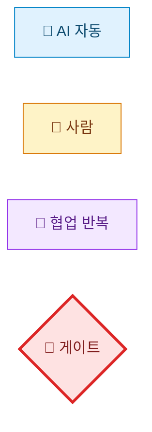
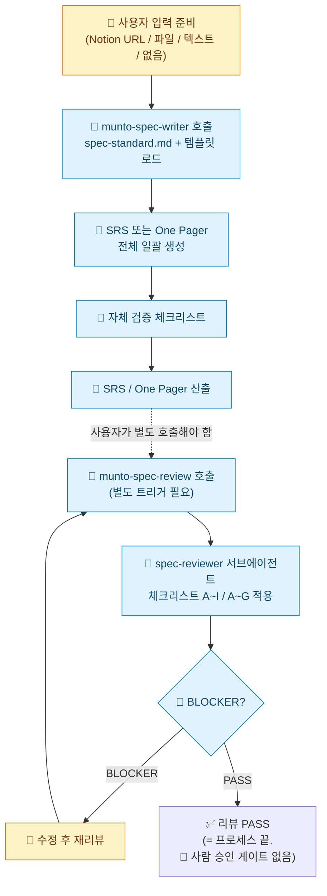
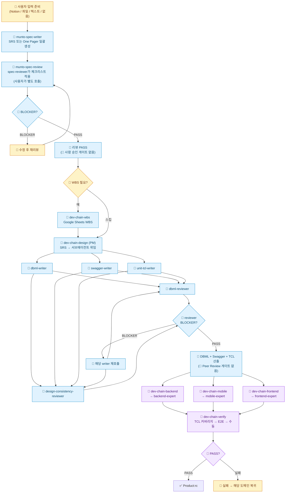

# Munto Dev Assistant 하네스 — AS-IS 분석

> **이 문서의 범위**: `munto-dev-assistant` 레포에 **현재 실제로 구현·기술되어 있는 것**만을 설명하고, 그 한계를 파악한다. 개선 제안·프로세스 가이드는 담지 않는다.

**분석 일자**: 2026-05-14  
**분석 범위**: `munto-dev-assistant` 내 `.agents/`, `.claude/`, `.cursor/`, `.codex/`, `scripts/`, `AGENTS.md`, 대표 스킬·에이전트.

---

## 1. 레포지토리가 하는 일 (한 줄 요약)

문토 조직에서 **Claude · Cursor · Codex** 등이 **같은 스킬·규칙·(일부) 커맨드**를 공유하도록, **원본은 `.agents/` 단일 레포**에 두고 플랫폼별 폴더는 **래퍼(어댑터)** 만 두는 **에이전트 하네스** 저장소다.

---

## 2. 구성 원리 (구조 파악)

### 2.1 단일 진실 공급원

| 레이어         | 역할                                                                                                          |
| -------------- | ------------------------------------------------------------------------------------------------------------- |
| **`.agents/`** | 스킬(`skills/**/SKILL.md`), 규칙(`rules/**/*.md`), 서브에이전트 원본(`agents/*.md`), 커맨드 원본(`commands/`) |
| **`.claude/`** | Claude용 스킬/에이전트/커맨드 래퍼                                                                            |
| **`.cursor/`** | `.mdc` → `.agents/rules` 연결 규칙 래퍼                                                                       |
| **`.codex/`**  | Codex 스킬·에이전트 래퍼(`source`, `spawn_agent` 절차)                                                        |

원칙: **수정은 `.agents/`에서만.** 래퍼 경로는 `scripts/check-adapters.sh`로 검증 가능.

### 2.2 디렉터리 맵 (기억용)

```
.agents/
├── skills/     (common|mobile|frontend|backend/…)
├── rules/
├── agents/     서브에이전트 원본
└── commands/

.claude/ .cursor/ .codex/  → 각각 어댑터
document/                   SRS 템플릿 등
workspace/                  멀티 루트 .code-workspace
scripts/
```

### 2.3 스킬 vs 규칙 vs 커맨드

- **스킬**: 워크플로·트리거·체크리스트·도구 순서(예: SSM 후 DB).
- **규칙**: 코드/문서 작성 제약(NestJS·Flutter 등). Cursor globs로 매핑.
- **커맨드**: 툴 권한 한정 등 **슬래시 커맨드**가 필요할 때만(수가 적도록 유지 정책).

### 2.4 서브에이전트

위임 계약은 `.agents/agents/*.md`에 명시. **Cursor는 서브에이전트 개념 미지원**(AGENTS.md 기준) → 동일 스킬이라도 플랫폼별 체감 차이 발생.

### 2.5 외부 도구 의존

Jira(acli), GWS(`gws`), DB(SSM+MCP 등), Notion MCP 등 스킬 전제 도구 다수.

---

## 3. 현재 전체 프로세스 (AGENTS.md + 스킬 기준 AS-IS)

`AGENTS.md`의 Development Chain은 "기획/SRS"를 시작점으로 적고 있지만, 실제로 하네스에는 **SRS/One Pager를 작성·리뷰하는 스킬**(`munto-spec-writer`, `munto-spec-review`)이 존재한다. 이를 포함한 전체 AS-IS 프로세스를 정리한다.

### 3.0 다이어그램 범례 (Legend)

각 노드는 **누가 일을 수행하는가**에 따라 4가지로 분류한다. 색·아이콘이 동시에 표시되며, 한 채널이 깨져도 다른 채널이 의미를 살린다.

| 아이콘 | 색 | 의미 | 예시 |
|--------|-----|------|------|
| 🤖 | 옅은 파랑 | **AI 자동** — 사람은 트리거만 하고, 실행 중 사람 개입 없음 | `munto-spec-writer` 호출, `dbml-writer`, reviewer 자동 분류 |
| 👤 | 옅은 노랑 | **사람** — 사람이 직접 작성·결정. 결과물의 책임이 사람에게 있는 경우 | 입력 준비, BLOCKER 수정, WBS 필요 여부 판단 |
| 🔄 | 옅은 보라 | **협업 반복** — AI가 만들고 사람이 검토·수정 요청을 반복하는 *루프* 작업 | `dev-chain-backend/mobile/frontend` (현재 상태), 수동 체크리스트 |
| 🚧 | 옅은 빨강 (굵은 테두리) | **게이트** — 사람이 명시적으로 *PASS/REJECT*를 결정하는 의사결정 지점 | (AS-IS에는 거의 없음 — §4.1·4.2 비판 참조) |



> **분류 원칙**: 사람이 호출(trigger)만 하고 AI가 자율 완료하면 🤖이다. AI가 만든 결과를 사람이 *여러 번 검토·수정 요청*하는 패턴이 본질이면 🔄이다. AS-IS 다이어그램에서 🚧이 거의 보이지 않는다는 사실 자체가 **§4.1~4.2 비판(사람 승인 게이트 없음)** 의 시각적 증거다.

### 3.1 SRS/One Pager 작성·리뷰 프로세스 (AS-IS)

하네스에 존재하는 두 스킬이 SRS/One Pager의 작성과 리뷰를 담당한다.

#### `munto-spec-writer` — 실제 동작

1. `document/spec-standard.md` + 문서 유형별 템플릿 로드
2. 입력 소스 판별: Notion URL(`notion-fetch`) / 로컬 파일 / 텍스트 설명 / **입력 없음(대화형 수집)**
3. 문서 유형 자동 판별 (SRS vs One Pager), 불분명 시 질문
4. **SRS 전체 또는 One Pager 전체를 한 번에 작성** — 섹션별·단계별 분할 작성 기능 없음
5. 자체 검증 체크리스트 실행 (항목 구조·1.2 서술형·2.4↔7장 매핑 등)

**스킬에 없는 것:**

- "1.2·2.1·2.2를 사람이 먼저 쓰고 오라"는 **선행 조건 없음**
- 섹션별 분할 작성·단계별 인간 확인 **강제 없음**
- 입력 품질이 낮아도 **거부·경고 없이 생성 진행**

#### `munto-spec-review` — 실제 동작

1. `spec-standard.md` 로드 + 대상 문서 가져오기
2. 문서 유형 자동 판별 (SRS vs One Pager)
3. **PM 모드**: `spec-reviewer` 서브에이전트에 체크리스트 적용 위임
4. 체크리스트 적용: SRS는 A~I (구조·기호·스코프·일관성·DB·API·측정·TBD·링크), One Pager는 A~G
5. BLOCKER / WARNING / SUGGESTION 분류 리포트 출력

**스킬에 없는 것:**

- **비즈니스 방향·조직 의사결정에 대한 검증 없음** — 형식·표준 대비 검수만
- **리뷰 통과 후 사람 승인 단계 없음** — PASS하면 바로 끝
- **"Spec 완료"라는 게이트와 연결 없음** — 후속 단계(`dev-chain-design` 등)와 자동 연결 안 됨

#### SRS/리뷰 AS-IS 다이어그램



> 주의: `munto-spec-writer` 완료 후 `munto-spec-review`는 **자동으로 이어지지 않는다.** 사용자가 별도로 리뷰를 요청해야 한다.

### 3.2 AGENTS.md에 적힌 Development Chain 흐름

```
기획/SRS
   ↓
0. [WBS]    dev-chain-wbs      → Google Sheets WBS 작성 (간단한 기능은 스킵 가능)
   ↓
1. [설계]   dev-chain-design   → DBML + Swagger + TCL 생성
   ↓
2. [개발]   아래 중 해당 도메인 선택 (병렬 가능)
   ├── dev-chain-backend   → Entity → Service → Controller → Unit Test
   ├── dev-chain-mobile    → Model → API → Repository → BLoC/Riverpod → Screen/View → Unit Test
   └── dev-chain-frontend  → Model → Repository → ViewModel → View → Page → Unit Test
   ↓
3. [검증]   dev-chain-verify   → TCL 기반 Unit Test + E2E + 수동 체크리스트
```

### 3.3 전체 AS-IS 다이어그램 (SRS 작성·리뷰 포함)



> 다이어그램에 **🚧(게이트)** 가 나타나지 않는 것이 핵심 관찰: AS-IS에는 *사람 명시 승인 단계*가 사실상 없다. PHASE 2 도메인 구현(`dev-chain-backend/mobile/frontend`)은 의도상 🤖이지만 현재 **🔄 협업 반복**으로 운영되고 있어 그대로 표시했다. 이 두 가지가 **TO-BE에서 가장 큰 변화 지점**이다.

### 3.4 AGENTS.md에 적힌 에이전트 행동 원칙

1. **설계 없이 개발 시작 금지**: Swagger와 TCL이 없으면 개발 스킬 실행 불가.
2. **완료 보고 없이 다음 단계 진행 금지**: 각 스킬의 완료 체크리스트를 통과해야 다음 단계로 이동.
3. **단계 순서 역행 금지**: 검증에서 발견된 문제는 해당 도메인 스킬로 돌아가 수정.
4. **설계 산출물 보존**: 생성된 DBML, Swagger, TCL은 후속 스킬에서 반드시 참조.
5. **레거시 코드 수정 범위 제한**: 요청하지 않은 기존 코드 수정 금지.

### 3.5 각 스킬이 실제로 하는 것 요약

| 스킬 | 입력 | 산출물 | 서브에이전트 | 비고 |
| --- | --- | --- | --- | --- |
| `munto-spec-writer` | 기획 문서 / Notion / 텍스트 / **없음** | SRS 또는 One Pager (마크다운) **전체 일괄 생성** | 없음 | `spec-standard.md` + 템플릿 로드. **선행 조건·단계 분할 없음.** 입력 부족 시 대화형 수집은 하지만 거부하지 않음 |
| `munto-spec-review` | SRS / One Pager | BLOCKER/WARNING/SUGGESTION 리포트 | `spec-reviewer` (PM 모드) | 체크리스트 A~I (SRS) / A~G (One Pager). **형식·표준 검수만**, 비즈니스 검증 불가. **리뷰 후 사람 승인 단계 없음** |
| `dev-chain-wbs` | SRS | Google Sheets WBS | 없음 | `gws` CLI 사용 |
| `dev-chain-design` | SRS | DBML + Swagger + Unit TCL | `dbml-writer`, `swagger-writer`, `unit-tcl-writer`, `dbml-reviewer`, `design-consistency-reviewer` (PM 모드, 팬아웃/팬인) | 3개 writer 병렬 필수 |
| `dev-chain-backend` | Swagger + TCL | Entity → Service → Controller → Unit Test 코드 | `backend-expert` (PM 모드) | `dating-backend` 표준, `munto-backend` 참조 |
| `dev-chain-mobile` | Swagger + TCL + Figma | Model → API → Repo → State → Screen → Test 코드 | `mobile-expert` (PM 모드) | `dating-mobile`(BLoC), `munto-mobile`(Riverpod) |
| `dev-chain-frontend` | Swagger + TCL + Figma | Model → Repo → ViewModel → View → Page → Test 코드 | `frontend-expert` (PM 모드) | `munto-frontend` |
| `dev-chain-verify` | TCL + 구현 완료 보고 | 검증 보고서 (Unit/E2E/수동 체크리스트) | 없음 | 실패 시 해당 도메인 스킬로 복귀 |

### 3.6 보조 스킬 (개발 체인 외 업무 도구)

| 카테고리        | 스킬                                      | 트리거 예시                                |
| --------------- | ----------------------------------------- | ------------------------------------------ |
| **이슈 관리**   | `munto-create-issue` · `munto-read-issue` | "Jira 이슈 만들어줘" · "DEVT-123 조회해줘" |
| **PR 생성**     | `munto-create-pr`                         | "PR 만들어줘"                              |
| **DB 조회**     | `munto-read-db`                           | "프로덕션 데이터 확인해줘" (SSM 먼저)      |
| **문서 읽기**   | `munto-read-document`                     | "이 노션 문서 요약해줘"                    |
| **스탠드업**    | `munto-standup`                           | "오늘 할 일 정리해줘"                      |
| **이메일**      | `munto-check-email`                       | "메일 브리핑해줘"                          |
| **QA TCL**      | `qa-tcl-writer`                           | "QA TCL 만들어줘" (릴리즈 회귀용)          |
| **하네스 진단** | `harness-diagnostics`                     | "harness 진단해줘"                         |

---

## 4. 비판: 현재 프로세스의 문제점

### 4.1 `munto-spec-writer` — 풀 자동 작성에 아무 장벽이 없다

- 스킬 자체에 **선행 조건이 없다.** "1.2·2.1·2.2를 사람이 먼저 쓰고 오라"는 강제도, 입력 품질이 낮을 때 거부하는 로직도 없다.
- 입력이 아예 없어도(`입력이 부족한 경우 → 필수 정보를 대화형으로 수집`) 대화형 질문 몇 개로 **SRS 전체를 한 번에 생성**한다. 섹션별 분할 작성 기능이 없다.
- 개발자가 "SRS 전체 써줘"라고 하면 에이전트는 그냥 쓴다. **작성자가 범위·목적을 깊게 고민하지 않고 AI 출력에 매몰될 위험**이 크다.
- 스킬에 자체 검증 체크리스트가 있지만, 이는 **형식 검증**(항목 구조·매핑)이지 **"사람이 핵심을 먼저 썼는가"를 확인하는 것이 아니다.**

### 4.2 `munto-spec-review` — 형식 검수만, 비즈니스 검증·사람 승인 없음

- 체크리스트 A~I(SRS)는 **항목 구조, 기호 정의, 스코프 서술형 여부, 섹션 매핑, DB/API 스키마, 측정 가능성, TBD, 링크** 등 **형식·표준 정합성**만 검증한다.
- **"이 스펙의 방향이 비즈니스에 맞는가"**, **"문서화되지 않은 조직 의사결정과 부합하는가"**는 검증 범위 밖이다.
- 리뷰 PASS 후 **사람(기획/PM) 승인 단계가 없다.** 형식 통과하면 프로세스가 그냥 끝난다.

### 4.3 SRS 작성과 리뷰가 자동으로 연결되지 않는다

- `munto-spec-writer`로 SRS를 생성해도, `munto-spec-review`는 **별도 트리거**가 필요하다. 자동으로 이어지지 않는다.
- 작성만 하고 리뷰를 하지 않는 것이 가능하며, 이를 막는 프로세스 장치가 없다.
- AGENTS.md의 Development Chain에서도 SRS 작성·리뷰 단계가 **명시적으로 표현되어 있지 않다.** "기획/SRS"라는 시작점만 있고, 그 SRS가 어떤 품질 검증을 거쳤는지는 규정하지 않는다.

### 4.4 설계(DBML·Swagger) 후 Peer Review 게이트가 없다

- `dev-chain-design`이 DBML·Swagger·TCL을 만들면, AGENTS.md 흐름상 **바로 `dev-chain-backend` 등 구현 스킬로 넘어간다.**
- **개발자 Peer Review**라는 단계가 AGENTS.md에 없다. 에이전트가 만든 설계를 사람이 검토하지 않고 바로 구현으로 넘어갈 수 있는 구조다.
- `dbml-reviewer`·`design-consistency-reviewer`는 **자동 정합성 검증**일 뿐, 사람의 판단(아키텍처·비즈니스 적합성)을 대체하지 못한다.

### 4.5 Spec 정의가 불분명하다

- AGENTS.md에서 "기획/SRS"라고만 적혀 있고, **Spec이 정확히 어디까지인지**(SRS 문서만? 상위설계까지?) **정의가 없다.**
- `munto-spec-writer`는 SRS 텍스트만, `dev-chain-design`은 DBML·Swagger·TCL만 각각 다루는데, 이 둘을 **하나의 Spec 완료 게이트**로 묶는 규약이 없다. 「SRS만 있으니 Spec 끝」으로 오인하기 쉽다.

### 4.6 `spec-standard.md`의 1.2 예시가 오히려 나쁜 지침이었다

- 기존 ✅ 예시가 **추천·베이지안 점수**라는 특정 도메인에 고정되어 있어, 이를 복사한 SRS는 **형식만 맞고 내용은 타 팀 과제 설명** 같은 스펙이 되기 쉬웠다.
- 1.2 Product Scope가 해야 할 역할(**문제→목표→책임·경계 서술**)이 아니라, **In/Out Scope 나열 금지**라는 형식 제약만 강조하는 데 그쳤다.

### 4.7 Cursor에서 품질 격차

- `dev-chain-design`·`munto-spec-review` 등이 **서브에이전트 병렬 위임**을 전제로 설계되었으나, **Cursor는 서브에이전트 개념 미지원**이다.
- 동일 스킬을 Cursor에서 쓰면 팬아웃/팬인 패턴이 작동하지 않아 **설계 의도 대비 품질 격차**가 발생한다.

### 4.8 어댑터 드리프트 CI 미부착

- 래퍼가 가리키는 `.agents/` 경로가 깨져도 **빌드가 돌지 않으므로** 놓치기 쉽다.
- `scripts/check-adapters.sh`가 존재하지만 **CI/PR 파이프라인에 붙어 있지 않다.** 로컬에서만 수동 실행.

### 4.9 무인 야간 실행에는 거리가 있다

- "Spec 완결 후 밤새 자동 개발·테스트"라는 비전을 가지려면, **오케스트레이션·CI/CD·플랫폼 런타임·안전 장치**(샌드박스, 비밀 분리, 승인 게이트) 레이어가 필요하다.
- 현재 하네스는 **사람이 시작·종료**해야 하며, **실패 시 알림·롤백·중단 조건** 같은 야간 플레이북이 없다.

---

## 변경 이력

| 일자 | 내용 |
| --- | --- |
| 2026-05-14 | 통합 분석 원고에서 분리·재구성하여 신규 작성 |
| 2026-05-18 | 문서 성격을 AS-IS 순수 분석 + 비판으로 한정. TO-BE 내용은 별도 문서로 분리 |
| 2026-05-18 | 학습 로드맵·준비도 평가를 별도 학습 가이드 문서로 분리. 파일명 `2026-05-harness-AS-IS.md`로 변경 |
| 2026-05-18 | **SRS 작성·리뷰 프로세스 AS-IS 추가**: `munto-spec-writer`·`munto-spec-review` 스킬 분석을 §3.1에 신설, AS-IS 다이어그램에 SRS 단계 포함(§3.3), 비판 §4.1~§4.3을 SRS 스킬 관련 문제로 보강 (풀 자동 작성 무장벽·형식 검수만·자동 미연결), 기존 §4.2~§4.7을 §4.4~§4.9로 재번호 |
| 2026-05-19 | **다이어그램 4-카테고리 분류 도입** — §3.0 범례 신설 (🤖 AI 자동 / 👤 사람 / 🔄 협업 반복 / 🚧 게이트). §3.1·§3.3 두 다이어그램에 색·아이콘·`classDef` 일괄 적용. `dev-chain-backend/mobile/frontend`는 현재 실태대로 🔄 표시. AS-IS에 🚧이 거의 없는 사실 자체가 §4.1·§4.2 비판의 시각적 증거임을 명시 |
