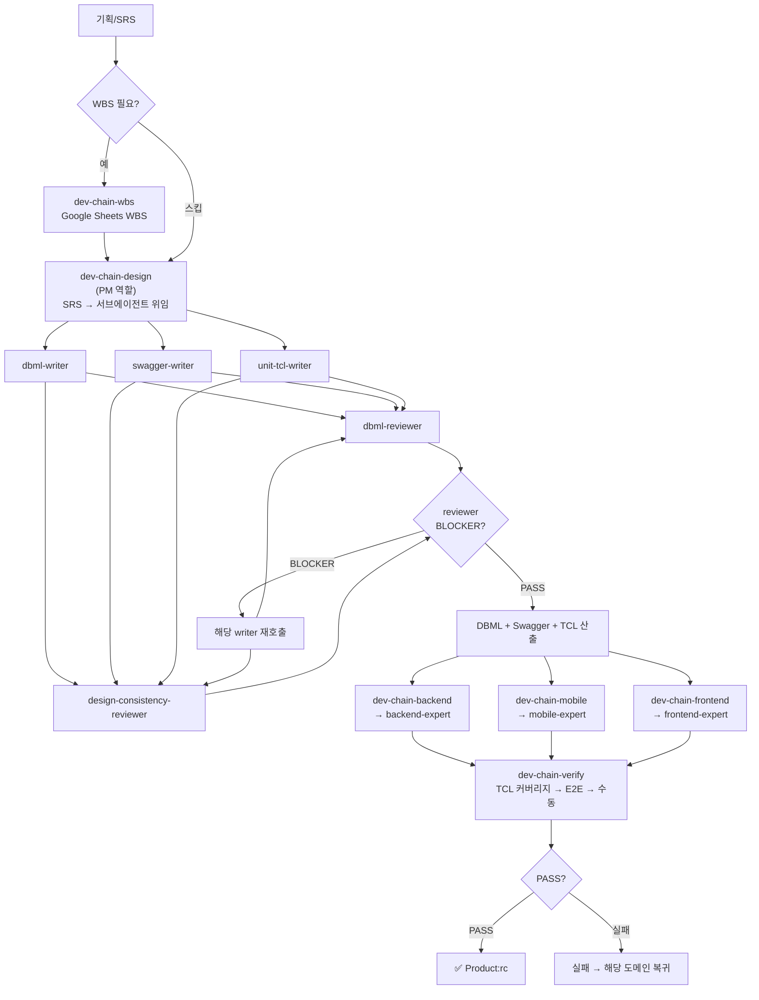

# Munto Dev Assistant 하네스 — AS-IS 분석

> **이 문서의 범위**: `munto-dev-assistant` 레포에 **현재 실제로 구현·기술되어 있는 것**만을 설명하고, 그 한계를 비판한다.
> 개선 제안·프로세스 가이드는 담지 않는다.

**관련 문서**:
- **TO-BE 프로세스 가이드**: [2026-05-harness-TO-BE.md](./2026-05-harness-TO-BE.md) — 개선된 프로세스·다이어그램·단계별 사용법.
- **학습 가이드**: [2026-05-harness-learning-guide.md](./2026-05-harness-learning-guide.md) — 하네스를 학습하기 위한 로드맵·실습 안내.
- **팀 공유 브리핑**: [2026-05-harness-team-developer-brief.md](../2026-05-harness-team-developer-brief.md) — 문제·로드맵·교육.

**분석 일자**: 2026-05-14  
**분석 범위**: `munto-dev-assistant` 내 `.agents/`, `.claude/`, `.cursor/`, `.codex/`, `scripts/`, `AGENTS.md`, 대표 스킬·에이전트.

---

## 1. 레포지토리가 하는 일 (한 줄 요약)

문토 조직에서 **Claude · Cursor · Codex** 등이 **같은 스킬·규칙·(일부) 커맨드**를 공유하도록, **원본은 `.agents/` 단일 레포**에 두고 플랫폼별 폴더는 **래퍼(어댑터)** 만 두는 **에이전트 하네스** 저장소다.

---

## 2. 구성 원리 (구조 파악)

### 2.1 단일 진실 공급원

| 레이어 | 역할 |
|--------|------|
| **`.agents/`** | 스킬(`skills/**/SKILL.md`), 규칙(`rules/**/*.md`), 서브에이전트 원본(`agents/*.md`), 커맨드 원본(`commands/`) |
| **`.claude/`** | Claude용 스킬/에이전트/커맨드 래퍼 |
| **`.cursor/`** | `.mdc` → `.agents/rules` 연결 규칙 래퍼 |
| **`.codex/`** | Codex 스킬·에이전트 래퍼(`source`, `spawn_agent` 절차) |

원칙: **수정은 `.agents/`에서만.** 래퍼 경로는 `scripts/check-adapters.sh`로 검증 가능.

### 2.2 디렉터리 맵 (기억용)

```
.agents/
├── skills/     (common|mobile|frontend|backend/…)
├── rules/
├── agents/     서브에이전트 원본
└── commands/

.claude/ .cursor/ .codex/  → 각각 어댑터
document/                   SRS 템플릿 등
workspace/                  멀티 루트 .code-workspace
scripts/
```

### 2.3 스킬 vs 규칙 vs 커맨드

- **스킬**: 워크플로·트리거·체크리스트·도구 순서(예: SSM 후 DB).
- **규칙**: 코드/문서 작성 제약(NestJS·Flutter 등). Cursor globs로 매핑.
- **커맨드**: 툴 권한 한정 등 **슬래시 커맨드**가 필요할 때만(수가 적도록 유지 정책).

### 2.4 서브에이전트

위임 계약은 `.agents/agents/*.md`에 명시. **Cursor는 서브에이전트 개념 미지원**(AGENTS.md 기준) → 동일 스킬이라도 플랫폼별 체감 차이 발생.

### 2.5 외부 도구 의존

Jira(acli), GWS(`gws`), DB(SSM+MCP 등), Notion MCP 등 스킬 전제 도구 다수.

---

## 3. 현재 Development Chain (AGENTS.md 기준)

`AGENTS.md`에 명시된 **현재** 프로세스는 아래와 같다. 이것이 **있는 그대로**의 정의이며, 개선 제안은 포함하지 않는다.

### 3.1 AGENTS.md에 적힌 흐름

```
기획/SRS
   ↓
0. [WBS]    dev-chain-wbs      → Google Sheets WBS 작성 (간단한 기능은 스킵 가능)
   ↓
1. [설계]   dev-chain-design   → DBML + Swagger + TCL 생성
   ↓
2. [개발]   아래 중 해당 도메인 선택 (병렬 가능)
   ├── dev-chain-backend   → Entity → Service → Controller → Unit Test
   ├── dev-chain-mobile    → Model → API → Repository → BLoC/Riverpod → Screen/View → Unit Test
   └── dev-chain-frontend  → Model → Repository → ViewModel → View → Page → Unit Test
   ↓
3. [검증]   dev-chain-verify   → TCL 기반 Unit Test + E2E + 수동 체크리스트
```

### 3.2 AS-IS 다이어그램



### 3.3 AGENTS.md에 적힌 에이전트 행동 원칙

1. **설계 없이 개발 시작 금지**: Swagger와 TCL이 없으면 개발 스킬 실행 불가.
2. **완료 보고 없이 다음 단계 진행 금지**: 각 스킬의 완료 체크리스트를 통과해야 다음 단계로 이동.
3. **단계 순서 역행 금지**: 검증에서 발견된 문제는 해당 도메인 스킬로 돌아가 수정.
4. **설계 산출물 보존**: 생성된 DBML, Swagger, TCL은 후속 스킬에서 반드시 참조.
5. **레거시 코드 수정 범위 제한**: 요청하지 않은 기존 코드 수정 금지.

### 3.4 각 스킬이 실제로 하는 것 요약

| 스킬 | 입력 | 산출물 | 서브에이전트 | 비고 |
|------|------|--------|------------|------|
| `munto-spec-writer` | 기획 문서 / Notion / 텍스트 | SRS 또는 One Pager (마크다운) | 없음 | `spec-standard.md` + 템플릿 로드 |
| `munto-spec-review` | SRS / One Pager | BLOCKER/WARNING/SUGGESTION 리포트 | `spec-reviewer` (PM 모드) | 체크리스트 A~I (SRS) / A~G (One Pager) |
| `dev-chain-wbs` | SRS | Google Sheets WBS | 없음 | `gws` CLI 사용 |
| `dev-chain-design` | SRS | DBML + Swagger + Unit TCL | `dbml-writer`, `swagger-writer`, `unit-tcl-writer`, `dbml-reviewer`, `design-consistency-reviewer` (PM 모드, 팬아웃/팬인) | 3개 writer 병렬 필수 |
| `dev-chain-backend` | Swagger + TCL | Entity → Service → Controller → Unit Test 코드 | `backend-expert` (PM 모드) | `dating-backend` 표준, `munto-backend` 참조 |
| `dev-chain-mobile` | Swagger + TCL + Figma | Model → API → Repo → State → Screen → Test 코드 | `mobile-expert` (PM 모드) | `dating-mobile`(BLoC), `munto-mobile`(Riverpod) |
| `dev-chain-frontend` | Swagger + TCL + Figma | Model → Repo → ViewModel → View → Page → Test 코드 | `frontend-expert` (PM 모드) | `munto-frontend` |
| `dev-chain-verify` | TCL + 구현 완료 보고 | 검증 보고서 (Unit/E2E/수동 체크리스트) | 없음 | 실패 시 해당 도메인 스킬로 복귀 |

### 3.5 보조 스킬 (개발 체인 외 업무 도구)

| 카테고리 | 스킬 | 트리거 예시 |
|---------|------|------------|
| **이슈 관리** | `munto-create-issue` · `munto-read-issue` | "Jira 이슈 만들어줘" · "DEVT-123 조회해줘" |
| **PR 생성** | `munto-create-pr` | "PR 만들어줘" |
| **DB 조회** | `munto-read-db` | "프로덕션 데이터 확인해줘" (SSM 먼저) |
| **문서 읽기** | `munto-read-document` | "이 노션 문서 요약해줘" |
| **스탠드업** | `munto-standup` | "오늘 할 일 정리해줘" |
| **이메일** | `munto-check-email` | "메일 브리핑해줘" |
| **QA TCL** | `qa-tcl-writer` | "QA TCL 만들어줘" (릴리즈 회귀용) |
| **하네스 진단** | `harness-diagnostics` | "harness 진단해줘" |

---

## 4. 비판: 현재 프로세스의 문제점

### 4.1 Spec 단계에 사람 주도 게이트가 없다

- `munto-spec-writer`는 SRS 전체를 **한 번에 풀 자동 작성**하는 데 아무 장벽이 없다. 스킬 자체에 "1.2·2.1·2.2를 사람이 먼저 쓰고 오라"는 **강제 조건이 없다.**
- 개발자가 "SRS 전체 써줘"라고 하면 에이전트는 그냥 쓴다. **작성자가 범위·목적을 깊게 고민하지 않고 AI 출력에 매몰될 위험**이 크다.
- `munto-spec-review`도 **형식·표준 대비 검수**만 하지, "이 스펙의 방향이 비즈니스에 맞는가"를 판단하지는 못한다. **기획/PM 사람 승인**이라는 단계가 프로세스에 없다.

### 4.2 설계(DBML·Swagger) 후 Peer Review 게이트가 없다

- `dev-chain-design`이 DBML·Swagger·TCL을 만들면, AGENTS.md 흐름상 **바로 `dev-chain-backend` 등 구현 스킬로 넘어간다.**
- **개발자 Peer Review**라는 단계가 AGENTS.md에 없다. 에이전트가 만든 설계를 사람이 검토하지 않고 바로 구현으로 넘어갈 수 있는 구조다.
- `dbml-reviewer`·`design-consistency-reviewer`는 **자동 정합성 검증**일 뿐, 사람의 판단(아키텍처·비즈니스 적합성)을 대체하지 못한다.

### 4.3 Spec 정의가 불분명하다

- AGENTS.md에서 "기획/SRS"라고만 적혀 있고, **Spec이 정확히 어디까지인지**(SRS 문서만? 상위설계까지?) **정의가 없다.**
- `munto-spec-writer`는 SRS 텍스트만, `dev-chain-design`은 DBML·Swagger·TCL만 각각 다루는데, 이 둘을 **하나의 Spec 완료 게이트**로 묶는 규약이 없다. 「SRS만 있으니 Spec 끝」으로 오인하기 쉽다.

### 4.4 `spec-standard.md`의 1.2 예시가 오히려 나쁜 지침이었다

- 기존 ✅ 예시가 **추천·베이지안 점수**라는 특정 도메인에 고정되어 있어, 이를 복사한 SRS는 **형식만 맞고 내용은 타 팀 과제 설명** 같은 스펙이 되기 쉬웠다.
- 1.2 Product Scope가 해야 할 역할(**문제→목표→책임·경계 서술**)이 아니라, **In/Out Scope 나열 금지**라는 형식 제약만 강조하는 데 그쳤다.

### 4.5 Cursor에서 품질 격차

- `dev-chain-design`·`munto-spec-review` 등이 **서브에이전트 병렬 위임**을 전제로 설계되었으나, **Cursor는 서브에이전트 개념 미지원**이다.
- 동일 스킬을 Cursor에서 쓰면 팬아웃/팬인 패턴이 작동하지 않아 **설계 의도 대비 품질 격차**가 발생한다.

### 4.6 어댑터 드리프트 CI 미부착

- 래퍼가 가리키는 `.agents/` 경로가 깨져도 **빌드가 돌지 않으므로** 놓치기 쉽다.
- `scripts/check-adapters.sh`가 존재하지만 **CI/PR 파이프라인에 붙어 있지 않다.** 로컬에서만 수동 실행.

### 4.7 무인 야간 실행에는 거리가 있다

- "Spec 완결 후 밤새 자동 개발·테스트"라는 비전을 가지려면, **오케스트레이션·CI/CD·플랫폼 런타임·안전 장치**(샌드박스, 비밀 분리, 승인 게이트) 레이어가 필요하다.
- 현재 하네스는 **사람이 시작·종료**해야 하며, **실패 시 알림·롤백·중단 조건** 같은 야간 플레이북이 없다.

---

## 변경 이력

| 일자 | 내용 |
|------|------|
| 2026-05-14 | 통합 분석 원고에서 분리·재구성하여 신규 작성 |
| 2026-05-18 | 문서 성격을 AS-IS 순수 분석 + 비판으로 한정. TO-BE 내용은 별도 문서로 분리 |
| 2026-05-18 | 학습 로드맵·준비도 평가를 별도 학습 가이드 문서로 분리. 파일명 `2026-05-harness-AS-IS.md`로 변경 |
