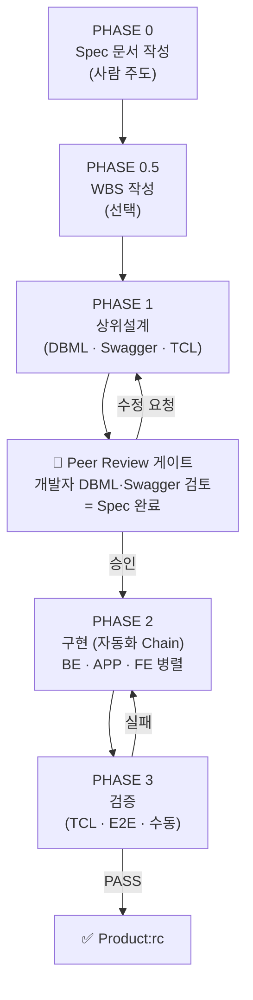
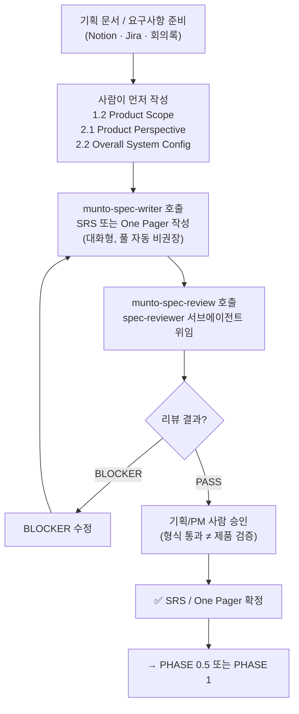
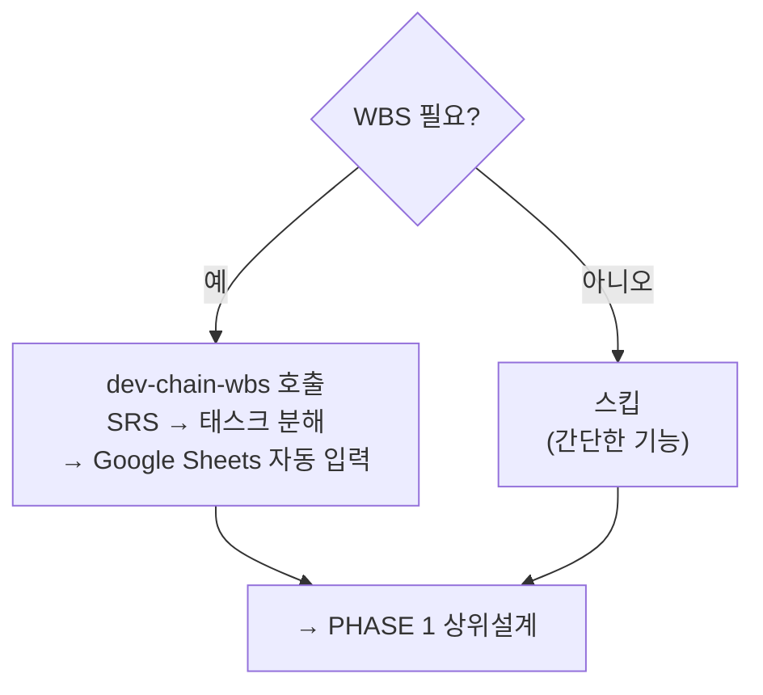
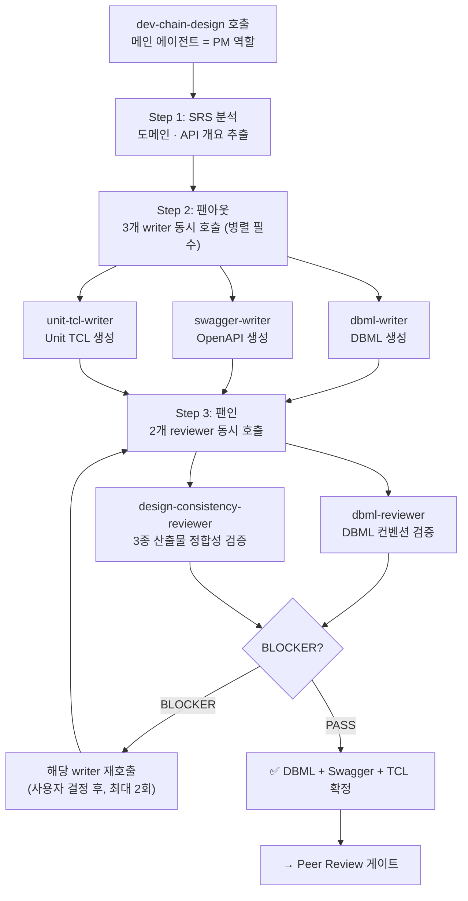
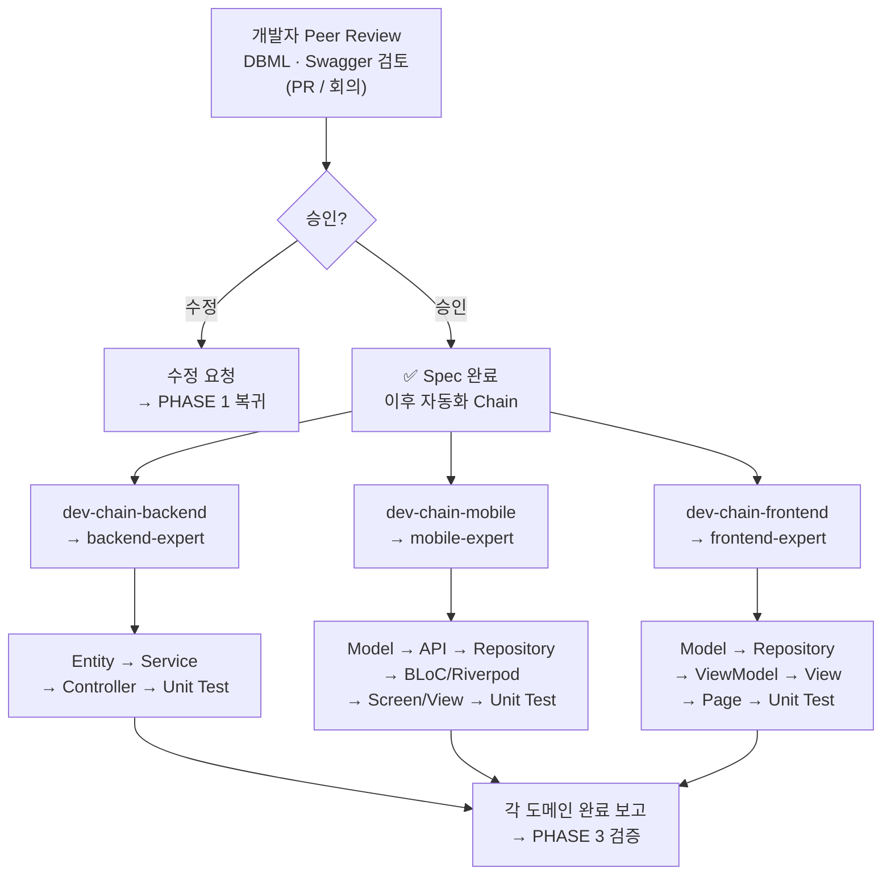
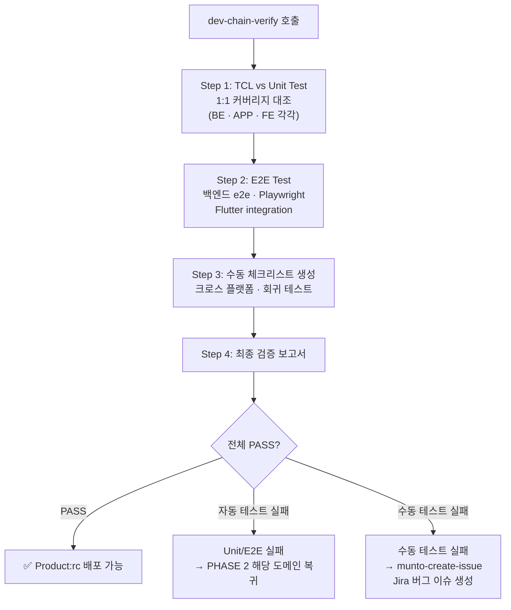

# Agentic Dev Chain — Munto 개발 자동화 프로세스 가이드 (TO-BE)

> **이 문서의 범위**: 현재 `munto-dev-assistant`의 AS-IS 분석([2026-05-harness-AS-IS.md](./2026-05-harness-AS-IS.md))에서 도출된 비판을 바탕으로, **Munto 개발 자동화의 총칭인 `Agentic Dev Chain`** 의 목표 형태(TO-BE)를 다이어그램·단계별 가이드·규격으로 정의한다.
> **팀 공유 브리핑**(문제·로드맵·교육)은 [2026-05-harness-team-developer-brief.md](../2026-05-harness-team-developer-brief.md) 참고.

---

## 1. 팀 용어 정의

> **왜 이 절이 가장 먼저인가**: 팀이 동일한 용어로 소통하지 않으면 같은 단어로 다른 것을 가리키게 된다. 본 문서·후속 회의·코드 리뷰에서 사용할 핵심 명칭을 **여기서 한 번에 고정**한다.

### 1.1 Agentic Dev Chain — Munto 개발 자동화의 총칭

**Agentic Dev Chain**은 Munto 개발팀이 **AI 에이전트와 협업해 기획부터 릴리즈까지 가는 개발 자동화 방법론**을 총칭한다. 단순한 도구·레포의 이름이 아니라 **프로세스·게이트·역할 분담을 포함한 방법론 그 자체**를 가리킨다.

**진화 맥락:**

| 세대 | 명칭 | 특징 |
|------|------|------|
| **v1 (~2024)** | `AI Dev Chain` | 단계별로 사람이 많이 개입하는 수작업 중심 워크플로 (참고: `AI development chain.drawio.png` legacy 자료) |
| **v2 (2025~)** | **`Agentic Dev Chain`** (본 문서) | Agentic AI · 서브에이전트 · CLI를 활용해 자동화를 극대화하고, 사람이 *반드시* 개입해야 할 지점에 **명시적 게이트**를 둠 |

**핵심 원칙 3가지:**

1. **자동화 우선** — 가능한 모든 단계를 에이전트·CLI·파이프라인이 수행한다.
2. **전략적 HITL (Human-in-the-Loop)** — 인간 개입은 *줄이는 게 아니라 강화한다*. 비즈니스 승인·DBML/Swagger Peer Review 등은 *명시적 게이트*로 박는다.
3. **이름과 게이트의 일치** — 모든 단계·게이트가 고유한 이름을 갖는다. 팀이 동일 용어로 소통할 수 있도록 한다.

### 1.2 Agentic Dev Chain의 구성 요소 (Implementation Layer)

Agentic Dev Chain은 **방법론(본 문서)** 과, 그것을 실현하는 **여러 구현 요소(Implementation Layer)** 가 함께 떠받치는 구조다. 방법론과 구현 요소는 **1:N 관계**다.

```
Agentic Dev Chain (방법론 · 총칭)
│
├─ 프로세스 정의 (this document)
│   └─ Phase 0 → 0.5 → 1 → Peer Review Gate → 2 → 3
│
└─ 구현 요소 (Implementation Layer)
    ├─ ✅ munto-dev-assistant  (현재 운영 중)
    │   ├─ Agent Configuration 레포
    │   ├─ Skills · Rules · Subagents · Commands · Adapters
    │   └─ Claude · Cursor · Codex 환경에서 동작
    │
    └─ 🚧 추가 예정 요소
        ├─ OpenClaw 등 24시간 무인 실행 서비스
        ├─ CI 통합 (어댑터 검증, 평가 자동화)
        └─ 회귀 시나리오 자동 평가 시스템 등
```

| 구성 요소 | 카테고리 | 역할 | 현재 상태 |
|----------|---------|------|---------|
| **Agentic Dev Chain** | **방법론(총칭)** | Munto 개발 자동화의 표준 프로세스·게이트·역할 분담 정의 | 본 문서로 정의 |
| **`munto-dev-assistant`** | 구현 요소 — *Agent Configuration 레포* | AI 에이전트가 위 프로세스를 실행하도록 만드는 **설정 모음** (스킬·규칙·서브에이전트·어댑터) | ✅ 운영 중 |
| **OpenClaw** (예시·가칭) | 구현 요소 — *무인 실행 서비스* | **24시간 무인 실행** 환경 (스케줄러·러너·알림·롤백 등) — Spec만 깔아 두면 야간 자동 개발·테스트를 돌릴 인프라 | 🚧 미구축 (향후 검토) |
| CI 통합 · 평가 자동화 등 | 구현 요소 — *품질 게이트 강화* | PR 시 어댑터 검증, 골든 시나리오 회귀 테스트 등 | 🚧 미구축 |

**명명 원칙 (혼동 방지용 핵심 규칙):**

- **"Agentic Dev Chain"** = *방법론·개념·총칭*. 외부 발표·회의·문서 머리말에서 쓴다.
- **`munto-dev-assistant`** = *물리적 레포(파일·설정의 모음)* 이름. Git 클론·경로 표기 등 *구체적 산출물을 가리킬 때만* 쓴다.
- **둘은 동의어가 아니다.** "munto-dev-assistant 프로세스"라는 표현은 잘못이다. 정확한 표현은 *"Agentic Dev Chain 프로세스"* 또는 *"`munto-dev-assistant` 레포에 정의된 스킬"* 처럼 카테고리를 분리해 쓴다.

### 1.3 Spec의 범위

| 포함 여부 | 산출물 |
|-----------|--------|
| **포함** | SRS / One Pager (문서) |
| **포함** | DBML, Swagger(OpenAPI), Unit TCL (상위설계 산출물, `dev-chain-design` 결과) |
| **포함 기준** | 위 산출물이 **합의·완성**되고, 특히 **DBML·Swagger는 개발자 Peer Review**를 거쳤을 때 비로소 **Spec 완료** |
| 범위 밖 | 코드 수준의 세부 설계 (필요 시 팀이 범위만 정하면 됨) |

### 1.4 AS-IS에서 무엇이 빠져 있었나

AS-IS(`AGENTS.md` 기준)의 Development Chain에는 아래가 없다:

1. **SRS 작성 시 사람 주도 게이트** — "1.2·2.1·2.2를 사람이 먼저" 같은 강제 조건 없음
2. **Spec 완료 정의** — SRS 끝이 Spec 끝인지, 상위설계까지인지 불분명
3. **Peer Review 게이트** — `dev-chain-design` 후 바로 구현으로 넘어감
4. **기획/PM 사람 승인** — 형식 리뷰(`munto-spec-review`)만 있고, 비즈니스 검증 단계 없음

본 문서가 정의하는 **Agentic Dev Chain (TO-BE)** 은 위 4가지를 **명시적 단계·게이트로 추가**한다.

---

## 2. 목표 비전

1. **Spec 단계 전반**  
   SRS·원페이저·그리고 **상위설계 산출물**에 이르기까지 AI와 협업할 때는 **일회 명령이 아니라 지속적인 의논·수정 과정**으로 둔다. 합의·판단이 명확해질수록 이후 무인 실행에 넘길 **입력 품질**이 올라간다.

2. **구현부터 QA까지의 자동화 비전(목표 상태)**  
   Spec이 완결(문서 + DBML·Swagger·TCL 등 **상위설계** 및 **DBML·Swagger에 대한 개발자 Peer Review** 포함)되면, **구현·테스트·검증**까지는 **에이전트·파이프라인이 장시간 무인으로 수행**할 수 있기를 기대한다.  
   개발자는 퇴근 전에 작업을 맡겨 두고, 출근 후 에이전트가 만든 변경·테스트 결과를 검토하며 살릴 것·고칠 것만 골라 반영하는 패턴을 목표로 한다.  
   즉 **「Spec(문서와 상위설계까지) 만 제대로 깔아 두면 밤샘 자동 개발·테스트」** 에 가깝게 가는 것을 지향한다.

---

## 3. Agentic Dev Chain — 프로세스 도식 (TO-BE)

### 3.1 전체 흐름 개요



> 아래에서 각 Phase를 세로형 다이어그램으로 상세히 풀어 본다.

### 3.2 PHASE 0 — Spec 문서 작성



### 3.3 PHASE 0.5 — WBS (선택)



### 3.4 PHASE 1 — 상위설계 (dev-chain-design)



### 3.5 Peer Review 게이트 + PHASE 2 구현



### 3.6 PHASE 3 — 검증 (dev-chain-verify)



---

## 4. 단계별 사용법

### 4.1 PHASE 0 — Spec 문서 작성 (사람 주도)

| 단계 | 무엇을 하나 | 사용 스킬 / 도구 | 핵심 규칙 |
|------|------------|-----------------|----------|
| 0-1 | **기획 정보 준비** | Notion · Jira · 기획 회의록 | **1.2 Product Scope**, **2.1 Product Perspective**, **2.2 Overall System Configuration** 을 **사람이 먼저** 작성해야 한다. AI에 통째로 맡기지 않는다. |
| 0-2 | **SRS 또는 One Pager 작성** | `munto-spec-writer` | 문서 유형(SRS/One Pager) 판별 → `spec-standard.md` + 템플릿 로드 → 대화형으로 내용 채움. **풀 자동 작성 비권장** — 사람 핵심 문단 먼저, AI가 확장. |
| 0-3 | **스펙 리뷰** | `munto-spec-review` | `spec-reviewer` 서브에이전트가 체크리스트(SRS A~I / One Pager A~G) 적용 → BLOCKER/WARNING/SUGGESTION 분류. **BLOCKER 시 0-2로 복귀.** |
| 0-4 | **사람 승인** | (프로세스) | 형식 통과 ≠ 제품 검증. **기획/PM 사람 승인 필수.** |

```
트리거 예시
  "SRS 써줘" → munto-spec-writer
  "이 SRS 리뷰해줘 [Notion URL]" → munto-spec-review
```

### 4.2 PHASE 0.5 — WBS 작성 (선택)

| 단계 | 무엇을 하나 | 사용 스킬 / 도구 | 핵심 규칙 |
|------|------------|-----------------|----------|
| 0.5-1 | **WBS 필요 여부 판단** | (대화) | 간단한 기능이면 스킵 가능. |
| 0.5-2 | **WBS 작성** | `dev-chain-wbs` | SRS 기반으로 태스크 분해 → Google Sheets WBS 시트에 `gws` CLI로 자동 입력. |

```
트리거 예시
  "WBS 만들어줘" → dev-chain-wbs
```

### 4.3 PHASE 1 — 상위설계 (Spec의 일부)

| 단계 | 무엇을 하나 | 사용 스킬 / 서브에이전트 | 핵심 규칙 |
|------|------------|----------------------|----------|
| 1-1 | **SRS 분석** | `dev-chain-design` (메인 = PM) | 도메인·API 개요만 추출. SRS 본문 상세 분석은 서브에이전트가 한다. |
| 1-2 | **3개 writer 병렬 호출** (팬아웃) | `dbml-writer` · `swagger-writer` · `unit-tcl-writer` | **반드시 같은 메시지에서 3개 동시 호출.** 순차 호출은 금지. |
| 1-3 | **2개 reviewer 병렬 호출** (팬인) | `dbml-reviewer` · `design-consistency-reviewer` | DBML 단독 컨벤션 + 3종 정합성 검증. BLOCKER 시 해당 writer 재호출(최대 2회, 이후 수동). |
| 1-4 | **완료 체크리스트** | (메인) | DBML·Swagger·TCL 각각 완료 + 두 reviewer PASS + 저장 위치 확인. |

```
트리거 예시
  "설계해줘" → dev-chain-design
  "DBML 만들어줘" → dev-chain-design
  "Swagger 만들어줘" → dev-chain-design
```

**산출물:**

| 산출물 | 형식 | 역할 |
|--------|------|------|
| **DBML** | `.dbml` | DB 스키마 정의 (Prisma 호환) |
| **Swagger** | `.yaml` (OpenAPI 3.0) | API 엔드포인트·DTO·응답 정의 |
| **Unit TCL** | `.md` (마크다운 표) | API별 테스트 시나리오 (정상·오류·경계, 대상: BE/APP/FE/E2E) |

### 4.4 Peer Review 게이트 (Agentic Dev Chain 핵심 추가 단계)

| 단계 | 무엇을 하나 | 주체 | 핵심 규칙 |
|------|------------|------|----------|
| PR-1 | **DBML · Swagger Peer Review** | **개발자** (사람) | DBML·Swagger는 **Spec의 일부**이므로 **충분한 코드 리뷰 대상**. PR·회의 등 팀 방식으로 진행. |
| PR-2 | **승인 → 구현 단계 진입** | **개발자** (사람) | **Peer Review 승인 없이 `dev-chain-*` 구현 스킬 실행 금지.** 수정 요청 시 PHASE 1로 복귀. |

> 이 게이트가 **Spec 완료** 시점이다. 이후 단계는 **자동화 Chain**으로 넘길 수 있다.

### 4.5 PHASE 2 — 구현 (자동화 Chain)

**도메인별로 병렬 실행 가능** — 각각 다른 제품 레포에서 작업하므로 충돌 없음.

| 도메인 | 스킬 | 서브에이전트 | 구현 순서 | 프로젝트 |
|--------|------|------------|----------|----------|
| **백엔드** | `dev-chain-backend` | `backend-expert` | Entity → Service → Controller → Unit Test | `munto-backend` 또는 `dating-backend` |
| **모바일** | `dev-chain-mobile` | `mobile-expert` | Model(Freezed) → API(Retrofit) → Repository → BLoC/Riverpod → Screen/View → Unit Test | `dating-mobile`(BLoC) 또는 `munto-mobile`(Riverpod) |
| **프론트엔드** | `dev-chain-frontend` | `frontend-expert` | Model → Repository → ViewModel → View → Page → Unit Test | `munto-frontend` |

**공통 흐름** (3개 도메인 모두 동일):

1. **시작 전 체크포인트** — Swagger·TCL 존재 확인. 없으면 `dev-chain-design` 안내.
2. **메인(PM)이 expert 서브에이전트에 위임** — Swagger·TCL·프로젝트 경로를 전달.
3. **Expert가 자체 컨텍스트에서 순서대로 구현** — 해당 스킬 SKILL.md + 규칙(`rules/`) Read → 코드 작성 → 자체 검증(lint·typecheck·test).
4. **결과를 메인이 사용자에게 보고.**

```
트리거 예시
  "이 Swagger로 백엔드 구현해줘" → dev-chain-backend
  "Flutter 구현해줘" → dev-chain-mobile
  "프론트 개발해줘" → dev-chain-frontend
```

### 4.6 PHASE 3 — 검증

| 단계 | 무엇을 하나 | 사용 스킬 / 도구 | 핵심 규칙 |
|------|------------|-----------------|----------|
| 3-1 | **TCL 기반 Unit Test 커버리지** | `dev-chain-verify` | TCL의 BE/APP/FE 항목과 실제 테스트 케이스를 **1:1 대조**. 미구현이면 해당 도메인 스킬로 복귀. |
| 3-2 | **E2E Test** | `dev-chain-verify` | 백엔드 e2e · Playwright(FE) · Flutter integration test. 자동화 불가 케이스는 3-3으로. |
| 3-3 | **수동 테스트 체크리스트** | `dev-chain-verify` | 크로스 플랫폼·회귀 항목 생성. 수동 실패 시 Jira 버그 이슈 생성(`munto-create-issue`). |
| 3-4 | **최종 검증 보고서** | `dev-chain-verify` | 전체 PASS → **Product:rc 배포 가능**. 실패 → 해당 도메인 스킬 재실행 → 재검증. |

```
트리거 예시
  "검증해줘" → dev-chain-verify
  "QA 해줘" → dev-chain-verify
  "릴리즈 준비해줘" → dev-chain-verify
```

**실패 시 복귀 흐름:**

```
테스트 실패
  ├── Unit Test 실패  → dev-chain-backend / mobile / frontend 로 돌아가 수정
  ├── E2E 실패       → 해당 도메인 스킬로 돌아가 수정
  └── 수동 테스트 실패 → munto-create-issue 로 Jira 버그 이슈 생성
```

---

## 5. 전체 프로세스 요약 (한눈에 보기)

```
┌─────────────────────────────────────────────────────────────────────┐
│ PHASE 0  기획 → SRS/OnePager 작성 → 리뷰 → 사람 승인              │
│          (munto-spec-writer → munto-spec-review)                   │
│          ※ 1.2·2.1·2.2는 사람이 먼저 작성                          │
├─────────────────────────────────────────────────────────────────────┤
│ PHASE 0.5  WBS 작성 (선택, 간단하면 스킵)                           │
│            (dev-chain-wbs → Google Sheets)                         │
├─────────────────────────────────────────────────────────────────────┤
│ PHASE 1  상위설계 산출물 생성                                       │
│          dev-chain-design (PM)                                     │
│            → 병렬: dbml-writer / swagger-writer / unit-tcl-writer  │
│            → 병렬: dbml-reviewer / design-consistency-reviewer     │
│          산출물: DBML + Swagger + Unit TCL                         │
├─────────────────────────────────────────────────────────────────────┤
│ 🚧 GATE  개발자 Peer Review (DBML · Swagger)                       │
│          ※ 이 시점이 「Spec 완료」 — 이후는 자동화 Chain             │
├─────────────────────────────────────────────────────────────────────┤
│ PHASE 2  구현 (도메인별 병렬 가능)                                  │
│  ┌─ BE:  Entity → Service → Controller → Unit Test                │
│  ├─ APP: Model → API → Repo → BLoC/Riverpod → Screen → Test      │
│  └─ FE:  Model → Repo → ViewModel → View → Page → Test           │
├─────────────────────────────────────────────────────────────────────┤
│ PHASE 3  검증                                                      │
│  TCL 커버리지 → E2E → 수동 체크리스트 → 보고서                     │
│  PASS → Product:rc  |  FAIL → PHASE 2 복귀                        │
└─────────────────────────────────────────────────────────────────────┘
```

---

## 6. AS-IS와 Agentic Dev Chain(TO-BE) 비교

| 항목 | AS-IS (현재 AGENTS.md) | Agentic Dev Chain (TO-BE, 본 문서) |
|------|----------------------|-----------------|
| **총칭(이름)** | 불명확. "Development Chain" 또는 "munto-dev-assistant" 혼용 | **`Agentic Dev Chain`** — 방법론·총칭으로 고정. `munto-dev-assistant`는 그 *구현 요소 중 하나* |
| **SRS 작성** | `munto-spec-writer`로 한 번에 풀 작성 가능 | 사람이 1.2·2.1·2.2 먼저 → AI 확장 (풀 자동 비권장) |
| **SRS 검증** | `munto-spec-review` 형식 검수만 | + **기획/PM 사람 승인** 단계 추가 |
| **Spec 완료 정의** | 불명확 (SRS 끝 = Spec 끝?) | **SRS + 상위설계(DBML·Swagger·TCL) + Peer Review = Spec 완료** |
| **설계 → 구현 전환** | reviewer PASS 후 바로 구현 진입 | **개발자 Peer Review 게이트** 추가 (승인 전 구현 금지) |
| **무인 야간 실행 인프라** | 없음 (사람이 시작·종료) | **OpenClaw 등 24시간 무인 실행 서비스**를 구현 요소로 추가 검토 |
| **실패 복귀** | 동일 | 동일 |

---

## 7. 관련 문서 안내

| 문서 | 쓰임 |
|------|------|
| [AS-IS 분석](./2026-05-harness-AS-IS.md) | `munto-dev-assistant`의 **현재 상태(Agentic Dev Chain v1 잔재 포함)** 분석과 비판. |
| [학습 가이드](./2026-05-harness-learning-guide.md) | `munto-dev-assistant` 레포를 **스스로 이해·분석**하기 위한 학습 로드맵. |
| **본 문서** | **`Agentic Dev Chain`** 의 TO-BE 프로세스·다이어그램·단계별 사용법·구성 요소 계층. |
| [팀 개발자 브리핑](../2026-05-harness-team-developer-brief.md) | **문제·개선 로드맵·교육/온보딩**을 동료에게 공유할 때 사용. |

---

## 변경 이력

| 일자 | 내용 |
|------|------|
| 2026-05-18 | AS-IS 분석에서 TO-BE 내용(프로세스 다이어그램·단계별 가이드·Peer Review 게이트·Spec 정의·목표 비전) 분리하여 신규 작성 |
| 2026-05-18 | AS-IS vs TO-BE 비교 표(§6) 추가, 문서 간 교차 참조 정리 |
| 2026-05-18 | 파일명 `2026-05-harness-TO-BE.md`로 변경, 학습 가이드 문서 참조 추가 |
| 2026-05-19 | **`Agentic Dev Chain` 명칭 도입** — Munto 개발 자동화의 총칭으로 고정. §1.1 총칭 정의 + §1.2 구성 요소 계층(`munto-dev-assistant` ✅운영중 / OpenClaw 등 🚧예정) 신설. 기존 §1.1·1.2를 §1.3·1.4로 재번호. 문서 제목·§3·§4.4·§6·§7을 새 명칭으로 동기화. **명명 원칙(방법론 vs 레포 분리)** 명시 |
