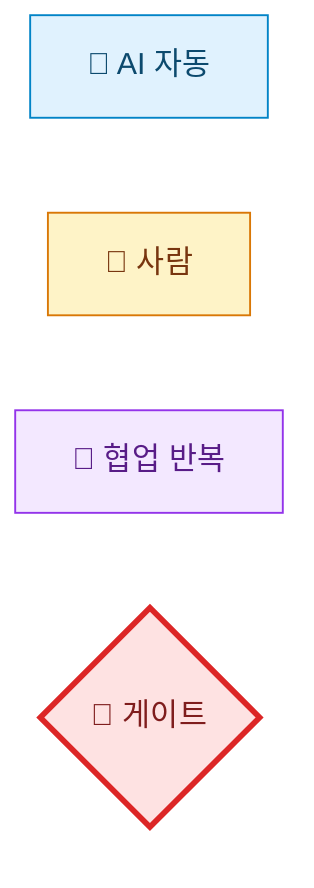
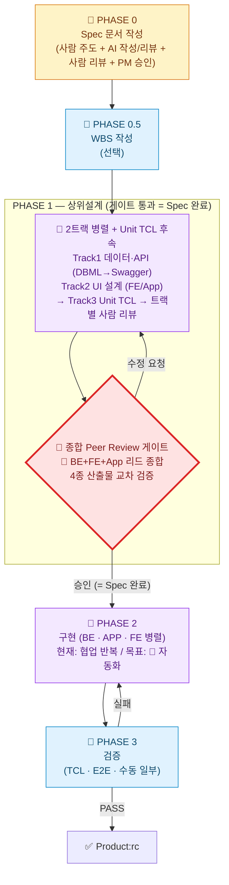
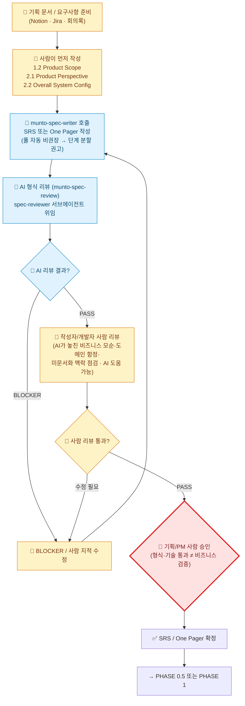
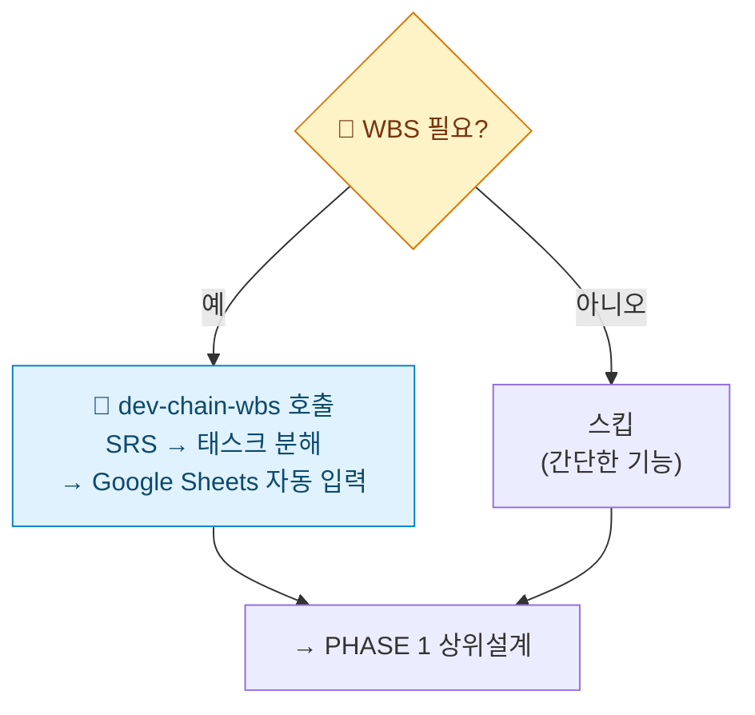
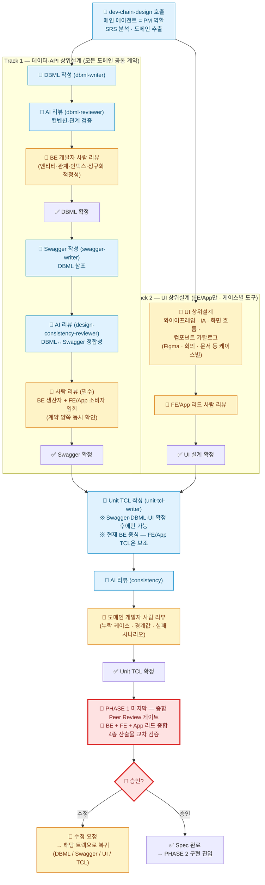
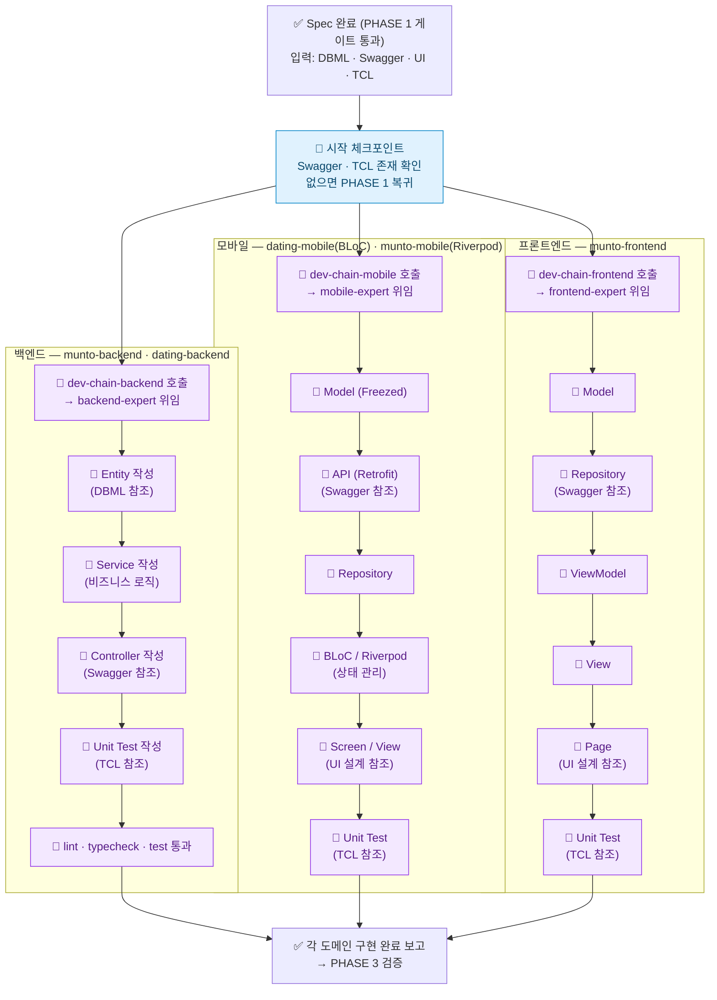
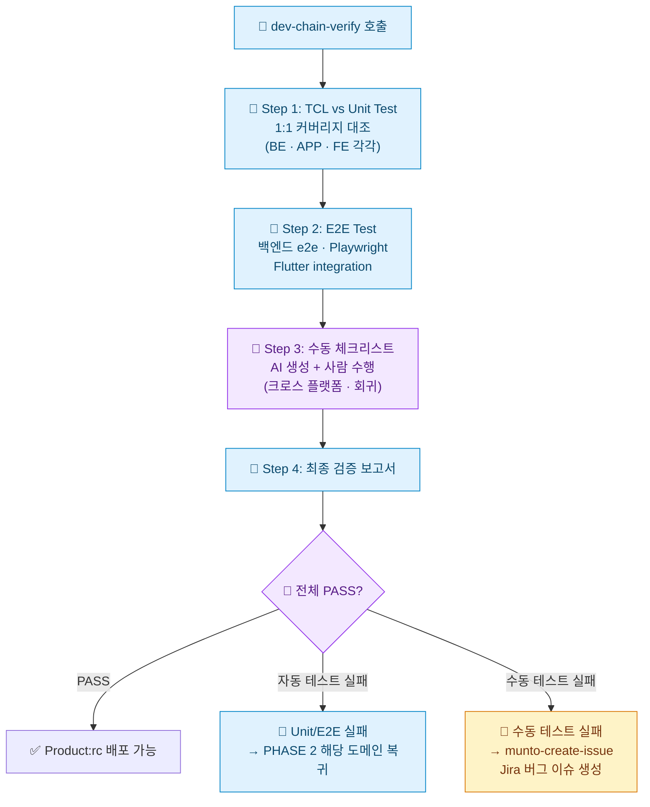

# Agentic Dev Chain — Munto 개발 자동화 프로세스 가이드 (TO-BE)

## 1. 팀 용어 정의

> **왜 이 절이 가장 먼저인가**: 팀이 동일한 용어로 소통하지 않으면 같은 단어로 다른 것을 가리키게 된다. 본 문서·후속 회의·코드 리뷰에서 사용할 핵심 명칭을 **여기서 한 번에 고정**한다.

### 1.1 Agentic Dev Chain — Munto 개발 자동화의 총칭

**Agentic Dev Chain**은 Munto 개발팀이 **AI 에이전트와 협업해 기획부터 릴리즈까지 가는 개발 자동화 방법론**을 총칭한다. 단순한 도구·레포의 이름이 아니라 **프로세스·게이트·역할 분담을 포함한 방법론 그 자체**를 가리킨다.

**진화 맥락:**

| 세대 | 명칭 | 특징 |
| --- | --- | --- |
| **v1 (~2024)** | `AI Dev Chain` | 단계별로 사람이 많이 개입하는 수작업 중심 워크플로 (참고: `AI development chain.drawio.png` legacy 자료) |
| **v2 (2025~)** | **`Agentic Dev Chain`** (본 문서) | Agentic AI · 서브에이전트 · CLI를 활용해 자동화를 극대화하고, 사람이 _반드시_ 개입해야 할 지점에 **명시적 게이트**를 둠 |

**핵심 원칙 3가지:**

1. **자동화 우선** — 가능한 모든 단계를 에이전트·CLI·파이프라인이 수행한다.
2. **전략적 HITL (Human-in-the-Loop)** — 인간 개입은 _줄이는 게 아니라 강화한다_. 비즈니스 승인·DBML/Swagger Peer Review 등은 *명시적 게이트*로 박는다.
3. **이름과 게이트의 일치** — 모든 단계·게이트가 고유한 이름을 갖는다. 팀이 동일 용어로 소통할 수 있도록 한다.

### 1.2 Agentic Dev Chain의 구성 요소 (Implementation Layer)

Agentic Dev Chain은 **방법론(본 문서)** 과, 그것을 실현하는 **여러 구현 요소(Implementation Layer)** 가 함께 떠받치는 구조다. 방법론과 구현 요소는 **1:N 관계**다.

```
Agentic Dev Chain (방법론 · 총칭)
│
├─ 프로세스 정의 (this document)
│   └─ Phase 0 → 0.5 → 1 → Peer Review Gate → 2 → 3
│
└─ 구현 요소 (Implementation Layer)
    ├─ ✅ munto-dev-assistant  (현재 운영 중)
    │   ├─ Agent Configuration 레포
    │   ├─ Skills · Rules · Subagents · Commands · Adapters
    │   └─ Claude · Cursor · Codex 환경에서 동작
    │
    └─ 🚧 추가 예정 요소
        ├─ OpenClaw 등 24시간 무인 실행 서비스
        ├─ CI 통합 (어댑터 검증, 평가 자동화)
        └─ 회귀 시나리오 자동 평가 시스템 등
```

| 구성 요소 | 카테고리 | 역할 | 현재 상태 |
| --- | --- | --- | --- |
| **Agentic Dev Chain** | **방법론(총칭)** | Munto 개발 자동화의 표준 프로세스·게이트·역할 분담 정의 | 본 문서로 정의 |
| **`munto-dev-assistant`** | 구현 요소 — _Agent Configuration 레포_ | AI 에이전트가 위 프로세스를 실행하도록 만드는 **설정 모음** (스킬·규칙·서브에이전트·어댑터) | ✅ 운영 중 |
| **OpenClaw** (예시·가칭) | 구현 요소 — _무인 실행 서비스_ | **24시간 무인 실행** 환경 (스케줄러·러너·알림·롤백 등) — Spec만 깔아 두면 야간 자동 개발·테스트를 돌릴 인프라 | 🚧 미구축 (향후 검토) |
| CI 통합 · 평가 자동화 등 | 구현 요소 — _품질 게이트 강화_ | PR 시 어댑터 검증, 골든 시나리오 회귀 테스트 등 | 🚧 미구축 |

**명명 원칙 (혼동 방지용 핵심 규칙):**

- **"Agentic Dev Chain"** = _방법론·개념·총칭_. 외부 발표·회의·문서 머리말에서 쓴다.
- **`munto-dev-assistant`** = _물리적 레포(파일·설정의 모음)_ 이름. Git 클론·경로 표기 등 _구체적 산출물을 가리킬 때만_ 쓴다.
- **둘은 동의어가 아니다.** "munto-dev-assistant 프로세스"라는 표현은 잘못이다. 정확한 표현은 _"Agentic Dev Chain 프로세스"_ 또는 _"`munto-dev-assistant` 레포에 정의된 스킬"_ 처럼 카테고리를 분리해 쓴다.

### 1.3 Spec의 범위

| 포함 여부     | 산출물                                                                                                     |
| ------------- | ---------------------------------------------------------------------------------------------------------- |
| **포함**      | SRS / One Pager (문서)                                                                                     |
| **포함**      | DBML, Swagger(OpenAPI), Unit TCL (상위설계 산출물, `dev-chain-design` 결과)                                |
| **포함 기준** | 위 산출물이 **합의·완성**되고, 특히 **DBML·Swagger는 개발자 Peer Review**를 거쳤을 때 비로소 **Spec 완료** |
| 범위 밖       | 코드 수준의 세부 설계 (필요 시 팀이 범위만 정하면 됨)                                                      |

### 1.4 AS-IS에서 무엇이 빠져 있었나

AS-IS(`AGENTS.md` 기준)의 Development Chain에는 아래가 없다:

1. **SRS 작성 시 사람 주도 게이트** — "1.2·2.1·2.2를 사람이 먼저" 같은 강제 조건 없음
2. **Spec 완료 정의** — SRS 끝이 Spec 끝인지, 상위설계까지인지 불분명
3. **Peer Review 게이트** — `dev-chain-design` 후 바로 구현으로 넘어감
4. **기획/PM 사람 승인** — 형식 리뷰(`munto-spec-review`)만 있고, 비즈니스 검증 단계 없음

본 문서가 정의하는 **Agentic Dev Chain (TO-BE)** 은 위 4가지를 **명시적 단계·게이트로 추가**한다.

---

## 2. 목표 비전 및 설계 원칙

### 2.1 한 줄 요약

> **사람이 핵심만 정확히 잡으면, AI 가 살을 붙이고, 구현·테스트는 24 시간 무인으로 돈다.**
> 사람 개입은 *줄이는 것* 이 목적이 아니라, *꼭 필요한 곳에 집중*시키는 것이 목적이다.

### 2.2 Spec 의 정의 — 본 TO-BE 가 따르는 SW 공학 원칙

본 TO-BE 가 다루는 "Spec" 은 산업계에서 통용되는 **소프트웨어 스펙 작성 표준** 의 정의를 따른다. 핵심 두 가지를 먼저 못 박는다.

#### ① Spec 인 것 / Spec 이 아닌 것 — *경계가 모호하면 Spec 이 오염된다*

| Spec 에 **포함** | Spec 에서 **분리** (별도 관리) |
| --- | --- |
| 프로젝트 비전 · 비즈니스 전략 | 프로젝트 일정 · 조직도 · 인원 |
| 기능 요구사항 · 비기능 요구사항 (성능·보안·국제화 등) | 개발자 확보·교육 계획 |
| 사용자 계층 · 하위 호환성 | 개발 프로세스 · 테스트 일정 |
| 외부/시스템/UI 인터페이스 | 사용자 매뉴얼 |
| 운영 환경 · 배포 방법 | 빌드 자동화 계획 |
| 비즈니스 규칙 · 설계 제약 · 시스템 특성 | 외주·라이브러리 구매 계획 |
| 가정·종속 사항 | 서비스 인력 교육 |

> **원칙**: 프로젝트 관리·일정·교육·매뉴얼 류는 Spec 에 들어가는 순간, 계획이 바뀔 때마다 Spec 도 수정해야 한다. **Spec 의 베이스라인(=변경의 기준점)이 흔들리면 Spec 의 권위가 무너진다.**

#### ② Spec 과 설계의 경계는 절대적이지 않다 — *잘 분석된 Spec 은 상당 부분 설계 영역까지 다룬다*

| 통념 | 본 TO-BE 가 따르는 원칙 |
| --- | --- |
| Spec = What, 설계 = How (칼로 무 자르듯 구분) | **경계 없음.** 잘 분석된 Spec 은 상당 부분 설계까지 포함 |
| 컴포넌트 간 인터페이스는 설계 영역 | **전체 시스템 관점에선 설계, 개별 모듈 개발자 관점에선 Spec** |
| 별도 설계 문서가 필수 | Spec 만으로 구현 가능한 프로젝트도 있음. 별도 설계 문서 필수 아님 |
| 설계 깊이는 일률적 | **프로젝트 규모 · 개발자 경험 · 외주 여부 · 도메인 성격에 따라 적정 깊이가 다름** |

> **본 TO-BE 의 귀결**: 우리가 **PHASE 1 의 DBML · Swagger · UI · TCL 을 Spec 의 일부로 정의**하는 것은 자의적 결정이 아니라, *"잘 분석된 Spec 은 상위 설계까지 다룬다"* 는 SW 공학 표준 원칙의 직접 적용이다. 종합 Peer Review 게이트 통과 = **Spec 의 베이스라인 설정**과 같은 의미다.

> *(참조: 국내 SW 스펙 작성 표준 §2.6 「스펙인 것과 스펙이 아닌 것」, §2.8 「스펙과 설계의 구분」, §6.8 「스펙과 베이스라인」)*

### 2.3 핵심 원칙 (7개)

#### ① Spec 정확성 우선 — *정확함 ≠ 자세함*

- **비즈니스 요구사항이 정확히 반영된 스펙**이 최상위 가치. AI 가 혼동 없이 구현할 수 있는 수준이면 충분하다.
- **적게 쓰되 핵심이 빠지지 않게.** 자세한 스펙은 문서 부피만 키우고, 개발 중 변하는 스펙을 따라가기 어렵다.
- 자세한 사항은 ② 의 Sub스펙으로 분리한다.

**Spec 의 적정 상세도는 프로젝트 성격에 따라 다르다** (SW 공학 표준):

| 구분 | 간단히 적어도 OK | 상세히 적어야 안전 |
| --- | --- | --- |
| 프로젝트 난이도 | 쉬운 프로젝트 | 어려운 프로젝트 |
| 작성자 - 구현자 거리 | 같은 사람 / 수시로 물어볼 수 있음 | 다른 팀 / 만나기 어려움 |
| 개발팀 경험 | 비슷한 프로젝트 다수 경험 | 신규 투입 개발자 많음 |
| 참고 제품 유무 | 비슷한 제품 있어서 참고 가능 | 참고 제품 없음 |
| 외주 여부 | 내부 경험 많은 팀이 개발 | 외주 개발 |

> **Munto 적용**: 도메인·팀 익숙도가 높은 기능은 핵심 Spec 만으로 충분 / 신규 도메인·새 멤버 투입·외주 시에는 Spec 깊이를 더 채운다. *AI가 구현할 때 추론으로 못 메우는 부분이 어느 정도 있느냐* 가 판단 기준.

**Spec 작성 종료 시그널** — 다음이 보이면 "이번 (Sub)스펙은 닫고 다음으로 가라" 신호:

- 사용자가 새 요구사항을 더 못 만들거나, 이전 리뷰 때 했던 얘기를 반복하기 시작
- 프로젝트 목표·범위에서 벗어난 새 기능이 자꾸 나옴
- 우선순위 낮은 기능들이 자꾸 제안됨 → **다음 Sub스펙으로 연기**하고 현재 Spec 종료

**Why-What-How 의 균형** — Spec 은 What 만이 아니다:

| 분량 비중 | 기획 문서 | **Spec (본 TO-BE)** | 설계 문서 |
| --- | --- | --- | --- |
| **Why** (비전·전략·이유) | 가장 많음 | **상당량 필요** | 적음 |
| **What** (기능·UI·환경) | 보통 | **가장 많음** | 보통 |
| **How** (제약·인터페이스·구현 방향) | 적음 | **보통** | 가장 많음 |

> **핵심**: *Why 가 없는 Spec 위에는 좋은 아키텍처를 설계할 수 없다.* AI 가 구현 시 "왜 이렇게?" 를 물을 때 답할 수 있어야 한다. 그래서 사람의 핵심 입력(원칙 ③)에 **Why** 가 반드시 들어가야 한다.

> *(참조: 국내 SW 스펙 작성 표준 §6.5 「스펙은 얼마나 자세히 적어야 하는가」, §8.1 「Why, What, How」, §9.11 「Why 를 잘 알아야 한다」)*

#### ② Phase → Task → Sub스펙 분해

큰 프로젝트의 Spec 은 **하나의 문서로 적지 않는다.** SW 공학 표준 패턴을 그대로 따른다.

**구조 — 상위 Spec 1 개 + 하위 Sub스펙 N 개**

```
Main Spec  ── 프로젝트 비전·전략·Phase/Task 분해·컴포넌트 식별·
   │           ★ 컴포넌트 간 인터페이스 정의 ★
   │
   ├── Sub Spec 1 (컴포넌트 A) ── 외부 인터페이스만 고려 + A 의 상세
   ├── Sub Spec 2 (컴포넌트 B) ── 외부 인터페이스만 고려 + B 의 상세
   └── Sub Spec 3 (컴포넌트 C) ── 외부 인터페이스만 고려 + C 의 상세
```

**작성 순서 원칙**

1. **Main Spec 에서 컴포넌트 간 인터페이스만 먼저 정의** → 이 시점부터 하위 Sub스펙 **병렬 작성 가능**.
2. Sub스펙은 Main 과 많은 부분을 공유하므로 **중복 작성 금지** → Main 을 참조하는 방식.
3. Sub스펙은 Main 과 **일관성 유지가 필수.**
4. **작성 시점은 자유** — Main 과 동시에 작성하거나, 진행 중 해당 Task 직전에 작성.

**왜 분해하는가**

- Spec 작성 시간 절약
- 프로젝트도 작은 서브 프로젝트로 나눠 동시 진행 가능 → 복잡도 ↓, 개발 기간 ↓
- **단, 인터페이스 정의가 핵심.** 엉성한 인터페이스 → 개발 도중 인터페이스 변경 → **대규모 재작업.** 병렬 개발의 성패는 인터페이스에 달려 있다.

> **본 TO-BE 의 직접 적용**: 우리 PHASE 1 의 **Track 1 — 데이터·API 상위설계 (DBML → Swagger)** 가 바로 *"Main Spec 에서 컴포넌트 간 인터페이스를 먼저 정의"* 단계다. Swagger 가 확정되어야 PHASE 2 의 BE/App/FE 가 병렬로 진행 가능하다. *인터페이스 정의가 병렬 개발의 핵심*이라는 원칙의 Munto 버전 구현.

> **Sub스펙 트리거** — 다음이 보이면 Sub스펙으로 분리:
> - Main Spec 작성 중 *"이 부분은 자세히 적으면 분량이 너무 커진다"* 는 판단
> - 한 컴포넌트가 독립 개발자/팀에 할당되어 외부 인터페이스만 합의되면 내부 작업 가능
> - 우선순위 낮아서 나중에 작성해도 되는 Task → 진행 시점에 Sub스펙 작성

> *(참조: 국내 SW 스펙 작성 표준 §6.12 「큰 프로젝트 분석 협업 방법」)*

#### ③ 사람의 핵심 입력 → AI 살붙임 → 사람 최종 확인 *(3단 필수)*

문서화되지 않은 조직 의사결정·맥락이 항상 존재하므로 이 3단은 생략 불가.

- **입력 (사람)**: 비즈니스 전략·문제 정의·핵심 아키텍처는 **사람이 먼저 명시적으로 입력**한다.
- **살붙임 (AI)**: AI 가 살을 붙이는 과정에서 모호한 지점을 발견하면 **추측 대신 사람에게 질문**한다. → **대화식 필수** (사람이 먼저 알려주기 + AI 가 먼저 파악해서 묻기, 양방향).
- **확인 (사람)**: AI 작성 결과는 사람이 **최종 확인**한다. AI 가 절대 못 잡는 영역(비즈니스 정합·미문서화 맥락·도메인 함정)이 있기 때문.

#### ④ 사람 개입 "최소화 + 핵심 명확화"

사람이 *반드시* 해야 하는 일만 명시적으로 박고, 나머지는 AI 가 자율 진행한다. *(상세 체크리스트: §4.6)*

- **사람이 꼭 해야 하는 일**
  - SRS 의 **핵심 전략·문제 정의·핵심 아키텍처** 입력 및 확인
  - **DBML · API · 핵심 아키텍처** 꼼꼼한 사람 리뷰
  - 종합 Peer Review 게이트 승인 결정
- 그 외는 ⑤ 의 AI 자동화 가이드로 처리

#### ⑤ AI 자율 작업도 완전 자동화 지향 — *가이드와 Review 방법까지 제공*

사람이 모든 결과를 다시 손봐야 한다면 그것은 자동화가 아니다. AI 가 사람 개입 없이도 일정 품질을 내도록 *(상세: §4.7)*:

- **스킬 · 규칙 · 서브에이전트 정의 · 컨벤션 문서** 4종의 가이드 체계를 채워 둔다.
- **AI 자체 Review 방법** (lint · typecheck · test · 산출물 정합성 reviewer) 을 모든 산출물에 박는다.
- **사람 Review 방법** (체크리스트 · 보조 프롬프트 예시) 도 동봉한다.

#### ⑥ 테스트 완전 자동화 지향 — *Unit · E2E · UI 까지*

- **풍부한 Unit Test + E2E Test** — 1차 검증이자 **Regression Test 자산**.
- **UI 테스트도 최대한 자동화.** 현재 도구로 가능한 영역과 남은 숙제는 §3.6 / §4.5 에 정리한다.
- 자동화 비율이 올라갈수록 PHASE 3 의 🔄(협업)·👤(사람) 노드가 🤖 로 옮겨간다.

#### ⑦ 24시간 무인 실행 인프라 — *준비 중*

- 개발자가 퇴근 전 맡기고, 출근 후 결과 검토하는 패턴을 지향.
- **OpenClaw 등 24시간 무인 실행 서비스**를 별도 구현 요소로 추가 검토. *(상세: §1.2)*
- Spec(문서 + 상위설계 + Peer Review)이 완결되면 그 뒤는 무인 실행에 맡길 수 있다는 것이 ①~⑥ 의 자연스러운 귀결.

### 2.4 변경 원칙 — *기존 자산 활용, 완전 새로 만들지 않음*

- 본 TO-BE 는 기존 `munto-dev-assistant` 의 스킬·규칙·서브에이전트를 **활용 · 추가 · 수정 · 삭제** 한다.
- 백지에서 새로 만드는 것이 아니라, 현재 자산이 ②~⑥ 원칙을 만족하도록 **진화시키는 청사진**이 본 문서다.
- 변경 단위는 가능한 한 작게(스킬 1개 · 규칙 1개 단위), 변경 이력은 본 문서 마지막 표에 누적한다.

---

## 3. Agentic Dev Chain — 프로세스 도식 (TO-BE)

### 3.0 다이어그램 범례 (Legend)

각 노드는 **누가 일을 수행하는가**에 따라 4가지로 분류한다. 색·아이콘이 동시에 표시되며, 한 채널이 깨져도 다른 채널이 의미를 살린다.

| 아이콘 | 색 | 의미 | 예시 |
|--------|-----|------|------|
| 🤖 | 옅은 파랑 | **AI 자동** — 사람은 트리거만 하고, 실행 중 사람 개입 없음 | `dbml-writer`, `dev-chain-verify` 자동 단계 |
| 👤 | 옅은 노랑 | **사람** — 사람이 직접 작성·결정. 결과물의 책임이 사람에게 있는 경우 | SRS 1.2·2.1·2.2 작성, BLOCKER 수정 |
| 🔄 | 옅은 보라 | **협업 반복** — AI가 만들고 사람이 검토·수정 요청을 반복하는 *루프* 작업 | `dev-chain-backend/mobile/frontend` (현재 상태) |
| 🚧 | 옅은 빨강 (굵은 테두리) | **게이트** — 사람이 명시적으로 *PASS/REJECT*를 결정하는 의사결정 지점 | Peer Review 승인, 기획/PM 승인 |



> **분류 원칙**: 사람이 호출(trigger)만 하고 AI가 자율 완료하면 🤖이다. AI가 만든 결과를 사람이 *여러 번 검토·수정 요청*하는 패턴이 본질이면 🔄이다. **🔄로 표시된 노드는 "장기적으로 🤖로 옮기는 게 목표"인 백로그**이기도 하다.

### 3.1 전체 흐름 개요

> **스펙 분해 원칙** (§2.3 ② 적용)
> - 큰 프로젝트는 PHASE 0 시점에 **Phase → Task** 로 분해한다.
> - 각 Task 는 본 흐름(PHASE 0 → 1 → 2 → 3)을 자체적으로 한 번씩 돈다. Main 스펙 1회로 끝나는 게 아니라, **Task 단위 Sub스펙** 이 그때그때 추가된다.
> - **Sub스펙 작성 시점**은 Main 과 동시이거나, 프로젝트 진행 중 해당 Task 직전이거나 자유.
> - 즉 본 다이어그램은 **하나의 (Sub)스펙 단위 흐름**으로 보면 된다. 큰 프로젝트는 동일 흐름이 N 번 누적된다.



> 아래에서 각 Phase를 세로형 다이어그램으로 상세히 풀어 본다.

### 3.2 PHASE 0 — Spec 문서 작성



> **A1 입력 단계 체크리스트 — 요구사항 13 가지 출처** *(사람이 직접 훑어야 누락이 안 생긴다)*
>
> 사람이 A1 을 작성하기 전에 아래 출처를 한 번씩 훑고 핵심을 *문서·메모로 모은 뒤* AI 에 입력한다. **AI 가 자력으로 알 수 없는 출처가 대부분**이라는 점이 본 체크리스트의 핵심이다.
>
> | 분류 | # | 출처 | Munto 매핑 |
> | --- | --- | --- | --- |
> | **내부 인풋** | 1 | 비즈니스 전략·OKR | Notion 전략 페이지, 분기 OKR |
> | | 2 | 기존 제품/서비스 데이터·이슈 | Jira(버그·요청), CS 로그, Crashlytics |
> | | 3 | 내부 이해관계자(PM·CS·세일즈·운영) | 인터뷰·회의록·Slack |
> | | 4 | 제약(법무·보안·예산·납기) | 사내 정책 문서, 보안 가이드 |
> | | 5 | 기존 코드·DB 스키마·API 계약 | 레포지토리, `document/ERD.dbml`, 기존 Swagger |
> | **사용자/시장** | 6 | 사용자 인터뷰·설문 | 리서치 보고서, NPS |
> | | 7 | 사용 데이터/행동 로그 | Mixpanel · GA · DB 쿼리 |
> | | 8 | VOC / 문의 / 리뷰 | 앱스토어 리뷰, 고객센터, SNS |
> | | 9 | 경쟁 제품·대체재 | 경쟁 분석 보고서 |
> | **외부 환경** | 10 | 도메인 전문가·자문 | 외부 자문, 학계 |
> | | 11 | 표준·규제 | 개인정보보호법, PCI-DSS 등 |
> | | 12 | 외부 시스템·파트너 API | PG, 알림톡, OAuth, 지도 등 |
> | | 13 | 시장 트렌드·기술 동향 | 컨퍼런스, 논문, 블로그 |
>
> *(참조: 국내 SW 스펙 작성 표준 §3 「요구 분석의 시작 — 정보 출처」, §3.2 「요구 분석의 13 가지 정보 출처」)*

> **PHASE 0 핵심 원칙 (§2.3 적용)**
>
> | 원칙 | 적용 |
> |------|------|
> | ① **정확함 ≠ 자세함** | A1·A2 작성 단계에서 "적게 쓰되 핵심 빠지지 않게". 변동성 큰 세부는 Sub스펙으로 미룬다. |
> | ② **Phase → Task → Sub스펙** | 큰 프로젝트는 A1 단계에서 Phase/Task 분해를 같이 작성. Task 별 Sub스펙은 그때그때 추가. |
> | ③ **사람 입력 → AI 살붙임 → 사람 확인** | A1(사람) → A2(AI) → A4b(사람) 의 3단이 본 다이어그램의 골격. |
> | **대화식 필수** | A2(AI 작성) 도중 모호한 지점은 **AI 가 먼저 사람에게 질문**해야 한다 — 추측 금지. `munto-spec-writer` 대화 패턴으로 진행. |
> | **AI 가 잡는 것 / 사람이 잡는 것 분리** | A3(AI 형식 리뷰) = 표준·체크리스트 / A4b(사람 리뷰) = 비즈니스 정합·도메인 함정·미문서화 맥락. **둘 다 필수.** |

> **PHASE 0 사람 리뷰(A4b) 운영 5 원칙** — *형식 게이트가 아닌, 진짜 결함을 잡는 리뷰가 되도록*
>
> | # | 원칙 | 실무 적용 |
> | --- | --- | --- |
> | 1 | **1 회 원칙** | 완성도 높은 SRS 1 회 정밀 리뷰. *"대충 적고 여러 번 리뷰"* 패턴은 집중도 ↓ → 중요한 결함을 놓치기 쉬움 |
> | 2 | **사전 배포 — 분량·이해관계자 비례 (AI 시대 가변)** | 단일 숫자 대신 케이스 표로 운영. 아래 표 참조 |
> | 3 | **사전 정독 필수 (AI 보조 권장)** | 모든 리뷰어는 회의·코멘트 작성 *전에* 전체 또는 담당 영역을 정독. AI 요약·하이라이트·가설 검증 사용 권장. 즉석 리뷰 금지 |
> | 4 | **부분 리뷰 가이드 명시** | 누가 어느 섹션을 봐야 하는지 SRS 본문 (예: `1.6 Intended Audience`) 에 명시. 모두가 전체 리뷰할 필요 없음 |
> | 5 | **특별 리뷰어** | 보안·법무·접근성 등 특정 영역 전문가는 프로젝트 참여 여부와 무관하게 해당 섹션 리뷰. 분석 아키텍트가 호출 |
>
> **② 사전 배포 기간 — 케이스별 가이드**
>
> | 케이스 | 사전 배포 권장 | 비고 |
> | --- | --- | --- |
> | One Pager · 리뷰어 1~2 명 · 단일 도메인 | **1 일 (24 h)** | 작은 변경·실험 기능. AI 보조 정독으로 충분 |
> | 일반 SRS · 리뷰어 3~4 명 · 2 도메인 (예: BE + FE) | **2~3 일** | Munto 기본 케이스. 본업 병행 + 도메인 간 의견 수렴 시간 |
> | 큰 SRS · 리뷰어 5 명 이상 · 다도메인·외부 시스템 영향 | **5~7 일** | 베이스라인 영향 큰 Spec. *3~7 일 원칙 유지* |
> | (덧셈) 보안·법무·접근성 등 특별 리뷰어 포함 | **+ 2 일** | 본업 우선순위가 달라 별도 시간 확보 필요 |
>
> **AI 시대에도 줄어들지 않는 시간 — 명시적으로 보호한다**
>
> - **사고와 통찰(Incubation)**: 도메인 함정·미문서화 맥락·"이거 진짜 될까?" 는 자고 일어나야 떠오른다. **최소 1 박** 은 큰 SRS 에서도 그대로 둔다.
> - **비동기 의견 수렴**: 리뷰어가 본업 병행. 이해관계자 수에 비례한 *달력 시간* 은 AI 가 못 줄인다.
> - **"AI 가 ① 정독을 단축한 만큼 ② 사고에 더 쓰라"** — 단축된 시간을 "리뷰 가속" 이 아니라 "리뷰 깊이" 에 투자한다.
>
> **AI 보조 활용**: 리뷰어가 *"이 SRS 의 7장 기능과 2.4 매핑 일관성 봐줘"*, *"6장 NFR 과 가정 충돌 있는지 봐줘"* 같이 가설을 던지면 AI 가 정밀 검토 → 사람이 통과 판단. *(참조: 국내 SW 스펙 작성 표준 §6.6 「스펙을 리뷰하라」)*



### 3.4 PHASE 1 — 상위설계 (dev-chain-design)

> **구조 원칙**: PHASE 1은 **두 트랙이 병렬로 진행 → Unit TCL은 두 트랙이 모두 확정된 후에만 작성**된다.
> - **Track 1 — 데이터·API 상위설계** (DBML → Swagger): 모든 도메인 공통 계약. BE 생산자, FE/App 소비자.
> - **Track 2 — UI 상위설계** (와이어프레임 · IA · 화면 흐름 · 컴포넌트 카탈로그): FE/App만 해당. 케이스별 도구(Figma 등) 사용.
> - **Unit TCL**: Track 1 의 Swagger·DBML 과 Track 2 의 UI 설계가 모두 끝난 후 작성.



> **현재 한계 노트**
> - `unit-tcl-writer` 는 입력으로 SRS·Swagger·DBML 을 받기 때문에 BE 단위 테스트 시나리오에 강하다. **FE/App UI 흐름·상호작용 TCL 은 보조 산출물**로 보고, 필요 시 도메인 개발자가 직접 보강한다.
> - Track 2(UI 상위설계)는 **현재 자동화 스킬이 없다.** Figma·회의·내부 문서로 사람이 진행하며, 나중에 UI writer/reviewer 스킬이 생기면 이 칸에 추가된다.
> - **종합 Peer Review 게이트는 PHASE 1 의 마지막 단계**이지 별도 PHASE 가 아니다. AI 리뷰는 트랙 내부 단위 리뷰에서 이미 끝났고, 게이트는 **사람의 종합 정합성 결정**만 담당한다.

> **PHASE 1 사람 리뷰 운영 — §3.2 의 리뷰 5 원칙 동일 적용**
>
> D3·S3·U2·T5·GATE 의 모든 사람 리뷰 단계는 §3.2 의 **리뷰 5 원칙**(① 1 회 ② 사전 배포 가변 ③ 사전 정독+AI 보조 ④ 부분 리뷰 가이드 ⑤ 특별 리뷰어)을 그대로 따른다. **② 사전 배포 기간은 §3.2 케이스 표 참조** — 단일 산출물 트랙 리뷰(D3·S3·U2·T5)는 보통 *1~2 일* 이면 충분하고, 종합 게이트(GATE)는 *분량·이해관계자 수에 비례* 한다.
>
> 단, PHASE 1 특성상 다음 항목을 추가로 강제한다:
>
> | # | 단계 | 추가 강제 사항 |
> | --- | --- | --- |
> | 1 | **S3 — Swagger 사람 리뷰** | BE 생산자 + FE/App 소비자 **동시 입회** (계약을 한쪽만 보는 일 금지) |
> | 2 | **U2 — UI 사람 리뷰** | FE/App 리드 + 기획자 + (필요 시) BE 리드. 데이터·계산 화면은 BE 도 입회 |
> | 3 | **T5 — Unit TCL 사람 리뷰** | "정상 케이스만 쓰지 마라" — **경계값·실패·권한·동시성 시나리오 누락 여부** 사람이 명시 체크 |
> | 4 | **GATE — 종합 게이트** | 4 종 산출물 **교차 정합성**만 다룬다. 단일 산출물 결함은 해당 트랙으로 되돌린다 (트랙 우회 금지) |

### 3.5 PHASE 2 — 구현 (도메인별 병렬)

> **전제**: PHASE 1 종합 Peer Review 게이트 통과 = Spec 완료. 그 전에는 PHASE 2 진입 불가.
> **구조**: BE · App · FE 3개 도메인은 **서로 다른 제품 레포에서 독립 병렬** 진행. 각 도메인은 PM(메인 에이전트) → expert 서브에이전트 위임 방식.



> 🔄 표시된 구현 단계는 **장기적으로 🤖(완전 자동화)로 옮기는 것이 목표**다. 현재는 AI 1차 구현 → 사람 검토 → 수정 요청 → 재실행의 반복 루프가 일반적.
> **자동화 진척 추적**: 도메인별로 협업 반복(🔄) 단계 수가 줄고 AI 자동(🤖) 비율이 늘어나는 것을 본 다이어그램의 색 변화로 확인할 수 있다.

### 3.6 PHASE 3 — 검증 (dev-chain-verify)



> **UI 테스트 자동화 — 현재 도구와 남은 숙제 (§2.3 ⑥ 적용)**
>
> "UI 도 최대한 자동화" 가 목표지만 영역별 성숙도가 다르다. *기능적 동작* 은 어느 정도 자동화 가능하고, *시각적 회귀 · 다양한 디바이스 · 접근성* 이 가장 큰 숙제다.
>
> | 영역 | 현재 가능 (활용 중) | 남은 숙제 (도입 검토) |
> | --- | --- | --- |
> | 백엔드 API | Jest e2e | — |
> | 웹 UI 기능 | Playwright | — |
> | **웹 UI 시각 회귀** | — | **Chromatic / Percy / Applitools** 등 시각 회귀 도구 |
> | 모바일 UI 기능 | Flutter `integration_test`, `flutter_driver`, `flutter-driver-mcp` 스킬 | — |
> | **모바일 UI 시각 회귀** | 일부 (`flutter_test/goldens`) | **골든 테스트 본격 도입 + 멀티 디바이스 자동 실행** (Firebase Test Lab · BrowserStack App Live) |
> | **접근성 자동 테스트** | — | **axe-core(web), Flutter Accessibility** |
> | **자연어 기반 UI 회귀** | 일부 (Cursor browser MCP) | **Anthropic Computer Use / Browser Use** 본격 도입 (자연어 시나리오 → 자동 실행) |
> | **Figma → 테스트 케이스 자동 생성** | — | **검토 필요** (TCL 자동 보강 후보; Track 2 UI 설계 ↔ Track 3 TCL 다리 역할) |
>
> **방향성**:
> 1. 단기 — 골든 테스트 + 시각 회귀 도구 도입으로 PHASE 3 의 🔄(수동 체크리스트) 비율 감소.
> 2. 중기 — Computer Use 류 자연어 UI 회귀로 *"새 화면이 추가될 때마다 시나리오 자연어로만 쓰면 자동 회귀"* 까지.
> 3. 장기 — Figma 변경이 TCL 까지 자동 반영되는 양방향 연결.

---

## 4. 단계별 사용법

### 4.1 PHASE 0 — Spec 문서 작성 (사람 주도)

| 단계 | 무엇을 하나 | 주체 | 사용 스킬 / 도구 | 핵심 규칙 |
| --- | --- | --- | --- | --- |
| 0-1 | **기획 정보 준비** | 👤 사람 | Notion · Jira · 기획 회의록 | **1.2 Product Scope**, **2.1 Product Perspective**, **2.2 Overall System Configuration** 을 **사람이 먼저** 작성해야 한다. AI에 통째로 맡기지 않는다. |
| 0-2 | **SRS 또는 One Pager 작성** | 🤖 AI | `munto-spec-writer` | 문서 유형(SRS/One Pager) 판별 → `spec-standard.md` + 템플릿 로드 → 대화형으로 내용 채움. **풀 자동 작성 비권장** — 사람 핵심 문단 먼저, AI가 확장. |
| 0-3 | **AI 형식 리뷰** | 🤖 AI | `munto-spec-review` | `spec-reviewer` 서브에이전트가 체크리스트(SRS A~I / One Pager A~G) 적용 → BLOCKER/WARNING/SUGGESTION 분류. **BLOCKER 시 0-2로 복귀.** *AI 리뷰는 형식·표준 정합성까지만 잡는다.* |
| 0-4 | **작성자/개발자 사람 리뷰** *(생략 불가)* | 👤 사람 | (AI 도움 가능, 결과 책임은 사람) | AI 리뷰가 **놓치는 영역**을 사람이 채운다: 비즈니스 방향과의 정합, 미문서화된 조직 의사결정, 도메인 함정, 데이터·운영 가정의 모순 등. **AI를 보조로 활용은 가능하나(예: "이 SRS에서 가정과 6장 NFR이 충돌하는지 봐줘"), 통과 여부 판단은 사람이 한다.** 지적 사항 발생 시 0-5(BLOCKER/지적 수정)로 복귀. |
| 0-5 | **BLOCKER · 사람 지적 수정** | 👤 사람 | (필요 시 AI 활용) | 0-3 AI 형식 BLOCKER와 0-4 사람 지적을 모두 수정. 수정 완료 시 0-3(재리뷰)부터 다시 흐른다. |
| 0-6 | **기획/PM 사람 승인 (게이트)** | 🚧 게이트 | (프로세스) | 형식·기술 통과 ≠ 제품 검증. **기획/PM의 비즈니스 검증 승인 필수.** 승인 없이 PHASE 1로 진행 금지. |

```
트리거 예시
  "SRS 써줘" → munto-spec-writer                    [0-2]
  "이 SRS 리뷰해줘 [Notion URL]" → munto-spec-review [0-3]
  ※ 0-4(사람 리뷰)는 스킬이 아니라 사람 작업.
     AI 도움 받을 때 예시: "이 SRS의 7장 기능과 2.4 매핑이 일관된지,
     누락된 도메인 케이스가 있는지 검토해 줘" 같이 사람이 가설을 던지고 확인.
```

### 4.2 PHASE 0.5 — WBS 작성 (선택)

| 단계  | 무엇을 하나            | 사용 스킬 / 도구 | 핵심 규칙                                                                  |
| ----- | ---------------------- | ---------------- | -------------------------------------------------------------------------- |
| 0.5-1 | **WBS 필요 여부 판단** | (대화)           | 간단한 기능이면 스킵 가능.                                                 |
| 0.5-2 | **WBS 작성**           | `dev-chain-wbs`  | SRS 기반으로 태스크 분해 → Google Sheets WBS 시트에 `gws` CLI로 자동 입력. |

```
트리거 예시
  "WBS 만들어줘" → dev-chain-wbs
```

### 4.3 PHASE 1 — 상위설계 (Spec의 일부)

> **순서 원칙**
> - **Track 1(데이터·API)** 과 **Track 2(UI)** 는 **병렬 진행 가능**.
> - **Track 1 내부는 순차**: DBML 확정 → Swagger 작성.
> - **Unit TCL 은 두 트랙이 모두 확정된 후에만** 작성 시작.

#### Track 1 — 데이터·API 상위설계 (모든 도메인 공통)

| 단계 | 무엇을 하나 | 주체 | 사용 스킬 / 도구 | 핵심 규칙 |
| --- | --- | --- | --- | --- |
| 1A-0 | **SRS 분석** | 🤖 AI | `dev-chain-design` (메인 = PM) | 도메인·엔티티·API 개요 추출. 본문 상세 분석은 서브에이전트가 한다. |
| 1A-1 | **DBML 작성** | 🤖 AI | `dbml-writer` | SRS 기반 엔티티·관계·인덱스 설계. |
| 1A-2 | **AI 형식·컨벤션 리뷰** | 🤖 AI | `dbml-reviewer` | 명명 규약, 관계 무결성, 인덱스 누락 등 검증. BLOCKER 시 1A-1 재호출(최대 2회). |
| 1A-3 | **DBML 사람 리뷰** *(필수)* | 👤 BE 개발자 | (AI 도움 가능) | 정규화 적정성, 도메인 모델 부합, 운영 비용. 확정 전까지 1A-4 진행 금지. |
| 1A-4 | **Swagger 작성** | 🤖 AI | `swagger-writer` | **1A-3 통과 후에만 시작.** DBML 참조하여 OpenAPI 3.0 생성. |
| 1A-5 | **AI 정합성 리뷰** | 🤖 AI | `design-consistency-reviewer` | DBML↔Swagger 필드·타입·관계 정합성. BLOCKER 시 1A-4 재호출. |
| 1A-6 | **Swagger 사람 리뷰** *(필수)* | 👤 BE 생산자 + FE/App 소비자 입회 | (PR · 회의) | **계약의 양쪽이 동시에 확인.** 응답 스키마·에러 코드·페이지네이션·인증 정책 등 소비자 입장에서 사용 가능한지 검증. |

#### Track 2 — UI 상위설계 (FE/App만 · 케이스별 도구)

| 단계 | 무엇을 하나 | 주체 | 사용 스킬 / 도구 | 핵심 규칙 |
| --- | --- | --- | --- | --- |
| 1B-1 | **UI 상위설계 작성** | 👤 FE/App 디자이너·개발자 | Figma · 회의 · 내부 문서 등 케이스별 | 와이어프레임, IA(정보구조), 화면 흐름, 컴포넌트 카탈로그. **현재 자동화 스킬 없음.** 케이스별 도구로 사람이 진행. |
| 1B-2 | **UI 설계 사람 리뷰** *(필수)* | 👤 FE/App 리드 | (필요 시 AI 도움) | 화면 누락, 상태 분기 누락, 디자인 토큰 일관성, 접근성 등 검토. |

#### Track 3 — Unit TCL 작성 (Track 1·2 종료 후)

| 단계 | 무엇을 하나 | 주체 | 사용 스킬 / 도구 | 핵심 규칙 |
| --- | --- | --- | --- | --- |
| 1C-1 | **Unit TCL 작성** | 🤖 AI | `unit-tcl-writer` | **선행 조건: Swagger·DBML·UI 모두 확정.** SRS·Swagger·DBML 기반으로 API별 정상·오류·경계 시나리오 도출. **현재 BE 중심 — FE/App UI TCL 은 보조 산출물.** |
| 1C-2 | **AI 리뷰** | 🤖 AI | (consistency 검토) | TCL ↔ Swagger 매핑 누락, 시나리오 중복·모순 검출. |
| 1C-3 | **사람 리뷰** *(필수)* | 👤 도메인 개발자 (BE / FE / App 각자) | (AI 도움 가능) | AI 가 놓친 도메인 함정·실패 시나리오·경계값 보강. FE/App 은 UI 상호작용 TCL 직접 추가. |
| 1C-4 | **완료 체크리스트** | (메인) | — | DBML·Swagger·UI·TCL 모두 확정 + 모든 트랙별 사람 리뷰 통과 + 저장 위치 확인. **다음은 아래 PHASE 1 마무리(종합 Peer Review 게이트).** |

```
트리거 예시
  "설계해줘"          → dev-chain-design (전체 PM)
  "DBML 만들어줘"     → dev-chain-design 의 1A-1
  "Swagger 만들어줘"  → dev-chain-design 의 1A-4 (DBML 확정 후)
  "TCL 만들어줘"      → dev-chain-design 의 1C-1 (DBML·Swagger·UI 확정 후)
```

**산출물:**

| 산출물       | 형식                  | 역할                                                        |
| ------------ | --------------------- | ----------------------------------------------------------- |
| **DBML**     | `.dbml`               | DB 스키마 정의 (Prisma 호환) — Track 1                      |
| **Swagger**  | `.yaml` (OpenAPI 3.0) | API 엔드포인트·DTO·응답 정의 — Track 1                      |
| **UI 설계**  | Figma · 문서 등       | 와이어프레임 · IA · 화면 흐름 · 컴포넌트 카탈로그 — Track 2 |
| **Unit TCL** | `.md` (마크다운 표)   | API별 테스트 시나리오 (BE 중심, FE/App 보조) — Track 3      |

#### PHASE 1 마무리 — 종합 Peer Review 게이트 *(PHASE 1 마지막 단계, Agentic Dev Chain 핵심 게이트)*

> 위 Track 1A/1B/1C 의 **트랙별 사람 리뷰**가 각 산출물 단위 검증이라면, 이 단계는 **4종 산출물 전체의 정합성·완결성**을 묶어서 보는 마지막 관문이다. 트랙별 리뷰가 통과해도 트랙 간 불일치가 있을 수 있다.
> ※ **AI 리뷰는 트랙 내부에서 이미 끝났다.** 이 게이트는 **사람의 종합 결정**만 담당한다.

| 단계 | 무엇을 하나 | 주체 | 핵심 규칙 |
| ---- | ----------- | ---- | --------- |
| 1G-1 | **종합 정합성 검토** | 👤 BE + FE + App 리드 | DBML · Swagger · UI 설계 · Unit TCL **4종 산출물을 한 자리에서** 교차 검증. 트랙 간 누락·모순 점검. |
| 1G-2 | **승인 → PHASE 2 진입** | 🚧 게이트 (사람 결정) | **승인 없이 `dev-chain-*` 구현 스킬 실행 금지.** 수정 요청 시 해당 트랙(1A/1B/1C)으로 복귀. |

> 이 게이트 통과 = **Spec 완료** = PHASE 1 종료. 이후 PHASE 2 구현 단계로 진입한다.

### 4.4 PHASE 2 — 구현 (자동화 Chain 지향, 현재는 🔄 협업 반복)

> **현재 모드(2026-05 기준)**: 구현 스킬은 **PM 모드로 expert 서브에이전트에 위임하는 형태로 설계**되어 있지만, 실제로는 AI가 1차 구현 → 사람이 검토 → 수정 요청 → 재실행이라는 **🔄 협업 반복 루프**가 일반적이다.
> **TO-BE 지향점**: PHASE 1 종합 Peer Review 게이트로 입력 품질(Spec)이 안정화되면 이 루프는 줄어들 것으로 기대한다. 장기적으로는 PHASE 2가 🤖로 옮겨가는 것이 목표이며, 그 진척은 본 문서·AS-IS의 다이어그램 색 변화로 추적한다.

**도메인별로 병렬 실행 가능** — 각각 다른 제품 레포에서 작업하므로 충돌 없음.

| 도메인 | 스킬 | 서브에이전트 | 구현 순서 | 프로젝트 |
| --- | --- | --- | --- | --- |
| **백엔드** | `dev-chain-backend` | `backend-expert` | Entity → Service → Controller → Unit Test | `munto-backend` 또는 `dating-backend` |
| **모바일** | `dev-chain-mobile` | `mobile-expert` | Model(Freezed) → API(Retrofit) → Repository → BLoC/Riverpod → Screen/View → Unit Test | `dating-mobile`(BLoC) 또는 `munto-mobile`(Riverpod) |
| **프론트엔드** | `dev-chain-frontend` | `frontend-expert` | Model → Repository → ViewModel → View → Page → Unit Test | `munto-frontend` |

**공통 흐름** (3개 도메인 모두 동일):

1. **시작 전 체크포인트** — Swagger·TCL 존재 확인. 없으면 `dev-chain-design` 안내.
2. **메인(PM)이 expert 서브에이전트에 위임** — Swagger·TCL·프로젝트 경로를 전달.
3. **Expert가 자체 컨텍스트에서 순서대로 구현** — 해당 스킬 SKILL.md + 규칙(`rules/`) Read → 코드 작성 → 자체 검증(lint·typecheck·test).
4. **결과를 메인이 사용자에게 보고.**

```
트리거 예시
  "이 Swagger로 백엔드 구현해줘" → dev-chain-backend
  "Flutter 구현해줘" → dev-chain-mobile
  "프론트 개발해줘" → dev-chain-frontend
```

### 4.5 PHASE 3 — 검증

| 단계 | 무엇을 하나                     | 사용 스킬 / 도구   | 핵심 규칙                                                                                     |
| ---- | ------------------------------- | ------------------ | --------------------------------------------------------------------------------------------- |
| 3-1  | **TCL 기반 Unit Test 커버리지** | `dev-chain-verify` | TCL의 BE/APP/FE 항목과 실제 테스트 케이스를 **1:1 대조**. 미구현이면 해당 도메인 스킬로 복귀. |
| 3-2  | **E2E Test**                    | `dev-chain-verify` | 백엔드 e2e · Playwright(FE) · Flutter integration test. 자동화 불가 케이스는 3-3으로.         |
| 3-3  | **수동 테스트 체크리스트**      | `dev-chain-verify` | 크로스 플랫폼·회귀 항목 생성. 수동 실패 시 Jira 버그 이슈 생성(`munto-create-issue`).         |
| 3-4  | **최종 검증 보고서**            | `dev-chain-verify` | 전체 PASS → **Product:rc 배포 가능**. 실패 → 해당 도메인 스킬 재실행 → 재검증.                |

```
트리거 예시
  "검증해줘" → dev-chain-verify
  "QA 해줘" → dev-chain-verify
  "릴리즈 준비해줘" → dev-chain-verify
```

**실패 시 복귀 흐름:**

```
테스트 실패
  ├── Unit Test 실패  → dev-chain-backend / mobile / frontend 로 돌아가 수정
  ├── E2E 실패       → 해당 도메인 스킬로 돌아가 수정
  └── 수동 테스트 실패 → munto-create-issue 로 Jira 버그 이슈 생성
```

### 4.6 사람 핵심 개입 체크리스트 (전 Phase 통합)

§2.3 ④ 적용. **사람이 꼭 해야 하는 일만 모아 본 한 장 체크리스트**. 그 외 영역은 AI 가 자율 진행한다 (§4.7).

| Phase | 단계 | 사람이 꼭 해야 하는 일 | 절대 생략 불가 이유 |
| --- | --- | --- | --- |
| PHASE 0 | 입력 | **비즈니스 전략 · 문제 정의 · 핵심 아키텍처** 를 사람이 먼저 입력 (SRS §1.2 · §2.1 · §2.2) | 문서화되지 않은 조직 의사결정·맥락은 AI 추론으로 채울 수 없음 |
| PHASE 0 | 작성 중 | **AI 가 묻는 모호 지점에 대화식 응답** (Phase/Task 분해도 이 단계에서 함께) | AI 가 추측으로 메우면 핵심이 어긋남 |
| PHASE 0 | 검토 | AI 작성 SRS 의 **핵심 전략 · 핵심 아키텍처** 적정성 사람 리뷰 (AI 도움 가능, 통과 판단은 사람) | AI 리뷰는 형식·표준까지만 잡음 |
| PHASE 0 | 승인 | 🚧 **기획/PM 비즈니스 검증 승인** | 형식 통과 ≠ 제품 검증 |
| PHASE 1 | DBML | BE 개발자가 **엔티티 · 관계 · 인덱스 · 정규화 적정성** 꼼꼼히 사람 리뷰 | 데이터 모델 결정은 운영 비용·확장성에 장기 영향 |
| PHASE 1 | Swagger | **BE 생산자 + FE/App 소비자 입회** 꼼꼼히 사람 리뷰 | 계약 양쪽이 동시에 봐야 누락 발견 |
| PHASE 1 | UI 설계 | FE/App 리드 사람 리뷰 (와이어프레임·상태·접근성) | 현재 UI 자동화 스킬 부재, 사람이 주도 |
| PHASE 1 | TCL | 도메인 개발자가 **누락 케이스 · 경계값 · 실패 시나리오** 보강 | AI 가 놓친 도메인 함정을 사람이 채움 |
| PHASE 1 | 🚧 게이트 | **BE + FE + App 리드 종합 교차 검증 + 승인** | 트랙 간 정합성·Spec 완료 결정 |
| PHASE 2 | (목표) | **개입 없음** — 현재는 협업 반복 단계마다 검토 | 자동화 진척에 따라 ⑤ 가이드 보강으로 줄여간다 |
| PHASE 3 | 수동 | 수동 테스트 항목 수행 + 실패 시 Jira 이슈 등록 | 자동화 불가 영역 (UI 자동화 숙제 §3.6 참조) |

> **사용 원칙**
> - 위 목록 외의 영역에서 사람이 AI 1차 결과를 매번 수정하고 있다면, **자동화 가이드(§4.7)가 부족하다는 신호**다. 가이드를 보강한다.
> - 사람 리뷰의 *효율*을 높이기 위해 AI 보조 사용은 권장된다 — 단, **통과 판단의 책임은 사람**.

#### 4.6.1 "분석 아키텍트 8 활동" 매핑 — 누가 PHASE 0·1 에서 사람측 오너인가

PHASE 0·1 에서 위 체크리스트의 *사람* 칸을 실제로 책임지는 역할을 본 가이드에서는 **분석 아키텍트(Analyst-Architect)** 라 부른다. 회사 규모에 따라 **PM 1 인 겸직 · BE 리드 겸직 · 별도 분석가** 어느 형태든 무방하지만, 다음 8 가지 활동은 **누군가가 반드시 수행**해야 한다.

| # | 분석 아키텍트 활동 | Munto 매핑 (Phase / 단계) |
| --- | --- | --- |
| 1 | **요구사항 수집** — 13 가지 출처(§3.2 박스)를 빠짐없이 훑기 | PHASE 0 — A0 / A1 |
| 2 | **이해관계자 정렬** — PM·BE·FE·App·CS·법무 의견 수렴·충돌 조정 | PHASE 0 — A1 ~ A4b |
| 3 | **요구사항 분석·우선순위화** — Must / Should / Could · Phase·Task·Sub스펙 분해 | PHASE 0 — A1 / A2 |
| 4 | **Spec 작성 주도** — AI 가 살을 붙이도록 골격·핵심 결정을 사람이 먼저 입력 | PHASE 0 — A1, A2 대화 |
| 5 | **AI 작성물 비즈니스 검증** — 형식·기술 통과와는 별개로 도메인 모순·미문서화 맥락 점검 | PHASE 0 — A4b |
| 6 | **상위설계 가드** — DBML·Swagger·UI 가 SRS 의 *Why·What* 을 깨지 않는지 감독 | PHASE 1 — D3 / S3 / U2 |
| 7 | **종합 게이트 진행** — 4 종 산출물 교차 검증 회의 소집·결정 | PHASE 1 — GATE |
| 8 | **변경 관리** — Spec 변경 요청 영향도 평가, 베이스라인 갱신 (CCB 가 있다면 사무국 역할) | 전 Phase 통합 (§4.8 예정) |

> **운영 팁**
> - 8 가지 중 *어느 활동이 누구의 책임인지* 가 모호하면, 가장 흔한 PHASE 0/1 결함(요구사항 누락 · 트랙 정합성 깨짐) 이 곧바로 발생한다.
> - 새 프로젝트 킥오프 시 **분석 아키텍트 1 명을 명시적으로 지정**하고 위 8 가지에 본인 이름을 적게 한다.
> - 활동 1·2·3·5·6 은 사람 핵심 시간을 가장 많이 잡아먹는 지점 — **AI 보조 자동화(§4.7) 의 1 순위 투자 대상**이다.
>
> *(참조: 국내 SW 스펙 작성 표준 §4 「분석 아키텍트의 역할」, §4.2 「분석 아키텍트의 8 가지 활동」)*

### 4.7 AI 자동화 가이드 원칙 + Review 방법

§2.3 ⑤ 적용. **사람이 안 들어가도 결과 품질이 일정 수준 이상**이 되도록 AI 작업을 받쳐주는 가이드 4종과, AI/사람 양쪽의 Review 방법을 정리한다.

#### AI 자동화 가이드 4종 — 어디에 무엇을 적나

| 종류 | 위치 | 무엇을 적나 | 예시 |
| --- | --- | --- | --- |
| **스킬 (SKILL.md)** | `.agents/skills/**/SKILL.md` | 작업 *순서* · 체크포인트 · 실패 시 복귀 절차 | `dev-chain-backend`, `dev-chain-design` |
| **규칙 (rules/)** | `.agents/rules/**/*.md` | 코드·문서 *형식* 강제. AI 가 항상 따라야 하는 컨벤션 | `any` 금지, exception 메시지 영어, kebab-case 파일명 |
| **서브에이전트 정의 (agents/)** | `.agents/agents/*.md` | expert 가 자체 컨텍스트에서 따르는 *작업 규약* | `backend-expert`, `mobile-expert` |
| **컨벤션 문서 (document/)** | `document/*.md` | 산출물 *표준* (스킬보다 더 안정적인 정의) | `spec-standard.md`, ERD/Swagger 컨벤션 |

> **가이드 작성 원칙**
> - **트리거 명시** (자연어 표현): 어떤 사용자 발화에 이 가이드가 작동해야 하는지.
> - **순서·체크포인트 명시**: AI 가 한 단계 끝낼 때마다 확인하는 것.
> - **실패 시 복귀 절차 명시**: BLOCKER 가 나오면 어디로 되돌아가는지.
> - **사람 개입 지점 명시**: 가이드에서 "여기서는 사람에게 물어라" 가 명확하게.

#### Review 방법 — 산출물별

| 산출물 | 🤖 AI 자체 검증 | 👤 사람 Review 보조 |
| --- | --- | --- |
| **코드** | `lint · typecheck · test` 자체 실행 → 실패 시 재시도(최대 2회) → 그래도 실패면 사람에게 보고 | 변경 diff 리뷰. AI 에 "이 PR 에서 도메인 규칙 위반 있는지 봐줘" 같은 보조 요청 가능 |
| **DBML** | `dbml-reviewer` (컨벤션) + `design-consistency-reviewer` (DBML↔Swagger) | BE 개발자 체크리스트: 엔티티·관계·인덱스·정규화 적정성 |
| **Swagger** | `design-consistency-reviewer` (DBML↔Swagger 정합성) | BE+FE/App 소비자 입회 체크리스트: 응답 스키마·에러 코드·페이지네이션·인증 정책 |
| **SRS** | `spec-reviewer` 체크리스트 (SRS A~I / OnePager A~G) | 작성자 사람 리뷰. AI 보조 예시: *"가정과 6장 NFR 충돌 봐줘"*, *"7장 기능과 2.4 매핑 일관성 봐줘"* |
| **TCL** | `unit-tcl-writer` 자체 Swagger 매핑 검증 + AI consistency 리뷰 | 도메인 개발자 보강: 누락 케이스 · 경계값 · 실패 시나리오 |
| **UI 설계** | (현재 자동 검증 없음) | FE/App 리드 체크리스트: 화면 누락 · 상태 분기 · 접근성 · 컴포넌트 토큰 일관성 |

> **사람 Review 보조 프롬프트 패턴**
> - **가설 검증**: "이 [산출물]에서 [가정] 이 [영역] 과 충돌하는지 봐줘"
> - **누락 점검**: "이 [산출물]에서 [도메인] 케이스가 빠진 게 있는지 봐줘"
> - **일관성 검증**: "이 [산출물]의 [필드] 가 [다른 산출물] 과 일관된지 봐줘"
>
> 이런 패턴을 가이드 작성 시 함께 박아두면 사람 리뷰 효율이 올라간다.

#### 4.7.1 SRS·설계 문서 작성 4 팁 (스킬·룰에 반영할 표기 규약)

본 4 가지는 *"적게 쓰되 핵심 빠지지 않게"*(§2.3 ①) 를 실무에서 지키게 만드는 표기 규약이다. **`munto-spec-writer` · `dbml-writer` · `swagger-writer` 가 각 산출물 작성 시 동일하게 강제**한다.

| 팁 | 표기 | 언제 쓰나 | 반드시 함께 적을 것 | 안티패턴 |
| --- | --- | --- | --- | --- |
| **TBD** *(To Be Determined)* | `TBD: <짧은 설명>` | 핵심이지만 **현재 결정 불가** — 비워두면 AI/개발자가 임의 추정 위험 | ① 미결 이유 ② 결정 책임자 ③ 마감 시점 ④ 결정 시 영향 받는 섹션 | 의미 없는 "추후 결정" |
| **N/A** vs **None** | `N/A` (해당 없음) / `None` (있어야 하지만 없음) | 항목 자체가 적용 불가 ↔ 항목은 적용되지만 현재 비어 있음 — **둘을 구분**해야 리뷰어가 누락인지 무관인지 판단 가능 | 한 줄 사유 — *"공개 API 없음(N/A)"* / *"아직 정해지지 않음(None)"* | 빈칸 · `-` · "없음"만 적기 |
| **Will Not Do** *(비목표 / Non-Goals)* | 별도 섹션 또는 항목별 `(Out of Scope)` | 이해관계자가 *기대할 수 있지만 이번 Spec 에서 안 할* 항목 — 명시하지 않으면 *"왜 안 했냐"* 가 반복 질의됨 | 안 하는 이유 (전략·일정·비용) + 다음 Phase / Sub스펙 / 별도 프로젝트 어디로 가는지 | "필요 시 추가" 같은 회피 표현 |
| **논의 기록** *(Decision Log)* | SRS 부록 또는 문단 끝 인용 박스 | 이해관계자 의견이 갈렸던 항목 — 최종 결정의 **근거·반대 의견**을 함께 남김 | 일시 · 참석자 · 옵션 A/B · 채택 옵션 · 채택 사유 · 폐기 사유 | 결정만 남기고 근거 삭제 |

> **에이전트 강제 방법**
> - `munto-spec-writer` 스킬 본문에 위 4 팁을 *체크리스트* 로 박는다 — AI 가 비결정 항목을 만나면 추측 대신 `TBD` 로 명시하고 사람에게 질문.
> - `munto-spec-review` / `spec-reviewer` 서브에이전트는 위 4 표기의 **부재(빈칸·"-"·"없음")** 를 결함으로 잡는다.
> - PHASE 1 의 `dbml-reviewer` · `swagger-writer` 도 같은 규약을 따른다 (예: Swagger description 에 `TBD:` · `(Out of Scope)` 허용).
>
> *(참조: 국내 SW 스펙 작성 표준 §6.4 「잘 모르는 부분은 TBD」, §6.5 「적지 않을 사항도 명시」, §6.3 「결정 근거를 남겨라」)*

---

## 5. 보조 스킬 (개발 프로세스 외)

본 TO-BE 의 PHASE 0~3 외에도, **사람의 문서 리뷰·판단을 보조**하는 영역에 스킬을 추가한다. (§2.3 ⑤ 적용)

### 5.1 신규 제안 스킬 — `munto-doc-review-helper` (가칭)

분석 보고서 · OnePager · 외부 기획서 등 **표준화되지 않은 문서**의 핵심을 잡고 사람 리뷰를 보조하는 대화식 스킬.

| 항목 | 내용 |
| --- | --- |
| **트리거** | "이 분석 보고서 리뷰 도와줘", "OnePager 핵심 잡아줘", "이 기획서 검토 도와줘" |
| **입력** | 분석 보고서 · OnePager · 외부 기획서 · 시장 자료 · 회의록 등 |
| **출력** | 문서의 **목표 · 문제 인식 · 방향 · 전략** 핵심 요약 + 누락·모순 지점 질문 |
| **모드** | **대화식** (사람 의도 확인 → AI 분석 → 사람 추가 질문 → AI 보강) |
| **차별점** | `munto-spec-review` 가 표준 스펙 체크리스트 적용 스킬이라면, 본 스킬은 **외부/내부 문서의 핵심 파악·사고 보조** 도구 |

### 5.2 연관 기존 스킬 — 역할 차이

| 스킬 | 역할 | 차이 |
| --- | --- | --- |
| `munto-read-document` | Notion 문서 읽기 · 단순 요약 | 본문 요약까지 |
| `munto-spec-review` | SRS/OnePager 표준 체크리스트 리뷰 | 표준 정합성 검증 |
| **`munto-doc-review-helper`** *(신규)* | **외부/내부 문서의 목표 · 문제 · 전략 핵심 파악, 대화식 리뷰 보조** | **표준이 없는 문서를 사람이 비판적으로 읽도록 보조** |

> **관계**: 셋은 보완 관계. 단순 정보 추출 → 표준 검증 → 핵심 사고 보조 순으로 추상화 수준이 높아진다.

### 5.3 그 외 추가 가능 영역 (백로그)

- **회의록 → 액션 아이템 추출 + Jira 이슈화** 스킬
- **외부 자료 비교 분석** 스킬 (경쟁 분석, 기술 동향)
- **개인 학습 로그 자동 정리** 스킬
- 새 스킬 도입 기준: ② 분해 원칙처럼 *"필요한 시점에 작게 추가"*. 한꺼번에 다 만들지 않는다.

---

## 6. 전체 프로세스 요약 (한눈에 보기)

```
┌─────────────────────────────────────────────────────────────────────┐
│ PHASE 0  기획 → SRS/OnePager 작성 → AI 리뷰 → 사람 리뷰 → PM 승인  │
│          (munto-spec-writer → munto-spec-review → 사람 리뷰)       │
│          ※ 1.2·2.1·2.2는 사람이 먼저 작성                          │
│          ※ 사람 리뷰는 생략 불가 (AI 도움 가능)                     │
├─────────────────────────────────────────────────────────────────────┤
│ PHASE 0.5  WBS 작성 (선택, 간단하면 스킵)                           │
│            (dev-chain-wbs → Google Sheets)                         │
├─────────────────────────────────────────────────────────────────────┤
│ PHASE 1  상위설계 (Spec 완료까지)                                    │
│  ┌─ Track 1 (데이터·API, 모든 도메인 공통, 순차)                    │
│  │   DBML(AI) → AI리뷰 → 👤사람리뷰 → 확정                          │
│  │     → Swagger(AI) → AI리뷰 → 👤BE+FE/App 입회 리뷰 → 확정        │
│  ├─ Track 2 (UI, FE/App만, 케이스별)                                │
│  │   👤Figma·IA·상태도·컴포넌트 카탈로그 → 👤FE/App 리드 리뷰        │
│  ├─ Track 3 (Unit TCL, Track 1·2 종료 후)                          │
│  │   Unit TCL(AI, BE 중심) → AI리뷰 → 👤도메인 개발자 리뷰          │
│  └─ 🚧 PHASE 1 마무리 — 종합 Peer Review 게이트                      │
│       👤 BE+FE+App 리드 종합 (4종 산출물 교차 검증)                  │
│       ✅ 승인 = 「Spec 완료」 → PHASE 2 진입                          │
├─────────────────────────────────────────────────────────────────────┤
│ PHASE 2  구현 (도메인별 병렬 가능)                                  │
│  ┌─ BE:  Entity → Service → Controller → Unit Test                │
│  ├─ APP: Model → API → Repo → BLoC/Riverpod → Screen → Test      │
│  └─ FE:  Model → Repo → ViewModel → View → Page → Test           │
├─────────────────────────────────────────────────────────────────────┤
│ PHASE 3  검증                                                      │
│  TCL 커버리지 → E2E → 수동 체크리스트 → 보고서                     │
│  PASS → Product:rc  |  FAIL → PHASE 2 복귀                        │
└─────────────────────────────────────────────────────────────────────┘
```

---

## 7. AS-IS와 Agentic Dev Chain(TO-BE) 비교

| 항목 | AS-IS (현재 AGENTS.md) | Agentic Dev Chain (TO-BE, 본 문서) |
| --- | --- | --- |
| **총칭(이름)** | 불명확. "Development Chain" 또는 "munto-dev-assistant" 혼용 | **`Agentic Dev Chain`** — 방법론·총칭으로 고정. `munto-dev-assistant`는 그 _구현 요소 중 하나_ |
| **SRS 작성** | `munto-spec-writer`로 한 번에 풀 작성 가능 | 사람이 1.2·2.1·2.2 먼저 → AI 확장 (풀 자동 비권장) |
| **SRS 검증** | `munto-spec-review` AI 형식 검수만 | AI 형식 리뷰 → **작성자/개발자 사람 리뷰(생략 불가)** → **기획/PM 사람 승인** 3단 게이트 |
| **상위설계 구조** | DBML·Swagger·TCL 3종 **동시 팬아웃**, 트랙·UI 구분 없음 | **2트랙 병렬 + Unit TCL 후속** — Track1 데이터·API(DBML 확정 → Swagger), Track2 UI 설계(FE/App), Track3 Unit TCL(두 트랙 종료 후) |
| **DBML / Swagger 작성 순서** | 같은 메시지에서 병렬 생성 (정합성은 사후 reviewer 의존) | **DBML 사람 확정 후 Swagger 시작** (선후 의존성 명시) |
| **Swagger 사람 리뷰 참여자** | 명시 없음 | **BE 생산자 + FE/App 소비자 입회 필수** (계약 양쪽 동시 확인) |
| **UI 상위설계** | 프로세스에 부재 | **Track 2로 명시** — Figma·IA·상태도·컴포넌트 카탈로그. 현재 자동화 스킬 없어 사람이 진행, 자리만 박아둠 |
| **Unit TCL 작성 시점** | 다른 산출물과 같이 팬아웃되어 동시 생성 | **Swagger·DBML·UI 모두 확정된 후에만 시작** — 입력 품질이 안정된 후 풍부한 TCL 도출 |
| **Spec 완료 정의** | 불명확 (SRS 끝 = Spec 끝?) | **SRS + 2트랙 상위설계 + Unit TCL + 종합 Peer Review = Spec 완료** |
| **Peer Review 게이트 위치** | 별도 단계로 모호하게 떠 있음 | **PHASE 1 의 마지막 단계로 명확히 박힘** (별도 PHASE 아님) |
| **PHASE 2(구현)와 게이트 관계** | 한 다이어그램에 섞여 게이트가 PHASE 2 입구처럼 보임 | **게이트는 PHASE 1 내부 종료, PHASE 2(구현)는 완전히 별도 다이어그램** |
| **설계 → 구현 전환** | reviewer PASS 후 바로 구현 진입 | **PHASE 1 게이트 승인** 후에만 PHASE 2 진입 |
| **Spec 분량 철학** | 명시 없음 (장황한 SRS 도 OK) | **"정확함 ≠ 자세함"** — 적게 쓰되 핵심 빠지지 않게 (§2.3 ①) |
| **큰 프로젝트 분해** | 한 SRS 로 끝 (사실상 분해 없음) | **Phase → Task → Sub스펙** 분해 + Sub스펙은 그때그때 추가 (§2.3 ②) |
| **대화식 작성/리뷰 의무** | 사용자 입력 부족 시 AI 가 추측으로 채울 수 있음 | **AI 가 모호 지점 발견 시 사람에게 먼저 질문 (대화식 필수)** (§2.3 ③) |
| **사람 개입 정책** | 단계별 산발적, 무엇이 필수인지 불명확 | **사람 필수 일 / AI 자율 일을 한 장 체크리스트로 명시** (§4.6) |
| **AI 자동화 가이드 체계** | 스킬 · 규칙 존재하나 작성 원칙 미정리 | **4종(스킬·규칙·서브에이전트·컨벤션) + 작성 원칙 + Review 방법** 명시 (§4.7) |
| **테스트 UI 자동화** | Playwright · integration_test 등 부분 자동화 | 영역별 **현재 도구·남은 숙제** 명시 — 시각 회귀, 디바이스 farm, 접근성, 자연어 UI 회귀 (§3.6) |
| **개발 외 보조 스킬** | 없음 (개발 프로세스만) | **`munto-doc-review-helper` 등** 신규 영역 (§5) |
| **변경 원칙** | 명시 없음 | **기존 자산 활용 · 추가 · 수정 · 삭제** — 완전 새로 만들지 않음 (§2.3) |
| **무인 야간 실행 인프라** | 없음 (사람이 시작·종료) | **OpenClaw 등 24시간 무인 실행 서비스**를 구현 요소로 추가 검토 |
| **실패 복귀** | 동일 | 동일 |

---

## 8. 관련 문서 안내

| 문서                                                           | 쓰임                                                                               |
| -------------------------------------------------------------- | ---------------------------------------------------------------------------------- |
| [AS-IS 분석](./2026-05-harness-AS-IS.md)                       | `munto-dev-assistant`의 **현재 상태(Agentic Dev Chain v1 잔재 포함)** 분석과 비판. |
| [학습 가이드](./2026-05-harness-learning-guide.md)             | `munto-dev-assistant` 레포를 **스스로 이해·분석**하기 위한 학습 로드맵.            |
| **본 문서**                                                    | **`Agentic Dev Chain`** 의 TO-BE — Spec 정의(§2.2) · 7대 원칙(§2.3) · 다이어그램(§3) · 단계별 사용법(§4) · 사람 핵심 개입 체크리스트(§4.6) · AI 자동화 가이드(§4.7) · 보조 스킬(§5) · 구성 요소 계층(§1.2). |
| [팀 개발자 브리핑](../2026-05-harness-team-developer-brief.md) | **문제·개선 로드맵·교육/온보딩**을 동료에게 공유할 때 사용.                        |

---

## 변경 이력

| 일자 | 내용 |
| --- | --- |
| 2026-05-18 | AS-IS 분석에서 TO-BE 내용(프로세스 다이어그램·단계별 가이드·Peer Review 게이트·Spec 정의·목표 비전) 분리하여 신규 작성 |
| 2026-05-18 | AS-IS vs TO-BE 비교 표(§6) 추가, 문서 간 교차 참조 정리 |
| 2026-05-18 | 파일명 `2026-05-harness-TO-BE.md`로 변경, 학습 가이드 문서 참조 추가 |
| 2026-05-19 | **`Agentic Dev Chain` 명칭 도입** — Munto 개발 자동화의 총칭으로 고정. §1.1 총칭 정의 + §1.2 구성 요소 계층(`munto-dev-assistant` ✅운영중 / OpenClaw 등 🚧예정) 신설. 기존 §1.1·1.2를 §1.3·1.4로 재번호. 문서 제목·§3·§4.4·§6·§7을 새 명칭으로 동기화. **명명 원칙(방법론 vs 레포 분리)** 명시 |
| 2026-05-19 | **다이어그램 4-카테고리 분류 도입** — §3.0 범례 신설 (🤖 AI 자동 / 👤 사람 / 🔄 협업 반복 / 🚧 게이트). §3.1~3.6 6개 다이어그램에 색·아이콘·`classDef` 일괄 적용. §4.5 PHASE 2 서술에 *현재 🔄 협업 반복 / 목표 🤖 자동화* 노트 추가. `dev-chain-backend/mobile/frontend`는 현재 실태를 반영해 🔄로 표시 |
| 2026-05-19 | **PHASE 0에 작성자/개발자 사람 리뷰 단계(0-4) 추가** — AI 형식 리뷰(0-3) → 사람 리뷰(0-4, 생략 불가) → BLOCKER/지적 수정(0-5) → 기획/PM 승인 게이트(0-6) 순으로 재구성. §3.2 다이어그램에 `A4b`(사람 리뷰) + `A4c`(통과 결정) 노드 추가. AI가 놓치는 비즈니스 모순·도메인 함정을 사람이 채운다는 책임 분리 명시. 사람 리뷰 시 AI 보조 활용은 허용하되 통과 판단은 사람 책임으로 못박음 |
| 2026-05-19 | **PHASE 1 상위설계를 2트랙 + Unit TCL 후속 구조로 전면 개편** — 기존 "3종 동시 팬아웃 + 사후 reviewer" 구조 폐기. Track 1(데이터·API: DBML→Swagger, 순차) / Track 2(UI: FE/App, 케이스별 사람 도구) / Track 3(Unit TCL: 두 트랙 종료 후) 로 분리. 각 산출물마다 **AI 작성 → AI 리뷰 → 👤 사람 리뷰 → 확정** 4단 흐름 적용. Swagger 사람 리뷰에 **BE 생산자 + FE/App 소비자 입회 필수** 명시. **Unit TCL은 Swagger·DBML·UI 확정 후에만 시작** 의존성 명시 + 현재 BE 중심·FE/App 보조 한계 노트. §3.4 다이어그램(서브그래프 2개), §3.1 전체 흐름 PHASE 1 노드, §3.5 게이트 명칭, §4.3 단계 표(Track 1A/1B/1C 분리), §4.4 종합 게이트 정의, §5 한눈에 보기 박스, §6 비교 표 6행 보강 모두 동기화 |
| 2026-05-19 | **Peer Review 게이트의 위치를 PHASE 1 내부로 명확화 + PHASE 2 구현을 단독 다이어그램으로 분리** — 기존 §3.5 "Peer Review 게이트 + PHASE 2 구현" 한 묶음에서 게이트가 별도 PHASE 처럼 보이고 구현이 가려지던 문제 해결. ① §3.4 PHASE 1 다이어그램 끝에 게이트 결정 분기(승인/수정 요청 + Spec 완료 노드) 추가하여 게이트가 PHASE 1 의 마지막 단계임을 시각화. ② §3.5 를 **PHASE 2 구현 단독** 다이어그램으로 통째 교체 — BE/App/FE 3개 도메인 각 단계(Entity/Service/Controller 등)를 서브그래프로 펼침, 시작 체크포인트와 자체 검증(lint·typecheck·test) 노출. ③ §3.1 전체 흐름에서 PHASE 1 을 서브그래프로 감싸 게이트 포함을 강조. ④ §4.4(기존 별도 게이트 표)를 §4.3 의 #### "PHASE 1 마무리 — 종합 Peer Review 게이트" 하위 섹션으로 통합 (1G-1, 1G-2). ⑤ 기존 §4.5(PHASE 2)→§4.4, §4.6(PHASE 3)→§4.5 재번호. ⑥ §5 한눈에 보기 박스에서 게이트를 PHASE 1 박스 안으로 흡수. ⑦ §6 비교 표에 "게이트 위치" / "PHASE 2와 게이트 관계" 2행 추가. **AI 리뷰는 트랙 내부 단위 리뷰까지, 게이트는 사람의 종합 결정**이라는 책임 분리 명시 |
| 2026-05-20 | **§2 목표 비전을 7개 핵심 원칙 + 변경 원칙(2.3) 구조로 전면 재작성** + 문서 전반 동기화. ① §2.1 한 줄 요약 + §2.2 7개 원칙(정확함 ≠ 자세함 / Phase→Task→Sub스펙 분해 / 사람 입력 → AI 살붙임 → 사람 확인 3단 + 대화식 / 사람 개입 최소화 핵심 명확화 / AI 자율 작업 완전 자동화 / 테스트 자동화 / 24시간 무인 인프라) + §2.3 기존 자산 활용 변경 원칙. ② §3.1 위에 **스펙 분해 원칙 박스** 추가 (Phase→Task→Sub스펙). ③ §3.2 PHASE 0 본문에 **핵심 원칙 표** 추가 (정확함·분해·3단·대화식·AI vs 사람 책임 분리). ④ §3.6 PHASE 3 본문에 **UI 테스트 자동화 — 현재 도구·남은 숙제 표** 추가 (시각 회귀, 골든 테스트, 멀티 디바이스, 접근성, 자연어 UI 회귀, Figma→TCL). ⑤ **§4.6 사람 핵심 개입 체크리스트** 신설 — 전 Phase 사람 필수 일을 한 장에 통합. ⑥ **§4.7 AI 자동화 가이드 4종 + Review 방법** 신설 — 가이드 작성 원칙, 산출물별 AI/사람 Review 방법, 사람 Review 보조 프롬프트 패턴. ⑦ **§5 보조 스킬 (개발 외)** 신설 — `munto-doc-review-helper` 등 신규 영역. ⑧ 기존 §5(한눈에 보기)→§6, §6(비교)→§7, §7(관련 문서)→§8 재번호. ⑨ §7 비교 표에 7행 추가 (분량 철학, 분해, 대화식, 사람 정책, AI 가이드, UI 자동화, 보조 스킬, 변경 원칙). **핵심 메시지: 사람 개입은 줄이는 게 아니라 꼭 필요한 곳에 집중** |
| 2026-05-20 | **국내 SW 스펙 작성 표준에 기반한 §2 보강 (1차 — D-1·D-2·D-3)** ① **새 §2.2 "Spec 의 정의" 박스 신설** — Spec 인 것/아닌 것 명확 구분(프로젝트 관리 항목 분리), Spec 과 설계의 경계는 절대적이지 않다(잘 분석된 Spec 은 상위 설계까지 다룸). 본 TO-BE 의 *PHASE 1 = Spec 의 일부* 정의를 SW 공학 표준 원칙으로 정당화. ② 기존 §2.2 7개 원칙 → **§2.3 으로 재번호**, §2.3 → §2.4 로 재번호. 본문 8 군데 (§3.1·§3.2·§3.6·§4.6·§4.7·§5·§7·§8) §2.2 ①~⑦ 참조를 §2.3 ①~⑦ 로 일괄 변경. ③ **§2.3 ① 보강** — Case A/B/C 적정 상세도 표 + Spec 작성 종료 시그널 + Why-What-How 분량 비중 표 추가. *"Why 가 없는 Spec 위에는 좋은 아키텍처 불가능"* 원칙 박음. ④ **§2.3 ② 보강** — Main Spec + Sub스펙 구조 도식 + 작성 순서 원칙 4단(인터페이스 먼저 → 병렬 가능 / 중복 금지 / 일관성 필수 / 시점 자유) + Sub스펙 트리거 명시. 본 TO-BE 의 PHASE 1 Track 1(DBML→Swagger) 이 *인터페이스 먼저 정의* 단계임을 매핑. **참조: 국내 SW 스펙 작성 표준 §2.6·§2.8·§6.5·§6.8·§6.12·§8.1·§9.11** (D-4 ~ D-10 보강은 후속 진행 예정) |
| 2026-05-20 | **국내 SW 스펙 작성 표준에 기반한 §2 보강 (2차 — D-4·D-5·D-6·D-7)** ① **§3.2 PHASE 0 에 "요구사항 13 가지 출처 체크리스트" 박스 신설 (D-4)** — A1 입력 단계에서 사람이 빠짐없이 훑어야 할 13 가지 출처(내부 5 / 사용자·시장 4 / 외부 환경 4) 를 Munto 매핑과 함께 표로 박음. AI 가 자력으로 알 수 없는 출처가 대부분임을 강조. ② **§3.2·§3.4 사람 리뷰 단계에 "리뷰 5 원칙" 박스 추가 (D-6)** — §3.2 에 PHASE 0 A4b 운영 5 원칙(1 회·사전 배포 3~7일·사전 정독·부분 리뷰 가이드·특별 리뷰어) + AI 보조 활용법. §3.4 에 동일 5 원칙 적용 명시 + PHASE 1 특성상 4 가지 추가 강제(Swagger 양쪽 입회·UI 기획자 입회·TCL 경계값/실패 시나리오 점검·게이트는 교차 정합성만). ③ **§4.6 사람 핵심 개입 체크리스트에 §4.6.1 "분석 아키텍트 8 활동" 하위 섹션 신설 (D-5)** — PHASE 0·1 의 사람 칸을 실제로 책임지는 *분석 아키텍트* 역할 정의(PM/BE 리드 겸직 가능)와 8 가지 활동(요구사항 수집·이해관계자 정렬·분석·Spec 작성 주도·비즈니스 검증·상위설계 가드·게이트 진행·변경 관리) 을 Munto Phase 단계와 매핑. 신규 프로젝트 킥오프 시 분석 아키텍트 1 인 지정 운영 팁 포함. ④ **§4.7 끝에 §4.7.1 "SRS·설계 문서 작성 4 팁" 박스 신설 (D-7)** — TBD / N/A vs None / Will Not Do / 논의 기록(Decision Log) 4 가지 표기 규약을 표 형태로 정리. 각 팁마다 *반드시 함께 적을 것 · 안티패턴* 명시. `munto-spec-writer` · `munto-spec-review` · `dbml-reviewer` 가 이 규약을 강제할 것을 에이전트 강제 방법으로 박음. **참조: 국내 SW 스펙 작성 표준 §3.2 · §4.2 · §6.3 · §6.4 · §6.5 · §6.6** (D-8 ~ D-10 — 변경 관리·베이스라인·SW 공학 정렬도 — 는 후속 진행 예정) |
| 2026-05-20 | **리뷰 5 원칙 ② "사전 배포 기간" 을 AI 시대 가변 케이스 표로 교체 (B 안)** — 기존 단일값 *3~7 일* → 케이스 4 단(One Pager 1 일 / 일반 SRS 2~3 일 / 큰 SRS 5~7 일 / 특별 리뷰어 포함 +2 일). 동시에 "AI 시대에도 줄어들지 않는 시간" 박스 신설 — Incubation(최소 1 박)·비동기 의견 수렴은 AI 가 못 줄이며, *AI 가 정독을 단축한 만큼 사고에 더 쓴다* 는 원칙 명시. §3.4 PHASE 1 동일 적용 노트도 "② 사전 배포 가변 / 단일 산출물 트랙은 1~2 일 충분 / GATE 는 §3.2 케이스 표 참조" 로 동기화. *(배경: AI 시대에도 3~7 일을 그대로 둘지 사용자 검토 결과 — 작은 케이스는 단축, 큰 케이스는 유지, "줄여서는 안 되는 것"은 명시적으로 보호하는 절충안 채택)* |
