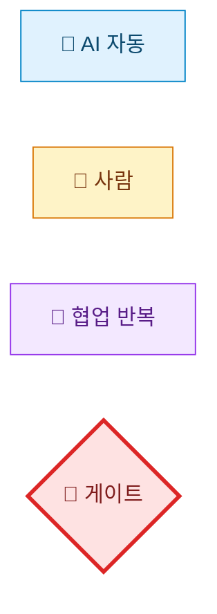
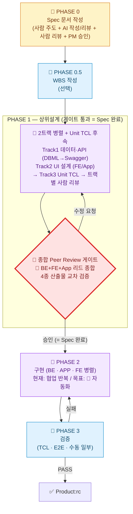
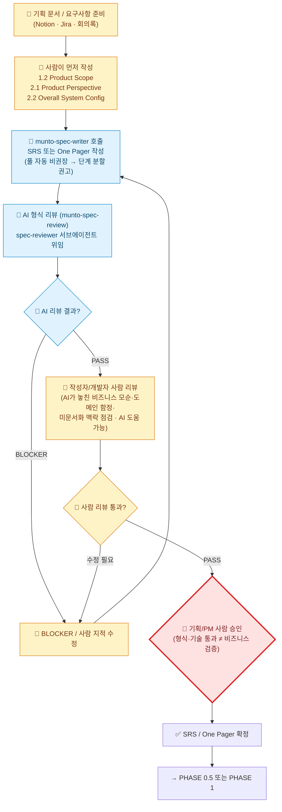
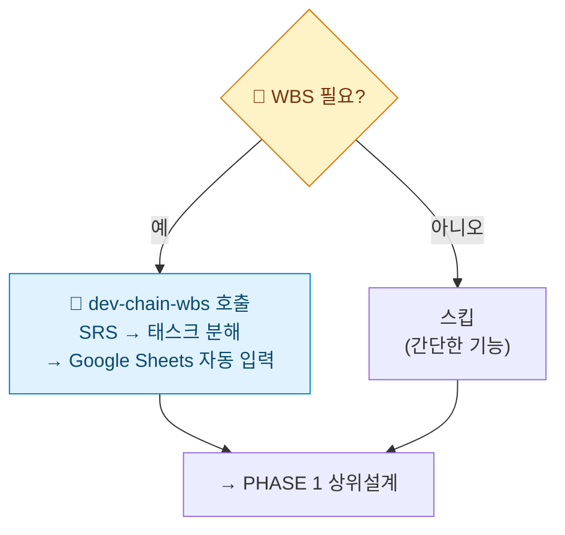
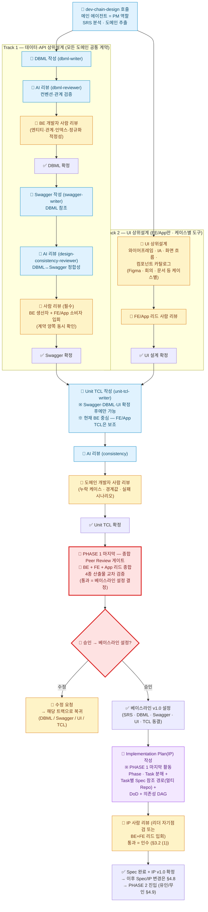
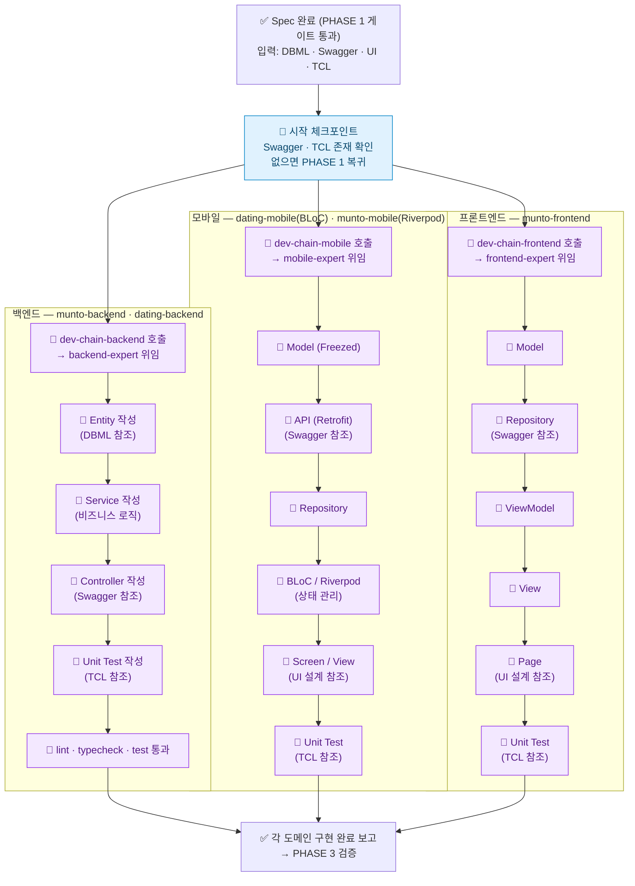
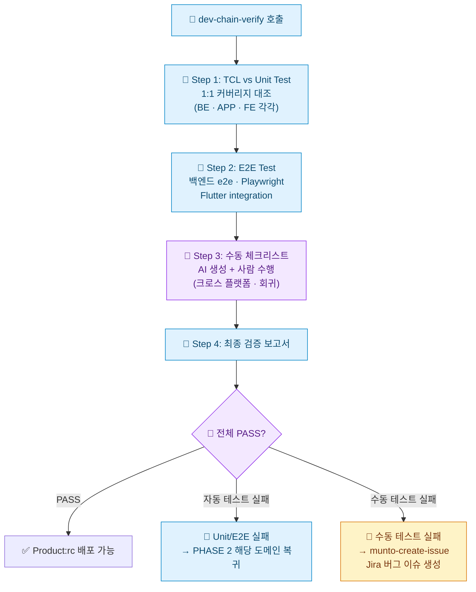
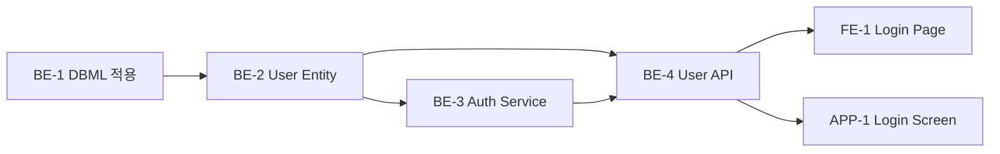
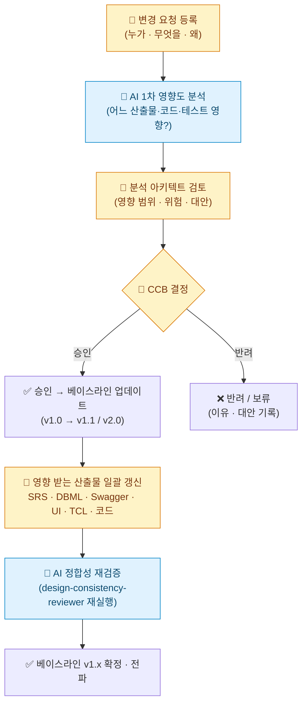

# Agentic Dev Chain — Munto 개발 자동화 프로세스 가이드 (TO-BE)

## 1. 팀 용어 정의

> **왜 이 절이 가장 먼저인가**: 팀이 동일한 용어로 소통하지 않으면 같은 단어로 다른 것을 가리키게 된다. 본 문서·후속 회의·코드 리뷰에서 사용할 핵심 명칭을 **여기서 한 번에 고정**한다.

### 1.1 Agentic Dev Chain — Munto 개발 자동화의 총칭

**Agentic Dev Chain**은 Munto 개발팀이 **AI 에이전트와 협업해 기획부터 릴리즈까지 가는 개발 자동화 방법론**을 총칭한다. 단순한 도구·레포의 이름이 아니라 **프로세스·게이트·역할 분담을 포함한 방법론 그 자체**를 가리킨다.

**진화 맥락:**

| 세대 | 명칭 | 특징 |
| --- | --- | --- |
| **v1 (~2024)** | `AI Dev Chain` | 단계별로 사람이 많이 개입하는 수작업 중심 워크플로 (참고: `AI development chain.drawio.png` legacy 자료) |
| **v2 (2025~)** | **`Agentic Dev Chain`** (본 문서) | Agentic AI · 서브에이전트 · CLI를 활용해 자동화를 극대화하고, 사람이 _반드시_ 개입해야 할 지점에 **명시적 게이트**를 둠 |

**핵심 원칙 3가지:**

1. **자동화 우선** — 가능한 모든 단계를 에이전트·CLI·파이프라인이 수행한다.
2. **전략적 HITL (Human-in-the-Loop)** — 인간 개입은 _줄이는 게 아니라 강화한다_. 비즈니스 승인·DBML/Swagger Peer Review 등은 *명시적 게이트*로 박는다.
3. **이름과 게이트의 일치** — 모든 단계·게이트가 고유한 이름을 갖는다. 팀이 동일 용어로 소통할 수 있도록 한다.

### 1.2 Agentic Dev Chain의 구성 요소 (Implementation Layer)

Agentic Dev Chain은 **방법론(본 문서)** 과, 그것을 실현하는 **여러 구현 요소(Implementation Layer)** 가 함께 떠받치는 구조다. 방법론과 구현 요소는 **1:N 관계**다.

```
Agentic Dev Chain (방법론 · 총칭)
│
├─ 프로세스 정의 (this document)
│   └─ Phase 0 → 0.5 → 1 → Peer Review Gate → 2 → 3
│
└─ 구현 요소 (Implementation Layer)
    ├─ ✅ munto-dev-assistant  (현재 운영 중)
    │   ├─ Agent Configuration 레포
    │   ├─ Skills · Rules · Subagents · Commands · Adapters
    │   └─ Claude · Cursor · Codex 환경에서 동작
    │
    └─ 🚧 추가 예정 요소
        ├─ OpenClaw 등 24시간 무인 실행 서비스
        ├─ CI 통합 (어댑터 검증, 평가 자동화)
        └─ 회귀 시나리오 자동 평가 시스템 등
```

| 구성 요소 | 카테고리 | 역할 | 현재 상태 |
| --- | --- | --- | --- |
| **Agentic Dev Chain** | **방법론(총칭)** | Munto 개발 자동화의 표준 프로세스·게이트·역할 분담 정의 | 본 문서로 정의 |
| **`munto-dev-assistant`** | 구현 요소 — _Agent Configuration 레포_ | AI 에이전트가 위 프로세스를 실행하도록 만드는 **설정 모음** (스킬·규칙·서브에이전트·어댑터) | ✅ 운영 중 |
| **OpenClaw** (예시·가칭) | 구현 요소 — _무인 실행 서비스_ | **24시간 무인 실행** 환경 (스케줄러·러너·알림·롤백 등) — Spec만 깔아 두면 야간 자동 개발·테스트를 돌릴 인프라 | 🚧 미구축 (향후 검토) |
| CI 통합 · 평가 자동화 등 | 구현 요소 — _품질 게이트 강화_ | PR 시 어댑터 검증, 골든 시나리오 회귀 테스트 등 | 🚧 미구축 |

**명명 원칙 (혼동 방지용 핵심 규칙):**

- **"Agentic Dev Chain"** = _방법론·개념·총칭_. 외부 발표·회의·문서 머리말에서 쓴다.
- **`munto-dev-assistant`** = _물리적 레포(파일·설정의 모음)_ 이름. Git 클론·경로 표기 등 _구체적 산출물을 가리킬 때만_ 쓴다.
- **둘은 동의어가 아니다.** "munto-dev-assistant 프로세스"라는 표현은 잘못이다. 정확한 표현은 _"Agentic Dev Chain 프로세스"_ 또는 _"`munto-dev-assistant` 레포에 정의된 스킬"_ 처럼 카테고리를 분리해 쓴다.

### 1.3 Spec의 범위

| 포함 여부     | 산출물                                                                                                     |
| ------------- | ---------------------------------------------------------------------------------------------------------- |
| **포함**      | SRS / One Pager (문서)                                                                                     |
| **포함**      | DBML, Swagger(OpenAPI), Unit TCL (상위설계 산출물, `dev-chain-design` 결과)                                |
| **포함 기준** | 위 산출물이 **합의·완성**되고, 특히 **DBML·Swagger는 개발자 Peer Review**를 거쳤을 때 비로소 **Spec 완료** |
| 범위 밖       | 코드 수준의 세부 설계 (필요 시 팀이 범위만 정하면 됨)                                                      |

### 1.4 AS-IS에서 무엇이 빠져 있었나

AS-IS(`AGENTS.md` 기준)의 Development Chain에는 아래가 없다:

1. **SRS 작성 시 사람 주도 게이트** — "1.2·2.1·2.2를 사람이 먼저" 같은 강제 조건 없음
2. **Spec 완료 정의** — SRS 끝이 Spec 끝인지, 상위설계까지인지 불분명
3. **Peer Review 게이트** — `dev-chain-design` 후 바로 구현으로 넘어감
4. **기획/PM 사람 승인** — 형식 리뷰(`munto-spec-review`)만 있고, 비즈니스 검증 단계 없음

본 문서가 정의하는 **Agentic Dev Chain (TO-BE)** 은 위 4가지를 **명시적 단계·게이트로 추가**한다.

---

## 2. 목표 비전 및 설계 원칙

### 2.1 한 줄 요약

> **사람이 핵심만 정확히 잡으면, AI 가 살을 붙이고, 구현·테스트는 24 시간 무인으로 돈다.**
> 사람 개입은 *줄이는 것* 이 목적이 아니라, *꼭 필요한 곳에 집중*시키는 것이 목적이다.

### 2.2 Spec 의 정의 — 본 TO-BE 가 따르는 SW 공학 원칙

본 TO-BE 가 다루는 "Spec" 은 산업계에서 통용되는 **소프트웨어 스펙 작성 표준** 의 정의를 따른다. 핵심 두 가지를 먼저 못 박는다.

#### ① Spec 인 것 / Spec 이 아닌 것 — *경계가 모호하면 Spec 이 오염된다*

| Spec 에 **포함** | Spec 에서 **분리** (별도 관리) |
| --- | --- |
| 프로젝트 비전 · 비즈니스 전략 | 프로젝트 일정 · 조직도 · 인원 |
| 기능 요구사항 · 비기능 요구사항 (성능·보안·국제화 등) | 개발자 확보·교육 계획 |
| 사용자 계층 · 하위 호환성 | 개발 프로세스 · 테스트 일정 |
| 외부/시스템/UI 인터페이스 | 사용자 매뉴얼 |
| 운영 환경 · 배포 방법 | 빌드 자동화 계획 |
| 비즈니스 규칙 · 설계 제약 · 시스템 특성 | 외주·라이브러리 구매 계획 |
| 가정·종속 사항 | 서비스 인력 교육 |

> **원칙**: 프로젝트 관리·일정·교육·매뉴얼 류는 Spec 에 들어가는 순간, 계획이 바뀔 때마다 Spec 도 수정해야 한다. **Spec 의 베이스라인(=변경의 기준점)이 흔들리면 Spec 의 권위가 무너진다.**

#### ② Spec 과 설계의 경계는 절대적이지 않다 — *잘 분석된 Spec 은 상당 부분 설계 영역까지 다룬다*

| 통념 | 본 TO-BE 가 따르는 원칙 |
| --- | --- |
| Spec = What, 설계 = How (칼로 무 자르듯 구분) | **경계 없음.** 잘 분석된 Spec 은 상당 부분 설계까지 포함 |
| 컴포넌트 간 인터페이스는 설계 영역 | **전체 시스템 관점에선 설계, 개별 모듈 개발자 관점에선 Spec** |
| 별도 설계 문서가 필수 | Spec 만으로 구현 가능한 프로젝트도 있음. 별도 설계 문서 필수 아님 |
| 설계 깊이는 일률적 | **프로젝트 규모 · 개발자 경험 · 외주 여부 · 도메인 성격에 따라 적정 깊이가 다름** |

> **본 TO-BE 의 귀결**: 우리가 **PHASE 1 의 DBML · Swagger · UI · TCL 을 Spec 의 일부로 정의**하는 것은 자의적 결정이 아니라, *"잘 분석된 Spec 은 상위 설계까지 다룬다"* 는 SW 공학 표준 원칙의 직접 적용이다. 종합 Peer Review 게이트 통과 = **Spec 의 베이스라인 설정**과 같은 의미다.

> *(참조: 국내 SW 스펙 작성 표준 §2.6 「스펙인 것과 스펙이 아닌 것」, §2.8 「스펙과 설계의 구분」, §6.8 「스펙과 베이스라인」)*

### 2.3 핵심 원칙 (8개)

#### ① Spec 정확성 우선 — *정확함 ≠ 자세함*

- **비즈니스 요구사항이 정확히 반영된 스펙**이 최상위 가치. AI 가 혼동 없이 구현할 수 있는 수준이면 충분하다.
- **적게 쓰되 핵심이 빠지지 않게.** 자세한 스펙은 문서 부피만 키우고, 개발 중 변하는 스펙을 따라가기 어렵다.
- 자세한 사항은 ② 의 Sub스펙으로 분리한다.

**Spec 의 적정 상세도는 프로젝트 성격에 따라 다르다** (SW 공학 표준):

| 구분 | 간단히 적어도 OK | 상세히 적어야 안전 |
| --- | --- | --- |
| 프로젝트 난이도 | 쉬운 프로젝트 | 어려운 프로젝트 |
| 작성자 - 구현자 거리 | 같은 사람 / 수시로 물어볼 수 있음 | 다른 팀 / 만나기 어려움 |
| 개발팀 경험 | 비슷한 프로젝트 다수 경험 | 신규 투입 개발자 많음 |
| 참고 제품 유무 | 비슷한 제품 있어서 참고 가능 | 참고 제품 없음 |
| 외주 여부 | 내부 경험 많은 팀이 개발 | 외주 개발 |

> **Munto 적용**: 도메인·팀 익숙도가 높은 기능은 핵심 Spec 만으로 충분 / 신규 도메인·새 멤버 투입·외주 시에는 Spec 깊이를 더 채운다. *AI가 구현할 때 추론으로 못 메우는 부분이 어느 정도 있느냐* 가 판단 기준.

**Spec 작성 종료 시그널** — 다음이 보이면 "이번 (Sub)스펙은 닫고 다음으로 가라" 신호:

- 사용자가 새 요구사항을 더 못 만들거나, 이전 리뷰 때 했던 얘기를 반복하기 시작
- 프로젝트 목표·범위에서 벗어난 새 기능이 자꾸 나옴
- 우선순위 낮은 기능들이 자꾸 제안됨 → **다음 Sub스펙으로 연기**하고 현재 Spec 종료

**Why-What-How 의 균형** — Spec 은 What 만이 아니다:

| 분량 비중 | 기획 문서 | **Spec (본 TO-BE)** | 설계 문서 |
| --- | --- | --- | --- |
| **Why** (비전·전략·이유) | 가장 많음 | **상당량 필요** | 적음 |
| **What** (기능·UI·환경) | 보통 | **가장 많음** | 보통 |
| **How** (제약·인터페이스·구현 방향) | 적음 | **보통** | 가장 많음 |

> **핵심**: *Why 가 없는 Spec 위에는 좋은 아키텍처를 설계할 수 없다.* AI 가 구현 시 "왜 이렇게?" 를 물을 때 답할 수 있어야 한다. 그래서 사람의 핵심 입력(원칙 ③)에 **Why** 가 반드시 들어가야 한다.

> *(참조: 국내 SW 스펙 작성 표준 §6.5 「스펙은 얼마나 자세히 적어야 하는가」, §8.1 「Why, What, How」, §9.11 「Why 를 잘 알아야 한다」)*

#### ② Phase → Task → Sub스펙 분해

큰 프로젝트의 Spec 은 **하나의 문서로 적지 않는다.** SW 공학 표준 패턴을 그대로 따른다.

**구조 — 상위 Spec 1 개 + 하위 Sub스펙 N 개**

```
Main Spec  ── 프로젝트 비전·전략·Phase/Task 분해·컴포넌트 식별·
   │           ★ 컴포넌트 간 인터페이스 정의 ★
   │
   ├── Sub Spec 1 (컴포넌트 A) ── 외부 인터페이스만 고려 + A 의 상세
   ├── Sub Spec 2 (컴포넌트 B) ── 외부 인터페이스만 고려 + B 의 상세
   └── Sub Spec 3 (컴포넌트 C) ── 외부 인터페이스만 고려 + C 의 상세
```

**작성 순서 원칙**

1. **Main Spec 에서 컴포넌트 간 인터페이스만 먼저 정의** → 이 시점부터 하위 Sub스펙 **병렬 작성 가능**.
2. Sub스펙은 Main 과 많은 부분을 공유하므로 **중복 작성 금지** → Main 을 참조하는 방식.
3. Sub스펙은 Main 과 **일관성 유지가 필수.**
4. **작성 시점은 자유** — Main 과 동시에 작성하거나, 진행 중 해당 Task 직전에 작성.

**왜 분해하는가**

- Spec 작성 시간 절약
- 프로젝트도 작은 서브 프로젝트로 나눠 동시 진행 가능 → 복잡도 ↓, 개발 기간 ↓
- **단, 인터페이스 정의가 핵심.** 엉성한 인터페이스 → 개발 도중 인터페이스 변경 → **대규모 재작업.** 병렬 개발의 성패는 인터페이스에 달려 있다.

> **본 TO-BE 의 직접 적용**: 우리 PHASE 1 의 **Track 1 — 데이터·API 상위설계 (DBML → Swagger)** 가 바로 *"Main Spec 에서 컴포넌트 간 인터페이스를 먼저 정의"* 단계다. Swagger 가 확정되어야 PHASE 2 의 BE/App/FE 가 병렬로 진행 가능하다. *인터페이스 정의가 병렬 개발의 핵심*이라는 원칙의 Munto 버전 구현.

> **Sub스펙 트리거** — 다음이 보이면 Sub스펙으로 분리:
> - Main Spec 작성 중 *"이 부분은 자세히 적으면 분량이 너무 커진다"* 는 판단
> - 한 컴포넌트가 독립 개발자/팀에 할당되어 외부 인터페이스만 합의되면 내부 작업 가능
> - 우선순위 낮아서 나중에 작성해도 되는 Task → 진행 시점에 Sub스펙 작성

> *(참조: 국내 SW 스펙 작성 표준 §6.12 「큰 프로젝트 분석 협업 방법」)*

> **본 TO-BE 의 직접 적용 — Implementation Plan (구현계획서, IP)**: Main Spec/Sub스펙의 Phase·Task 분해를 *실행 가능한 단일 문서*로 박은 산출물이 **IP** 다. IP 는 *"각 Task 가 어느 Repo · 어느 Spec · 어느 섹션을 어떻게 참고해 무엇을 만들고 어떻게 끝났음을 판정하는가"* 를 한 곳에 묶어, *Spec 분해 원칙 ②를 PHASE 2 무인 실행 모드(§4.9)의 실제 입력*으로 변환한다. 상세는 §4.3 끝 *PHASE 1 마지막 활동 — Implementation Plan 작성* 참조.

#### ③ 사람의 핵심 입력 → AI 살붙임 → 사람 최종 확인 *(3단 필수)*

문서화되지 않은 조직 의사결정·맥락이 항상 존재하므로 이 3단은 생략 불가.

- **입력 (사람)**: 비즈니스 전략·문제 정의·핵심 아키텍처는 **사람이 먼저 명시적으로 입력**한다.
- **살붙임 (AI)**: AI 가 살을 붙이는 과정에서 모호한 지점을 발견하면 **추측 대신 사람에게 질문**한다. → **대화식 필수** (사람이 먼저 알려주기 + AI 가 먼저 파악해서 묻기, 양방향).
- **확인 (사람)**: AI 작성 결과는 사람이 **최종 확인**한다. AI 가 절대 못 잡는 영역(비즈니스 정합·미문서화 맥락·도메인 함정)이 있기 때문.

#### ④ 사람 개입 "최소화 + 핵심 명확화"

사람이 *반드시* 해야 하는 일만 명시적으로 박고, 나머지는 AI 가 자율 진행한다. *(상세 체크리스트: §4.6)*

- **사람이 꼭 해야 하는 일**
  - SRS 의 **핵심 전략·문제 정의·핵심 아키텍처** 입력 및 확인
  - **DBML · API · 핵심 아키텍처** 꼼꼼한 사람 리뷰
  - 종합 Peer Review 게이트 승인 결정
- 그 외는 ⑤ 의 AI 자동화 가이드로 처리

#### ⑤ AI 자율 작업도 완전 자동화 지향 — *가이드와 Review 방법까지 제공*

사람이 모든 결과를 다시 손봐야 한다면 그것은 자동화가 아니다. AI 가 사람 개입 없이도 일정 품질을 내도록 *(상세: §4.7)*:

- **스킬 · 규칙 · 서브에이전트 정의 · 컨벤션 문서** 4종의 가이드 체계를 채워 둔다.
- **AI 자체 Review 방법** (lint · typecheck · test · 산출물 정합성 reviewer) 을 모든 산출물에 박는다.
- **사람 Review 방법** (체크리스트 · 보조 프롬프트 예시) 도 동봉한다.

#### ⑥ 테스트 완전 자동화 지향 — *Unit · E2E · UI 까지*

- **풍부한 Unit Test + E2E Test** — 1차 검증이자 **Regression Test 자산**.
- **UI 테스트도 최대한 자동화.** 현재 도구로 가능한 영역과 남은 숙제는 §3.6 / §4.5 에 정리한다.
- 자동화 비율이 올라갈수록 PHASE 3 의 🔄(협업)·👤(사람) 노드가 🤖 로 옮겨간다.

#### ⑦ 24시간 무인 실행 인프라 — *준비 중*

- 개발자가 퇴근 전 맡기고, 출근 후 결과 검토하는 패턴을 지향.
- **OpenClaw 등 24시간 무인 실행 서비스**를 별도 구현 요소로 추가 검토. *(상세: §1.2)*
- Spec(문서 + 상위설계 + Peer Review)이 완결되면 그 뒤는 무인 실행에 맡길 수 있다는 것이 ①~⑥ 의 자연스러운 귀결. **본 원칙(⑦)의 *전제* 는 ⑧** — *Spec 완료 = IP/Spec 단일 진실* 이 박혀야 무인 실행이 컨텍스트를 추가로 요구하지 않는다.

#### ⑧ Spec ↔ 구현의 컨텍스트 단절 원칙 — *Spec 완료 후엔 IP·Spec 만으로 누구나(AI·사람) 구현·테스트 가능*

> **본 TO-BE 의 모든 sessions/ 정책·인계 정책·cwd 정책의 *상위 원리*.** 본 원칙이 박히지 않으면 ⑦ 무인 실행은 *작성자에게 매번 물어보는 시스템* 으로 전락한다.

**두 단계로 분리된 *컨텍스트 보존 정책*:**

| 단계 | 컨텍스트 보존 정책 | 이유 |
|------|------------------|------|
| **Spec 작성 중 (PHASE 0~1)** | *세션 컨텍스트를 적극 보존* — Spec 작성자가 *어제 어디까지 진행했는지*, *어떤 대안을 검토했는지*, *어떤 모호함이 남았는지* 가 *다음 작성 세션*·*리뷰어*·*ip-writer* 에게 흘러야 한다. → §4.7.4 (a)+(c) 자동 저장·`spec-baseline-handoff.md` 사람 의무 | Spec 자체가 *Why 와 결정 흐름의 결정체* (§2.3 ①·§4.7.3). 작성 중 휘발되면 *왜* 가 영원히 사라짐 |
| **Spec 완료 후 (PHASE 2~3)** | *세션 컨텍스트는 단절* — 구현·테스트 단계의 *입력 = IP + Spec 만*. 작성자에게 추가 질문 없이도 누구나(AI·사람) 진행 가능해야 한다. *팀 공유 `sessions/` 의 PHASE 2 파일들(daily·phase·blocker)은 오케스트레이터·Owner 모니터링용 — 구현 개발자가 컨텍스트 얻으려고 읽는 파일 아님.* | *컨텍스트가 추가로 필요하면 IP/Spec 이 불완전한 것* (IP-9.4). IP-8 *통과 = 인수* 와 일관 |

**행위자별 의무·금지 매트릭스 — 본 원칙의 *운영형*:**

| 행위자 | cwd | 입력 (읽을 것) | sessions/ 폴더 관계 |
|--------|-----|---------------|--------------------|
| **Spec 작성자 (분석 아키텍트)** | `munto-dev-assistant/projects/{프로젝트명}/` | SRS · DBML · Swagger · UI/TCL · 본인의 `spec-session-*.md` 누적 | **작성 의무** — `spec-session-*.md`·`spec-review-*.md`·`spec-baseline-handoff.md` (Owner) |
| **ip-writer (서브에이전트)** | 위와 동일 | Spec 4 종 + **`spec-baseline-handoff.md` 우선 참조** + (선택) 최근 `spec-session-*.md` | 박지 않음 (작성자의 산출물을 *읽기만*) |
| **구현 개발자 (BE / FE / App)** | **각 제품 Repo** (`munto-backend`·`munto-frontend`·`munto-mobile`·`dating-*`) | **IP + Spec 만 — `sessions/` 폴더 읽을 의무·필요 없음** | **박지 않음.** 본인의 진행 로그는 *로컬 `~/.claude/` 세션 + PR description* 으로만. *유일 예외*: 인계 발생 시 `handover-*.md` |
| **무인 오케스트레이터** | 시스템 (CI) | IP Task 카드 + Spec 참조 4 요소 | **작성 의무** — `daily-summary.md`·`phase-{n}-summary.md`·`blocker-{id}.md` (§4.9.7) |
| **Owner / 리뷰어** | 상황별 | 위 산출물 전부 | 읽기 권한 — *직접 박는 의무 없음* (오케스트레이터/Spec 작성자가 박은 것을 읽음) |

**원칙의 결과 — 5 가지:**

1. **구현 개발자는 `projects/{프로젝트명}/` 폴더에서 작업하지 않는다.** 거기는 *Spec 작성자·오케스트레이터·인계자의 영역*.
2. **구현 개발자는 팀 공유 `sessions/` 에 본인의 작업 로그를 박지 않는다.** 본인의 *어제 어디까지 진행했는가* 는 *본인 로컬 `~/.claude/` + PR description* 으로 충분.
3. **인계가 발생하면 — 작성자→작성자, 작성자→ip-writer, 작성자→Owner — 인계 단일 컨텍스트는 IP (PHASE 2 진입 시) 또는 `spec-baseline-handoff.md` (PHASE 1 GATE 통과 시).** 그 외 정보는 *읽으면 도움이 되지만 안 읽어도 진행 가능* 해야 한다.
4. **멀티 작성자 시나리오** — 같은 프로젝트의 Spec 작성자 N 명이 같은 날 작업하면, `sessions/` 파일은 *작성자별로 분리* (`spec-session-{date}-{author-id}.md`) — race condition·merge conflict 0. *상세는 §4.7.4 (1)*.
5. **PHASE 2 sessions/ 의 daily/phase/blocker 는 *모니터링 데이터*** (오케스트레이터·Owner 가 *프로젝트가 잘 굴러가는가* 추적용) — *구현 개발자가 컨텍스트 얻으려고 읽는 파일 아님*. *상세는 §4.9.7*.

> **메시지**: *컨텍스트는 PHASE 0~1 에 갇혀 있고, PHASE 2 는 IP/Spec 만으로 닫힌 시스템이어야 한다.* 이게 깨지면 — 즉 구현 개발자가 작성자의 `sessions/` 를 읽어야 일이 되면 — Spec 이 *불완전* 한 것이며 IP 작성 단계로 돌아가야 한다.

> **본 원칙의 운영 정책 cross-link**: 작성 중 보존 = §4.7.4 / 완료 후 단절 = §4.4 *구현 개발자 운영* 박스 · §4.9.7 / 인계 단일 컨텍스트 = IP-9.4 / 안티 패턴 = IP-9.6.

### 2.4 변경 원칙 — *기존 자산 활용, 완전 새로 만들지 않음*

- 본 TO-BE 는 기존 `munto-dev-assistant` 의 스킬·규칙·서브에이전트를 **활용 · 추가 · 수정 · 삭제** 한다.
- 백지에서 새로 만드는 것이 아니라, 현재 자산이 ②~⑥ 원칙을 만족하도록 **진화시키는 청사진**이 본 문서다.
- 변경 단위는 가능한 한 작게(스킬 1개 · 규칙 1개 단위), 변경 이력은 본 문서 마지막 표에 누적한다.

---

## 3. Agentic Dev Chain — 프로세스 도식 (TO-BE)

### 3.0 다이어그램 범례 (Legend)

각 노드는 **누가 일을 수행하는가**에 따라 4가지로 분류한다. 색·아이콘이 동시에 표시되며, 한 채널이 깨져도 다른 채널이 의미를 살린다.

| 아이콘 | 색 | 의미 | 예시 |
|--------|-----|------|------|
| 🤖 | 옅은 파랑 | **AI 자동** — 사람은 트리거만 하고, 실행 중 사람 개입 없음 | `dbml-writer`, `dev-chain-verify` 자동 단계 |
| 👤 | 옅은 노랑 | **사람** — 사람이 직접 작성·결정. 결과물의 책임이 사람에게 있는 경우 | SRS 1.2·2.1·2.2 작성, BLOCKER 수정 |
| 🔄 | 옅은 보라 | **협업 반복** — AI가 만들고 사람이 검토·수정 요청을 반복하는 *루프* 작업 | `dev-chain-backend/mobile/frontend` (현재 상태) |
| 🚧 | 옅은 빨강 (굵은 테두리) | **게이트** — 사람이 명시적으로 *PASS/REJECT*를 결정하는 의사결정 지점 | Peer Review 승인, 기획/PM 승인 |



> **분류 원칙**: 사람이 호출(trigger)만 하고 AI가 자율 완료하면 🤖이다. AI가 만든 결과를 사람이 *여러 번 검토·수정 요청*하는 패턴이 본질이면 🔄이다. **🔄로 표시된 노드는 "장기적으로 🤖로 옮기는 게 목표"인 백로그**이기도 하다.

### 3.1 전체 흐름 개요

> **스펙 분해 원칙** (§2.3 ② 적용)
> - 큰 프로젝트는 PHASE 0 시점에 **Phase → Task** 로 분해한다.
> - 각 Task 는 본 흐름(PHASE 0 → 1 → 2 → 3)을 자체적으로 한 번씩 돈다. Main 스펙 1회로 끝나는 게 아니라, **Task 단위 Sub스펙** 이 그때그때 추가된다.
> - **Sub스펙 작성 시점**은 Main 과 동시이거나, 프로젝트 진행 중 해당 Task 직전이거나 자유.
> - 즉 본 다이어그램은 **하나의 (Sub)스펙 단위 흐름**으로 보면 된다. 큰 프로젝트는 동일 흐름이 N 번 누적된다.



> 아래에서 각 Phase를 세로형 다이어그램으로 상세히 풀어 본다.

### 3.2 PHASE 0 — Spec 문서 작성



> **A1 입력 단계 체크리스트 — 요구사항 13 가지 출처** *(사람이 직접 훑어야 누락이 안 생긴다)*
>
> 사람이 A1 을 작성하기 전에 아래 출처를 한 번씩 훑고 핵심을 *문서·메모로 모은 뒤* AI 에 입력한다. **AI 가 자력으로 알 수 없는 출처가 대부분**이라는 점이 본 체크리스트의 핵심이다.
>
> | 분류 | # | 출처 | Munto 매핑 |
> | --- | --- | --- | --- |
> | **내부 인풋** | 1 | 비즈니스 전략·OKR | Notion 전략 페이지, 분기 OKR |
> | | 2 | 기존 제품/서비스 데이터·이슈 | Jira(버그·요청), CS 로그, Crashlytics |
> | | 3 | 내부 이해관계자(PM·CS·세일즈·운영) | 인터뷰·회의록·Slack |
> | | 4 | 제약(법무·보안·예산·납기) | 사내 정책 문서, 보안 가이드 |
> | | 5 | 기존 코드·DB 스키마·API 계약 | 레포지토리, `document/ERD.dbml`, 기존 Swagger |
> | **사용자/시장** | 6 | 사용자 인터뷰·설문 | 리서치 보고서, NPS |
> | | 7 | 사용 데이터/행동 로그 | Mixpanel · GA · DB 쿼리 |
> | | 8 | VOC / 문의 / 리뷰 | 앱스토어 리뷰, 고객센터, SNS |
> | | 9 | 경쟁 제품·대체재 | 경쟁 분석 보고서 |
> | **외부 환경** | 10 | 도메인 전문가·자문 | 외부 자문, 학계 |
> | | 11 | 표준·규제 | 개인정보보호법, PCI-DSS 등 |
> | | 12 | 외부 시스템·파트너 API | PG, 알림톡, OAuth, 지도 등 |
> | | 13 | 시장 트렌드·기술 동향 | 컨퍼런스, 논문, 블로그 |
>
> *(참조: 국내 SW 스펙 작성 표준 §3 「요구 분석의 시작 — 정보 출처」, §3.2 「요구 분석의 13 가지 정보 출처」)*

> **PHASE 0 핵심 원칙 (§2.3 적용)**
>
> | 원칙 | 적용 |
> |------|------|
> | ① **정확함 ≠ 자세함** | A1·A2 작성 단계에서 "적게 쓰되 핵심 빠지지 않게". 변동성 큰 세부는 Sub스펙으로 미룬다. |
> | ② **Phase → Task → Sub스펙** | 큰 프로젝트는 A1 단계에서 Phase/Task 분해를 같이 작성. Task 별 Sub스펙은 그때그때 추가. |
> | ③ **사람 입력 → AI 살붙임 → 사람 확인** | A1(사람) → A2(AI) → A4b(사람) 의 3단이 본 다이어그램의 골격. |
> | **대화식 필수** | A2(AI 작성) 도중 모호한 지점은 **AI 가 먼저 사람에게 질문**해야 한다 — 추측 금지. `munto-spec-writer` 대화 패턴으로 진행. |
> | **AI 가 잡는 것 / 사람이 잡는 것 분리** | A3(AI 형식 리뷰) = 표준·체크리스트 / A4b(사람 리뷰) = 비즈니스 정합·도메인 함정·미문서화 맥락. **둘 다 필수.** |

> **PHASE 0 사람 리뷰(A4b) 운영 5 원칙** — *형식 게이트가 아닌, 진짜 결함을 잡는 리뷰가 되도록*
>
> | # | 원칙 | 실무 적용 |
> | --- | --- | --- |
> | 1 | **1 회 원칙** | 완성도 높은 SRS 1 회 정밀 리뷰. *"대충 적고 여러 번 리뷰"* 패턴은 집중도 ↓ → 중요한 결함을 놓치기 쉬움 |
> | 2 | **사전 배포 — 분량·이해관계자 비례 (AI 시대 가변)** | 단일 숫자 대신 케이스 표로 운영. 아래 표 참조 |
> | 3 | **사전 정독 필수 (AI 보조 권장)** | 모든 리뷰어는 회의·코멘트 작성 *전에* 전체 또는 담당 영역을 정독. AI 요약·하이라이트·가설 검증 사용 권장. 즉석 리뷰 금지 |
> | 4 | **부분 리뷰 가이드 명시** | 누가 어느 섹션을 봐야 하는지 SRS 본문 (예: `1.6 Intended Audience`) 에 명시. 모두가 전체 리뷰할 필요 없음 |
> | 5 | **특별 리뷰어** | 보안·법무·접근성 등 특정 영역 전문가는 프로젝트 참여 여부와 무관하게 해당 섹션 리뷰. 분석 아키텍트가 호출 |
>
> **② 사전 배포 기간 — 케이스별 가이드**
>
> | 케이스 | 사전 배포 권장 | 비고 |
> | --- | --- | --- |
> | One Pager · 리뷰어 1~2 명 · 단일 도메인 | **1 일 (24 h)** | 작은 변경·실험 기능. AI 보조 정독으로 충분 |
> | 일반 SRS · 리뷰어 3~4 명 · 2 도메인 (예: BE + FE) | **2~3 일** | Munto 기본 케이스. 본업 병행 + 도메인 간 의견 수렴 시간 |
> | 큰 SRS · 리뷰어 5 명 이상 · 다도메인·외부 시스템 영향 | **5~7 일** | 베이스라인 영향 큰 Spec. *3~7 일 원칙 유지* |
> | (덧셈) 보안·법무·접근성 등 특별 리뷰어 포함 | **+ 2 일** | 본업 우선순위가 달라 별도 시간 확보 필요 |
>
> **AI 시대에도 줄어들지 않는 시간 — 명시적으로 보호한다**
>
> - **사고와 통찰(Incubation)**: 도메인 함정·미문서화 맥락·"이거 진짜 될까?" 는 자고 일어나야 떠오른다. **최소 1 박** 은 큰 SRS 에서도 그대로 둔다.
> - **비동기 의견 수렴**: 리뷰어가 본업 병행. 이해관계자 수에 비례한 *달력 시간* 은 AI 가 못 줄인다.
> - **"AI 가 ① 정독을 단축한 만큼 ② 사고에 더 쓰라"** — 단축된 시간을 "리뷰 가속" 이 아니라 "리뷰 깊이" 에 투자한다.
>
> **AI 보조 활용**: 리뷰어가 *"이 SRS 의 7장 기능과 2.4 매핑 일관성 봐줘"*, *"6장 NFR 과 가정 충돌 있는지 봐줘"* 같이 가설을 던지면 AI 가 정밀 검토 → 사람이 통과 판단. *(참조: 국내 SW 스펙 작성 표준 §6.6 「스펙을 리뷰하라」)*

> **AI 시대 사람 리뷰 — 행동 패턴을 막는 검증 메커니즘** *(AS-IS §5 행동 패턴 대응)*
>
> AI 가 작성한 Spec 을 사람이 *형식적으로 통과시키는* 패턴(AS-IS §5.1~§5.3)을 막기 위해, A4b 사람 리뷰는 다음 **3 가지 검증 메커니즘**을 강제한다.
>
> #### (1) AI 출력 책임 전환 원칙 — *"통과시킨 사람이 작성자다"*
>
> | 원칙 | 운영 |
> | --- | --- |
> | **통과 = 인수** | A4b 통과를 선언한 리뷰어는 *AI 가 썼다는 이유로 면책되지 않는다*. **본인이 직접 작성한 것과 동일한 책임** 을 진다 (= 6 개월 뒤 *"왜 이렇게 했어요?"* 질문에 답할 의무) |
> | **이름 기록 의무** | A4b 통과 시점에 *리뷰어 실명 + 통과 일시 + 본인이 검토한 섹션*을 SRS 변경 이력에 기록 |
> | **"AI 가 썼으니까" 면책 금지** | 이슈 발견 시 *"AI 가 그렇게 적어서요"* 는 변명으로 인정되지 않는다. 통과시킨 사람의 판단 부재로 본다 |
>
> > **※ 무인 실행 모드(§4.9)에서도 본 원칙은 우회 불가** — 자동화 루프는 PHASE 2 안에서만 작동하며, PHASE 0 의 A4b · A6 사람 게이트는 사람이 직접 통과시켜야 한다. 무인 루프가 생성한 PR 역시 머지 시점에 *통과 = 인수* 원칙이 그대로 적용된다 (PR 머지자가 책임자).
>
> #### (2) 리뷰어 자기점검 체크리스트 — *형식적 통과 차단*
>
> A4b 통과 선언 *전*에 리뷰어가 본인에게 던지고 명시적으로 답해야 하는 5 개 질문 (체크 못 하면 통과 보류):
>
> - [ ] **이해 점검**: 이 SRS 의 *모든 용어·약어*를 내가 설명할 수 있는가? 못하면 §1.4 Terms and Abbreviations 에서 정의 확인 (§4.7.2). 정의가 없으면 작성자에게 질문 → §1.4 보강 → 다시 리뷰
> - [ ] **모순 점검**: 같은 항목을 다른 섹션에서 *다르게 서술* 하지 않았는가? (예: 1.2 에선 "B2C 위주", 7장에선 B2B 기능)
> - [ ] **Why 점검**: 핵심 기능마다 *"왜 이렇게 결정했는지"*가 적혀 있거나, 내가 답할 수 있는가? (Why-What-How 균형, §2.3 ①)
> - [ ] **누락 점검**: AS-IS 운영에서 발생했던 *비슷한 도메인 함정*이 이 SRS 에서 다뤄지고 있는가?
> - [ ] **대안 점검**: 핵심 아키텍처 결정에 대해 *고려한 대안 N 개* 와 *각 대안의 트레이드오프* 가 있는가? 없으면 §4.7.3 대안 검토 박스 참조하여 작성자에게 보강 요청
>
> #### (3) "모르는 용어 발견 시 질문 강제" — 학습 회피 차단
>
> 리뷰어가 모르는 용어를 발견했는데 *그냥 넘어가는 것은 통과 불가 사유*. 다음 순서로 처리:
>
> 1. **§1.4 조회**: §4.7.2 의 SRS §1.4 Terms and Abbreviations 에서 정의 확인
> 2. **정의 없음 → 작성자에게 질문**: Slack/회의에서 명시적으로 *"○○ 가 무엇입니까?"* 질문 (모른다는 사실을 *숨기지 않는다*)
> 3. **§1.4 보강 요구**: 답을 들었으면 §1.4 Terms and Abbreviations 에 정의 추가 요청
> 4. **재리뷰**: §1.4 보강 후 다시 정독
>
> > *모른다고 말하는 비용 < 모르는 척 통과시킨 비용 × 100.* 6 개월 뒤 *"왜 이렇게 만들었는지 아무도 모르는 시스템"* 의 시작은 *"모르는 용어를 그냥 넘긴 그 회의"* 다.



### 3.4 PHASE 1 — 상위설계 (dev-chain-design)

> **구조 원칙**: PHASE 1은 **두 트랙이 병렬로 진행 → Unit TCL은 두 트랙이 모두 확정된 후에만 작성**된다.
> - **Track 1 — 데이터·API 상위설계** (DBML → Swagger): 모든 도메인 공통 계약. BE 생산자, FE/App 소비자.
> - **Track 2 — UI 상위설계** (와이어프레임 · IA · 화면 흐름 · 컴포넌트 카탈로그): FE/App만 해당. 케이스별 도구(Figma 등) 사용.
> - **Unit TCL**: Track 1 의 Swagger·DBML 과 Track 2 의 UI 설계가 모두 끝난 후 작성.



> **현재 한계 노트**
> - `unit-tcl-writer` 는 입력으로 SRS·Swagger·DBML 을 받기 때문에 BE 단위 테스트 시나리오에 강하다. **FE/App UI 흐름·상호작용 TCL 은 보조 산출물**로 보고, 필요 시 도메인 개발자가 직접 보강한다.
> - Track 2(UI 상위설계)는 **현재 자동화 스킬이 없다.** Figma·회의·내부 문서로 사람이 진행하며, 나중에 UI writer/reviewer 스킬이 생기면 이 칸에 추가된다.
> - **종합 Peer Review 게이트는 PHASE 1 의 마지막 단계**이지 별도 PHASE 가 아니다. AI 리뷰는 트랙 내부 단위 리뷰에서 이미 끝났고, 게이트는 **사람의 종합 정합성 결정**만 담당한다.

> **게이트 통과 = 베이스라인(Baseline) 설정**
>
> PHASE 1 종합 Peer Review 게이트 통과는 단순히 *"Spec 작성 끝났음"* 이 아니라, **이 시점의 4 종 산출물(SRS · DBML · Swagger · UI · TCL) 을 베이스라인 v1.0 으로 고정한다** 는 의미다.
>
> | 베이스라인 설정의 의미 | 결과 |
> | --- | --- |
> | 개발자 · 테스터 · 운영 모두가 **동일한 기준**으로 작업한다 | 트랙 간 정합성 보장 |
> | 베이스라인 이후 변경은 **누가 마음대로 못 한다** | 모든 변경은 §4.8 변경 관리 절차 통과 |
> | 변경 영향이 4 종 산출물 전반에 미친다 → **소규모 변경도 영향도 평가** | DBML 컬럼 추가가 Swagger·TCL·BE 코드 동시 영향 |
> | 베이스라인은 **버전을 갖는다** (v1.0 → v1.1 → v2.0) | 변경 이력·차이를 추적 가능 |
>
> 베이스라인 미설정 = 모두가 다른 버전을 보고 개발 → AS-IS 의 "동기 어려움" 원인. *"베이스라인 = Spec 의 동결 시점"* 이라는 SW 공학 표준 용어로 본 TO-BE 에서 채택. *(참조: 국내 SW 스펙 작성 표준 §6.8 「베이스라인을 설정하라」)*

> **PHASE 1 마지막 활동 — Implementation Plan (구현계획서, IP)** *(NEW)*
>
> 베이스라인 v1.0 직후, PHASE 2 진입 *전*에 **IP 를 작성**한다. IP 는 *"Spec 을 무인 실행 가능한 형태로 변환한 단일 문서"* 다.
>
> | 항목 | 내용 |
> | --- | --- |
> | **위치 / 범위** | PHASE 1 의 마지막 활동 (별도 PHASE 번호 없음). PHASE 2 의 *실행 입력*이 된다 |
> | **입력** | 베이스라인 v1.0 4 종 산출물 + 기존 Repo 의 `docs/specs/` + 멀티 Repo Spec 인덱스 |
> | **출력** | IP 본문 — `munto-dev-assistant/projects/{프로젝트명}/ImplementationPlan.md` + 옵션 부속 산출물 (저장 위치·폴더 구조는 §4.3 IP-0 참조). Phase 분해 / Task 분해 / Task별 Spec 참조 경로(4 요소) / DoD / 의존성 DAG / Repo 매핑 포함 |
> | **게이트** | IP 사람 리뷰 통과 = *PHASE 2 진입 자격 + 무인 실행 모드(§4.9) 입력 자격*. 통과 = 인수 원칙(§3.2 (1)) 동일 적용 |
> | **작성 책임** | 분석 아키텍트 또는 프로젝트 리더 (1 인 가능). AI 가 1 차 분해를 도출하고 사람이 검수 |
>
> **왜 필요한가** — Spec 이 완벽해도 *"Task 1 번 구현해"* 라고만 지시하면 매 Task 마다 *어느 Repo · 어느 파일 · 어느 섹션 · 어느 TCL 케이스* 를 사람이 다시 설명해야 한다. 이건 무인 실행을 *원천적으로 불가능*하게 만든다. IP 는 *Task 단위로 한 번에 자동 실행 가능한 컨텍스트 묶음*을 사전에 박아둔다.
>
> **상세 작성법은 §4.3 끝 — *PHASE 1 마지막 활동 — Implementation Plan 작성*** 참조.

> **PHASE 1 사람 리뷰 운영 — §3.2 의 리뷰 5 원칙 동일 적용**
>
> D3·S3·U2·T5·GATE 의 모든 사람 리뷰 단계는 §3.2 의 **리뷰 5 원칙**(① 1 회 ② 사전 배포 가변 ③ 사전 정독+AI 보조 ④ 부분 리뷰 가이드 ⑤ 특별 리뷰어)을 그대로 따른다. **② 사전 배포 기간은 §3.2 케이스 표 참조** — 단일 산출물 트랙 리뷰(D3·S3·U2·T5)는 보통 *1~2 일* 이면 충분하고, 종합 게이트(GATE)는 *분량·이해관계자 수에 비례* 한다.

> **PHASE 1 도 §3.2 의 *AI 시대 사람 리뷰 — 행동 패턴을 막는 검증 메커니즘* 3 가지를 모두 적용한다.** *(AS-IS §5 행동 패턴 대응)*
>
> ① **AI 출력 책임 전환 원칙** — D3·S3·U2·T5·GATE 통과를 선언한 리뷰어는 *"AI 가 썼다"* 는 이유로 면책되지 않는다. *통과 = 인수* 원칙.
>
> ② **리뷰어 자기점검 체크리스트** — PHASE 1 산출물별 추가 체크 항목:
>
> | 산출물 | 추가 자기점검 항목 (5 개 기본 + 아래) |
> | --- | --- |
> | **DBML (D3)** | □ 각 컬럼의 *제약 조건*(`NOT NULL` · `UNIQUE` · `DEFAULT` · `INDEX`) 에 *근거가 있는가*? AI 가 *그럴듯하게 넣은* 것은 *명시적으로 제거*하거나 근거를 적는다. □ 정규화 수준이 운영 비용·확장성에 적정한가? |
> | **Swagger (S3)** | □ 모든 엔드포인트의 *0-base vs 1-base*, *시간대*, *통화 단위*, *Null 의미* 가 description 에 명시되었는가? □ BE 생산자와 FE/App 소비자가 *동일하게* 이해했는가? (회의에서 *각자 한 줄로 설명하게* 한다 — 다르면 description 보강) |
> | **UI (U2)** | □ *에러 상태·로딩 상태·빈 상태* 가 모두 정의되었는가? □ 접근성(WCAG)·다국어가 고려되었는가? |
> | **TCL (T5)** | □ *경계값·실패·권한·동시성* 시나리오가 누락되지 않았는가? □ 정상 케이스만 95% 인 TCL 은 *재작성* 요구 |
> | **GATE** | □ 4 종 산출물 *상호 참조 정합성* (DBML 의 컬럼 ↔ Swagger 의 DTO 필드 ↔ TCL 의 입력값) 이 일치하는가? |
>
> ③ **모르는 용어 발견 시 질문 강제** — 특히 PHASE 1 은 *기술 용어가 폭증*하는 구간. *"NOT NULL DEFERRABLE", "JWT refresh rotation", "soft delete", "optimistic locking"* 등 용어를 *들어본 적은 있지만 정확히 설명 못하는* 상태로 통과시키는 것 금지. §4.7.2 의 §1.4 보강 절차 따른다.
>
> **GATE 통과 = 베이스라인 v1.0 설정 = 4 종 산출물 모두에 대해 BE/FE/App 리드가 인수 도장.** 책임 전환 원칙(①) 이 *베이스라인 설정의 무게*를 사람 이름으로 박는다.
>
> **※ 무인 실행 모드(§4.9)는 PHASE 1 게이트와 베이스라인 설정을 우회하지 않는다.** 무인 루프는 *이미 사람이 베이스라인을 설정한 v1.x 산출물* 위에서만 PHASE 2 를 진행한다. 루프가 베이스라인 산출물 변경 필요를 발견하면 BLOCKER 로 정지하고 §4.8 변경 관리 절차로 위임한다.
>
> 단, PHASE 1 특성상 다음 항목을 추가로 강제한다:
>
> | # | 단계 | 추가 강제 사항 |
> | --- | --- | --- |
> | 1 | **S3 — Swagger 사람 리뷰** | BE 생산자 + FE/App 소비자 **동시 입회** (계약을 한쪽만 보는 일 금지) |
> | 2 | **U2 — UI 사람 리뷰** | FE/App 리드 + 기획자 + (필요 시) BE 리드. 데이터·계산 화면은 BE 도 입회 |
> | 3 | **T5 — Unit TCL 사람 리뷰** | "정상 케이스만 쓰지 마라" — **경계값·실패·권한·동시성 시나리오 누락 여부** 사람이 명시 체크 |
> | 4 | **GATE — 종합 게이트** | 4 종 산출물 **교차 정합성**만 다룬다. 단일 산출물 결함은 해당 트랙으로 되돌린다 (트랙 우회 금지) |

### 3.5 PHASE 2 — 구현 (도메인별 병렬)

> **전제**: PHASE 1 종합 Peer Review 게이트 통과 = Spec 완료. 그 전에는 PHASE 2 진입 불가.
> **구조**: BE · App · FE 3개 도메인은 **서로 다른 제품 레포에서 독립 병렬** 진행. 각 도메인은 PM(메인 에이전트) → expert 서브에이전트 위임 방식.
> **실행 모드**: 본 PHASE 는 ① *유인 모드* (개발자가 직접 지시·검토) / ② *무인 모드* (오케스트레이션 루프, §4.9) 로 운영 가능. 단 **PHASE 0/1 의 사람 게이트와 PR 머지는 무인화 대상이 아니다** — *통과 = 인수* 원칙 보존을 위해.



> 🔄 표시된 구현 단계는 **장기적으로 🤖(완전 자동화)로 옮기는 것이 목표**다. 현재는 AI 1차 구현 → 사람 검토 → 수정 요청 → 재실행의 반복 루프가 일반적.
> **자동화 진척 추적**: 도메인별로 협업 반복(🔄) 단계 수가 줄고 AI 자동(🤖) 비율이 늘어나는 것을 본 다이어그램의 색 변화로 확인할 수 있다.

### 3.6 PHASE 3 — 검증 (dev-chain-verify)



> **UI 테스트 자동화 — 현재 도구와 남은 숙제 (§2.3 ⑥ 적용)**
>
> "UI 도 최대한 자동화" 가 목표지만 영역별 성숙도가 다르다. *기능적 동작* 은 어느 정도 자동화 가능하고, *시각적 회귀 · 다양한 디바이스 · 접근성* 이 가장 큰 숙제다.
>
> | 영역 | 현재 가능 (활용 중) | 남은 숙제 (도입 검토) |
> | --- | --- | --- |
> | 백엔드 API | Jest e2e | — |
> | 웹 UI 기능 | Playwright | — |
> | **웹 UI 시각 회귀** | — | **Chromatic / Percy / Applitools** 등 시각 회귀 도구 |
> | 모바일 UI 기능 | Flutter `integration_test`, `flutter_driver`, `flutter-driver-mcp` 스킬 | — |
> | **모바일 UI 시각 회귀** | 일부 (`flutter_test/goldens`) | **골든 테스트 본격 도입 + 멀티 디바이스 자동 실행** (Firebase Test Lab · BrowserStack App Live) |
> | **접근성 자동 테스트** | — | **axe-core(web), Flutter Accessibility** |
> | **자연어 기반 UI 회귀** | 일부 (Cursor browser MCP) | **Anthropic Computer Use / Browser Use** 본격 도입 (자연어 시나리오 → 자동 실행) |
> | **Figma → 테스트 케이스 자동 생성** | — | **검토 필요** (TCL 자동 보강 후보; Track 2 UI 설계 ↔ Track 3 TCL 다리 역할) |
>
> **방향성**:
> 1. 단기 — 골든 테스트 + 시각 회귀 도구 도입으로 PHASE 3 의 🔄(수동 체크리스트) 비율 감소.
> 2. 중기 — Computer Use 류 자연어 UI 회귀로 *"새 화면이 추가될 때마다 시나리오 자연어로만 쓰면 자동 회귀"* 까지.
> 3. 장기 — Figma 변경이 TCL 까지 자동 반영되는 양방향 연결.

---

## 4. 단계별 사용법

### 4.1 PHASE 0 — Spec 문서 작성 (사람 주도)

| 단계 | 무엇을 하나 | 주체 | 사용 스킬 / 도구 | 핵심 규칙 |
| --- | --- | --- | --- | --- |
| 0-1 | **기획 정보 준비** | 👤 사람 | Notion · Jira · 기획 회의록 | **1.2 Product Scope**, **2.1 Product Perspective**, **2.2 Overall System Configuration** 을 **사람이 먼저** 작성해야 한다. AI에 통째로 맡기지 않는다. |
| 0-2 | **SRS 또는 One Pager 작성** | 🤖 AI | `munto-spec-writer` | 문서 유형(SRS/One Pager) 판별 → `spec-standard.md` + 템플릿 로드 → 대화형으로 내용 채움. **풀 자동 작성 비권장** — 사람 핵심 문단 먼저, AI가 확장. |
| 0-3 | **AI 형식 리뷰** | 🤖 AI | `munto-spec-review` | `spec-reviewer` 서브에이전트가 체크리스트(SRS A~I / One Pager A~G) 적용 → BLOCKER/WARNING/SUGGESTION 분류. **BLOCKER 시 0-2로 복귀.** *AI 리뷰는 형식·표준 정합성까지만 잡는다.* |
| 0-4 | **작성자/개발자 사람 리뷰** *(생략 불가)* | 👤 사람 | (AI 도움 가능, 결과 책임은 사람) | AI 리뷰가 **놓치는 영역**을 사람이 채운다: 비즈니스 방향과의 정합, 미문서화된 조직 의사결정, 도메인 함정, 데이터·운영 가정의 모순 등. **AI를 보조로 활용은 가능하나(예: "이 SRS에서 가정과 6장 NFR이 충돌하는지 봐줘"), 통과 여부 판단은 사람이 한다.** 지적 사항 발생 시 0-5(BLOCKER/지적 수정)로 복귀. |
| 0-5 | **BLOCKER · 사람 지적 수정** | 👤 사람 | (필요 시 AI 활용) | 0-3 AI 형식 BLOCKER와 0-4 사람 지적을 모두 수정. 수정 완료 시 0-3(재리뷰)부터 다시 흐른다. |
| 0-6 | **기획/PM 사람 승인 (게이트)** | 🚧 게이트 | (프로세스) | 형식·기술 통과 ≠ 제품 검증. **기획/PM의 비즈니스 검증 승인 필수.** 승인 없이 PHASE 1로 진행 금지. |

```
트리거 예시
  "SRS 써줘" → munto-spec-writer                    [0-2]
  "이 SRS 리뷰해줘 [Notion URL]" → munto-spec-review [0-3]
  ※ 0-4(사람 리뷰)는 스킬이 아니라 사람 작업.
     AI 도움 받을 때 예시: "이 SRS의 7장 기능과 2.4 매핑이 일관된지,
     누락된 도메인 케이스가 있는지 검토해 줘" 같이 사람이 가설을 던지고 확인.
```

### 4.2 PHASE 0.5 — WBS 작성 (선택)

| 단계  | 무엇을 하나            | 사용 스킬 / 도구 | 핵심 규칙                                                                  |
| ----- | ---------------------- | ---------------- | -------------------------------------------------------------------------- |
| 0.5-1 | **WBS 필요 여부 판단** | (대화)           | 간단한 기능이면 스킵 가능.                                                 |
| 0.5-2 | **WBS 작성**           | `dev-chain-wbs`  | SRS 기반으로 태스크 분해 → Google Sheets WBS 시트에 `gws` CLI로 자동 입력. |

```
트리거 예시
  "WBS 만들어줘" → dev-chain-wbs
```

### 4.3 PHASE 1 — 상위설계 (Spec의 일부)

> **순서 원칙**
> - **Track 1(데이터·API)** 과 **Track 2(UI)** 는 **병렬 진행 가능**.
> - **Track 1 내부는 순차**: DBML 확정 → Swagger 작성.
> - **Unit TCL 은 두 트랙이 모두 확정된 후에만** 작성 시작.

#### Track 1 — 데이터·API 상위설계 (모든 도메인 공통)

| 단계 | 무엇을 하나 | 주체 | 사용 스킬 / 도구 | 핵심 규칙 |
| --- | --- | --- | --- | --- |
| 1A-0 | **SRS 분석** | 🤖 AI | `dev-chain-design` (메인 = PM) | 도메인·엔티티·API 개요 추출. 본문 상세 분석은 서브에이전트가 한다. |
| 1A-1 | **DBML 작성** | 🤖 AI | `dbml-writer` | SRS 기반 엔티티·관계·인덱스 설계. |
| 1A-2 | **AI 형식·컨벤션 리뷰** | 🤖 AI | `dbml-reviewer` | 명명 규약, 관계 무결성, 인덱스 누락 등 검증. BLOCKER 시 1A-1 재호출(최대 2회). |
| 1A-3 | **DBML 사람 리뷰** *(필수)* | 👤 BE 개발자 | (AI 도움 가능) | 정규화 적정성, 도메인 모델 부합, 운영 비용. 확정 전까지 1A-4 진행 금지. |
| 1A-4 | **Swagger 작성** | 🤖 AI | `swagger-writer` | **1A-3 통과 후에만 시작.** DBML 참조하여 OpenAPI 3.0 생성. |
| 1A-5 | **AI 정합성 리뷰** | 🤖 AI | `design-consistency-reviewer` | DBML↔Swagger 필드·타입·관계 정합성. BLOCKER 시 1A-4 재호출. |
| 1A-6 | **Swagger 사람 리뷰** *(필수)* | 👤 BE 생산자 + FE/App 소비자 입회 | (PR · 회의) | **계약의 양쪽이 동시에 확인.** 응답 스키마·에러 코드·페이지네이션·인증 정책 등 소비자 입장에서 사용 가능한지 검증. |

#### Track 2 — UI 상위설계 (FE/App만 · 케이스별 도구)

| 단계 | 무엇을 하나 | 주체 | 사용 스킬 / 도구 | 핵심 규칙 |
| --- | --- | --- | --- | --- |
| 1B-1 | **UI 상위설계 작성** | 👤 FE/App 디자이너·개발자 | Figma · 회의 · 내부 문서 등 케이스별 | 와이어프레임, IA(정보구조), 화면 흐름, 컴포넌트 카탈로그. **현재 자동화 스킬 없음.** 케이스별 도구로 사람이 진행. |
| 1B-2 | **UI 설계 사람 리뷰** *(필수)* | 👤 FE/App 리드 | (필요 시 AI 도움) | 화면 누락, 상태 분기 누락, 디자인 토큰 일관성, 접근성 등 검토. |

#### Track 3 — Unit TCL 작성 (Track 1·2 종료 후)

| 단계 | 무엇을 하나 | 주체 | 사용 스킬 / 도구 | 핵심 규칙 |
| --- | --- | --- | --- | --- |
| 1C-1 | **Unit TCL 작성** | 🤖 AI | `unit-tcl-writer` | **선행 조건: Swagger·DBML·UI 모두 확정.** SRS·Swagger·DBML 기반으로 API별 정상·오류·경계 시나리오 도출. **현재 BE 중심 — FE/App UI TCL 은 보조 산출물.** |
| 1C-2 | **AI 리뷰** | 🤖 AI | (consistency 검토) | TCL ↔ Swagger 매핑 누락, 시나리오 중복·모순 검출. |
| 1C-3 | **사람 리뷰** *(필수)* | 👤 도메인 개발자 (BE / FE / App 각자) | (AI 도움 가능) | AI 가 놓친 도메인 함정·실패 시나리오·경계값 보강. FE/App 은 UI 상호작용 TCL 직접 추가. |
| 1C-4 | **완료 체크리스트** | (메인) | — | DBML·Swagger·UI·TCL 모두 확정 + 모든 트랙별 사람 리뷰 통과 + 저장 위치 확인. **다음은 아래 PHASE 1 마무리(종합 Peer Review 게이트).** |

```
트리거 예시
  "설계해줘"          → dev-chain-design (전체 PM)
  "DBML 만들어줘"     → dev-chain-design 의 1A-1
  "Swagger 만들어줘"  → dev-chain-design 의 1A-4 (DBML 확정 후)
  "TCL 만들어줘"      → dev-chain-design 의 1C-1 (DBML·Swagger·UI 확정 후)
```

**산출물:**

| 산출물       | 형식                  | 역할                                                        |
| ------------ | --------------------- | ----------------------------------------------------------- |
| **DBML**     | `.dbml`               | DB 스키마 정의 (Prisma 호환) — Track 1                      |
| **Swagger**  | `.yaml` (OpenAPI 3.0) | API 엔드포인트·DTO·응답 정의 — Track 1                      |
| **UI 설계**  | Figma · 문서 등       | 와이어프레임 · IA · 화면 흐름 · 컴포넌트 카탈로그 — Track 2 |
| **Unit TCL** | `.md` (마크다운 표)   | API별 테스트 시나리오 (BE 중심, FE/App 보조) — Track 3      |

#### PHASE 1 마무리 — 종합 Peer Review 게이트 *(PHASE 1 마지막 단계, Agentic Dev Chain 핵심 게이트)*

> 위 Track 1A/1B/1C 의 **트랙별 사람 리뷰**가 각 산출물 단위 검증이라면, 이 단계는 **4종 산출물 전체의 정합성·완결성**을 묶어서 보는 마지막 관문이다. 트랙별 리뷰가 통과해도 트랙 간 불일치가 있을 수 있다.
> ※ **AI 리뷰는 트랙 내부에서 이미 끝났다.** 이 게이트는 **사람의 종합 결정**만 담당한다.

| 단계 | 무엇을 하나 | 주체 | 핵심 규칙 |
| ---- | ----------- | ---- | --------- |
| 1G-1 | **종합 정합성 검토** | 👤 BE + FE + App 리드 | DBML · Swagger · UI 설계 · Unit TCL **4종 산출물을 한 자리에서** 교차 검증. 트랙 간 누락·모순 점검. |
| 1G-2 | **승인 → 베이스라인 v1.0 설정** | 🚧 게이트 (사람 결정) | 승인 후 4 종 산출물 동결. **수정 요청 시 해당 트랙(1A/1B/1C)으로 복귀.** |

> 게이트 통과 = **Spec 완료 + 베이스라인 v1.0 설정**. 단, *PHASE 2 진입 자격*은 아래 *Implementation Plan 작성* 까지 완료된 시점에 확정된다.

#### PHASE 1 마지막 활동 — Implementation Plan (구현계획서, IP) 작성 *(NEW)*

> **왜 별도 활동인가** — Spec 이 완벽해도 *"Task 1 번 구현해"* 라고만 지시하면 매 Task 마다 *어느 Repo · 어느 파일 · 어느 섹션 · 어느 TCL 케이스 · 어느 의존 Task* 를 사람이 다시 설명해야 한다. 이건 §4.9 무인 실행 모드를 *원천 불가능*하게 만든다. **IP 는 Spec 을 무인 실행 가능한 형태로 변환한 단일 문서**다. PHASE 1 의 마지막 활동으로 박는다 (별도 PHASE 번호 없음).

##### IP-0. 저장 위치·폴더 구조·파일명 규약

> **단일 파일이 아닌 *프로젝트 폴더*** — 멀티 프로젝트 동시 운영(§IP-9) · 무인 실행 모드(§4.9) · ③ 별도 repo Spec 방식(§IP-7) 도입으로 *IP 본문 외 부속 산출물* 이 누적된다. 단일 `.ip.md` 파일은 *어디에 둘지 모호한 부속 산출물* 을 양산하므로 *프로젝트 폴더가 기본 단위* 다.

| 항목 | 정책 |
| --- | --- |
| **저장 레포** | **`munto-dev-assistant`** 의 `projects/` 폴더 |
| **프로젝트 단위** | `projects/{프로젝트명}/` (폴더). `{프로젝트명}` 은 *kebab-case 영문* (예: `paid-socialing-v2`) |
| **IP 본문 파일명** | **`ImplementationPlan.md`** (폴더 안 *고정명*. 프로젝트명 prefix 없음 — 폴더가 이미 식별자 역할) |
| **버전 관리** | 같은 파일에서 본문 헤더에 v 표기 (`v1.0 → v1.x`). 메이저 변경(v2.0) = *새 폴더* — `projects/{프로젝트명}-v2/ImplementationPlan.md` (파일명은 같음, 폴더로 분기) |
| **인덱스** | `projects/README.md` 에 활성 프로젝트 목록·상태·담당자·최신 v 표기 |

**프로젝트 폴더 구조 (필수 1 + 옵션 4):**

```
munto-dev-assistant/projects/
├── README.md                            # 활성 프로젝트 인덱스 (전체)
└── {프로젝트명}/                          # 프로젝트 1 개당 1 폴더
    ├── ImplementationPlan.md            # 필수 — IP 본문 (단일 진실 공급원, IP-1 8 섹션)
    ├── README.md                        # 옵션 — 프로젝트 현재 상태·Slack 채널·세션 인덱스·다음 작업자
    ├── sessions/                        # 옵션 — 무인 모드(§4.9) 세션 로그·일일/Phase 요약·BLOCKER 기록 (자동/수동 매트릭스·Git 정책은 §4.9.7 참조)
    │   ├── YYYY-MM-DD-daily-summary.md
    │   ├── YYYY-MM-DD-phase-{n}-summary.md
    │   └── YYYY-MM-DD-blocker-{id}.md
    ├── decisions/                       # 옵션 — §4.7.3 대안 검토 박스 누적본 (Decision Log)
    ├── attachments/                     # 옵션 — Figma 캡처·아키텍처 다이어그램·외부 자료
    └── spec-stubs/                      # 옵션 — ③ 별도 repo Spec 방식(§IP-7)의 STUB·임시 사본
```

> **무인 모드를 안 쓰는 작은 프로젝트는 `ImplementationPlan.md` 하나만 두면 된다.** 옵션 서브폴더는 *필요할 때만* 생성. 빈 옵션 폴더를 미리 만들지 않는다.

**왜 BE/FE 가 아닌 `munto-dev-assistant` 인가** — IP 는 *Spec(BE/FE 각자에 baseline 으로 위치) 과 다른 위계의 문서*다.

- **Spec 은 SCM 의 baseline 철학에 따라 *해당 제품 Repo (BE/FE/APP)* 에 위치**한다 — *제품과 함께 버저닝되어야 하기* 때문 (예: BE Spec v1.0 = BE 코드 v1.0 에 대응).
- 반면 **IP 는 *프로젝트 단위 산출물* 이며 *멀티 Repo 를 가로지르는 단일 진입점*** 이다. BE Repo 에 두면 FE 변경 Task 가 어색하고, FE Repo 에 두면 그 반대다. 별도 *프로젝트 메타 레포* 가 필요하다.
- **`munto-dev-assistant` 가 이 역할에 가장 적합** — 이미 *Agentic Dev Chain 의 운영 레포* 이고, 무인 실행 루프(§4.9)·스킬·서브에이전트 정의가 모두 여기 있다. IP 는 *루프의 입력*이므로 *루프 정의와 같은 곳*에 두는 것이 자연스럽다.
- **워크스페이스 구성과 일관** — Munto 프로젝트는 일반적으로 *BE + FE + APP + munto-dev-assistant* 를 한 워크스페이스로 묶어 진행한다. `munto-dev-assistant` 가 *항상 포함되는 유일한 레포* 이므로 IP 의 단일 위치로 안정적이다 (워크스페이스 정책은 §IP-9 참조).

##### IP-1. 문서 구조 — 8 개 필수 섹션

> *IP 본문은 아래 8 개 섹션 고정 구조*. 섹션 번호·제목 변경 금지. 상세 작성 양식은 `munto-dev-assistant/document/ip-standard.md` 를 단일 진실 공급원으로 한다.

| 섹션 | 내용 |
| --- | --- |
| **1. Project Header (프로젝트 헤더)** | 프로젝트명 / Owner (Slack 핸들) / 작성 시작·현재 버전 (v1.x) / 관여 Repo 목록 + 각 Repo 의 *베이스라인 SHA* / Operating Mode 디폴트 / Slack 채널 / Kill Switch 위치 |
| **2. Spec Index (스펙 인덱스)** | 본 프로젝트가 참조하는 *모든 Spec 의 인덱스*. 각 행 = ID + Repo + 경로 + 베이스라인 SHA + 비고 (IP-3 의 4 요소 표기 규약을 본 표가 1 회 정리; Task 카드는 *Spec Index ID + anchor* 로 줄여 참조) |
| **3. Phase Breakdown (Phase 분해)** | 큰 묶음 단위 (예: BE 데이터 모델 / BE API / FE 페이지 / App 화면 / 통합 검증). 일반 3~7 개. Phase 간 순서·병렬성 명시 |
| **4. Task Cards (Task 카드)** | Phase 안 Task 목록 + 각 Task 의 9 필드 카드. 각 Task = AI 1 회 실행 단위 (IP-2 기준). Task 분해와 카드 상세는 본 섹션에 통합 |
| **5. Dependency DAG (의존성 그래프)** | Task 간 전제·후속 관계. Mermaid `flowchart LR` 권장. *순환 의존 금지*. 노드 10 개 초과 시 Phase 단위 서브그래프 분할 |
| **6. DoD Mapping (TCL 케이스 ID 매핑)** | Task 별 완료 판정 기준 = TCL 케이스 ID + lint/typecheck/test 통과 (IP-5). 자동/수동 비율 표기 |
| **7. Operating Mode (유인/무인 모드)** | 기본 모드 (유인/무인) / 무인 전환 조건 / 무인 모드 안전 기본값 (DB 마이그레이션·외부 API 자동 머지 금지 등) / BLOCKER 정의 / Slack 알림 정책 / Kill Switch 위치. *§4.9 무인 실행 모드 운영 규칙과 1:1 매핑* |
| **8. Change History (변경 이력)** | IP 자체의 v1.0 → v1.x 변경 기록. *인수자 (acceptor-of-record)* 명시. Spec 베이스라인 변경 시 IP 도 동기화 의무 |

**Task 카드 9 필드** *(섹션 4 의 부속 — 필드 추가·삭제 금지)*

| 필드 | 예시 |
| --- | --- |
| `id` | `BE-3` (Phase 코드 + 순번) |
| `title` | *"User 엔티티 + Repository + Service 구현"* |
| `repo` | `munto-backend` |
| `spec_refs[]` | 4 요소 경로 N 개 — *어느 Spec 의 어느 부분을 참고해야 하는가* |
| `depends_on[]` | 전제 Task ID 배열 (예: `[BE-1, BE-2]`) |
| `outputs[]` | 생성/수정될 파일·디렉터리 (예: `src/users/`) |
| `dod[]` | TCL 케이스 ID + 검증 명령 (예: `TCL-USR-001~005`, `pnpm test --filter users`) |
| `estimate` | LLM 실행 시간 추정 (예: *"30 분~1 시간"*) |
| `risk` | BLOCKER 가능 지점 (예: *"DB 마이그레이션 필요 — Spec 변경 위험"*) |

##### IP-2. Task 단위 기준 — *AI 가 한 번에 무리 없이 끝낼 크기*

| 기준 | 권장 범위 | 안티패턴 |
| --- | --- | --- |
| **변경 분량** | PR 1 개 = 약 100~300 줄 | 1 Task = 1000+ 줄 (BLOCKER 빈발) / 1 Task = 5 줄 (Task 수 폭증) |
| **책임 범위** | 단일 책임 — Entity 1 개 + 그 테스트 / Endpoint 1 개 + 그 테스트 / ViewModel 1 개 + Screen 1 개 | 동시에 BE+FE+APP 가 함께 바뀌는 Task |
| **LLM 실행 시간** | 30 분 ~ 2 시간 | 24 시간 이상 (1 Task 가 너무 큼) |
| **외부 의존** | 0~1 개 | 3 개 이상 (예: PG + 알림톡 + OAuth 동시) — 분리 |
| **롤백 단위** | PR revert 1 회로 원상복귀 가능 | 다른 Task 와 산출물이 얽혀 부분 revert 불가 |

> **판단 보조 질문**: *"이 Task 를 LLM 1 세션 안에서 BLOCKER 없이 끝낼 자신이 있는가?"* 자신이 없으면 더 잘게 쪼갠다.

##### IP-3. 멀티 Repo Spec 참조 경로 — 4 요소 표기 규약

분산 Spec(기존 Repo `docs/` · 신규 Sub스펙 · 별도 repo) 어디든 동일 형식으로 표기.

```
{repo}/{path}#{anchor}@{baseline-sha}
```

| 요소 | 의미 | 예시 |
| --- | --- | --- |
| `repo` | Spec 이 들어있는 Repo 식별자 | `munto-backend` |
| `path` | Repo 루트 기준 파일 경로 | `docs/specs/2026-Q2/user-auth.md` |
| `anchor` | 파일 내 섹션 Anchor (헤더 ID) | `#api-login` |
| `baseline-sha` | 해당 Spec 의 *기준* commit SHA (7~12 자) | `@a1b2c3d` |

> **베이스라인 ≠ 단일 문서 동결.** 멀티 Repo 환경에서 베이스라인은 *Repo n 개의 Spec SHA n 개의 묶음*이다. IP 헤더(섹션 1) 의 *Repo + 기준 SHA* 가 이 묶음을 잠근다.

##### IP-4. Task 의존성 DAG — 무인 병렬 실행의 전제

각 Task 의 `depends_on[]` 배열로 표기 + IP 본문에 Mermaid DAG 1 장 첨부.



- **독립 Task** (의존성 없음) = 무인 병렬 실행 가능 (§4.9 의 다도메인 동시 사이클)
- **선후 의존** = 직렬. 전제 Task PR 머지 후에야 후속 Task 자동 시작 트리거 발화

> DAG 가 없으면 무인 루프가 잘못된 순서로 돌아 *50 % BLOCKER* 가 발생한다. 작은 프로젝트라도 *최소 의존 화살표*는 필수.

##### IP-5. DoD (Definition of Done) — TCL 케이스 ID 매핑

각 Task 의 *"끝났음"* 판정은 §4.9.3 *검증 주체 분리* 원칙에 따라 **오케스트레이터가 독립적으로 재실행**한다. 따라서 DoD 는 *기계 판정 가능한 형태*여야 한다.

| 항목 | 예시 |
| --- | --- |
| **TCL 케이스 ID** | `TCL-USR-001 ~ TCL-USR-005` (PHASE 1 Track 3 에서 확정된 ID) |
| **검증 명령** | `pnpm test --filter users && pnpm lint --filter users` |
| **정합성 재검증** | `design-consistency-reviewer` 자동 호출 (DBML ↔ Swagger ↔ 코드) |
| **PR 본문 의무** | Task ID · Spec 참조 경로 · 검증 결과 · 머지 책임자 후보 (§4.9.5) |

##### IP-6. 단일 세션 vs 세션 분리 — *디폴트 없음, 판단 기준 4 개*

*Spec 작성 ~ IP 작성 ~ 무인 실행 트리거* 를 같은 세션에서 진행할지(*세션 통합*), Spec 과 구현을 다른 세션으로 나눌지(*세션 분리*) 는 프로젝트 리더가 매번 판단한다. **TO-BE 는 어느 쪽도 디폴트로 강요하지 않는다.** 다만 다음 4 기준을 명시적으로 본 뒤 결정한다. **각 행은 *가산점* 이며 *단독 결정 요인 아님*** — 예컨대 Repo 가 3+ 라도 *결합도가 높아 한 덩어리로 변경되는 경우* 는 통합이 유리할 수 있다 (아래 *예외 시나리오* 박스 참조).

| 기준 | 세션 통합이 유리 | 세션 분리가 유리 |
| --- | --- | --- |
| **관여 Repo 수** | 1~2 개 | 3 개 이상 |
| **예상 Task 수** | 20 개 이하 | 21 개 이상 |
| **기간** | 1~2 주 | 3 주 이상 |
| **인원** | 리더 1 인 (Spec~구현 책임) | 2 명 이상 + PM 분리 |

> **예외 — *결합도 높은 다중 Repo* 는 통합 유리**: 모바일 웹뷰(mobile + FE + BE), 푸시 알림(mobile + BE + notification), 소셜 로그인·결제(FE + BE + OAuth/PG), 실시간 채팅(mobile + FE + chat-backend) 같이 *교차 Repo 계약(JS bridge·URL 스킴·메시지 포맷·인증 토큰)이 긴밀해 한 기능 = 다중 Repo 동시 변경* 인 경우. Spec 도 보통 한 덩어리라 *분리 시 세션 간 인계 비용 > Repo 수의 인지 부담*. 이 경우 *Repo 수 3+ 행을 무시하고 통합* 으로 결정 가능.

> *세션 통합*의 강점: Spec → IP → 구현으로 갈 때 *베이스라인 전달 손실 0*. 약점: 컨텍스트 윈도우·비용·*버스 팩터 1*. *세션 분리*에선 IP 가 *세션 간 인계의 단일 컨텍스트*역할.

##### IP-7. Spec 작성 3 방식과의 매핑

| 방식 | 언제 쓰나 | IP 의 `spec_refs` 표기 | 통합 비용 |
| --- | --- | --- | --- |
| **① 기존 Spec 수정** *(디폴트)* | 작은 변경 — 필드 추가·조항 수정 | 기존 Spec 경로 + 변경 후 SHA | 0 (원본에 누적) |
| **② Sub스펙 누적** | 작은 신규 기능 — `{repo}/docs/specs/YYYY-MM/{name}.md` | 신규 Sub스펙 경로 + Main Spec 참조 경로 동시 표기 | 낮음 (폴더 누적만) |
| **③ 별도 repo Spec** *(예외)* | 대규모 신규 — 여러 Repo 에 동시 영향 + Spec 자체가 커서 호스트 Repo 에 두기 어려움 | 별도 repo 경로 + 호스트 Repo 의 자리 표시자(STUB) 양쪽 표기 | **높음 — PHASE 3 후속 작업으로 원본 Repo 통합 의무화** |

> *③ 별도 repo* 방식은 *PHASE 3 검증 종료 후 30 일 안에 원본 Repo `docs/specs/` 로 통합*을 IP 의 *post-merge 후속 Task* 로 박는다. 통합하지 않으면 6 개월 뒤 *"Spec 이 어디 있었지?"* 가 반복된다.

##### IP-8. IP 자체의 사람 리뷰 + 통과 = 인수

> *IP 가 잘못되면 무인 루프가 24 시간 잘못된 방향으로 돈다.* Spec 리뷰가 PHASE 1 의 중간 게이트라면, IP 리뷰는 *PHASE 2 진입 직전의 마지막 게이트*다.

| 항목 | 운영 |
| --- | --- |
| **리뷰어** | 분석 아키텍트 또는 프로젝트 리더 1 인 (작은 프로젝트) / BE + FE 리드 입회 (멀티 Repo·다도메인) |
| **자기점검 7 가지 질문** | *(아래 박스 — `ip-standard.md` §IP 자체의 사람 리뷰와 1:1 동일)* |
| **통과 = 인수** | IP 통과를 선언한 리더는 *무인 루프가 잘못된 방향으로 돌았을 때의 책임자*. §3.2 (1) 책임 전환 원칙 동일 적용 |

> **IP 통과 직전 7 가지 질문** *(1 개라도 "아니오/모름" 이면 통과 보류)*
>
> 1. Task Card 9 필드 모두 채워졌는가? (빈 필드·`TBD` 0 개)
> 2. Spec Index 의 모든 SHA 가 *동결 SHA* 인가? (`HEAD` 가 아닌 fixed SHA)
> 3. Task 카드 `spec_refs[]` 가 모두 Spec Index ID 를 가리키는가? (IP-3 4 요소 표기 검증)
> 4. `depends_on[]` 에 순환 의존이 없는가? (DAG 가 실제로 DAG 인가)
> 5. 모든 Task 의 `dod[]` 가 TCL 케이스 ID 를 1 개 이상 가지는가? (모호한 표현 0 개)
> 6. ③ 별도 repo Spec 방식이라면, `T-MIGRATE-SPEC-FINAL` Task 가 포함되어 있는가?
> 7. Operating Mode (섹션 7) 의 무인 모드 안전 기본값과 Kill Switch 가 명시되어 있는가?

##### IP-9. 동시 프로젝트 운영·세션 관리 — *워크스페이스 = 프로젝트 = 세션*

> **IP-6 과의 차이** — IP-6 은 *한 프로젝트 안에서* Spec→IP→구현을 *한 세션* 으로 할지 *나눌지* (인계 단위). IP-9 는 *여러 프로젝트 간에* 세션이 *섞이지 않도록* 격리하는 정책 (격리 단위). 두 축은 직교한다.

> **적용 범위 — *신규 기능 프로젝트(Spec+IP 보유)* 만 본 절의 *프로젝트 폴더 모델* 대상**. *Jira 단발성 이슈 (스펙 없는 버그 수정·오류 분석)* · *운영 작업 (DB 조회·데이터 분석)* · *메타·하네스 작업 (스킬 수정·진단)* · *휘발성 ops (메일 트리아지·스탠드업)* 는 본 절 대상 아님. 이슈마다 `projects/{ID}/` 폴더를 만들지 않는다 (Spec/IP 가 없으면 IP-9 의 핵심 가치 *인계 단일 컨텍스트 = IP* 가 비어버림 + 연 200+ 이슈 폴더 생성·아카이브 부담). 이런 작업의 cwd 가이드는 §IP-9.2 cwd 결정 트리에 *작업 성격별 행* 으로 박힘.

**핵심 사실 — AI 도구의 세션 격리는 *cwd / 워크스페이스* 가 단위다:**

| 도구 | 세션 분리 단위 | 세션 저장 위치 |
| --- | --- | --- |
| **Claude Code** | 실행 시점의 *cwd (작업 디렉터리)* | `~/.claude/projects/{cwd-encoded}/{session-id}.jsonl` |
| **Cursor** | *워크스페이스* (`.code-workspace` 또는 폴더) | `~/.cursor/projects/{workspace-encoded}/...` |
| **Codex** | 실행 시점의 *cwd* | 도구별 캐시 |

> 같은 cwd / 같은 워크스페이스에서 *프로젝트 2 개를 번갈아* 작업하면 *세션이 물리적으로 섞이고*, AI 가 *한쪽 프로젝트의 컨텍스트를 다른 쪽으로 가져온다*. 격리는 반드시 *도구 레벨에서* 해야 한다.

**원칙 4 가지:**

1. **1 프로젝트 = 1 워크스페이스 = 1 세션 트랙.** 프로젝트 N 개 동시 진행 = 워크스페이스 N 개 = 세션 트랙 N 개.
2. **워크스페이스는 *해당 프로젝트가 건드리는 Repo 묶음 + `munto-dev-assistant` (항상 포함)***.
3. **메타 작업(Spec·IP·오케스트레이션) 의 cwd = `munto-dev-assistant/projects/{프로젝트명}/`**. 구현 작업의 cwd = 각 제품 Repo.
4. **세션 인계의 단일 컨텍스트는 `ImplementationPlan.md`**. 인계자는 IP 와 `README.md` (활성 세션 인덱스) 외 따로 설명할 필요 없다.

###### IP-9.1 워크스페이스 구성 — *프로젝트당 1 개*

`munto-dev-assistant/workspace/` 폴더에 프로젝트별 `.code-workspace` 파일을 둔다 (이미 존재하는 `workspace/` 폴더 활용).

```
munto-dev-assistant/workspace/
├── paid-socialing-v2.code-workspace
│   └─ folders: [
│        "../",                          # munto-dev-assistant
│        "../../munto-backend",
│        "../../munto-frontend"
│      ]
└── new-onboarding.code-workspace
    └─ folders: [
        "../",
        "../../dating-backend",
        "../../dating-mobile"
      ]
```

- 워크스페이스 이름 = *IP 폴더 이름* (`{프로젝트명}` 일치). 디버깅 시 매핑 자명.
- *Repo 가 다르면 워크스페이스도 다르다.* 같은 Repo 묶음 두 프로젝트는 워크스페이스 *공유 가능* 하지만 *세션이 섞이므로 비권장*.
- **같은 Repo 를 두 프로젝트가 *동시 작업* 해야 하는 드문 경우** 는 `git worktree` 로 디렉토리를 분리해 브랜치 전환·stash 마찰을 줄이는 것을 *선택적 도구* 로 검토 가능. *단, `.env`·`node_modules`·build cache·DB 연결은 worktree 별로 개별 관리 필요*. 표준 절차로 강제하지 않으며 (사용 빈도 낮음 + 운영 복잡도 증가), 무인 모드(§4.9.6 *단일 도메인 레포·단일 베이스라인*) 와는 메타데이터 정합성 측면에서 비대상.

###### IP-9.2 Claude Code 의 cwd 결정 트리 — *작업 성격별 분리*

| 작업 성격 | 권장 cwd | 이유 |
| --- | --- | --- |
| Spec·IP 작성·리뷰, 무인 루프 *오케스트레이션* | `munto-dev-assistant/projects/{프로젝트명}/` | IP 본문 옆에서 시작 → AI 가 `ImplementationPlan.md` 자동 인식. 세션 목록이 *프로젝트별로 자연 격리* |
| BE 구현·디버깅 집중 | `munto-backend/` 또는 `dating-backend/` | 구현 컨텍스트 최소화. 다른 프로젝트 BE 작업이 끼어들지 않음 |
| FE 구현·디버깅 집중 | `munto-frontend/` | 동일 |
| App 구현·디버깅 집중 | `munto-mobile/` 또는 `dating-mobile/` | 동일 |
| 멀티 Repo 가로지르는 *통합 검증·릴리즈* | `munto-dev-assistant/` (루트) | `.claude/` 세션 인덱싱이 여기 잡힘. 단 *프로젝트 식별이 약함 — 일회성 사용* |
| **Jira 단발성 이슈** (스펙 없는 버그 수정·오류 분석) | **각 제품 Repo** (`munto-backend/` 등) — 어차피 코드 직접 수정 | 이슈마다 `projects/` 폴더 만들지 않음. **세션 식별 = 첫 메시지에 이슈 ID 1 줄** (예: *"`/WEBB-1452` 다이얼로그 닫힘 버그 분석"*) — `claude --resume` 목록에서 검색 단서로 활용 |
| **메타·하네스 작업** (스킬 수정·harness 진단) | `munto-dev-assistant/` 루트 | 본 레포 자체가 작업 대상 — 자연스러움. *프로젝트 폴더 모델 적용 안 함* |
| **휘발성 ops** (메일 트리아지·스탠드업·DB 일회성 조회) | 아무 cwd 가능 | `claude -p "질문"` 일회성 호출 — *세션 누적 X*. 격리 불요 |

> **루트(`munto-dev-assistant/`)에서 메타 작업을 하면 안 되는가?** — 작동은 한다. 하지만 *프로젝트 2 개 동시 진행 시 세션이 같은 cwd 에 쌓여* `claude --resume` 목록에서 *어느 프로젝트의 세션인지 구분 불가*. 메타 작업은 *반드시 프로젝트 폴더 cwd* 에서.

###### IP-9.3 세션 재개·전환 명령

| 시나리오 | Claude Code | Cursor |
| --- | --- | --- |
| 같은 프로젝트, 같은 작업 재개 | `cd projects/{프로젝트명}` → `claude --continue` | 해당 워크스페이스 열기 → 사이드바 *최근 채팅* 클릭 |
| 같은 프로젝트, 이전 특정 세션 재개 | `cd projects/{프로젝트명}` → `claude --resume` → 목록에서 선택 | 워크스페이스 열기 → 사이드바 *채팅 히스토리* 검색 |
| 다른 프로젝트로 전환 | *새 터미널* 열기 → `cd projects/{다른프로젝트명}` → `claude` | *새 IDE 윈도우* 로 다른 워크스페이스 열기 |
| 임시 일회성 질문 (세션 누적 X) | `claude -p "질문"` | (해당 없음 — IDE 채팅은 항상 누적) |

> **같은 IDE 윈도우에서 워크스페이스를 *전환* 하지 말 것.** Cursor 는 워크스페이스 전환 시 채팅 컨텍스트가 *일부 누적된 상태로 따라오는 경우* 가 있다. 안전한 방법은 *별도 윈도우*.

###### IP-9.4 세션 인계 — *작성자 ↔ 구현자, IP-6 *세션 분리* 선택 시*

IP-6 의 *세션 분리* 모드(Repo 3+ / Task 21+ / 3+ 주 / 2+ 인원)에서 발생한다. IP-6 은 *왜·언제 분리* 를 다루고, 이 절은 *어떻게 인계* 를 다룬다.

| 단계 | 작성자 | 인수자 |
| --- | --- | --- |
| 1 | `ImplementationPlan.md` 가 IP-8 *7 가지 자기점검* 모두 통과 확인 | — |
| 2 | `projects/{프로젝트명}/README.md` 에 *현재 활성 세션 ID + 다음 작업자 Slack 핸들 + 다음 Task ID* 기록 | — |
| 3 | Slack 으로 *워크스페이스 파일 경로 + README 링크* 전달 | — |
| 4 | — | 본인 환경에서 `workspace/{프로젝트명}.code-workspace` 열기 (또는 cwd 이동) |
| 5 | — | *새 세션* 시작 (`claude` 또는 새 Cursor 채팅). 첫 입력: *"`ImplementationPlan.md` 를 읽고 `README.md` 의 다음 Task 부터 진행"* |
| 6 | — | IP 가 모든 컨텍스트를 공급 → 추가 설명 *없이* 진행 가능 |

> 인수자가 *"이 프로젝트 처음인데..."* 라며 작성자에게 추가 질문을 해야 한다면 IP 가 *불완전한 것*. IP-8 자기점검으로 돌아가 보강.

###### IP-9.5 세션 종료·아카이브

| 시점 | 조치 |
| --- | --- |
| Task 완료 (PR 머지) | 별도 조치 없음. 다음 Task 트리거 |
| Phase 완료 | `sessions/YYYY-MM-DD-phase-{n}-summary.md` 1 장 저장 (무인 모드의 경우 §4.9 자동 생성) |
| IP v1.x 종료 (전체 Task 완료) | `README.md` 에 `STATUS=done` 표기 + 최종 회고 1 단락 추가 |
| 프로젝트 종료 (3 개월 이상 비활성) | `projects/{프로젝트명}/` → `projects/_archive/{YYYY}/{프로젝트명}/` 이동 (Git 히스토리 보존) |

> Claude Code 의 *JSONL 세션 파일 자체* 는 `~/.claude/` 에 자동 보존되므로 별도 백업 불필요. *팀이 공유해야 할 정보* 만 `sessions/` 에 요약 형태로 박는다.

###### IP-9.6 안티 패턴 — *섞이지 말아야 할 것*

| 안티 패턴 | 결과 | 대응 |
| --- | --- | --- |
| 한 IDE 윈도우에서 워크스페이스 *전환* 하며 두 프로젝트 작업 | 채팅 컨텍스트 누수 | 별도 윈도우로 분리 |
| 같은 cwd 에서 `claude --continue` 로 다른 프로젝트 재개 | 이전 프로젝트 컨텍스트가 새 프로젝트로 유입 | 각 프로젝트 폴더로 `cd` 이동 후 새 세션 |
| 루트(`munto-dev-assistant/`)에서 모든 프로젝트의 메타 작업 수행 | 세션 목록 식별 불가 | 메타 작업은 *프로젝트 폴더 cwd* |
| IP 폴더에 *프로젝트 코드* 보관 (예: `attachments/` 에 임시 BE 코드) | Repo 경계 오염, baseline 추적 깨짐 | 코드는 *해당 제품 Repo* 에만, IP 폴더는 *메타 산출물* 만 |
| 워크스페이스 파일 미공유 (개인 로컬에만) | 인수자가 *어떤 Repo 묶음인지 모름* | `workspace/*.code-workspace` 도 Git 으로 버저닝 |
| **구현 개발자가 `sessions/` 에 본인의 일일/Task 진행 로그를 박음** *(§2.3 ⑧ 컨텍스트 단절 원칙 위반)* | `sessions/` 폴더가 *오케스트레이터·Owner 시각의 모니터링 데이터* 와 *구현 개발자 개인의 진행 메모* 가 섞여 오염 — 인계 시 *어떤 게 공식 기록인지 모호*, IP/Spec 단일 진실 원칙 깨짐 | 구현 개발자의 진행은 *본인 로컬 `~/.claude/` 세션 + PR description* 으로만. 팀 공유 `sessions/` 는 *오케스트레이터·Spec 작성자·인계자* 만 작성 — §4.4 *구현 개발자 운영* 박스 참조 |
| **공통(`common/`) 폴더에 *프로젝트 외 세션* 을 모아 관리** | 도구가 *cwd / 워크스페이스 기반* 으로 세션을 격리하므로 *폴더만 만든다고 세션이 격리·발견되지 않음*. common/ 에 IP 도 없이 메모만 쌓이면 인계·검색 단서 0 | 폴더 만들지 말 것. *cwd 격리는 §IP-9.2 작업 성격별 행* 으로 해결. *흩어진 세션 검색 욕구* 는 별도 디스커버리 도구로 (아래 *보조 도구 백로그* 참조) |

###### IP-9.7 보조 도구 백로그 *(별도 PR 트랙)*

> 본 IP-9 의 cwd 격리 정책이 강화될수록 *여러 cwd 에 흩어진 세션을 한 화면에서 검색·재개* 하는 디스커버리 도구의 가치가 커진다. 다음 항목을 *별도 PR 트랙* 으로 추진:

| 항목 | 핵심 동작 | 비고 |
|------|----------|------|
| **`munto-find-session` (스킬 또는 쉘 스크립트)** | `~/.claude/projects/*/` · `~/.cursor/projects/*/` 스캔 → cwd 디코드 → 최근 N 개 세션 메타데이터(첫 메시지·마지막 수정 시각·cwd) 출력 → `fzf` 등으로 선택 → `claude --resume <id>` 호출 | IP-9 본문 보강 아님 — 별도 도구 PR. *Jira 이슈 첫 메시지에 박은 이슈 ID* 가 이 도구의 1 차 검색 단서 |

### 4.4 PHASE 2 — 구현 (자동화 Chain 지향, 현재는 🔄 협업 반복)

> **현재 모드(2026-05 기준)**: 구현 스킬은 **PM 모드로 expert 서브에이전트에 위임하는 형태로 설계**되어 있지만, 실제로는 AI가 1차 구현 → 사람이 검토 → 수정 요청 → 재실행이라는 **🔄 협업 반복 루프**가 일반적이다.
> **TO-BE 지향점**: PHASE 1 종합 Peer Review 게이트로 입력 품질(Spec)이 안정화되면 이 루프는 줄어들 것으로 기대한다. 장기적으로는 PHASE 2가 🤖로 옮겨가는 것이 목표이며, 그 진척은 본 문서·AS-IS의 다이어그램 색 변화로 추적한다.

> **구현 개발자 운영 원칙 (§2.3 ⑧ *컨텍스트 단절 원칙* 의 PHASE 2 적용)** — *Spec 완료 후 구현·테스트 단계는 IP/Spec 만으로 닫힌 시스템*. 다음 3 가지를 정책으로 박음:
>
> | 항목 | 정책 | 위반 시 |
> |------|------|--------|
> | **cwd** | **각 제품 Repo** (`munto-backend`·`munto-frontend`·`munto-mobile`·`dating-backend`·`dating-mobile`) — *`projects/{프로젝트명}/` 에서 구현 작업 금지* (그건 Spec 작성자·오케스트레이터·인계자의 영역) | 세션이 메타 작업·구현 작업 사이를 오가며 *세션 오염* — IP-9.6 안티 패턴 위반 |
> | **읽을 입력** | **IP + Spec 만** (`{repo}/docs/specs/{기능명}/SRS.md` + `Swagger.yaml` + `ImplementationPlan.md`). *팀 공유 `sessions/` 폴더 읽을 의무·필요 없음* | *컨텍스트가 IP/Spec 밖에 있으면* — 즉 작성자에게 추가 질문해야 일이 되면 — IP 가 불완전한 것. IP 작성 단계로 돌아가 보강 (IP-8 *7 가지 자기점검* 미통과) |
> | **본인의 진행 로그** | *본인 로컬 `~/.claude/` 세션 자동 보존 + PR description 만*. **팀 공유 `sessions/` 폴더에 본인의 일일/Task 작업 로그 박지 않음** | sessions/ 가 오케스트레이터·Owner 시각과 다른 noise 로 오염 — 인계 시 어떤 게 *공식 기록* 인지 모호. IP-9.6 안티 패턴 위반 |
>
> **유일 예외** — 다른 사람에게 인계 발생 시 `handover-{date}-{from}-to-{to}.md` 는 *수동 작성 의무* (IP-9.4 인계 6 단계).
>
> **무인 오케스트레이터 (DEVT-135 이후)** 가 박는 `daily-summary.md`·`phase-{n}-summary.md`·`blocker-{id}.md` 와는 *주체·목적 분리*: 오케스트레이터는 *프로젝트 진척 모니터링*, 구현 개발자는 *진척 데이터의 *대상* 이지 *생산자가 아님*. 상세 §4.9.7.

**도메인별로 병렬 실행 가능** — 각각 다른 제품 레포에서 작업하므로 충돌 없음.

| 도메인 | 스킬 | 서브에이전트 | 구현 순서 | 프로젝트 |
| --- | --- | --- | --- | --- |
| **백엔드** | `dev-chain-backend` | `backend-expert` | Entity → Service → Controller → Unit Test | `munto-backend` 또는 `dating-backend` |
| **모바일** | `dev-chain-mobile` | `mobile-expert` | Model(Freezed) → API(Retrofit) → Repository → BLoC/Riverpod → Screen/View → Unit Test | `dating-mobile`(BLoC) 또는 `munto-mobile`(Riverpod) |
| **프론트엔드** | `dev-chain-frontend` | `frontend-expert` | Model → Repository → ViewModel → View → Page → Unit Test | `munto-frontend` |

**공통 흐름** (3개 도메인 모두 동일):

1. **시작 전 체크포인트** — Swagger·TCL 존재 확인. 없으면 `dev-chain-design` 안내.
2. **메인(PM)이 expert 서브에이전트에 위임** — Swagger·TCL·프로젝트 경로를 전달.
3. **Expert가 자체 컨텍스트에서 순서대로 구현** — 해당 스킬 SKILL.md + 규칙(`rules/`) Read → 코드 작성 → 자체 검증(lint·typecheck·test).
4. **결과를 메인이 사용자에게 보고.**

```
트리거 예시
  "이 Swagger로 백엔드 구현해줘" → dev-chain-backend
  "Flutter 구현해줘" → dev-chain-mobile
  "프론트 개발해줘" → dev-chain-frontend
```

### 4.5 PHASE 3 — 검증

| 단계 | 무엇을 하나                     | 사용 스킬 / 도구   | 핵심 규칙                                                                                     |
| ---- | ------------------------------- | ------------------ | --------------------------------------------------------------------------------------------- |
| 3-1  | **TCL 기반 Unit Test 커버리지** | `dev-chain-verify` | TCL의 BE/APP/FE 항목과 실제 테스트 케이스를 **1:1 대조**. 미구현이면 해당 도메인 스킬로 복귀. |
| 3-2  | **E2E Test**                    | `dev-chain-verify` | 백엔드 e2e · Playwright(FE) · Flutter integration test. 자동화 불가 케이스는 3-3으로.         |
| 3-3  | **수동 테스트 체크리스트**      | `dev-chain-verify` | 크로스 플랫폼·회귀 항목 생성. 수동 실패 시 Jira 버그 이슈 생성(`munto-create-issue`).         |
| 3-4  | **최종 검증 보고서**            | `dev-chain-verify` | 전체 PASS → **Product:rc 배포 가능**. 실패 → 해당 도메인 스킬 재실행 → 재검증.                |

```
트리거 예시
  "검증해줘" → dev-chain-verify
  "QA 해줘" → dev-chain-verify
  "릴리즈 준비해줘" → dev-chain-verify
```

**실패 시 복귀 흐름:**

```
테스트 실패
  ├── Unit Test 실패  → dev-chain-backend / mobile / frontend 로 돌아가 수정
  ├── E2E 실패       → 해당 도메인 스킬로 돌아가 수정
  └── 수동 테스트 실패 → munto-create-issue 로 Jira 버그 이슈 생성
```

### 4.6 사람 핵심 개입 체크리스트 (전 Phase 통합)

§2.3 ④ 적용. **사람이 꼭 해야 하는 일만 모아 본 한 장 체크리스트**. 그 외 영역은 AI 가 자율 진행한다 (§4.7).

| Phase | 단계 | 사람이 꼭 해야 하는 일 | 절대 생략 불가 이유 |
| --- | --- | --- | --- |
| PHASE 0 | 입력 | **비즈니스 전략 · 문제 정의 · 핵심 아키텍처** 를 사람이 먼저 입력 (SRS §1.2 · §2.1 · §2.2) | 문서화되지 않은 조직 의사결정·맥락은 AI 추론으로 채울 수 없음 |
| PHASE 0 | 작성 중 | **AI 가 묻는 모호 지점에 대화식 응답** (Phase/Task 분해도 이 단계에서 함께) | AI 가 추측으로 메우면 핵심이 어긋남 |
| PHASE 0 | 검토 | AI 작성 SRS 의 **핵심 전략 · 핵심 아키텍처** 적정성 사람 리뷰 (AI 도움 가능, 통과 판단은 사람) | AI 리뷰는 형식·표준까지만 잡음 |
| PHASE 0 | 승인 | 🚧 **기획/PM 비즈니스 검증 승인** | 형식 통과 ≠ 제품 검증 |
| PHASE 1 | DBML | BE 개발자가 **엔티티 · 관계 · 인덱스 · 정규화 적정성** 꼼꼼히 사람 리뷰 | 데이터 모델 결정은 운영 비용·확장성에 장기 영향 |
| PHASE 1 | Swagger | **BE 생산자 + FE/App 소비자 입회** 꼼꼼히 사람 리뷰 | 계약 양쪽이 동시에 봐야 누락 발견 |
| PHASE 1 | UI 설계 | FE/App 리드 사람 리뷰 (와이어프레임·상태·접근성) | 현재 UI 자동화 스킬 부재, 사람이 주도 |
| PHASE 1 | TCL | 도메인 개발자가 **누락 케이스 · 경계값 · 실패 시나리오** 보강 | AI 가 놓친 도메인 함정을 사람이 채움 |
| PHASE 1 | 🚧 게이트 | **BE + FE + App 리드 종합 교차 검증 + 승인** | 트랙 간 정합성·Spec 완료 결정 |
| PHASE 2 | (목표) | **개입 없음** — 현재는 협업 반복 단계마다 검토 | 자동화 진척에 따라 ⑤ 가이드 보강으로 줄여간다 |
| PHASE 3 | 수동 | 수동 테스트 항목 수행 + 실패 시 Jira 이슈 등록 | 자동화 불가 영역 (UI 자동화 숙제 §3.6 참조) |

> **사용 원칙**
> - 위 목록 외의 영역에서 사람이 AI 1차 결과를 매번 수정하고 있다면, **자동화 가이드(§4.7)가 부족하다는 신호**다. 가이드를 보강한다.
> - 사람 리뷰의 *효율*을 높이기 위해 AI 보조 사용은 권장된다 — 단, **통과 판단의 책임은 사람**.

#### 4.6.1 "분석 아키텍트 8 활동" 매핑 — 누가 PHASE 0·1 에서 사람측 오너인가

PHASE 0·1 에서 위 체크리스트의 *사람* 칸을 실제로 책임지는 역할을 본 가이드에서는 **분석 아키텍트(Analyst-Architect)** 라 부른다. 회사 규모에 따라 **PM 1 인 겸직 · BE 리드 겸직 · 별도 분석가** 어느 형태든 무방하지만, 다음 8 가지 활동은 **누군가가 반드시 수행**해야 한다.

| # | 분석 아키텍트 활동 | Munto 매핑 (Phase / 단계) |
| --- | --- | --- |
| 1 | **요구사항 수집** — 13 가지 출처(§3.2 박스)를 빠짐없이 훑기 | PHASE 0 — A0 / A1 |
| 2 | **이해관계자 정렬** — PM·BE·FE·App·CS·법무 의견 수렴·충돌 조정 | PHASE 0 — A1 ~ A4b |
| 3 | **요구사항 분석·우선순위화** — Must / Should / Could · Phase·Task·Sub스펙 분해 | PHASE 0 — A1 / A2 |
| 4 | **Spec 작성 주도** — AI 가 살을 붙이도록 골격·핵심 결정을 사람이 먼저 입력 | PHASE 0 — A1, A2 대화 |
| 5 | **AI 작성물 비즈니스 검증** — 형식·기술 통과와는 별개로 도메인 모순·미문서화 맥락 점검 | PHASE 0 — A4b |
| 6 | **상위설계 가드** — DBML·Swagger·UI 가 SRS 의 *Why·What* 을 깨지 않는지 감독 | PHASE 1 — D3 / S3 / U2 |
| 7 | **종합 게이트 진행** — 4 종 산출물 교차 검증 회의 소집·결정 | PHASE 1 — GATE |
| 8 | **변경 관리** — Spec 변경 요청 영향도 평가, 베이스라인 갱신 (CCB 가 있다면 사무국 역할) | 전 Phase 통합 (§4.8 예정) |

> **운영 팁**
> - 8 가지 중 *어느 활동이 누구의 책임인지* 가 모호하면, 가장 흔한 PHASE 0/1 결함(요구사항 누락 · 트랙 정합성 깨짐) 이 곧바로 발생한다.
> - 새 프로젝트 킥오프 시 **분석 아키텍트 1 명을 명시적으로 지정**하고 위 8 가지에 본인 이름을 적게 한다.
> - 활동 1·2·3·5·6 은 사람 핵심 시간을 가장 많이 잡아먹는 지점 — **AI 보조 자동화(§4.7) 의 1 순위 투자 대상**이다.
>
> *(참조: 국내 SW 스펙 작성 표준 §4 「분석 아키텍트의 역할」, §4.2 「분석 아키텍트의 8 가지 활동」)*

### 4.7 AI 자동화 가이드 원칙 + Review 방법

§2.3 ⑤ 적용. **사람이 안 들어가도 결과 품질이 일정 수준 이상**이 되도록 AI 작업을 받쳐주는 가이드 4종과, AI/사람 양쪽의 Review 방법을 정리한다.

#### AI 자동화 가이드 4종 — 어디에 무엇을 적나

| 종류 | 위치 | 무엇을 적나 | 예시 |
| --- | --- | --- | --- |
| **스킬 (SKILL.md)** | `.agents/skills/**/SKILL.md` | 작업 *순서* · 체크포인트 · 실패 시 복귀 절차 | `dev-chain-backend`, `dev-chain-design` |
| **규칙 (rules/)** | `.agents/rules/**/*.md` | 코드·문서 *형식* 강제. AI 가 항상 따라야 하는 컨벤션 | `any` 금지, exception 메시지 영어, kebab-case 파일명 |
| **서브에이전트 정의 (agents/)** | `.agents/agents/*.md` | expert 가 자체 컨텍스트에서 따르는 *작업 규약* | `backend-expert`, `mobile-expert` |
| **컨벤션 문서 (document/)** | `document/*.md` | 산출물 *표준* (스킬보다 더 안정적인 정의) | `spec-standard.md`, ERD/Swagger 컨벤션 |

> **가이드 작성 원칙**
> - **트리거 명시** (자연어 표현): 어떤 사용자 발화에 이 가이드가 작동해야 하는지.
> - **순서·체크포인트 명시**: AI 가 한 단계 끝낼 때마다 확인하는 것.
> - **실패 시 복귀 절차 명시**: BLOCKER 가 나오면 어디로 되돌아가는지.
> - **사람 개입 지점 명시**: 가이드에서 "여기서는 사람에게 물어라" 가 명확하게.

#### Review 방법 — 산출물별

| 산출물 | 🤖 AI 자체 검증 | 👤 사람 Review 보조 |
| --- | --- | --- |
| **코드** | `lint · typecheck · test` 자체 실행 → 실패 시 재시도(최대 2회) → 그래도 실패면 사람에게 보고 | 변경 diff 리뷰. AI 에 "이 PR 에서 도메인 규칙 위반 있는지 봐줘" 같은 보조 요청 가능 |
| **DBML** | `dbml-reviewer` (컨벤션) + `design-consistency-reviewer` (DBML↔Swagger) | BE 개발자 체크리스트: 엔티티·관계·인덱스·정규화 적정성 |
| **Swagger** | `design-consistency-reviewer` (DBML↔Swagger 정합성) | BE+FE/App 소비자 입회 체크리스트: 응답 스키마·에러 코드·페이지네이션·인증 정책 |
| **SRS** | `spec-reviewer` 체크리스트 (SRS A~I / OnePager A~G) | 작성자 사람 리뷰. AI 보조 예시: *"가정과 6장 NFR 충돌 봐줘"*, *"7장 기능과 2.4 매핑 일관성 봐줘"* |
| **TCL** | `unit-tcl-writer` 자체 Swagger 매핑 검증 + AI consistency 리뷰 | 도메인 개발자 보강: 누락 케이스 · 경계값 · 실패 시나리오 |
| **UI 설계** | (현재 자동 검증 없음) | FE/App 리드 체크리스트: 화면 누락 · 상태 분기 · 접근성 · 컴포넌트 토큰 일관성 |

> **사람 Review 보조 프롬프트 패턴**
> - **가설 검증**: "이 [산출물]에서 [가정] 이 [영역] 과 충돌하는지 봐줘"
> - **누락 점검**: "이 [산출물]에서 [도메인] 케이스가 빠진 게 있는지 봐줘"
> - **일관성 검증**: "이 [산출물]의 [필드] 가 [다른 산출물] 과 일관된지 봐줘"
>
> 이런 패턴을 가이드 작성 시 함께 박아두면 사람 리뷰 효율이 올라간다.
>
> **※ 무인 실행 모드 PR (§4.9) 도 동일 적용** — 자동 생성 PR 의 *머지 = 인수*. *"AI 가 짰으니"* 면책 금지. 머지 전 §3.2 (2) 자기점검 5 개 질문(이해·모순·Why·누락·대안) 동일 수행.

#### 4.7.1 SRS·설계 문서 작성 4 팁 (스킬·룰에 반영할 표기 규약)

본 4 가지는 *"적게 쓰되 핵심 빠지지 않게"*(§2.3 ①) 를 실무에서 지키게 만드는 표기 규약이다. **`munto-spec-writer` · `dbml-writer` · `swagger-writer` 가 각 산출물 작성 시 동일하게 강제**한다.

| 팁 | 표기 | 언제 쓰나 | 반드시 함께 적을 것 | 안티패턴 |
| --- | --- | --- | --- | --- |
| **TBD** *(To Be Determined)* | `TBD: <짧은 설명>` | 핵심이지만 **현재 결정 불가** — 비워두면 AI/개발자가 임의 추정 위험 | ① 미결 이유 ② 결정 책임자 ③ 마감 시점 ④ 결정 시 영향 받는 섹션 | 의미 없는 "추후 결정" |
| **N/A** vs **None** | `N/A` (적용 자체가 불가 — 검토 무의미) / `None` (적용 대상이지만 이번엔 없음·안 함) | 항목이 *구조적으로 적용 불가* ↔ *적용 대상이지만* 이번 Spec 엔 해당 내용이 없음 — **둘을 구분**해야 리뷰어가 "원래 무관"인지 "확인했고 없음"인지 판단 가능 | 한 줄 사유 — N/A 예: *"v1.0 최초 제품이라 하위호환 대상 자체가 없음(N/A)"* / None 예: *"v2.0이나 하위호환 미지원 — 사유: …"* | 빈칸 · `-` · "없음"만 적기 (None 을 "있어야 하는데 빠짐"으로 오해 금지) |
| **Will Not Do** *(비목표 / Non-Goals)* | 별도 섹션 또는 항목별 `(Out of Scope)` | 이해관계자가 *기대할 수 있지만 이번 Spec 에서 안 할* 항목 — 명시하지 않으면 *"왜 안 했냐"* 가 반복 질의됨 | 안 하는 이유 (전략·일정·비용) + 다음 Phase / Sub스펙 / 별도 프로젝트 어디로 가는지 | "필요 시 추가" 같은 회피 표현 |
| **논의 기록** *(Decision Log)* | SRS 부록 또는 문단 끝 인용 박스 | 이해관계자 의견이 갈렸던 항목 — 최종 결정의 **근거·반대 의견**을 함께 남김 | 일시 · 참석자 · 옵션 A/B · 채택 옵션 · 채택 사유 · 폐기 사유 | 결정만 남기고 근거 삭제 |

> **에이전트 강제 방법**
> - `munto-spec-writer` 스킬 본문에 위 4 팁을 *체크리스트* 로 박는다 — AI 가 비결정 항목을 만나면 추측 대신 `TBD` 로 명시하고 사람에게 질문.
> - `munto-spec-review` / `spec-reviewer` 서브에이전트는 위 4 표기의 **부재(빈칸·"-"·"없음")** 를 결함으로 잡는다.
> - PHASE 1 의 `dbml-reviewer` · `swagger-writer` 도 같은 규약을 따른다 (예: Swagger description 에 `TBD:` · `(Out of Scope)` 허용).
>
> *(참조: 국내 SW 스펙 작성 표준 §6.4 「잘 모르는 부분은 TBD」, §6.5 「적지 않을 사항도 명시」, §6.3 「결정 근거를 남겨라」)*

#### 4.7.2 용어·약어 정의 의무화 (SRS §1.4 Terms and Abbreviations) — *"모르는 용어 그냥 넘기기"* 행동 패턴 차단

*(AS-IS §5.2 행동 패턴 대응)* AI 시대에 가장 위험한 행동 중 하나가 *모르는 용어를 그냥 넘기는 것*이다. SRS·DBML·Swagger 의 핵심 용어가 *팀 안에서 다르게 이해되거나, 누구도 정확히 모른 채 통과*되면 6 개월 뒤 *"왜 이렇게 만들었는지 아무도 모르는 시스템"* 이 된다. 이를 막기 위해 모든 Spec 산출물에 **용어·약어 정의 의무화** — 별도 "Glossary" 부록을 새로 만드는 게 아니라, **SRS 는 표준 항목 §1.4 Terms and Abbreviations** 에 적는다 (One Pager 는 Terms and Abbreviations 항목, DBML·Swagger 는 인라인 주석/description).

| 항목 | 운영 |
| --- | --- |
| **위치** | **SRS §1.4 Terms and Abbreviations** (별도 §10 Glossary 부록 신설 X), One Pager 의 *Terms and Abbreviations* 항목, DBML 파일 상단 주석, Swagger `components/schemas` 의 description |
| **포함 대상** | ① 도메인 용어 (예: *"소셜링", "호스트", "Munto Pay"*) ② 기술 용어 중 *팀 안에서 정의가 갈릴 수 있는 것* (예: *"soft delete", "idempotency key"*) ③ 약어·외래어 (예: *"PG", "CCB", "TBD"*) ④ AI 가 사용했지만 *왜 그 용어를 골랐는지 즉시 알기 어려운 것* — 단 *이해관계자가 모두 뻔히 아는 용어*(예: `JWT`, `TCP/IP`)는 적지 않는다 (§1.4 작성 원칙) |
| **각 항목 필수 정보** | 용어 / 한 줄 정의 / 우리 프로젝트에서의 *구체적* 의미 (일반 정의가 아닌) / 헷갈리기 쉬운 유사 용어와의 차이 |
| **에이전트 강제** | `munto-spec-writer` 가 SRS 작성 시 *본문에 등장한 비표준 용어 중 등록 판정을 통과한 것* 을 자동으로 §1.4 Terms and Abbreviations 에 등록 (정의는 사람이 채우거나 AI 가 1 차 작성). `munto-spec-review` 는 *§1.4 누락 용어* 를 결함으로 잡는다 |
| **리뷰 시 사용** | §3.2 사람 리뷰 자기점검 체크리스트의 *이해 점검* 항목과 연결. 리뷰어가 모르는 용어 → §1.4 조회 → 정의 없으면 작성자에게 질문 → §1.4 보강 → 재리뷰 |

> **운영 팁**
> - §1.4 가 *근거 없이 비어 있으면 안 된다*. *"용어 정의가 필요한 게 없습니다"* 라는 답은 *작성자가 본인이 모르는 용어가 무엇인지 모른다* 는 신호일 가능성이 높다 — AI 보조로 본문에서 *이해관계자가 모를 만한 용어* 를 뽑게 한다 (모든 용어를 다 적는 게 아님 — §1.4 작성 원칙).
> - 신규 입사자에게 SRS 를 정독시킨 뒤 *"모르는 용어 30 분 안에 뽑아보라"* — 거기 안 적힌 게 진짜 §1.4 등록 후보다.
> - 사내 공유 용어집(Notion/위키)이 있으면 §1.4 에 *링크* 로 대체하고, 본 문서 특화 용어만 §1.4 에 적는다 (`spec-standard.md §1.4` 정책과 동일).
>
> *(참조: 국내 SW 스펙 작성 표준 §1.4 「Terms and Abbreviations / 정의 및 약어」)*

#### 4.7.3 대안 검토 강제 — *"AI 가 준 답 = 최선"* 환상 차단

*(AS-IS §5.3 행동 패턴 대응)* AI 는 *최선의 답*이 아니라 *가장 빠른 답·가장 흔한 패턴·가장 안전한 답* 을 준다. 사람이 *대안과 트레이드오프* 를 비교하지 않으면, *"AI 가 골랐겠지"* 라는 환상으로 6 개월 뒤 비싼 재작업 비용이 돌아온다. 핵심 의사결정 항목에 **대안 검토 박스 의무화**.

| 항목 | 운영 |
| --- | --- |
| **대상 산출물** | SRS *핵심 아키텍처 결정* (§2.2 Overall System Configuration), DBML *주요 엔티티 구조 결정*, Swagger *주요 계약 패턴 결정* (예: 인증·페이지네이션·에러 응답 구조) |
| **필수 형식** | 각 핵심 결정마다 다음 박스를 부록 또는 본문에 첨부 |

```
[결정 항목] <한 줄 요약>

[고려한 대안 — 최소 2 개]
1. <대안 A 이름>
   - 장점: ...
   - 단점: ...
   - 운영 비용/확장성/성능: ...
2. <대안 B 이름>
   - 장점: ...
   - 단점: ...
   - 운영 비용/확장성/성능: ...

[채택안] <A / B / 다른 것>
[채택 사유] <우리 프로젝트의 어떤 컨텍스트(트래픽·팀 규모·일정·예산·도메인) 때문에 이게 최선인지>
[기각 사유] <기각된 대안이 *왜* 우리에게 안 맞는지 — "단순히 더 안 좋다" 가 아님>
[재검토 조건] <이 결정을 *다시 봐야 할* 상황 — 예: 트래픽 10배, 팀 인원 변경, 외부 시스템 추가>
```

> **선별 원칙 (먼저 읽을 것)**: 대안 검토는 *모든 결정이 아니라 핵심 아키텍처 결정에만* 적용한다. 한 산출물에 *여러 개*일 수도, **하나도 없을 수도** 있다. 버그 수정·소규모 변경·기존 팀 표준 답습은 면제이며 **박스 0 개도 정상**. 프로젝트 규모·신규/버그수정 여부에 따라 전혀 불필요할 수 있다. 목적은 *개발자가 AI 안을 무지성 수용하는 것* 차단이지 *형식 채우기*가 아니다. 판단 기준 = *"이 결정이 프로젝트 방향을 좌우하는 핵심 아키텍처인가? 나중에 바꾸면 비싼가?"*
>
> **에이전트 강제 방법**
> - `munto-spec-writer` 가 *핵심 아키텍처 결정*(주로 §2.2)으로 판단되는 항목에만 위 박스를 자동 생성하고 AI 1 차 대안 2 개 작성 → 사람이 검토·보강·결정.
> - `dbml-writer` / `swagger-writer` 가 *핵심 엔티티 구조·계약 패턴 결정* 에만 동일 박스 첨부 (단순 CRUD·기존 표준 답습 제외).
> - `munto-spec-review`(§J) / `dbml-reviewer`(S5) 는 *핵심 결정으로 보이는데 대안 검토 흔적이 없으면* 🟡 질문으로 보강 요청 — **부재 자체를 자동 결함으로 단정하지 않는다** (핵심 결정 여부가 모호하면 질문으로 남김). `design-consistency-reviewer` 는 *산출물 간 정합성 전용* 이라 대안 박스 검출은 범위 밖.
>
> **리뷰 시 사용**: §3.2 / §3.4 사람 리뷰 자기점검 체크리스트의 *대안 점검* 항목과 연결.
>
> **"AI 가 골랐겠지" 함정 깨기 — 리뷰어가 작성자에게 던질 질문 3 종 세트**
> - *"이 결정에서 *기각된 대안*은 무엇인가? 왜 기각됐는가?"*
> - *"이 결정이 6 개월 뒤 *재검토되어야 할 조건*은 무엇인가?"*
> - *"같은 결정을 *AI 없이 처음부터 다시 하라면* 같은 답이 나오겠는가? 그 이유는?"*

#### 4.7.4 Spec 작성 세션 저장 정책 — *PHASE 0~1 작성 과정의 맥락을 PHASE 2 까지 흘려보냄*

> **본 절은 §2.3 ⑧ *Spec ↔ 구현의 컨텍스트 단절 원칙* 의 *PHASE 0~1 운영형*.** ⑧ 의 두 단계 중 *Spec 작성 중 = 세션 컨텍스트 적극 보존* 단계의 구체 정책. *Spec 완료 후 단절* 단계의 운영 정책은 §4.4 *구현 개발자 운영* + §4.9.7 *PHASE 2 모니터링용 세션* 참조.
>
> **현 운영의 가장 큰 컨텍스트 유실 지점** — Spec 작성 중 AI 와 나눈 *추론·검토·대안 비교 대화* 가 *완성된 Spec 만* 남기고 모두 휘발된다 (AI 도구 raw 세션은 `~/.claude/` 에 *개인 로컬* 자동 보존되지만 *팀 공유 X·다음 단계 참조 X*). 다음 사람·다음 AI 세션은 *결과만* 받고 *왜* 를 모른다.
> 본 절은 *Spec 작성 단계의 세션 정보* 를 `projects/{프로젝트명}/sessions/` 에 *팀 공유 영구 기록* 으로 박는 정책이다 (§4.9.7 *PHASE 2 무인 모드 세션 저장 정책* 과 *대칭 구조*).

##### (1) 파일 종류 × 작성 주체 매트릭스

> **파일명에 `{author-id}` (작성자 식별 문자열) 가 포함됨 — 작성자별 파일 분리 정책 (옵션 α)**: 같은 프로젝트의 Spec 작성자 N 명이 같은 날 작업해도 *각자의 파일* 에 박혀 race condition·git merge conflict 0. `{author-id}` 는 *팀이 합의한 식별자* (Munto 권장 = Slack 멘션 핸들). *입력 정책* 은 (4) 참조 — *자동 추출이 아니라 사용자 명시 입력 기반*.

| 파일 (`sessions/` 안) | 트리거 | 작성 주체 | 자동/수동 |
|----|----|----|----|
| **`spec-session-{YYYY-MM-DD}-{author-id}.md`** | `munto-spec-writer` 스킬 호출 시 매번 | 메인 에이전트 (스킬이 박음) | **자동 (a)** — *스킬 호출 자체가 트리거*. *같은 사람 같은 날 반복 호출 시 같은 파일 끝에 `## {HH:MM} — 호출 N회차` append. 다른 사람은 다른 파일.* |
| **`spec-review-{YYYY-MM-DD}-{문서명}-{author-id}.md`** | `munto-spec-review` 스킬 호출 시 매번 | 메인 에이전트 (스킬이 박음) | **자동 (a)** — *작성자 ≠ 리뷰어* 일 때 충돌 없이 분리 |
| **`spec-handover-{YYYY-MM-DD}-{from}-to-{to}.md`** | Spec 작성 중 사람 인계 시 | 인계자 (사람) | 수동. *파일명에 from/to 가 이미 있어 자명* |
| **`spec-baseline-handoff.md`** | Spec baseline v1.0 동결 시점 (PHASE 1 GATE 통과 직후) | Owner (사람) + ip-writer 참조 | **수동 의무** — *프로젝트당 1 회, Owner 단독 작성이므로 `{author-id}` 불요*. *ip-writer 가 IP 초안 생성 시 반드시 이 파일 우선 참조* |
| *(옵션)* `spec-hook-turn-{YYYY-MM-DD}-{author-id}.md` | Claude Code Hook 으로 *매 turn 자동* | Hook 스크립트 (Claude Code 한정) | **자동 (c)** — *Hook 설치 시점부터 작동, 미설치 시 무관*. *작성자별 분리는 동일 정책* |

> **(a) 스킬 호출 자동 + (c) Hook 자동 하이브리드** — (a) 는 모든 사용자·모든 도구에서 *스킬 호출만 하면 자동*. (c) 는 Claude Code Hook 설치자에게만 작동하며 *스킬 미호출 turn 도 캡처*. (c) 의 구현은 별도 트랙 (아래 (5) 참조).

##### (2) 파일 내용 최소 양식

| 파일 | 최소 포함 항목 |
|------|---------------|
| `spec-session-{date}-{author-id}.md` | 작성 일자·작성자 ID (파일명과 동일 — 메타 헤더에 명시)·세션 시작/종료 시각·작업 대상 문서 경로·이 세션에서 *추가·수정한 섹션 ID 목록*·*제기된 의문·미해결 TBD 목록*·*다음 세션 첫 질문* |
| `spec-review-{date}-{doc}-{author-id}.md` | 리뷰 일자·리뷰어 ID·대상 문서 경로·spec-reviewer 자동 점검 결과 요약 (BLOCKER/WARNING/SUGGESTION 카운트)·*반영 결정한 항목 ID 목록*·*반영 보류·기각 항목 + 사유* |
| `spec-handover-{date}-*.md` | 인계자/인수자 ID·인계 시각·현재 작성 중 섹션·진행 중 의사결정 (대안 검토 진행 중인 항목)·다음 작업자 첫 액션·주의 사항 |
| `spec-baseline-handoff.md` | **(가장 중요)** baseline v1.0 동결 일자·문서 경로 4 종 (SRS·DBML·Swagger·UI/TCL)·각 문서의 동결 SHA·*핵심 아키텍처 결정 3~5 개* (§4.7.3 대안 검토 박스에서 *채택안·기각 대안·재검토 조건* 만 추출)·*미해결 TBD 잔여 목록* (해소 책임자 + 결정 시점)·*PHASE 2 진입 시 ip-writer 가 우선 참조해야 할 5 가지 컨텍스트*·Owner 사인·분석 아키텍트 사인 |
| `spec-hook-turn-{date}-{handle}.md` *(옵션)* | turn 별 자동 append (사용자 요청 1 줄 + AI 응답 1 줄 + 수정 파일 목록). *압축·요약 없음 — 원시 로그 수준* |

> **`spec-baseline-handoff.md` 가 *유일한 의무 산출물*** — 다른 4 종은 *자동 (a)/(c)* 또는 *인계 시 수동* 이지만, 본 파일은 *PHASE 1 GATE 통과 시 반드시 작성·인수자 기록* 한다. **ip-writer (IP 초안 생성 서브에이전트) 가 *Spec 본문보다 본 파일을 먼저 읽는다*** — 그래야 *왜* 가 다음 단계로 흐른다.
>
> ***작성자별 파일 분리* 의 의미** — 본 정책은 *시간순 통합 트랙* (한 파일에 작성자 헤더로 구분) 옵션을 *기각* 했다. 이유: (i) git merge conflict 회피 (멀티 작성자 동시 push 시 *다른 파일* 이라 auto-merge), (ii) *작성자별 인계* 시 본인 파일만 인수자에게 전달 가능, (iii) *작성자별 산출량 추적* (분석 아키텍트가 *누가 어떤 결정을 박았는가* 추적 가능). 시간순 통합이 필요하면 `cat sessions/spec-session-{date}-*.md | sort` 로 후처리.

##### (3) Git 커밋·PR 정책

§4.9.7 (3) *PHASE 2 sessions/ append-only 정책* 과 동일 — *세션 파일은 운영 기록* 이므로 `sessions/` 폴더 안에서는 *PR 없이 main 직접 push 허용*, 리뷰 불요. 단 **`spec-baseline-handoff.md` 는 예외** — PHASE 1 GATE 와 연동되므로 *Owner + 분석 아키텍트 1 인 ack* 후 push.

| 파일 | 커밋 시점 | 브랜치·PR | 리뷰 |
|------|----------|----------|------|
| `spec-session-{date}.md` | 스킬 호출 종료 직후 (자동) | `main` 직접 push | 리뷰 불요 |
| `spec-review-{date}-{doc}.md` | 스킬 호출 종료 직후 (자동) | `main` 직접 push | 리뷰 불요 |
| `spec-handover-{date}-*.md` | 인계 직전 push | `main` 직접 push | 인수자 Slack ack |
| `spec-baseline-handoff.md` | PHASE 1 GATE 통과 시점 | `main` 직접 push | **Owner + 분석 아키텍트 ack 의무** |
| `spec-hook-turn-{date}.md` *(옵션)* | 매 turn 자동 | `.gitignore` 권장 (개인 디버그용) | — |

> **왜 `spec-hook-turn-*.md` 만 `.gitignore`?** — turn 단위 원시 로그는 *팀 공유 가치 낮음 + 노이즈* . *압축·요약된 (1) 의 4 종만* 공유. Hook 산출물은 *작성자 본인의 디버그용* 으로만 활용.

##### (4) 메타 작업 cwd 와 `{author-id}` (작성자 식별자)

> §IP-9 *동시 프로젝트 운영·세션 관리* 의 *메타 작업 cwd = `projects/{프로젝트명}/`* 권장과 일관. *cwd 가 프로젝트 폴더면 스킬이 sessions/ 를 자동 발견*. *다른 cwd 면 스킬이 경고 + 수동 경로 안내*.

| cwd | 스킬 동작 |
|-----|----------|
| **`munto-dev-assistant/projects/{프로젝트명}/`** *(권장)* | `sessions/` 폴더 자동 생성·자동 박기. ip-writer 가 같은 폴더에서 자동 참조 |
| `munto-backend/` 또는 `munto-frontend/` 등 제품 Repo | 스킬이 *경고 출력*: *"세션 파일을 박을 프로젝트 폴더를 알 수 없습니다. 다음 중 하나를 선택하세요: (i) cwd 를 `projects/{프로젝트명}/` 으로 이동 후 재호출 (ii) 본 호출에서 `프로젝트명=` 인자 명시 (iii) 스킵 (세션 저장 안 함)"* |
| 그 외 cwd | 위와 동일 경고 |

> **권장 강도**: *경고만, 작업 계속 진행*. 의무화는 *추후 결정* (현재는 *작성자 자율* — IP-9 권장과 동일).

**`{author-id}` — *작성자/리뷰어 식별 문자열* — 정의와 입력 정책:**

> **`{author-id}` 는 *팀이 합의한 작성자 식별 문자열* 이다.** 어느 이름이든 *팀이 일관되게 쓰기로 합의한 것* 이면 OK. Munto 팀 권장 = **Slack 멘션 핸들** (`@gyuhyeon.jeon` 의 `gyuhyeon.jeon`). 같은 사람의 *이메일 ID prefix*·*GitHub username*·*이니셜* 등 다른 표기로도 박을 수 있으나 *팀이 한 형태로 통일* 해야 인덱스·검색·인계가 일관된다.
>
> **자동 추출은 *공식적으로 지원하지 않음*** — `git config user.email` 은 *전 회사 이메일이 잔존* 하거나 *오픈소스용 별도 계정* 인 경우가 흔하고, `$USER` 는 *PC 계정명* 일 뿐이라 본인 식별자와 무관한 경우가 다수 발견됨 (실제 검증 사례 다수). *추출 결과가 사용자 의도와 어긋날 가능성이 높아* 정책에서 제외.

| 순서 | 입력 방법 | 비고 |
|------|----------|------|
| 1 | 호출 시 명시 인자 `author=gyuhyeon.jeon` 전달 | **최우선·디폴트 권장** — 사용자가 *어느 표기를 박을지 통제* |
| 2 | (위 미명시 시) 스킬이 *세션 첫 호출에 1 회만* 질문: *"본 세션의 `{author-id}` 를 입력하세요 (예: `gyuhyeon.jeon`). 팀 합의 포맷은 [팀 인덱스 파일](TBD) 참조"*. **답한 값을 본 세션 동안 캐싱** — 재질문 없음 | 일반 경로 |

> *입력 결과 검증*: *공백·특수문자* (`/`·`\`·`:`·`@`·`.`*제외 옵션*) 처리는 **사용자 입력 *그대로 박음 — slugify 안 함***. 이유: *팀 합의 포맷대로 박혔는데 자동 변형* 되면 검색·통합이 깨짐. *권장 형식* 은 `^[a-z0-9._-]+$` 같은 *kebab/dot/lowercase* 패턴 (Slack handle 표기 호환).
>
> **`{author-id}` 가 비어 있으면 (= 사용자가 빈 값 입력) 스킬이 *세션 저장 자체를 스킵* + 경고 1 회.** *`unknown` 으로 박지 않음* — 익명 산출물은 인계·추적 가치 0.

**팀 인덱스 (선택·미래)** — `munto-dev-assistant/team/members.yml` 같은 *팀 멤버 식별자 인덱스* 를 별도 PR 로 박으면 다음이 가능:
- 신규 멤버의 *공식 `{author-id}`* 를 한 곳에서 합의·기록
- 스킬이 인덱스 존재 시 *드롭다운 형태로 선택지 제공* (질문 시 자유 입력 대신)
- *오타·표기 불일치 검출* (예: 누군가 실수로 `Gyuhyeon.Jeon` 입력 시 인덱스 매칭 실패 → 경고)

> 본 PR 에서는 *팀 인덱스 인프라 구축은 범위 외*. 현재는 *사용자 명시 입력 + 세션 캐싱* 만 동작. 인덱스 인프라는 별도 트랙으로 분리.

##### (5) 자동 생성 책임자 (기술 구현)

> *정책* 은 본 절에서 박고, *구현* 은 (a) 와 (c) 가 별도 트랙.

| 트리거 | 자동 생성 책임자 | 구현 상태 |
|--------|-----------------|----------|
| **(a) `munto-spec-writer` 호출** | 스킬 자체가 작성 완료 단계에 `sessions/spec-session-{date}.md` append | **본 PR 에 포함** — 스킬 본문 갱신 (적용 대기 본문은 `-report/munto-dev-assistant/skills/munto-spec-writer/SKILL.md`) |
| **(a) `munto-spec-review` 호출** | 스킬 자체가 리뷰 완료 단계에 `sessions/spec-review-{date}-{doc}.md` 생성 | **본 PR 에 포함** — 위와 동일 |
| **(c) Claude Code Hook (`Stop`)** | `.claude/hooks.json` 의 `Stop` hook 이 매 응답 완료 시 스크립트 실행 → `sessions/spec-hook-turn-{date}.md` append | *후속 트랙* — Hook 견본 (`.claude-hooks-proposal.json`) 만 -report 에 박음. 실제 적용은 DEVT-XXX 별도 PR |
| **인계 (`spec-handover-*.md`)** | 사람 (Owner / 인계자) | 자동화 대상 아님 |
| **baseline 동결 (`spec-baseline-handoff.md`)** | Owner (사람 작성). `munto-spec-review` 스킬이 *마지막 리뷰가 PASS 일 때* *이 파일이 존재하는가* 자동 점검 → 없으면 BLOCKER | **본 PR 에 포함** — `munto-spec-review` SKILL.md 갱신 |

##### (6) ip-writer 측 변경 (PHASE 1 → PHASE 2 컨텍스트 인계)

> Spec 작성 세션을 박는 *이유* 의 핵심 — *PHASE 2 의 ip-writer 가 이 정보를 우선 읽어야* 한다. 그렇지 않으면 박기만 하고 *참조 안 되는 죽은 파일* 이 된다.

`dev-chain-implementation-plan` SKILL.md (적용 대기 본문은 `-report/munto-dev-assistant/skills/dev-chain-implementation-plan/SKILL.md`) 의 Step 2 (ip-writer 호출) 프롬프트에 *입력 파일 목록* 갱신:

```
Task(subagent_type=ip-writer,
     prompt="Spec=<3 종 경로>, Repos=<참여 repo 목록>, Project=<프로젝트명>,
             ★ baseline-handoff=projects/{프로젝트명}/sessions/spec-baseline-handoff.md  ← 추가
             ★ 최근 spec-session/review 파일도 참조 가능: projects/{프로젝트명}/sessions/spec-*.md  ← 추가
             ")
```

ip-writer 는 *baseline-handoff.md 의 핵심 결정 3~5 개* 를 IP 본문 §1 Project Header 의 *작성 메모* 또는 §8 Change History 의 *v0.1 초안 작성 시 참조한 컨텍스트* 행에 자동 포함.

##### (7) 아카이브·보존

§4.9.7 (5) 와 동일 — 프로젝트 종료 시 `_archive/{YYYY}/{프로젝트명}/sessions/` 동행 이동.

##### (8) 안티 패턴

- ❌ Spec 작성을 *본인 PC 의 임의 cwd* 에서 진행 → 세션 파일 어디에도 안 박힘
- ❌ `spec-baseline-handoff.md` 작성 *생략* 후 IP 작성 단계로 진입 → ip-writer 가 *Spec 본문만 보고 의도 추측*, *왜* 가 영원히 유실
- ❌ `spec-session-*.md` 에 *Spec 본문 전체* 복사 → 가독성 0, baseline 과 *이중 진실*. *요약만* 박기
- ❌ Hook 으로 생성된 `spec-hook-turn-*.md` 를 *공유 Git 에 push* → 노이즈. `.gitignore` 정책 유지
- ❌ `spec-baseline-handoff.md` 의 *재검토 조건* 항목을 *공란* 으로 둠 → §4.7.3 대안 검토 박스의 *재검토 조건* 과 일관성 깨짐

#### 4.7.5 멀티 Repo Spec 인프라 — *작성 백로그* (TODO)

> **현 상태**: *비어 있음*. **PHASE 0~1 의 가장 큰 빈자리** — 신규 프로젝트가 *수십 개 기존 Repo 의 `docs/` 폴더에 흩어진 Spec* 을 어떻게 *발견·매핑·참조* 할지 정의된 가이드가 없다. 아래 7 가지 산출물을 별도 트랙으로 박아 본 절을 *작성 백로그* 로 운영한다.
>
> **왜 본 §4.7 묶음에 박는가**: §4.7.1 4 팁·§4.7.2 용어·약어 정의(§1.4)·§4.7.3 대안 검토·§4.7.4 Spec 세션 저장 모두 *PHASE 0~1 에서 사람·AI 가 따라야 할 가이드 정책 묶음*. *기존 Repo 의 Spec 자산을 끌어다 쓰는 방법* 도 같은 위계의 *입력 정책*. 본 절은 *해야 할 일을 박는* 메타 박스이며, 실제 가이드 본문은 별도 트랙으로 *MUNTO-XXX* (DEVT 또는 별도 이슈 키) 작업.

##### 빈자리의 구체 증상

| 빠진 항목 | 현재 영향 |
|----------|---------|
| **Repo 인벤토리** — 어떤 Repo 가 있고 각각이 어떤 도메인을 담당하는지 | 신규 프로젝트가 *어느 Repo 의 docs/ 를 봐야 할지* 매번 사람이 추측 |
| **각 Repo 의 `docs/` 폴더 구조 표준** | Repo 마다 docs/ 구조가 제각각 → AI·사람 모두 *탐색 비용 폭증* |
| **베이스라인 SHA 핀 절차** | §IP-3 의 표기 양식 (`{repo}/{path}#{anchor}@{sha}`) 은 박혔으나 *실제로 SHA 어떻게 얻고 박는지* 없음 |
| **멀티 Repo Spec 인덱스 — *실체 산출물*** | `ip-standard.md §작성 시점과 위치` L69 에 *언급* 만 있고 *어디에·누가* 박는지 정의 0. `ip-standard.md §멀티 Repo Spec 참조 4 요소 *Spec Index 활용*` 도 *원리만* 박힘 |
| **`dev-chain-design` 의 입력 정책** | `.agents/skills/common/docs/dev-chain-design/SKILL.md` *입력 확인* 절 — *기존 Swagger URL* 한 줄만, *기존 Repo docs/* 탐색·조립 정책 없음 |
| **anchor 표기 안정성** | 6 개월 후 Spec 헤딩 바뀌면 `{anchor}` 전부 깨짐. *헤딩 ID 변경 시 호환성* 규약 없음 |
| **Repo 별 `docs/` 작성 컨벤션** | 통일 표준이 없어 *Repo 마다 자유* — 인덱스 자동 생성 불가 |

##### 박을 산출물 7 종 (작성 백로그)

각 산출물의 *최종 위치 / 파일명 / 책임자* 는 별도 PR 에서 사용자 결정. 본 절은 *해야 할 일 + 박을 항목 요약* 만 담는다.

| # | 산출물 (가칭) | 핵심 내용 | 책임자 (예상) | 트리거 |
|---|--------------|----------|--------------|--------|
| 1 | **`munto-dev-assistant/repo-inventory.md`** | Munto 가 다루는 *모든 Repo* 의 이름·역할·기본 브랜치·docs/ 존재 여부·Owner 1 인. 신규 Repo 추가 시 본 인벤토리 PR 갱신 의무 | 분석 아키텍트 + 백엔드 리드 | Repo 신설/폐기·도메인 재배치 시 |
| 2 | **`munto-dev-assistant/repo-docs-convention.md`** | *각 Repo 의 `docs/` 폴더가 따라야 할 구조 표준* — `docs/specs/{도메인}/SRS.md`·`docs/specs/{도메인}/DBML.md` 같은 *권장 트리* + *각 파일 헤더 양식* (도메인·상태·last-baseline). 기존 Repo 는 *마이그레이션 백로그* | 분석 아키텍트 | 표준 합의 시 + 각 Repo PR 시 |
| 3 | **`munto-dev-assistant/multi-repo-spec-index.md`** | *멀티 Repo Spec 인덱스 실체* — `ip-standard.md` 가 언급한 *인덱스* 의 *진짜 산출물*. 컬럼 = `Spec ID (S-BE-1 등) / Repo / 경로 / 도메인 / 마지막 baseline SHA / 마지막 갱신일 / Owner`. *PHASE 1 Spec 베이스라인 동결 시 자동 1 행 append* | ip-writer + Repo Owner | 새 Spec 베이스라인 동결 시 |
| 4 | **`munto-dev-assistant/baseline-sha-pinning.md`** | *실제 SHA 얻기·박기 절차* — `git ls-remote {repo} HEAD` / Repo PR 머지 시점 SHA 자동 박는 GitHub Actions 견본 / 사람이 수동으로 박을 때의 명령 | 인프라 + ip-writer 사용자 | IP 작성 시·Spec 변경 시 |
| 5 | **`dev-chain-design/SKILL.md` *입력 확인* 절 갱신** | 현 본문의 *기존 Swagger URL* 1 줄을 *기존 Repo docs/ 탐색 4 단계* 로 확장 — (i) 인벤토리 조회 (ii) 도메인 매칭 (iii) `docs/specs/` 트리 탐색 (iv) 인덱스 등록 + Owner 확인 | dev-chain-design 운영자 | 1~3 완료 후 |
| 6 | **`munto-dev-assistant/spec-anchor-stability.md`** | *헤딩 ID 변경 시 호환성 규약* — `<a id="ANCHOR-ID">` 같은 *고정 anchor* 의무화 / *line 범위 anchor 금지* / 헤딩 변경 시 *anchor 유지* 의무. `dbml-reviewer`·`spec-reviewer` 자동 검출 패턴 | 분석 아키텍트 + 스킬 운영자 | 표준 합의 시 |
| 7 | **Repo 별 `docs/README.md` 양식 (각 Repo PR)** | 각 Repo 의 `docs/README.md` 헤더 *3 줄 의무* — *(i) 본 Repo 의 도메인·범위* *(ii) 본 docs/ 의 구조 (2 번 표준 링크)* *(iii) 멀티 Repo 인덱스 (3 번) 링크*. 신규 Repo PR 머지 게이트로 박힘 | 각 Repo Owner | Repo 신설 시·기존 Repo 마이그레이션 시 |

##### 운영 흐름 (산출물 1~3 완성 후)

```
신규 프로젝트 PHASE 0 입력 단계
  ↓
[분석 아키텍트] repo-inventory.md (1) 조회 → 관여 Repo 도출
  ↓
[ip-writer 또는 사람] multi-repo-spec-index.md (3) 조회 → Spec ID 목록 추출
  ↓
[ip-writer] IP Task 카드 spec_refs[] 에 *S-BE-1 §4.2.3* 줄임 표기로 박음 (ip-standard.md §멀티 Repo Spec 참조 4 요소 *Spec Index 활용*)
  ↓
[자동] baseline-sha-pinning.md (4) 절차로 SHA 자동 핀
  ↓
[PHASE 2 무인 루프] spec_refs[] 의 4 요소로 *정확한 baseline 컨텍스트* 만 읽음
```

##### 본 백로그의 *현실적 우선순위*

- **1·2·3·5** = *함께* 박혀야 동작 (인벤토리 없으면 인덱스 무의미, 인덱스 없으면 design 입력 정책 갱신 불가)
- **4·6** = 1~3 위에 *얹는* 자동화·안정화
- **7** = 각 Repo PR 트랙 (가장 느리게 채워짐)

##### 본 절 제거 조건 (PR 머지로 닫는 조건)

> 본 §4.7.5 는 *백로그* 이므로, 위 7 종 산출물이 *모두 박혀 운영에 진입* 하면 본 절을 *§4.7.5 멀티 Repo Spec 인프라 — 운영* 으로 *전면 재작성* (백로그 → 운영 가이드). 그 시점에 변경 이력 1 행 추가.

##### 안티 패턴

- ❌ 본 백로그 7 종 중 *1·2·3 없이* 다른 산출물부터 박음 → 의존 깨짐, 일관성 0
- ❌ Repo 인벤토리 (1) 을 *Notion 페이지* 로 운영 → AI 가 매번 fetch 비용 + 베이스라인 SHA 비호환. *반드시 Git 트래킹 파일*
- ❌ `multi-repo-spec-index.md` (3) 자동 append 트리거를 *사람 수동* 으로 박음 → 누락·지연 → IP 작성 단계가 *최신 Spec 모름*
- ❌ Repo 별 `docs/README.md` (7) *없이* `docs/specs/` 트리만 박음 → 신규 진입자가 *어디부터 봐야 할지* 모름. 표준화 무력화
- ❌ baseline SHA 핀 (4) 을 *대략의 날짜* 로 대체 → §IP-3 의 4 요소 표기 무력화

---

### 4.8 스펙 변경 관리 (모든 PHASE 공통)

§3.4 베이스라인 설정 이후 발생하는 *모든 변경* 은 본 절차를 따른다. **베이스라인이 있다는 것 ≠ 변경 금지** — *변경하되, 영향을 통제해서 변경* 한다는 의미다. (§2.4 변경 원칙 적용)

#### 4.8.1 언제 변경 관리 절차가 필요한가

| 분류 | 변경 관리 절차 필요? | 예시 |
| --- | --- | --- |
| **베이스라인 전** (PHASE 0·1 진행 중) | ❌ 필요 없음 — 자유롭게 수정 | Spec 초안 수정, Swagger 작성 중 필드 변경 |
| **베이스라인 후 · 사소한 수정** | ⚠️ 경량 절차 | 오타·문구 다듬기·예시 보강 (코드·계약 영향 없음) |
| **베이스라인 후 · 코드·계약 영향** | ✅ **본 절차 필수** | DBML 컬럼 추가/변경, Swagger 엔드포인트·필드 변경, NFR 변경, 핵심 시나리오 변경 |
| **베이스라인 후 · 신규 기능 추가** | ✅ 본 절차 + **Sub스펙** | 메인 흐름 외 기능 추가 → §2.3 ② Sub스펙으로 분리 |
| **IP (구현계획서) 변경** | ✅ 본 절차 필수 | IP 도 베이스라인 산출물 (§4.3 IP-1 참조). Task 추가·삭제·재배열·DoD 변경·의존성 DAG 변경 모두 본 절차. *Spec 베이스라인 변경 시 IP 도 함께 동기화 의무* |
| **무인 실행 루프(§4.9) 가 변경 필요 발견** | ✅ 본 절차 필수 | 루프가 BLOCKER 로 정지 → §4.8.4 영향도 분석 템플릿을 채운 Jira 이슈 자동 등록 → 본 절차 진입. 무인 루프는 베이스라인 산출물·IP 를 직접 수정하지 않는다 |

#### 4.8.2 변경 관리 절차 (CCB — Change Control Board)



#### 4.8.3 CCB (Change Control Board) 구성

**규모에 따라 가변** — Munto 현 단계에서는 *상시 회의체가 아니라 비동기 의사결정 패턴* 으로 운영.

| 변경 규모 | 의사결정자 | 운영 방식 |
| --- | --- | --- |
| **소규모** (단일 산출물 · 단일 도메인) | 해당 도메인 리드 1 인 | Slack 스레드 + 분석 아키텍트 통보 |
| **중규모** (2~3 산출물 · 2 도메인) | 분석 아키텍트 + 영향 도메인 리드 | 비동기 검토 1~2 일 + 결정 기록 |
| **대규모** (베이스라인 메이저 변경 · 일정/비용 영향) | 분석 아키텍트 + 모든 도메인 리드 + PM | 동기 회의 + 공식 결정 기록 → 메이저 버전 업 (v1.x → v2.0) |

> **Munto 현실 적용**: 별도 회의체를 만들지 않고, *분석 아키텍트(§4.6.1)가 사무국 역할*. 변경 요청은 Jira 이슈(예: SPEC-CHANGE 라벨)로 등록 → 위 규모 분류에 따라 결정 → 결정 기록은 SRS *변경 이력* 섹션과 §4.7.1 ④ *논의 기록* 패턴으로 남긴다.

#### 4.8.4 AI 1차 영향도 분석 — 자동화 가이드

R2 단계에서 AI 가 *생산자 측에 보낼* 영향도 보고서 템플릿:

```
[변경 요청] <한 줄 요약>
[변경 사유] <왜 변경이 필요한가>

[영향 분석]
1. 변경 대상 산출물: <SRS §X.Y / DBML / Swagger / UI / TCL>
2. 함께 변경되어야 할 산출물:
   - SRS: <섹션·페이지>
   - DBML: <테이블·컬럼>
   - Swagger: <엔드포인트·DTO>
   - UI: <화면·컴포넌트>
   - TCL: <테스트 케이스 ID>
3. 함께 변경되어야 할 코드:
   - BE: <Entity·Service·Controller>
   - App / FE: <Model·Repository·View>
4. 마이그레이션 필요 여부: <DB 마이그레이션·API 버저닝·하위 호환>
5. 위험 신호: <보안·성능·운영 비용 영향>
6. 대안 (있다면): <대안 A / 대안 B 와 트레이드오프>
```

`design-consistency-reviewer` 서브에이전트가 본 템플릿을 기준으로 *변경 후 정합성 재검증* (R8) 도 같이 담당한다.

#### 4.8.5 베이스라인 버저닝 규칙

| 버전 변화 | 트리거 | 예시 |
| --- | --- | --- |
| **v1.0 → v1.1** (마이너) | 단일 산출물 수정, 코드 영향 작음 | Swagger 필드 description 보강, 누락된 에러 케이스 추가 |
| **v1.x → v1.(x+1)** (마이너) | 신규 필드·테이블 추가, 하위 호환 유지 | 신규 컬럼 추가(nullable), 신규 옵션 엔드포인트 |
| **v1.x → v2.0** (메이저) | 하위 호환 깨짐, 다도메인 영향, 일정·비용 영향 | 핵심 엔티티 구조 변경, 인증 방식 변경, 신규 도메인 추가 |

> **운영 팁**
> - SRS 1.1 절(또는 부록)에 *베이스라인 버전 · 변경 이력 · CCB 결정 기록* 을 두고, 매 변경 시 한 줄 추가.
> - 메이저 버전 업 (v2.0) 은 *PHASE 1 종합 게이트를 다시 통과* — 사실상 작은 PHASE 1 재실행.
> - 마이너 변경도 *반드시 §4.7.1 ④ 논의 기록* 으로 사유를 남긴다 (왜 변경했는지 6 개월 후에도 알 수 있게).
>
> *(참조: 국내 SW 스펙 작성 표준 §6.8 「베이스라인을 설정하라」, §6.12 「변경을 통제하라」, §9.11 「변경의 영향을 분석하라」)*

### 4.9 PHASE 2 무인 실행 모드 (오케스트레이션 루프)

§2.3 ⑦ *"24 시간 무인 실행 인프라"* 의 구체 운영 규칙. **PHASE 2 구현 → 자체 검증 → PR 생성** 사이클을 사람이 자리에 없을 때도 안전하게 돌리기 위한 절. (실제 구현 트랙은 [DEVT-135](https://munto.atlassian.net/browse/DEVT-135) 에서 진행.)

> **루프의 입력 = Implementation Plan (IP) v1.x**
>
> 무인 루프는 *베이스라인 v1.x 산출물* 자체를 직접 읽지 않는다. **§4.3 끝에서 작성한 IP** 를 입력으로 받아, IP 의 *Task 카드* 를 순서대로(의존성 DAG 에 따라) 실행한다. IP 가 없으면 무인 루프 *진입 자체가 불가*하다 — 매 Task 마다 Spec 참조 경로·DoD·의존성을 사람이 다시 설명해야 하기 때문이다.

> **핵심 원칙 — 무인화의 *범위*가 본 절의 전부다**
>
> 무인 루프는 **PHASE 2 안에서만 작동**한다. *PHASE 0/1 의 사람 게이트(A4b · A6 · D3 · S3 · U2 · T5 · GATE · IP 리뷰)와 PR 머지는 무인화 대상이 아니다.* 이 경계가 무너지면 §3.2 · §3.4 의 *통과 = 인수* 원칙이 자동 통과로 무력화된다.

#### 4.9.1 적용 매트릭스 — 자동 / 비자동

| 활동 | 무인 자동화 | 사람 필수 | 비고 |
| --- | --- | --- | --- |
| PHASE 2 구현 (Entity → Test) | ✅ 루프 안 | — | `dev-chain-backend/mobile/frontend` 도메인 스킬 호출 |
| 자체 검증 (`lint · typecheck · unit test`) | ✅ 루프 안 | — | 실패 시 재시도 후 BLOCKER 보고 |
| 정합성 재검증 (Swagger ↔ 코드) | ✅ 루프 안 | — | `design-consistency-reviewer` 자동 호출 |
| PR 생성 (`munto-create-pr`) | ✅ 루프 안 | — | PR 본문에 자동 라벨 · 트리거 · 검증 결과 표 첨부 |
| **PR 머지** | ❌ | ✅ | 사람이 직접 머지 — *통과 = 인수* (§3.2 · §4.7) |
| **PHASE 0 · 1 사람 게이트** | ❌ | ✅ | 무인 루프가 절대 건드리지 않음 |
| **베이스라인 산출물(SRS · DBML · Swagger · UI · TCL) 수정** | ❌ | ✅ | 변경 필요 발견 시 BLOCKER → §4.8 변경 관리로 위임 |
| **신규 도메인·기능 추가** | ❌ | ✅ | Sub스펙(§2.3 ②) 작성 후 새 루프 사이클로 진입 |

#### 4.9.2 트리거 · 정지 · 종료 조건

| 구분 | 조건 |
| --- | --- |
| **트리거** | ① 사람이 PHASE 1 게이트 통과 + IP v1.0 확정 후 무인 모드 켜기 / ② IP v1.x 가 갱신되면 다음 사이클 자동 시작 / ③ Jira 이슈 라벨(예: `auto-impl`) 부착 시 / ④ IP 의 Task 카드 1 개(또는 의존성 만족된 묶음) 단위 트리거 |
| **정상 종료** | IP 의 Task 묶음 모두 PASS · PR 생성 완료 → Slack 알림 → 사람 머지 대기 |
| **자동 정지 (Auto-stop)** | ① 동일 실패 *N 회 연속* / ② 비용 상한 도달 / ③ 베이스라인 산출물 또는 IP 수정 필요 발견 / ④ 외부 시스템 응답 불가 / ⑤ 야간 작업 윈도우 종료 시각 / ⑥ IP 의 의존성 DAG 가 끊김·순환 감지 |
| **수동 정지 (Kill Switch)** | Slack 명령 또는 GitHub Actions Workflow Cancel — *언제든지 즉시* 중단 가능 |

#### 4.9.3 검증 주체 분리 — *오케스트레이터가 판정한다*

DEVT-135 의 핵심 인사이트. 에이전트는 *본인이 작성한 결과의 통과/실패를 본인이 판정하지 않는다.*

- **에이전트**: 작업 수행 + 자체 검증 실행 + 결과 *보고만*.
- **오케스트레이터 (GitHub Actions 등)**: 검증을 *독립적으로 재실행* 해 PASS/FAIL 판정.
- **사람**: 오케스트레이터의 PASS 판정이 난 PR 만 검토·머지.

> 본 원칙은 *AI 가 "다 됐다" 고 말하는* 행동 패턴(AS-IS §5.1)을 시스템 차원에서 차단한다. 자기 보고 = 자기 통과는 *통과 = 인수* 원칙과 양립할 수 없다.

#### 4.9.4 베이스라인 산출물 불변 원칙

무인 루프는 **베이스라인 v1.x 산출물(SRS · DBML · Swagger · UI · TCL)을 수정하지 않는다.** 구현 중 변경 필요를 발견하면:

1. 루프를 BLOCKER 로 정지.
2. 변경 사유 · §4.8.4 영향도 분석 템플릿을 채운 Jira 이슈를 자동 등록.
3. §4.8 변경 관리 절차로 위임.
4. CCB 결정 후 새 베이스라인 v1.(x+1) 이 확정되면 다음 사이클에서 재진입.

> 이 원칙이 깨지면 *"무인 루프가 밤사이 Spec 을 바꿔놨다"* 는 사고가 가능해진다 — §3.4 의 베이스라인 동결 의미가 무너진다.

#### 4.9.5 사람 게이트 우회 금지 + 무인 PR 도 *통과 = 인수*

| 항목 | 운영 |
| --- | --- |
| **자동 머지 금지** | 무인 루프가 생성한 PR 도 *반드시 사람이 머지*. *CI 그린 = 자동 머지* 패턴 금지 |
| **머지 = 인수** | 머지자는 *AI 가 짰다* 는 이유로 면책되지 않는다. §3.2 (1) *통과 = 인수* 원칙이 무인 PR 에도 그대로 적용 |
| **PR 본문 의무 표기** | 자동 생성 라벨, 트리거 사람, 베이스라인 버전, 자체 검증 · 정합성 검증 결과, 변경 영향 범위, 머지 책임자 후보 |
| **사람 리뷰 자기점검 5 개** | §3.2 (2) 자기점검 체크리스트(이해·모순·Why·누락·대안)를 무인 PR 리뷰에도 동일 적용 |

#### 4.9.6 안전 기본값

| 항목 | 기본값 |
| --- | --- |
| **변경 범위 제한** | 단일 도메인 레포 · 단일 베이스라인 v1.x 범위. 다도메인·크로스레포 변경은 무인 루프 비대상 |
| **비용 상한** | 1 일·1 사이클·1 PR 당 LLM·CI 비용 캡 (사전 합의) |
| **재시도 제한** | 동일 단계 최대 N 회 (예: 2~3 회) — 초과 시 BLOCKER 보고 |
| **시간 윈도우** | 야간 작업 윈도우(예: 22 시 ~ 익일 08 시) 외 자동 정지 |
| **Kill Switch** | Slack 명령(`/auto-stop <repo>`) 또는 GitHub Actions Workflow Cancel — *상시 가용* |
| **알림 (Slack)** | Task 1 개 단위 푸시는 *노이즈*. **묶음 정책: ① Phase 완료 / ② BLOCKER / ③ 일일 요약 (예: 09 시) — 3 종만 사람 푸시**. 그 외 Task 단위 결과는 Jira 코멘트 + PR 등록만. 야간 작업 종료 시각에 종합 요약 1 회 |
| **세션 파일** | Slack 알림과 별개로 *세션 단위 영구 기록* 을 `projects/{프로젝트명}/sessions/` 에 자동 저장 — *상세 정책은 §4.9.7 참조* |

#### 4.9.7 세션 파일 저장 정책 — *Slack 휘발 알림과 별개의 영구 기록*

> **본 절은 §2.3 ⑧ *Spec ↔ 구현의 컨텍스트 단절 원칙* 의 *PHASE 2 운영형*.** 다음 절대 오해 금지 — *본 절의 sessions/ 파일들은 **오케스트레이터·Owner·인계자의 모니터링·추적용** 이지 **구현 개발자가 컨텍스트를 얻기 위해 읽는 파일이 아니다***. 구현 개발자의 *유일한 입력* 은 IP + Spec (§2.3 ⑧ 행위자 매트릭스). 구현 개발자가 본 sessions/ 를 읽어야 일이 되면 *IP 가 불완전* 한 것이며 IP 작성 단계로 돌아가야 한다 (IP-9.4).
>
> Slack 알림(§4.9.6 *알림*) 은 *사람 푸시* 목적이므로 *휘발성·검색 어려움·인계 불가*. 무인 모드의 *팀 공유용 영구 기록* 은 `projects/{프로젝트명}/sessions/` 마크다운으로 별도 박는다 *(AI 도구의 raw 세션 jsonl 은 `~/.claude/` 에 개인 로컬로 자동 보존되므로 별도 백업 불필요 — 본 절은 *팀 공유 요약* 만 다룬다)*.
>
> **PHASE 0~1 (Spec 작성) 세션 저장 정책은 §4.7.4 참조** — 본 절(§4.9.7) 은 *PHASE 2 무인 모드* 만 다룬다. 두 절은 *대칭 구조*: PHASE 0~1 = 작성 컨텍스트의 PHASE 2 인계 (§2.3 ⑧ 보존 단계), PHASE 2 = 실행 컨텍스트의 일일·BLOCKER 추적 (§2.3 ⑧ 단절 단계의 *모니터링 데이터*).
>
> **본 절 파일들의 *대상 독자* — 명시:**
> - ✅ **오케스트레이터** (자동 작성·자동 소비 — 다음 사이클 트리거 판정)
> - ✅ **Owner / 분석 아키텍트** (프로젝트 진척·BLOCKER·비용 모니터링)
> - ✅ **인계자** (`handover-*.md` 만 — IP-9.4 인계 6 단계 보조)
> - ❌ **구현 개발자** — *읽을 의무·필요 없음*. 본인의 컨텍스트는 IP/Spec 으로 닫혀 있어야 함.

##### (1) 파일 종류 × 모드 매트릭스

| 파일 (`sessions/` 안) | 유인 모드 | 무인 모드 | 트리거 | 작성 주체 |
|----|----|----|----|----|
| **`YYYY-MM-DD-daily-summary.md`** | 수동 (선택) | **자동 의무** ✅ | 매일 정해진 시각 (디폴트 09:00 KST — 야간 작업 종료 직후) | 오케스트레이터 (무인) / Owner (유인) |
| **`YYYY-MM-DD-phase-{n}-summary.md`** | 수동 (선택) | **자동 의무** ✅ | Phase 완료 이벤트 발생 시 (모든 Task DoD 통과 직후) | 오케스트레이터 (무인) / Owner (유인) |
| **`YYYY-MM-DD-blocker-{id}.md`** | 수동 (선택) | **자동 의무** ✅ | BLOCKER 정지 발생 시 즉시 (§4.9.2 자동 정지 조건 트리거) | 오케스트레이터 (무인 정지 사유 기록) |
| **`YYYY-MM-DD-handover-{from}-to-{to}.md`** *(옵션)* | 수동 (인계 시) | 수동 (인계 시) | 다른 사람에게 세션 인계 시 (§IP-9 인계 6 단계) | 인계자 (사람) |

> *디폴트 = 무인 모드 3 종 자동 의무*. 유인 모드 작성은 *권장* 이나 강제 아님. 단 *동시 프로젝트 운영 시 (§IP-9)* 인계가 발생하면 `handover-*.md` 는 사람이 *반드시* 작성.

##### (2) 파일 내용 최소 양식

| 파일 | 최소 포함 항목 |
|------|---------------|
| `daily-summary.md` | 날짜·진행 Task ID 목록·완료 Task 수·BLOCKER 수·다음 24 시간 계획·비용(토큰·CI)·Slack 알림 ID 링크 |
| `phase-{n}-summary.md` | Phase ID·시작/종료 시각·완료 Task ID 목록·DoD 통과 TCL ID 목록·생성 PR 목록·Phase 단위 비용·다음 Phase 진입 조건 충족 여부 |
| `blocker-{id}.md` | BLOCKER ID·발생 Task ID·정지 사유 (§4.9.2 매핑)·재시도 횟수·관련 PR·오케스트레이터 자동 시도 결과·**사람 위임 사항** |
| `handover-*.md` | 인계자/인수자 Slack 핸들·인계 시각·현재 활성 Task ID·진행 중 PR 목록·다음 작업자 첫 액션·주의 사항 |

> 양식은 *최소 항목* 만 정의. 추가 필드는 자유. 단 *기계 판독* 을 위해 *항목명은 위 키워드 유지*.

##### (3) Git 커밋·PR 정책

> 세션 파일은 *IP 본문(`ImplementationPlan.md`) 과 다른 변경 정책* 을 가진다 — IP 본문은 *베이스라인 동결* 대상, 세션 파일은 *append-only 운영 기록*.

| 파일 | 커밋 시점 | 브랜치·PR | 리뷰 |
|------|----------|----------|------|
| `daily-summary.md` | 생성 즉시 (자동 push) | `main` 직접 push 가능 (PR 불요) | 리뷰 불요 — *운영 기록* |
| `phase-{n}-summary.md` | 생성 즉시 (자동 push) | `main` 직접 push 가능 (PR 불요) | 리뷰 불요 — *운영 기록* |
| `blocker-{id}.md` | 발생 즉시 (자동 push) | `main` 직접 push 가능 (PR 불요) — *추적성이 리뷰보다 우선* | 리뷰 불요 — *사람이 BLOCKER 해소 시 같은 파일 끝에 *해결 노트* append* |
| `handover-*.md` | 인계 직전 push | `main` 직접 push (PR 불요) | 인수자가 *읽었음* 을 Slack 에서 ack |

> **`ImplementationPlan.md` 와의 비대칭** — IP 본문 수정은 *§4.8 CCB 절차* 의무 (PR + 리뷰). 세션 파일은 *append-only 운영 기록* 이므로 PR 없이 *직접 push 허용*. **단 sessions/ 폴더 안에서만 적용 — 다른 폴더에는 영향 없음.**

##### (4) 자동 생성 책임자 (기술 구현)

> *정책* 은 본 절에서 박고, *구현* 은 DEVT-135 의 후속 트랙에서 진행 (현재 미구현).

| 트리거 | 자동 생성 책임자 (권장 구현) |
|--------|--------------------------|
| 매일 09:00 (`daily-summary.md`) | GitHub Actions Cron Workflow (예: `.github/workflows/daily-session-summary.yml`) — 무인 오케스트레이터 사이클 종료 직후 |
| Phase 완료 (`phase-{n}-summary.md`) | 무인 오케스트레이터의 *Phase 완료 이벤트 핸들러* — Slack 알림과 동시 트리거 |
| BLOCKER 발생 (`blocker-{id}.md`) | 무인 오케스트레이터의 *자동 정지 핸들러* — §4.9.2 자동 정지 조건 매칭 즉시 |
| 인계 (`handover-*.md`) | 사람 (Owner / 인계자) — 자동화 대상 아님 |

> **구현 미존재 시점의 운영 (현재)** — DEVT-135 완료 전까지는 *유인 모드만 운영* 하며, *유인 모드의 sessions/ 작성은 선택* 이므로 *현 시점 작성 의무 0*. 무인 모드 진입 시점에 본 절 (1)~(4) 가 *동시 적용* 된다.

##### (5) 아카이브·보존

| 기간 | 정책 |
|------|------|
| 프로젝트 활성 중 | 모두 `sessions/` 에 보존 |
| 프로젝트 종료 (3 개월 이상 비활성) | `projects/_archive/{YYYY}/{프로젝트명}/sessions/` 와 함께 이동 (§IP-9 종료 정책 참조) |
| 영구 보존 / 외부 공유 필요 시 | 별도 정책 미정 — *추후 결정* |

##### (6) 안티 패턴

- ❌ Slack 알림으로 *대체* 하고 세션 파일 미작성 → 1 주 뒤 Slack 검색 어려움 + 인계 불가
- ❌ 세션 파일에 *Task 단위 상세 로그* 모두 박기 → 가독성 0. *요약* 만, 상세는 `~/.claude/` raw jsonl 참조
- ❌ `blocker-{id}.md` 의 BLOCKER 해소 후 *별도 파일 추가* → *같은 파일 끝에 append* 하여 *한 파일 = 한 BLOCKER 의 전체 생애* 유지
- ❌ 세션 파일 작성 후 PR 띄움 → *append-only 운영 기록* 정책 위반. `main` 직접 push 가 정답
- ❌ ImplementationPlan.md 변경을 `sessions/` 에 메모만 하고 IP 본문 미반영 → IP 베이스라인 유실. *IP 변경은 §4.8 CCB 의무*

#### 4.9.8 권장 구현 + 단계적 도입

- **구현 스택 (권장)**: GitHub Actions (워크플로 트리거·재실행·취소) + Slack Bot (트리거·알림·Kill Switch) + Jira (이슈 등록·라벨·변경 요청 위임).
- **DEVT-135 와의 관계**: 본 절은 *운영 원칙·경계*. 구체 트리거·워크플로·도커 구성은 DEVT-135 구현 트랙에서 진행한다.

| 단계 | 적용 범위 | 진입 조건 |
| --- | --- | --- |
| **Stage 1 — 파일럿** | 단일 도메인 · 작은 베이스라인 v1.x · 사람 상시 관측 | DEVT-135 구현 완료 |
| **Stage 2 — 부분 무인화** | 사람 관측 없이 야간 1 사이클 · 단일 도메인 | Stage 1 BLOCKER 율 안정 |
| **Stage 3 — 다도메인 무인화** | BE · APP · FE 병렬 무인 사이클 | Stage 2 1 분기 운영 후 회고 |

> *(참조: §2.3 ⑦ 24 시간 무인 실행 인프라, §3.5 PHASE 2 다이어그램, §3.2 · §3.4 · §4.7 *통과 = 인수* 원칙, §4.8 변경 관리)*

---

## 5. 보조 스킬 (개발 프로세스 외)

본 TO-BE 의 PHASE 0~3 외에도, **사람의 문서 리뷰·판단을 보조**하는 영역에 스킬을 추가한다. (§2.3 ⑤ 적용)

### 5.1 신규 제안 스킬 — `munto-doc-review-helper` (가칭)

분석 보고서 · OnePager · 외부 기획서 등 **표준화되지 않은 문서**의 핵심을 잡고 사람 리뷰를 보조하는 대화식 스킬.

| 항목 | 내용 |
| --- | --- |
| **트리거** | "이 분석 보고서 리뷰 도와줘", "OnePager 핵심 잡아줘", "이 기획서 검토 도와줘" |
| **입력** | 분석 보고서 · OnePager · 외부 기획서 · 시장 자료 · 회의록 등 |
| **출력** | 문서의 **목표 · 문제 인식 · 방향 · 전략** 핵심 요약 + 누락·모순 지점 질문 |
| **모드** | **대화식** (사람 의도 확인 → AI 분석 → 사람 추가 질문 → AI 보강) |
| **차별점** | `munto-spec-review` 가 표준 스펙 체크리스트 적용 스킬이라면, 본 스킬은 **외부/내부 문서의 핵심 파악·사고 보조** 도구 |

### 5.2 연관 기존 스킬 — 역할 차이

| 스킬 | 역할 | 차이 |
| --- | --- | --- |
| `munto-read-document` | Notion 문서 읽기 · 단순 요약 | 본문 요약까지 |
| `munto-spec-review` | SRS/OnePager 표준 체크리스트 리뷰 | 표준 정합성 검증 |
| **`munto-doc-review-helper`** *(신규)* | **외부/내부 문서의 목표 · 문제 · 전략 핵심 파악, 대화식 리뷰 보조** | **표준이 없는 문서를 사람이 비판적으로 읽도록 보조** |

> **관계**: 셋은 보완 관계. 단순 정보 추출 → 표준 검증 → 핵심 사고 보조 순으로 추상화 수준이 높아진다.

### 5.3 그 외 추가 가능 영역 (백로그)

- **회의록 → 액션 아이템 추출 + Jira 이슈화** 스킬
- **외부 자료 비교 분석** 스킬 (경쟁 분석, 기술 동향)
- **개인 학습 로그 자동 정리** 스킬
- 새 스킬 도입 기준: ② 분해 원칙처럼 *"필요한 시점에 작게 추가"*. 한꺼번에 다 만들지 않는다.

---

## 6. 전체 프로세스 요약 (한눈에 보기)

```
┌─────────────────────────────────────────────────────────────────────┐
│ PHASE 0  기획 → SRS/OnePager 작성 → AI 리뷰 → 사람 리뷰 → PM 승인  │
│          (munto-spec-writer → munto-spec-review → 사람 리뷰)       │
│          ※ 1.2·2.1·2.2는 사람이 먼저 작성                          │
│          ※ 사람 리뷰는 생략 불가 (AI 도움 가능)                     │
├─────────────────────────────────────────────────────────────────────┤
│ PHASE 0.5  WBS 작성 (선택, 간단하면 스킵)                           │
│            (dev-chain-wbs → Google Sheets)                         │
├─────────────────────────────────────────────────────────────────────┤
│ PHASE 1  상위설계 (Spec 완료까지)                                    │
│  ┌─ Track 1 (데이터·API, 모든 도메인 공통, 순차)                    │
│  │   DBML(AI) → AI리뷰 → 👤사람리뷰 → 확정                          │
│  │     → Swagger(AI) → AI리뷰 → 👤BE+FE/App 입회 리뷰 → 확정        │
│  ├─ Track 2 (UI, FE/App만, 케이스별)                                │
│  │   👤Figma·IA·상태도·컴포넌트 카탈로그 → 👤FE/App 리드 리뷰        │
│  ├─ Track 3 (Unit TCL, Track 1·2 종료 후)                          │
│  │   Unit TCL(AI, BE 중심) → AI리뷰 → 👤도메인 개발자 리뷰          │
│  └─ 🚧 PHASE 1 마무리 — 종합 Peer Review 게이트                      │
│       👤 BE+FE+App 리드 종합 (4종 산출물 교차 검증)                  │
│       ✅ 승인 = 「Spec 완료」 → PHASE 2 진입                          │
├─────────────────────────────────────────────────────────────────────┤
│ PHASE 2  구현 (도메인별 병렬 가능)                                  │
│  ┌─ BE:  Entity → Service → Controller → Unit Test                │
│  ├─ APP: Model → API → Repo → BLoC/Riverpod → Screen → Test      │
│  └─ FE:  Model → Repo → ViewModel → View → Page → Test           │
├─────────────────────────────────────────────────────────────────────┤
│ PHASE 3  검증                                                      │
│  TCL 커버리지 → E2E → 수동 체크리스트 → 보고서                     │
│  PASS → Product:rc  |  FAIL → PHASE 2 복귀                        │
└─────────────────────────────────────────────────────────────────────┘
```

---

## 7. AS-IS와 Agentic Dev Chain(TO-BE) 비교

| 항목 | AS-IS (현재 AGENTS.md) | Agentic Dev Chain (TO-BE, 본 문서) |
| --- | --- | --- |
| **총칭(이름)** | 불명확. "Development Chain" 또는 "munto-dev-assistant" 혼용 | **`Agentic Dev Chain`** — 방법론·총칭으로 고정. `munto-dev-assistant`는 그 _구현 요소 중 하나_ |
| **SRS 작성** | `munto-spec-writer`로 한 번에 풀 작성 가능 | 사람이 1.2·2.1·2.2 먼저 → AI 확장 (풀 자동 비권장) |
| **SRS 검증** | `munto-spec-review` AI 형식 검수만 | AI 형식 리뷰 → **작성자/개발자 사람 리뷰(생략 불가)** → **기획/PM 사람 승인** 3단 게이트 |
| **상위설계 구조** | DBML·Swagger·TCL 3종 **동시 팬아웃**, 트랙·UI 구분 없음 | **2트랙 병렬 + Unit TCL 후속** — Track1 데이터·API(DBML 확정 → Swagger), Track2 UI 설계(FE/App), Track3 Unit TCL(두 트랙 종료 후) |
| **DBML / Swagger 작성 순서** | 같은 메시지에서 병렬 생성 (정합성은 사후 reviewer 의존) | **DBML 사람 확정 후 Swagger 시작** (선후 의존성 명시) |
| **Swagger 사람 리뷰 참여자** | 명시 없음 | **BE 생산자 + FE/App 소비자 입회 필수** (계약 양쪽 동시 확인) |
| **UI 상위설계** | 프로세스에 부재 | **Track 2로 명시** — Figma·IA·상태도·컴포넌트 카탈로그. 현재 자동화 스킬 없어 사람이 진행, 자리만 박아둠 |
| **Unit TCL 작성 시점** | 다른 산출물과 같이 팬아웃되어 동시 생성 | **Swagger·DBML·UI 모두 확정된 후에만 시작** — 입력 품질이 안정된 후 풍부한 TCL 도출 |
| **Spec 완료 정의** | 불명확 (SRS 끝 = Spec 끝?) | **SRS + 2트랙 상위설계 + Unit TCL + 종합 Peer Review = Spec 완료** |
| **Peer Review 게이트 위치** | 별도 단계로 모호하게 떠 있음 | **PHASE 1 의 마지막 단계로 명확히 박힘** (별도 PHASE 아님) |
| **PHASE 2(구현)와 게이트 관계** | 한 다이어그램에 섞여 게이트가 PHASE 2 입구처럼 보임 | **게이트는 PHASE 1 내부 종료, PHASE 2(구현)는 완전히 별도 다이어그램** |
| **설계 → 구현 전환** | reviewer PASS 후 바로 구현 진입 | **PHASE 1 게이트 승인** 후에만 PHASE 2 진입 |
| **Spec 분량 철학** | 명시 없음 (장황한 SRS 도 OK) | **"정확함 ≠ 자세함"** — 적게 쓰되 핵심 빠지지 않게 (§2.3 ①) |
| **큰 프로젝트 분해** | 한 SRS 로 끝 (사실상 분해 없음) | **Phase → Task → Sub스펙** 분해 + Sub스펙은 그때그때 추가 (§2.3 ②) |
| **대화식 작성/리뷰 의무** | 사용자 입력 부족 시 AI 가 추측으로 채울 수 있음 | **AI 가 모호 지점 발견 시 사람에게 먼저 질문 (대화식 필수)** (§2.3 ③) |
| **사람 개입 정책** | 단계별 산발적, 무엇이 필수인지 불명확 | **사람 필수 일 / AI 자율 일을 한 장 체크리스트로 명시** (§4.6) |
| **AI 자동화 가이드 체계** | 스킬 · 규칙 존재하나 작성 원칙 미정리 | **4종(스킬·규칙·서브에이전트·컨벤션) + 작성 원칙 + Review 방법** 명시 (§4.7) |
| **테스트 UI 자동화** | Playwright · integration_test 등 부분 자동화 | 영역별 **현재 도구·남은 숙제** 명시 — 시각 회귀, 디바이스 farm, 접근성, 자연어 UI 회귀 (§3.6) |
| **개발 외 보조 스킬** | 없음 (개발 프로세스만) | **`munto-doc-review-helper` 등** 신규 영역 (§5) |
| **변경 원칙** | 명시 없음 | **기존 자산 활용 · 추가 · 수정 · 삭제** — 완전 새로 만들지 않음 (§2.3) |
| **무인 야간 실행 인프라** | 없음 (사람이 시작·종료) | **§4.9 PHASE 2 무인 실행 모드** — OpenClaw / GitHub Actions 등 24 시간 루프. 무인화 범위는 *PHASE 2 구현 → 자체 검증 → PR 생성*까지로 한정. PHASE 0·1 사람 게이트와 PR 머지는 무인화 비대상 (*통과 = 인수* 보존). 검증은 오케스트레이터가 판정 (에이전트 자기 보고 X). 베이스라인 산출물 불변. DEVT-135 구현 트랙 |
| **Task 단위 컨텍스트 전달** | 매 Task 마다 사람이 *Spec 어느 부분·어느 Repo·어느 의존* 을 직접 설명 → 무인 자동화 불가능 | **§4.3 끝 Implementation Plan (IP)** — Task 별 *Spec 참조 경로 4 요소·DoD·의존성 DAG·Repo 매핑*을 사전 박음. 무인 루프(§4.9)의 *유일한 입력* |
| **멀티 Repo Spec 매핑** | Repo 마다 흩어진 `docs/specs/` 위치·버전이 IP 없이 암묵적 — 누가 어느 SHA 를 봤는지 추적 불가 | **IP 헤더의 *Repo + 기준 commit SHA 묶음* = 멀티-소스 베이스라인.** `spec_refs[]` 가 `{repo}/{path}#{anchor}@{sha}` 4 요소 표기 |
| **분산 Spec 작성 3 방식 정책** | 어디에 적을지 합의 없음 — 같은 기능의 Spec 이 BE/FE 양쪽에 다르게 적힘 | **§4.3 IP-7 매트릭스** — ① 기존 Spec 수정(디폴트) / ② Sub스펙 누적 / ③ 별도 repo(예외, PHASE 3 후 원본 통합 의무) |
| **Spec→구현 세션 운영** | 항상 별도 세션·별도 사람 — 컨텍스트 손실 큼 | **§4.3 IP-6 — 디폴트 없음, 판단 기준 4 개**(Repo 수·Task 수·기간·인원). 작은 프로젝트는 *세션 통합* 으로 베이스라인 전달 손실 0, 큰 프로젝트는 *세션 분리 + IP 가 인계 컨텍스트* |
| **베이스라인 개념** | 없음 — Spec 끝났다는 시점이 모호, 모두 다른 버전 참조 가능 | **PHASE 1 게이트 통과 = 베이스라인 v1.0 설정** — 4 종 산출물 동결 시점 명시 (§3.4) |
| **변경 관리** | 없음 — 누가 언제든 산출물 수정 가능, 영향도 추적 안 됨 | **§4.8 변경 관리 절차 신설** — CCB(규모별 가변 의사결정), AI 1차 영향도 분석 템플릿, 베이스라인 버저닝 (v1.x / v2.0) |
| **SW 공학 정렬도** | 임의 — SW 공학 표준 용어·원칙 참조 없음 | **국내 SW 스펙 작성 표준에 명시적 정렬** — Spec/설계 경계(§2.2), 정확함 ≠ 자세함(§2.3 ①), Phase→Task→Sub스펙(§2.3 ②), 요구사항 13 가지 출처(§3.2), 분석 아키텍트 8 활동(§4.6.1), 리뷰 5 원칙(§3.2·§3.4), TBD/N/A/Will Not Do/논의 기록 4 팁(§4.7.1), 베이스라인·변경 관리(§3.4·§4.8) 모두 책 참조 표기 |
| **실패 복귀** | 동일 | 동일 |

---

## 8. 관련 문서 안내

| 문서                                                           | 쓰임                                                                               |
| -------------------------------------------------------------- | ---------------------------------------------------------------------------------- |
| [AS-IS 분석](./2026-05-harness-AS-IS.md)                       | `munto-dev-assistant`의 **현재 상태(Agentic Dev Chain v1 잔재 포함)** 분석과 비판. |
| **본 문서**                                                    | **`Agentic Dev Chain`** 의 TO-BE — Spec 정의(§2.2) · 7대 원칙(§2.3) · 다이어그램(§3) · 단계별 사용법(§4) · 사람 핵심 개입 체크리스트(§4.6) · AI 자동화 가이드(§4.7) · 보조 스킬(§5) · 구성 요소 계층(§1.2). |
| [팀 개발자 브리핑](../2026-05-harness-team-developer-brief.md) | **문제·개선 로드맵·교육/온보딩**을 동료에게 공유할 때 사용.                        |

---

## 변경 이력

| 일자 | 내용 |
| --- | --- |
| 2026-05-18 | AS-IS 분석에서 TO-BE 내용(프로세스 다이어그램·단계별 가이드·Peer Review 게이트·Spec 정의·목표 비전) 분리하여 신규 작성 |
| 2026-05-18 | AS-IS vs TO-BE 비교 표(§6) 추가, 문서 간 교차 참조 정리 |
| 2026-05-18 | 파일명 `2026-05-harness-TO-BE.md`로 변경 |
| 2026-05-19 | **`Agentic Dev Chain` 명칭 도입** — Munto 개발 자동화의 총칭으로 고정. §1.1 총칭 정의 + §1.2 구성 요소 계층(`munto-dev-assistant` ✅운영중 / OpenClaw 등 🚧예정) 신설. 기존 §1.1·1.2를 §1.3·1.4로 재번호. 문서 제목·§3·§4.4·§6·§7을 새 명칭으로 동기화. **명명 원칙(방법론 vs 레포 분리)** 명시 |
| 2026-05-19 | **다이어그램 4-카테고리 분류 도입** — §3.0 범례 신설 (🤖 AI 자동 / 👤 사람 / 🔄 협업 반복 / 🚧 게이트). §3.1~3.6 6개 다이어그램에 색·아이콘·`classDef` 일괄 적용. §4.5 PHASE 2 서술에 *현재 🔄 협업 반복 / 목표 🤖 자동화* 노트 추가. `dev-chain-backend/mobile/frontend`는 현재 실태를 반영해 🔄로 표시 |
| 2026-05-19 | **PHASE 0에 작성자/개발자 사람 리뷰 단계(0-4) 추가** — AI 형식 리뷰(0-3) → 사람 리뷰(0-4, 생략 불가) → BLOCKER/지적 수정(0-5) → 기획/PM 승인 게이트(0-6) 순으로 재구성. §3.2 다이어그램에 `A4b`(사람 리뷰) + `A4c`(통과 결정) 노드 추가. AI가 놓치는 비즈니스 모순·도메인 함정을 사람이 채운다는 책임 분리 명시. 사람 리뷰 시 AI 보조 활용은 허용하되 통과 판단은 사람 책임으로 못박음 |
| 2026-05-19 | **PHASE 1 상위설계를 2트랙 + Unit TCL 후속 구조로 전면 개편** — 기존 "3종 동시 팬아웃 + 사후 reviewer" 구조 폐기. Track 1(데이터·API: DBML→Swagger, 순차) / Track 2(UI: FE/App, 케이스별 사람 도구) / Track 3(Unit TCL: 두 트랙 종료 후) 로 분리. 각 산출물마다 **AI 작성 → AI 리뷰 → 👤 사람 리뷰 → 확정** 4단 흐름 적용. Swagger 사람 리뷰에 **BE 생산자 + FE/App 소비자 입회 필수** 명시. **Unit TCL은 Swagger·DBML·UI 확정 후에만 시작** 의존성 명시 + 현재 BE 중심·FE/App 보조 한계 노트. §3.4 다이어그램(서브그래프 2개), §3.1 전체 흐름 PHASE 1 노드, §3.5 게이트 명칭, §4.3 단계 표(Track 1A/1B/1C 분리), §4.4 종합 게이트 정의, §5 한눈에 보기 박스, §6 비교 표 6행 보강 모두 동기화 |
| 2026-05-19 | **Peer Review 게이트의 위치를 PHASE 1 내부로 명확화 + PHASE 2 구현을 단독 다이어그램으로 분리** — 기존 §3.5 "Peer Review 게이트 + PHASE 2 구현" 한 묶음에서 게이트가 별도 PHASE 처럼 보이고 구현이 가려지던 문제 해결. ① §3.4 PHASE 1 다이어그램 끝에 게이트 결정 분기(승인/수정 요청 + Spec 완료 노드) 추가하여 게이트가 PHASE 1 의 마지막 단계임을 시각화. ② §3.5 를 **PHASE 2 구현 단독** 다이어그램으로 통째 교체 — BE/App/FE 3개 도메인 각 단계(Entity/Service/Controller 등)를 서브그래프로 펼침, 시작 체크포인트와 자체 검증(lint·typecheck·test) 노출. ③ §3.1 전체 흐름에서 PHASE 1 을 서브그래프로 감싸 게이트 포함을 강조. ④ §4.4(기존 별도 게이트 표)를 §4.3 의 #### "PHASE 1 마무리 — 종합 Peer Review 게이트" 하위 섹션으로 통합 (1G-1, 1G-2). ⑤ 기존 §4.5(PHASE 2)→§4.4, §4.6(PHASE 3)→§4.5 재번호. ⑥ §5 한눈에 보기 박스에서 게이트를 PHASE 1 박스 안으로 흡수. ⑦ §6 비교 표에 "게이트 위치" / "PHASE 2와 게이트 관계" 2행 추가. **AI 리뷰는 트랙 내부 단위 리뷰까지, 게이트는 사람의 종합 결정**이라는 책임 분리 명시 |
| 2026-05-20 | **§2 목표 비전을 7개 핵심 원칙 + 변경 원칙(2.3) 구조로 전면 재작성** + 문서 전반 동기화. ① §2.1 한 줄 요약 + §2.2 7개 원칙(정확함 ≠ 자세함 / Phase→Task→Sub스펙 분해 / 사람 입력 → AI 살붙임 → 사람 확인 3단 + 대화식 / 사람 개입 최소화 핵심 명확화 / AI 자율 작업 완전 자동화 / 테스트 자동화 / 24시간 무인 인프라) + §2.3 기존 자산 활용 변경 원칙. ② §3.1 위에 **스펙 분해 원칙 박스** 추가 (Phase→Task→Sub스펙). ③ §3.2 PHASE 0 본문에 **핵심 원칙 표** 추가 (정확함·분해·3단·대화식·AI vs 사람 책임 분리). ④ §3.6 PHASE 3 본문에 **UI 테스트 자동화 — 현재 도구·남은 숙제 표** 추가 (시각 회귀, 골든 테스트, 멀티 디바이스, 접근성, 자연어 UI 회귀, Figma→TCL). ⑤ **§4.6 사람 핵심 개입 체크리스트** 신설 — 전 Phase 사람 필수 일을 한 장에 통합. ⑥ **§4.7 AI 자동화 가이드 4종 + Review 방법** 신설 — 가이드 작성 원칙, 산출물별 AI/사람 Review 방법, 사람 Review 보조 프롬프트 패턴. ⑦ **§5 보조 스킬 (개발 외)** 신설 — `munto-doc-review-helper` 등 신규 영역. ⑧ 기존 §5(한눈에 보기)→§6, §6(비교)→§7, §7(관련 문서)→§8 재번호. ⑨ §7 비교 표에 7행 추가 (분량 철학, 분해, 대화식, 사람 정책, AI 가이드, UI 자동화, 보조 스킬, 변경 원칙). **핵심 메시지: 사람 개입은 줄이는 게 아니라 꼭 필요한 곳에 집중** |
| 2026-05-20 | **국내 SW 스펙 작성 표준에 기반한 §2 보강 (1차 — D-1·D-2·D-3)** ① **새 §2.2 "Spec 의 정의" 박스 신설** — Spec 인 것/아닌 것 명확 구분(프로젝트 관리 항목 분리), Spec 과 설계의 경계는 절대적이지 않다(잘 분석된 Spec 은 상위 설계까지 다룸). 본 TO-BE 의 *PHASE 1 = Spec 의 일부* 정의를 SW 공학 표준 원칙으로 정당화. ② 기존 §2.2 7개 원칙 → **§2.3 으로 재번호**, §2.3 → §2.4 로 재번호. 본문 8 군데 (§3.1·§3.2·§3.6·§4.6·§4.7·§5·§7·§8) §2.2 ①~⑦ 참조를 §2.3 ①~⑦ 로 일괄 변경. ③ **§2.3 ① 보강** — Case A/B/C 적정 상세도 표 + Spec 작성 종료 시그널 + Why-What-How 분량 비중 표 추가. *"Why 가 없는 Spec 위에는 좋은 아키텍처 불가능"* 원칙 박음. ④ **§2.3 ② 보강** — Main Spec + Sub스펙 구조 도식 + 작성 순서 원칙 4단(인터페이스 먼저 → 병렬 가능 / 중복 금지 / 일관성 필수 / 시점 자유) + Sub스펙 트리거 명시. 본 TO-BE 의 PHASE 1 Track 1(DBML→Swagger) 이 *인터페이스 먼저 정의* 단계임을 매핑. **참조: 국내 SW 스펙 작성 표준 §2.6·§2.8·§6.5·§6.8·§6.12·§8.1·§9.11** (D-4 ~ D-10 보강은 후속 진행 예정) |
| 2026-05-20 | **국내 SW 스펙 작성 표준에 기반한 §2 보강 (2차 — D-4·D-5·D-6·D-7)** ① **§3.2 PHASE 0 에 "요구사항 13 가지 출처 체크리스트" 박스 신설 (D-4)** — A1 입력 단계에서 사람이 빠짐없이 훑어야 할 13 가지 출처(내부 5 / 사용자·시장 4 / 외부 환경 4) 를 Munto 매핑과 함께 표로 박음. AI 가 자력으로 알 수 없는 출처가 대부분임을 강조. ② **§3.2·§3.4 사람 리뷰 단계에 "리뷰 5 원칙" 박스 추가 (D-6)** — §3.2 에 PHASE 0 A4b 운영 5 원칙(1 회·사전 배포 3~7일·사전 정독·부분 리뷰 가이드·특별 리뷰어) + AI 보조 활용법. §3.4 에 동일 5 원칙 적용 명시 + PHASE 1 특성상 4 가지 추가 강제(Swagger 양쪽 입회·UI 기획자 입회·TCL 경계값/실패 시나리오 점검·게이트는 교차 정합성만). ③ **§4.6 사람 핵심 개입 체크리스트에 §4.6.1 "분석 아키텍트 8 활동" 하위 섹션 신설 (D-5)** — PHASE 0·1 의 사람 칸을 실제로 책임지는 *분석 아키텍트* 역할 정의(PM/BE 리드 겸직 가능)와 8 가지 활동(요구사항 수집·이해관계자 정렬·분석·Spec 작성 주도·비즈니스 검증·상위설계 가드·게이트 진행·변경 관리) 을 Munto Phase 단계와 매핑. 신규 프로젝트 킥오프 시 분석 아키텍트 1 인 지정 운영 팁 포함. ④ **§4.7 끝에 §4.7.1 "SRS·설계 문서 작성 4 팁" 박스 신설 (D-7)** — TBD / N/A vs None / Will Not Do / 논의 기록(Decision Log) 4 가지 표기 규약을 표 형태로 정리. 각 팁마다 *반드시 함께 적을 것 · 안티패턴* 명시. `munto-spec-writer` · `munto-spec-review` · `dbml-reviewer` 가 이 규약을 강제할 것을 에이전트 강제 방법으로 박음. **참조: 국내 SW 스펙 작성 표준 §3.2 · §4.2 · §6.3 · §6.4 · §6.5 · §6.6** (D-8 ~ D-10 — 변경 관리·베이스라인·SW 공학 정렬도 — 는 후속 진행 예정) |
| 2026-05-20 | **리뷰 5 원칙 ② "사전 배포 기간" 을 AI 시대 가변 케이스 표로 교체 (B 안)** — 기존 단일값 *3~7 일* → 케이스 4 단(One Pager 1 일 / 일반 SRS 2~3 일 / 큰 SRS 5~7 일 / 특별 리뷰어 포함 +2 일). 동시에 "AI 시대에도 줄어들지 않는 시간" 박스 신설 — Incubation(최소 1 박)·비동기 의견 수렴은 AI 가 못 줄이며, *AI 가 정독을 단축한 만큼 사고에 더 쓴다* 는 원칙 명시. §3.4 PHASE 1 동일 적용 노트도 "② 사전 배포 가변 / 단일 산출물 트랙은 1~2 일 충분 / GATE 는 §3.2 케이스 표 참조" 로 동기화. *(배경: AI 시대에도 3~7 일을 그대로 둘지 사용자 검토 결과 — 작은 케이스는 단축, 큰 케이스는 유지, "줄여서는 안 되는 것"은 명시적으로 보호하는 절충안 채택)* |
| 2026-05-20 | **국내 SW 스펙 작성 표준에 기반한 §2 보강 (3차 — D-8·D-9·D-10)** ① **§3.4 PHASE 1 게이트 통과 = 베이스라인 v1.0 설정 으로 명명 (D-9)** — 다이어그램의 GATE/DECISION/DONE 노드에 *"베이스라인 설정"* 표기 추가. 한계 노트 아래 **"게이트 통과 = 베이스라인 설정"** 박스 신설 — 베이스라인 의미 4 가지(동일 기준 작업·임의 수정 금지·소규모 변경도 영향도 평가·버전 관리)를 표로 정리. 베이스라인 미설정 = AS-IS 의 동기 어려움 원인임을 명시. ② **§4.8 "스펙 변경 관리 (모든 PHASE 공통)" 신설 (D-8)** — 4.8.1 절차 필요성 분류표(베이스라인 전/후 × 영향도), 4.8.2 CCB 절차 Mermaid 다이어그램(요청→AI 영향 분석→분석 아키텍트 검토→CCB 결정→베이스라인 갱신→AI 정합성 재검증), 4.8.3 규모별 의사결정자 가변 운영 (소규모=리드 1 인 / 중규모=비동기 1~2 일 / 대규모=동기 회의 + 메이저 버전 업), Munto 현실 적용(상시 회의체 대신 분석 아키텍트가 사무국 역할, Jira `SPEC-CHANGE` 라벨). 4.8.4 **AI 1차 영향도 분석 템플릿** (6 개 영향 영역 + 마이그레이션 + 위험 신호 + 대안) — `design-consistency-reviewer` 가 자동 실행. 4.8.5 **베이스라인 버저닝 규칙** (v1.0→v1.1 마이너 / v1.x→v2.0 메이저, 메이저는 PHASE 1 재실행). ③ **§7 비교 표에 3 행 추가 (D-10)** — *"베이스라인 개념"* / *"변경 관리"* / *"SW 공학 정렬도"* — 세 번째 행에 본 TO-BE 가 책의 어느 섹션과 정렬되는지 8 개 지점 매핑 명시. **참조: 국내 SW 스펙 작성 표준 §6.8 · §6.12 · §9.11** |
| 2026-05-20 | **AI 시대 개발자 행동 패턴(AS-IS §5)을 막는 검증 메커니즘 신설** — AS-IS §5.1~§5.3 의 3 가지 행동 패턴 *("AI 가 썼으니 내 책임 아님" / "모르는 용어 그냥 넘기기" / "1 안 통과")* 을 시스템 차원에서 차단하는 메커니즘 추가. ① **§3.2 PHASE 0 사람 리뷰(A4b) 보강** — *(1) AI 출력 책임 전환 원칙* (통과 = 인수, 이름 기록 의무, "AI 가 썼으니까" 면책 금지) / *(2) 리뷰어 자기점검 체크리스트 5 개* (이해·모순·Why·누락·대안 점검) — 체크 못 하면 통과 보류 / *(3) 모르는 용어 발견 시 질문 강제 4 단계* (Glossary 조회 → 작성자 질문 → Glossary 보강 → 재리뷰). *모른다고 말하는 비용 < 모르는 척 통과시킨 비용 × 100* 메시지. ② **§3.4 PHASE 1 사람 리뷰 보강** — §3.2 의 3 가지 메커니즘을 D3·S3·U2·T5·GATE 에 동일 적용 + 산출물별 추가 자기점검 항목 표 (DBML: 제약 조건 근거 / Swagger: 0-base·시간대·통화 명시 + BE/FE 각자 한 줄 설명 일치 / UI: 에러·로딩·빈 상태 + 접근성·다국어 / TCL: 경계값·실패·권한·동시성 / GATE: 4 종 상호 참조 정합성). GATE 통과 = 베이스라인 설정 = 4 종 산출물 각 리드의 인수 도장. ③ **§4.7.2 Glossary(용어집) 의무화 신설** — *모르는 용어 그냥 넘기기* 차단. 모든 Spec 산출물(SRS 부록/DBML 주석/Swagger description)에 Glossary 의무화. 포함 대상 4 종(도메인 용어 / 팀 안에서 정의 갈리는 기술 용어 / 약어·외래어 / AI 사용 용어). `munto-spec-writer` 가 자동 등록, `munto-spec-review` 가 누락 결함으로 잡음. *"Glossary 가 비어 있으면 안 된다 — 작성자가 본인이 모르는 용어가 무엇인지 모른다는 신호"*. 신규 입사자에게 30 분 용어 추출 시키는 운영 팁. ④ **§4.7.3 대안 검토 강제 신설** — *"AI 가 준 답 = 최선"* 환상 차단. 핵심 아키텍처 결정·주요 엔티티·계약 패턴에 대안 검토 박스 의무화 (고려 대안 ≥ 2 / 장단점·운영 비용·확장성 / 채택안·채택 사유·기각 사유·재검토 조건). 에이전트가 자동 생성, reviewer 가 누락 결함으로 잡음. *"AI 가 골랐겠지" 함정 깨기 — 리뷰어 질문 3 종 세트* (기각된 대안·재검토 조건·AI 없이도 같은 답?). **참조: 국내 SW 스펙 작성 표준 §6.11 「용어 정의」 및 일반 SW 공학 의사결정 기록 원칙.** **핵심 메시지: AI 작성물에 대한 책임은 통과시킨 사람에게 있다.** |
| 2026-05-21 | **§4.9 PHASE 2 무인 실행 모드 (오케스트레이션 루프) 신설** *(DEVT-135 구현 트랙 연계)* — ① §2.3 ⑦ *24 시간 무인 실행 인프라* 의 구체 운영 규칙. ② 7 개 절: 4.9.1 적용 매트릭스 / 4.9.2 트리거·정지·종료 조건 / 4.9.3 검증 주체 분리 (오케스트레이터 판정) / 4.9.4 베이스라인 산출물 불변 / 4.9.5 사람 게이트 우회 금지 + PR 도 *통과 = 인수* / 4.9.6 안전 기본값(Kill Switch · 비용 상한 · 시간 윈도우 · 변경 범위 제한) / 4.9.7 권장 구현 + 단계적 도입(파일럿 → 부분 무인화 → 다도메인). ③ **무인화 범위를 PHASE 2 구현 · 자체 검증 · PR 생성까지로 한정** — PHASE 0/1 사람 게이트와 PR 머지는 무인화 비대상. ④ **베이스라인 산출물(SRS·DBML·Swagger·UI·TCL) 불변** — 무인 루프가 변경 필요 발견 시 BLOCKER 정지 → §4.8 변경 관리로 위임. ⑤ §3.5 도입부에 *유인/무인 모드 분기* 1 줄, §3.2 (1) 책임 전환 박스에 *무인 PR 도 우회 불가* 노트, §3.4 GATE 박스에 *무인 모드는 PHASE 1 게이트 우회 X* 노트, §4.7 Review 표 아래 *무인 PR 머지 = 인수* 노트, §4.8.1 표에 *무인 루프 변경 필요 발견* 행, §7 비교 표 *무인 야간 실행 인프라* 행 보강. **핵심 메시지: 무인 실행은 사람 게이트를 우회하지 않는다 — 자동화가 *통과 = 인수* 원칙을 깨면 안 된다.** |
| 2026-05-22 | **IP 관련 4 종 문서 일관성 점검 — 7 종 불일치 일괄 수정** *(점검 대상: TO-BE / 브리핑 / AS-IS / ip-standard.md / dev-chain-design-update-proposal.md / dev-chain-implementation-plan SKILL.md)* — ① **§4.3 IP-1 의 8 섹션 표 전면 교체** — *Task 분해(4) + Task 카드(5)* 를 **Task Cards(4) 통합**, *의존성 DAG → 5*, *DoD 매핑 → 6*, **Operating Mode(7) 신설** (§4.9 무인 모드와 1:1 매핑), *변경 이력 → 8*. ip-standard.md 의 8 섹션 구성과 완전 일치. ② **§4.3 IP-6 세션 4 기준 수치 구체화** — *적음/많음* → *20 개 이하/21 개 이상*, *1~2 스프린트/김* → *1~2 주/3 주 이상*, *리더 1 인 주도/다수 분담* → *리더 1 인 (Spec~구현 책임)/2 명 이상 + PM 분리*. ③ **§4.3 IP-8 자기점검** *5 항목 (작성 품질 기준) → 7 가지 질문 (기계 점검 가능 기준)* 으로 교체. ip-standard.md / dev-chain-implementation-plan SKILL.md / dev-chain-design-update-proposal.md 모두 *7 가지* 로 통일됨. ④ **변경 이력 오타** *"IP-1 문서 구조(8 필드)"* → *"IP-1 문서 구조(8 섹션)"*. ⑤ ip-standard.md 측 — **PR 크기 임계값** *200~500 줄 → 100~300 줄* (TO-BE §4.3 IP-2 기준에 맞춤). ⑥ ip-standard.md 측 — **§Spec 작성 3 방식** 표에 *디폴트(①)/예외(③)* 표기 추가 (TO-BE §4.3 IP-7 과 동일 정책). ⑦ AS-IS §4.15 마지막 줄의 *(§5.5 참조)* → *(§5.4 참조)* 오타 수정 (§5.4 신설로 인한 재번호 누락). **핵심 점검 결과: 저장 경로 (`munto-dev-assistant/projects/{프로젝트명}.ip.md`) · 서브에이전트 이름 (`ip-writer`/`ip-reviewer`) · 강제 조건 (`T-MIGRATE-SPEC-FINAL`) · 4 요소 표기 규약 · 9 필드 Task 카드는 모두 4 종 문서 사이에 일관됨.** |
| 2026-05-27 | **§2.3 ⑧ *Spec ↔ 구현의 컨텍스트 단절 원칙* 신설 + 5 군데 정합성 정비 — 사용자 철학 *"Spec 작성 중 = 컨텍스트 보존 / Spec 완료 후 = IP·Spec 단일 진실"* 의 시스템 박음** *(§2.3 ⑦ 24 시간 무인 실행 인프라의 *전제* 로 박힘)* — ① **§2.3 제목 *7 개 → 8 개*** + ⑧ *Spec ↔ 구현의 컨텍스트 단절 원칙* 신설 — *두 단계 컨텍스트 보존 정책* 표 (PHASE 0~1 = 보존 / PHASE 2~3 = 단절) + *행위자별 의무·금지 매트릭스* (Spec 작성자·ip-writer·구현 개발자·무인 오케스트레이터·Owner 5 종 행위자의 cwd·읽을 입력·sessions/ 관계 명시) + *원칙의 결과 5 가지* (구현 개발자 cwd 분리 / sessions/ 박지 않음 / 인계 단일 컨텍스트 = IP or baseline-handoff / 멀티 작성자 = 파일 분리 정책 / PHASE 2 sessions/ = 모니터링 데이터). ⑦ 끝줄 *"①~⑥ 의 자연스러운 귀결"* 에 *"⑧ 단절 원칙의 시스템 구현"* cross-link 추가. ② **§4.7.4 도입부** — §2.3 ⑧ *PHASE 0~1 운영형* 임을 명시. (1) 파일 종류 매트릭스 — 작성자별 분리 정책 (옵션 α) 적용: `spec-session-{date}.md` → `spec-session-{date}-{author-id}.md`, `spec-review-{date}-{doc}.md` → `spec-review-{date}-{doc}-{author-id}.md`, `spec-hook-turn-{date}.md` → `spec-hook-turn-{date}-{author-id}.md`. baseline-handoff 와 handover 는 변경 없음 (전자 = 프로젝트당 1 회 Owner 단독, 후자 = from/to 가 이미 자명). (2) 최소 양식 — 각 파일에 *작성자/리뷰어 Slack 핸들* 메타 항목 추가. baseline-handoff 에 *Owner 사인·분석 아키텍트 사인* 항목 명시. (4) 신설 — `{author-id}` 자동 추출 4 단 우선순위 + slugify·fallback 정책. 끝 박스에 *시간순 통합이 필요하면 `cat sessions/*-*.md \| sort` 후처리* 안내 + *작성자별 분리가 시간순 통합을 기각한 3 가지 이유* 명시. ③ **§4.9.7 도입부 — *대상 독자* 명시 박스 신설**: ✅ 오케스트레이터·Owner·인계자 / ❌ 구현 개발자. 구현 개발자가 본 폴더를 *읽어야 일이 되면 IP 가 불완전* 한 것 (IP-9.4 로 위임) 명시. §2.3 ⑧ 의 *PHASE 2 운영형* 임을 명시. ④ **§4.4 PHASE 2 도입부 — *구현 개발자 운영* 박스 신설**: 3 행 표 (cwd / 입력 / 본인 진행 로그) + 위반 시 결과 명시. 유일 예외 = `handover-*.md` 인계 시 수동. 무인 오케스트레이터와의 *주체·목적 분리* 명시. ⑤ **IP-9.6 안티 패턴 6 번째 행 추가**: *구현 개발자가 sessions/ 에 본인의 일일/Task 진행 로그를 박음* → §2.3 ⑧ 위반. 대응 = 본인 로컬 + PR description 으로만, 팀 공유 sessions/ 는 오케스트레이터·Spec 작성자·인계자만 작성. **핵심 메시지: Spec 작성 중에는 *세션 컨텍스트가 흘러야* 하고, Spec 완료 후에는 *IP·Spec 만으로 닫혀야* 한다. 이 비대칭이 무인 실행을 가능하게 한다.** |
| 2026-05-27 | **§4.7.4 *Spec 작성 세션 저장 정책* 신설 — PHASE 0~1 컨텍스트의 PHASE 2 인계 보장 *(§4.9.7 의 PHASE 2 정책과 대칭 구조)*** *(현 운영의 가장 큰 컨텍스트 유실 지점 해소)* — ① **§4.7.4 신설 — 8 개 하위 절**: (1) 파일 종류 × 작성 주체 매트릭스 — 5 종 (`spec-session-{date}.md`·`spec-review-{date}-{doc}.md`·`spec-handover-{date}-*.md`·**`spec-baseline-handoff.md`**·*(옵션)* `spec-hook-turn-{date}.md`). *spec-session/review = (a) 스킬 호출 자동, handover = 사람 인계 수동, **baseline-handoff = Owner 사람 의무**, hook-turn = (c) Hook 자동·.gitignore 권장.* (2) 최소 양식 — 각 파일별 필수 항목 키워드 고정. baseline-handoff = *문서 4 종 경로·동결 SHA·핵심 결정 3~5·재검토 조건·미해결 TBD·ip-writer 우선 참조 5 컨텍스트* 박힘. (3) Git 커밋·PR 정책 — 4 종 `main` 직접 push (baseline-handoff 만 Owner+분석 아키텍트 ack 의무). hook-turn 은 `.gitignore` 권장. (4) **메타 작업 cwd = 권장** (`munto-dev-assistant/projects/{프로젝트명}/`) — *의무 아님*, 비활성 시 스킬이 경고 1 회 후 작업 계속 (IP-9 와 일관). (5) 자동 생성 책임자 — (a) `munto-spec-writer`/`munto-spec-review` 본 PR 갱신 / (c) Hook 견본 별도 PR 트랙. baseline-handoff 자동 점검은 `munto-spec-review` 가 *마지막 리뷰 PASS 시* 존재 여부 검사 → 없으면 BLOCKER. (6) **ip-writer 측 변경 — PHASE 1 → PHASE 2 컨텍스트 인계** — `dev-chain-implementation-plan` 의 ip-writer 호출 프롬프트에 *★ baseline-handoff 우선 참조 / ★ 최근 spec-session/review 참조 가능* 2 줄 추가. (7) 아카이브 — §4.9.7 (5) 동일. (8) 안티 패턴 5 종. ② **§4.9.7 도입부 cross-link 보강** — *PHASE 0~1 정책은 §4.7.4 참조* 1 줄 추가 + *대칭 구조* 명시. ③ **본 PR 의 적용 대기 본문은 `-report/munto-dev-assistant/skills/munto-spec-{writer,review}/SKILL.md` 와 `-report/munto-dev-assistant/.claude-hooks-proposal.json` 에 박혀 있음** — 운영 레포 (`munto-dev-assistant/.agents/skills/common/docs/`) 미수정. 정책 합의 후 일괄 이관. **핵심 메시지: Spec 작성 중 AI 와 나눈 추론·검토·대안 비교 대화는 *완성된 Spec* 만 남기고 휘발되고 있다 — *왜* 가 다음 사람·다음 AI 세션에 흘러야 PHASE 2 가 IP 를 신뢰할 수 있다.** |
| 2026-05-27 | **§4.9.7 *세션 파일 저장 정책* 신설 — 자동/수동 매트릭스·BLOCKER 자동화·Git 커밋 정책 정의** *(IP-0 폴더 구조 도입 후 남은 정책 공백 메움)* — ① **기존 §4.9.7 *권장 구현* → §4.9.8 로 번호 밀기** (본문 외부 참조 0 확인). ② **신규 §4.9.7 신설 — 6 개 하위 절**: (1) 파일 종류 × 모드 매트릭스 (4 종: `daily-summary`·`phase-{n}-summary`·`blocker-{id}`·`handover-*`. 무인 모드 = 앞 3 종 자동 의무, 인계용 1 종 사람 수동). (2) 파일 내용 최소 양식 (각 파일별 필수 항목 키워드 고정 — 기계 판독 가능). (3) **Git 커밋·PR 정책 — *append-only 운영 기록* 으로 정의** → PR 없이 `main` 직접 push 허용, 리뷰 불요. ImplementationPlan.md 와의 비대칭 (IP 본문 = §4.8 CCB 의무, sessions/ = 직접 push) 명시. (4) 자동 생성 책임자 (GitHub Actions Cron / 오케스트레이터 이벤트 핸들러 / 자동 정지 핸들러). DEVT-135 완료 전 *현 운영 = 작성 의무 0* 명시. (5) 아카이브·보존 (`_archive/{YYYY}/{프로젝트명}/sessions/` 동행 이동). (6) 안티 패턴 5 종. ③ **§4.9.6 안전 기본값 표에 *세션 파일* 행 1 줄 추가** (Slack 알림 행과 짝, §4.9.7 cross-link). ④ **§4.3 IP-0 폴더 구조 박스의 sessions/ 줄 보강** — `phase-{n}-summary.md` 행 추가 + 정책 cross-link. **핵심 메시지: AI 도구 raw 세션(`~/.claude/` jsonl)은 자동 보존되지만 *팀 공유 영구 기록*은 `sessions/` 마크다운으로 별도 박는다 — 둘은 다른 것이다.** |
| 2026-05-27 | **§4.7.5 *멀티 Repo Spec 인프라 — 작성 백로그* 신설 (TODO 박스)** *(사용자 지적: 수십 개 Repo 의 docs/ 에 분산된 기존 Spec 을 신규 프로젝트가 어떻게 발견·매핑·참조할지 가이드 0)* — ① **분석 결과**: 이미 박힌 자산 = `ip-standard.md §멀티 Repo Spec 참조 4 요소` 의 *표기 양식* (`{repo}/{path}#{anchor}@{sha}`) + Spec Index *원리* + 운영 레포 `document/` 21 개 자체 도메인 문서. 비어 있는 자산 = Repo 인벤토리·docs/ 구조 표준·SHA 핀 절차·인덱스 실체·dev-chain-design 입력 정책·anchor 안정성·Repo 별 docs/ 컨벤션 7 종 전체. ② **§4.7.4 끝에 §4.7.5 신설** — *작성 백로그* 메타 박스. 본 절은 *해야 할 일* 만 박고 실제 가이드 본문은 별도 PR 트랙. ③ **빈자리의 구체 증상 7 행 표**. ④ **박을 산출물 7 종 표** — (1) `repo-inventory.md` (2) `repo-docs-convention.md` (3) `multi-repo-spec-index.md` *(ip-standard.md L69 가 *언급만* 한 인덱스의 실체 산출물)* (4) `baseline-sha-pinning.md` (5) `dev-chain-design/SKILL.md` 입력 확인 절 4 단계로 확장 (6) `spec-anchor-stability.md` (7) Repo 별 `docs/README.md` 양식 3 줄 의무. 각 산출물에 *책임자·트리거* 박음. ⑤ **운영 흐름 mermaid 텍스트** — 신규 프로젝트 PHASE 0 → 인벤토리 조회 → 인덱스 조회 → IP Task 카드 줄임 표기 → SHA 자동 핀 → PHASE 2 무인 루프. ⑥ **현실적 우선순위** — 1·2·3·5 함께 박혀야 동작 / 4·6 위에 얹기 / 7 Repo PR 트랙. ⑦ **제거 조건** — 7 종 모두 운영 진입 시 본 절을 *운영 가이드* 로 전면 재작성. ⑧ **안티 패턴 5 종**. **핵심 메시지: *Spec 의 표기 양식은 박혔으나 *발견·매핑·동기화 인프라* 가 통째로 비어 있다 — IP 작성·dev-chain-design 입력의 가장 큰 빈자리* — 본 절이 그 빈자리를 *어떻게 메울지* 를 백로그로 박는다.** |
| 2026-05-27 | **§4.7.4 (4) *Spec 작성 세션 식별자* 재정의 — 토큰 `{slack-handle}` → `{author-id}` 일괄 변경 + 자동 추출 정책 폐기** *(사용자 본인 환경에서 자동 추출 3 단계 검증 실패 — `git config user.email` = 전 회사 이메일 잔존, `$USER` = PC 계정명, 모두 Munto Slack 핸들과 무관)* — ① **용어 변경 사유**: `{slack-handle}` 이 *Slack 만 강조* 해서 *Slack 미사용·다른 식별자 (이메일 ID·GitHub username)* 사용자에게 *오해* 발생. *역할 명확한* `{author-id}` 로 변경 (= 팀이 합의한 작성자 식별 문자열, *어느 표기든 팀이 한 형태로 통일* 한 것). Munto 권장 = Slack 멘션 핸들 (`@gyuhyeon.jeon` → `gyuhyeon.jeon`). ② **자동 추출 폐기 사유**: 다중 회사 이메일 잔존·오픈소스용 별도 계정·PC 계정명 불일치 등으로 사용자 의도와 어긋날 확률 높음 — 공식 정책에서 제거. ③ **신정책 = 2 단계** — (1) 호출 시 명시 인자 `author=gyuhyeon.jeon` *(권장 디폴트)*, (2) 미명시 시 *세션 첫 호출에 1 회만* 질문 + 세션 캐싱. ④ **빈 값 입력 시** *세션 저장 자체 스킵 + 경고* — `unknown` 으로 박지 않음 (익명 산출물 추적 가치 0). ⑤ **팀 인덱스 (선택·미래)** — `munto-dev-assistant/team/members.yml` 같은 *팀 멤버 식별자 인덱스* 별도 PR 트랙으로 박으면 *드롭다운 선택지·오타 검출* 가능. 본 PR 범위 외. ⑥ **본 PR 동기화 범위** — TO-BE §4.7.4 (1)(2)(4) 본문 + 토큰 11 곳 일괄 치환 / ip-standard.md PHASE 0~1 표 6 곳 / `_template/ImplementationPlan.md` §1 헤더·§7 셀·§8 Change History 5 곳 + 헤더 주석 보강 / `_template/README.md` 7 곳 + 자동 추출 우선순위 박스 갱신 / `skills/munto-spec-{writer,review}/SKILL.md` 적용 대기본 — 시작 전 준비 §4 재작성 (4 단 → 2 단), `revision` 갱신, 헤더 항목명 변경 / `.claude-hooks-proposal.json` — Hook 은 *비대화형* 이라 *환경변수 `MUNTO_AUTHOR_ID` 만* 사용, 미설정 시 *silent no-op* (사용자가 `~/.zshrc` 에 1 회 박음), git config·`unknown` fallback 모두 제거, `_comment_author_id` 신설. **핵심 메시지: 자동 추출은 *환경 의존적 가정* 으로 실패율 높음 — *사용자 명시 입력* 이 더 명확하다. 식별자 이름은 *Slack 한정* 이 아니라 *팀 합의 식별자* 다.** |
| 2026-05-27 | **§4.3 IP-0 폴더 구조로 전환 + §4.3 IP-9 *동시 프로젝트 운영·세션 관리* 소절 신설** *(멀티 프로젝트 + 무인 모드 + ③ 별도 repo Spec 방식 도입으로 부속 산출물이 누적되는 현실 반영)* — ① **§4.3 IP-0 전면 재작성** — *단일 파일 `{프로젝트명}.ip.md` → 프로젝트 폴더 `{프로젝트명}/`*. IP 본문 파일명은 **`ImplementationPlan.md` (폴더 안 고정명, 프로젝트명 prefix 없음 — 폴더가 식별자 역할)**. 폴더 구조 = *필수 1 (`ImplementationPlan.md`) + 옵션 4* (`README.md`·`sessions/`·`decisions/`·`attachments/`·`spec-stubs/`) — *옵션은 필요할 때만 생성, 빈 폴더 사전 생성 금지*. 메이저 변경(v2.0) = *새 폴더* (`{프로젝트명}-v2/`). 단일 파일 한계 5 가지(무인 모드 세션 로그 위치 모호·③ 별도 repo STUB 위치 모호·Figma 캡처·Decision Log 누적·아카이브 단위) 박스로 명시. ② **§3.4 PHASE 1 IP 작성 박스** — 출력 경로 표기 동기화 (`projects/{프로젝트명}/ImplementationPlan.md`). ③ **§4.3 IP-9 신설** — *동시 프로젝트 운영·세션 관리* 소절. 핵심 사실 *AI 도구의 세션 격리는 cwd / 워크스페이스가 단위* 정리표(Claude Code = cwd 기반, Cursor = 워크스페이스 기반, 저장 위치 명시). **원칙 4 가지** (1 프로젝트 = 1 워크스페이스 = 1 세션 트랙 / 워크스페이스 = 해당 Repo 묶음 + munto-dev-assistant / 메타 작업 cwd = `projects/{프로젝트명}/` · 구현 cwd = 각 Repo / 인계 단일 컨텍스트 = `ImplementationPlan.md`). **6 개 하위 절** — IP-9.1 워크스페이스 구성(`workspace/*.code-workspace` 양식, 이름 = IP 폴더 이름) / IP-9.2 Claude Code cwd 결정 트리 (작업 성격 5 종 × 권장 cwd 표) / IP-9.3 세션 재개·전환 명령 (Claude Code · Cursor · 시나리오 4 종 표) / IP-9.4 세션 인계 6 단계 (IP-6 *세션 분리* 모드의 실행 절차, IP-6 *왜·언제* vs IP-9.4 *어떻게* 책임 분리) / IP-9.5 세션 종료·아카이브 (Task·Phase·v1.x·프로젝트 종료별 4 단계) / IP-9.6 **안티 패턴 5 종** (워크스페이스 전환 / 같은 cwd `--continue` 다른 프로젝트 / 루트에서 메타 작업 / IP 폴더에 코드 보관 / 워크스페이스 미공유). **IP-6 ↔ IP-9 직교 관계 명시** — IP-6 은 *한 프로젝트 안에서* 세션 통합 vs 분리, IP-9 는 *여러 프로젝트 간* 격리. **핵심 메시지: AI 도구의 세션 격리는 *cwd / 워크스페이스 레벨* 에서만 가능 — *한 IDE 윈도우에서 워크스페이스 전환* 같은 사람 행동이 세션 오염의 1 차 원인**. |
| 2026-05-27 | **§8 관련 문서 표·변경 이력에서 개인 전용 참고 문서 교차 참조 제거** — 작성자 개인 전용 문서 행·링크·파일명 언급 삭제. 외부 공유 대상 (AS-IS / TO-BE / brief / 임시 GitHub 레포 / 운영 레포) 간 참조만 유지. AS-IS·brief 변경 이력 동기화. |
| 2026-05-28 | **§4.3 IP-6 *각 행은 가산점, 단독 결정 요인 아님* 도입부 1 줄 + 표 아래 *예외 시나리오* 박스 신설** *(7 년차 개발자 피어 리뷰 — 모바일 웹뷰 등 *결합도 높은 다중 Repo* 시나리오에서 Repo 3+ 단정형 분리 기준의 위험 지적)* — 도입부에 *4 기준은 가산점, OR 조건 아님* 명시. 표 아래에 *결합도 높은 다중 Repo 통합 유리 예외* 박스 (웹뷰·푸시·소셜 로그인/결제·실시간 채팅 4 종 + 교차 Repo 계약 4 종 = JS bridge·URL 스킴·메시지 포맷·인증 토큰). **핵심 메시지: Repo 수는 *복잡도 단서지 결합도 측정 아님* — 결합도 높은 다중 Repo 는 분리 시 인계 비용이 더 큼.** |
| 2026-05-28 | **§4.3 IP-9 *적용 범위 명시* + IP-9.2 cwd 결정 트리 *작업 성격 3 종 추가* + IP-9.6 안티 패턴 *common 폴더 1 종 추가* + IP-9.7 보조 도구 백로그 신설** *(7 년차 개발자 피어 리뷰 — Jira 단발성 이슈·운영·메타·휘발성 작업의 세션 관리 정의 0 지적 + 흩어진 세션 디스커버리 도구 제안)* — ① **§4.3 IP-9 도입부에 *적용 범위* 박스 1 문단 추가** — 본 절은 *신규 기능 프로젝트(Spec+IP 보유)* 만 *프로젝트 폴더 모델* 대상. Jira 단발성 이슈·운영·메타·휘발성 ops 는 본 절 대상 아님. *이슈마다 `projects/{ID}/` 폴더를 만들지 않음* (Spec/IP 없으면 IP-9 핵심 가치 0 + 연 200+ 이슈 부담). ② **§4.3 IP-9.2 cwd 결정 트리 표에 3 행 추가** — *Jira 단발성 이슈* = 각 제품 Repo cwd + *첫 메시지에 이슈 ID 1 줄* 로 식별 / *메타·하네스 작업* = `munto-dev-assistant/` 루트 / *휘발성 ops* = 아무 cwd + `claude -p` 일회성. ③ **§4.3 IP-9.6 안티 패턴 1 행 추가** — *공통 `common/` 폴더에 프로젝트 외 세션 모아 관리* = 도구가 cwd 기반이라 폴더만 만든다고 격리·발견되지 않음. *흩어진 세션 검색 욕구* 는 디스커버리 도구로 분리. ④ **§4.3 IP-9.7 *보조 도구 백로그* 신설** — *별도 PR 트랙* 박스. `munto-find-session` 스킬 또는 쉘 스크립트 1 행 (`~/.claude/projects/*/` · `~/.cursor/projects/*/` 스캔 → cwd 디코드 → fzf 선택 → `claude --resume`). Jira 이슈 첫 메시지 이슈 ID 가 1 차 검색 단서. **핵심 메시지: IP-9 는 *신규 기능 프로젝트* 만 다루며, 그 외 작업 (이슈·운영·메타·휘발성) 은 *cwd 결정 트리* 가 식별 책임을 짊어진다. 흩어진 세션 디스커버리는 폴더가 아닌 *도구* 로 푼다.** |
| 2026-05-28 | **§4.3 IP-9.1 *git worktree 선택적 보강 1 줄 추가*** *(7 년차 개발자 피어 리뷰 — 같은 Repo·두 프로젝트 동시 작업 시 브랜치 전환 마찰 지적)* — *같은 Repo·동시 작업* 시 `git worktree` 디렉토리 분리를 *선택적 도구* 로 검토 가능함을 1 줄 추가. 단, *표준 절차 강제 아님* (사용 빈도 낮음 + `.env`·캐시·DB 연결 worktree 별 관리 부담 + 무인 모드 §4.9.6 *단일 도메인 레포·단일 베이스라인* 제약과 메타데이터 정합성 어긋남) 명시. **핵심 메시지: IP-9 의 워크스페이스 격리는 *AI 세션·cwd 격리* 가 목적이지 git working tree 격리는 결이 다른 문제 — worktree 는 개인의 선택적 도구로 둠.** |
| 2026-05-29 | **§4.3 IP-1 의 `ip-standard.md` 단일 진실 공급원 경로를 `munto-dev-assistant/ip-standard.md`(루트) → `munto-dev-assistant/document/ip-standard.md` 로 수정** *(운영 적용 시 `ip-standard.md` 를 `document/` 에 두기로 결정한 데 따른 동기화 — 적용 계획 `2026-05-harness-tobe-apply-plan.md` 백로그 B-5)*. 그 외 본문의 경로 없는 `ip-standard.md` 파일명 언급·과거 변경 이력은 위치 비종속이므로 유지 |
| 2026-05-29 | **§4.7.2 "Glossary 의무화" → "용어·약어 정의 의무화 (SRS §1.4 Terms and Abbreviations)" 로 재정의** *(사용자 지적: Munto SRS 표준은 별도 §10 Glossary 부록이 아니라 표준 항목 §1.4 에 용어를 적음)* — 절 제목·본문·운영표(위치/에이전트 강제/리뷰)·운영 팁의 "Glossary 부록"·"§10 Glossary" 표기를 *§1.4 Terms and Abbreviations* 로 일괄 치환. 참조도 *§6.11* → *§1.4* 로 정정. "모든 용어를 다 적는 게 아님(이해관계자 기준)" + "사내 공유 용어집 링크 대체"를 `spec-standard.md §1.4` 정책과 동일하게 명시. §3.2·§3.4 자기점검·질문 강제 절차, §4.7.5 묶음 설명의 Glossary 표기도 §1.4 로 동기화. One Pager 는 별도 용어 칸이 없어 `OnePager_v1.0_template.md` 에 *Terms and Abbreviations* 항목 신설 |
| 2026-05-29 | **§4.7.1 4팁 표의 `N/A` vs `None` 정의를 오해 없이 재서술** *(사용자 지적: "있어야 하지만 없음" = "있어야 하는데 빠짐(누락)"으로 오독됨)* — `N/A` = *적용 자체가 불가(검토 무의미, 예: v1.0 최초 제품의 하위호환성 — 이전 버전이 없어 적용 불가)*, `None` = *적용 대상이지만 이번엔 없음·안 함(예: v2.0이나 하위호환 미지원, 실무에선 "지원하지 않음 — 사유 …"로 적음)* 으로 명확화. *None 을 "있어야 하는데 빠짐"으로 오해 금지* 주석 추가. 적용 계획서·`munto-spec-writer`/`munto-spec-review` 스킬·`spec-writing-tips.md §4.2` 동기화 |
| 2026-05-22 | **Implementation Plan (구현계획서, IP) 도입 — PHASE 1 의 마지막 활동으로** *(Spec → 무인 실행 사이의 누락 고리 해결)* — ① **§4.3 끝에 *PHASE 1 마지막 활동 — Implementation Plan 작성* 소절 신설** (8 개 하위 항목: IP-1 문서 구조(8 섹션 + Task 카드 9 필드) / IP-2 Task 단위 기준(분량·책임·시간·외부 의존·롤백) / IP-3 멀티 Repo Spec 참조 4 요소 `{repo}/{path}#{anchor}@{sha}` / IP-4 의존성 DAG / IP-5 DoD = TCL 케이스 ID 매핑 / IP-6 *디폴트 없음* 세션 통합 vs 분리 판단 기준 4 개(Repo 수·Task 수·기간·인원) / IP-7 Spec 작성 3 방식 매트릭스(① 기존 수정 디폴트 / ② Sub스펙 누적 / ③ 별도 repo 예외 + PHASE 3 후 원본 통합 의무) / IP-8 IP 자체의 사람 리뷰 = 통과=인수). ② **§3.4 PHASE 1 다이어그램 보강** — GATE 통과 후 *베이스라인 v1.0 설정 → IP 작성 → IP 리뷰 → DONE* 흐름 추가. PHASE 2 진입 자격은 *IP 통과 시점*에 확정. ③ **§3.4 본문에 IP 작성 박스 신설** — 위치/입력/출력/게이트/작성 책임 + *왜 별도 활동인가* 메시지. ④ **§2.3 ② Phase→Task→Sub스펙 박스** 끝에 *"IP = ②의 실행 가능한 산출물"* 1 줄 보강. ⑤ **§4.9 무인 실행 모드 보강** — *루프의 유일한 입력 = IP v1.x* 박스 신설, 트리거 4 종에 *IP Task 카드 단위 트리거* 추가, 자동 정지 조건에 *IP DAG 끊김·순환* 추가, **Slack 알림을 *Phase 완료 / BLOCKER / 일일 요약* 3 종 묶음** 정책으로 보강 (Task 1:1 푸시는 노이즈). ⑥ **§4.8.1 변경 관리 표** — *IP 변경* 행 추가 (IP 도 베이스라인 산출물). ⑦ **§7 비교 표에 4 행 추가** — *Task 단위 컨텍스트 전달 / 멀티 Repo Spec 매핑 / 분산 Spec 작성 3 방식 정책 / Spec→구현 세션 운영*. **핵심 메시지: Spec 이 완벽해도 *Task 마다 컨텍스트를 매번 설명해야 하면 무인화는 불가능*. IP 는 Spec 을 *무인 실행 가능한 형태로 변환한 단일 문서*다.** |
