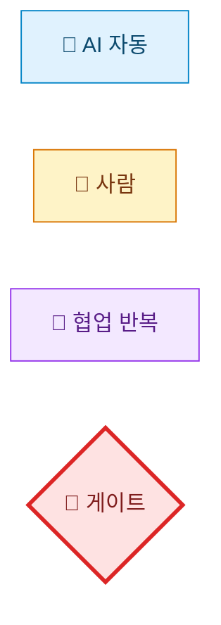
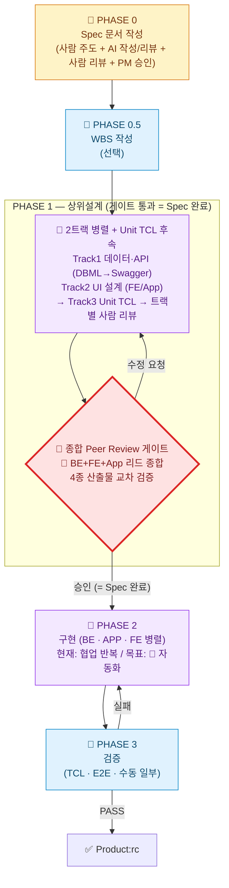
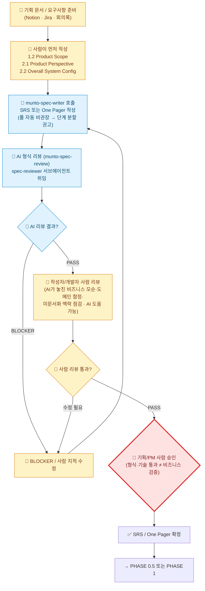
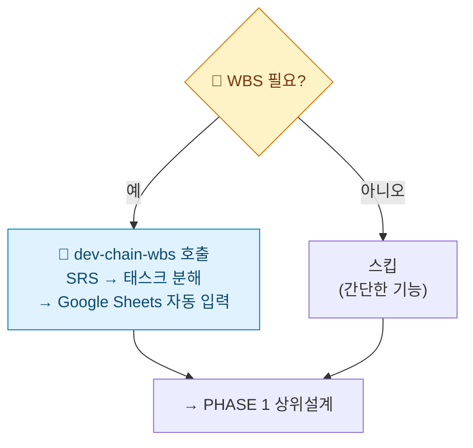
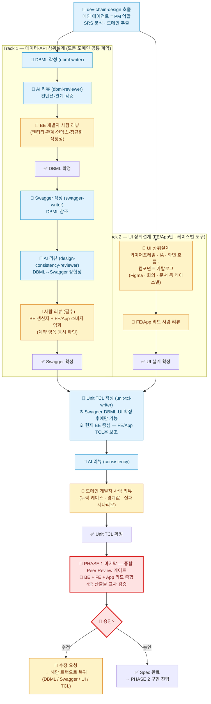
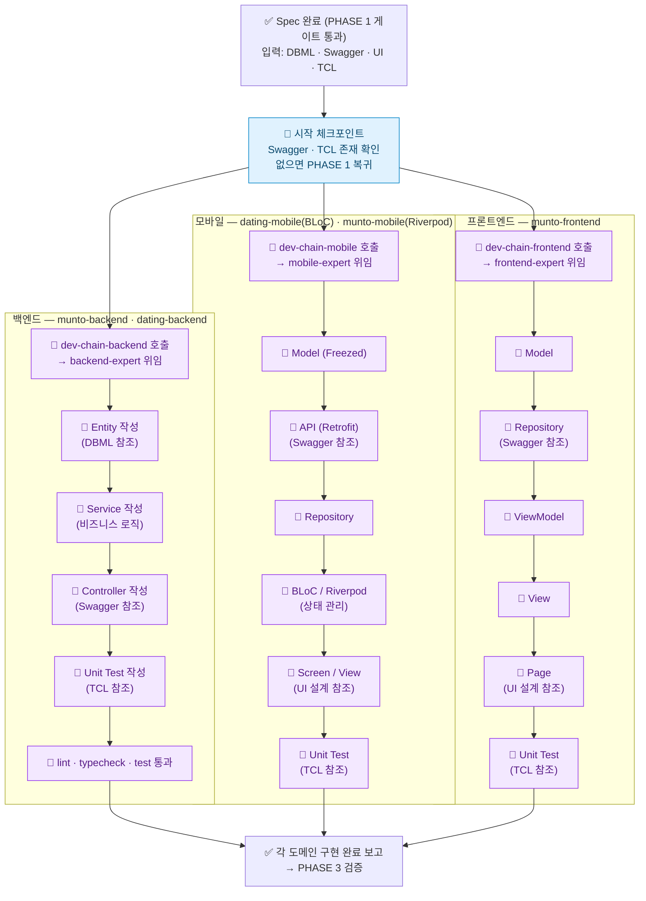
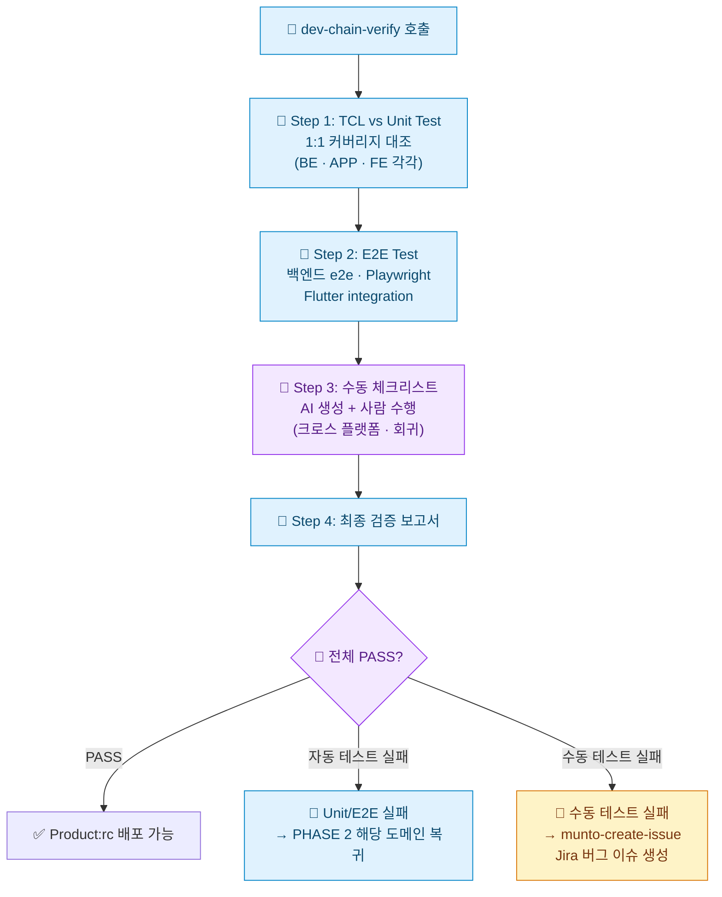

# Agentic Dev Chain — Munto 개발 자동화 프로세스 가이드 (TO-BE)

## 1. 팀 용어 정의

> **왜 이 절이 가장 먼저인가**: 팀이 동일한 용어로 소통하지 않으면 같은 단어로 다른 것을 가리키게 된다. 본 문서·후속 회의·코드 리뷰에서 사용할 핵심 명칭을 **여기서 한 번에 고정**한다.

### 1.1 Agentic Dev Chain — Munto 개발 자동화의 총칭

**Agentic Dev Chain**은 Munto 개발팀이 **AI 에이전트와 협업해 기획부터 릴리즈까지 가는 개발 자동화 방법론**을 총칭한다. 단순한 도구·레포의 이름이 아니라 **프로세스·게이트·역할 분담을 포함한 방법론 그 자체**를 가리킨다.

**진화 맥락:**

| 세대 | 명칭 | 특징 |
| --- | --- | --- |
| **v1 (~2024)** | `AI Dev Chain` | 단계별로 사람이 많이 개입하는 수작업 중심 워크플로 (참고: `AI development chain.drawio.png` legacy 자료) |
| **v2 (2025~)** | **`Agentic Dev Chain`** (본 문서) | Agentic AI · 서브에이전트 · CLI를 활용해 자동화를 극대화하고, 사람이 _반드시_ 개입해야 할 지점에 **명시적 게이트**를 둠 |

**핵심 원칙 3가지:**

1. **자동화 우선** — 가능한 모든 단계를 에이전트·CLI·파이프라인이 수행한다.
2. **전략적 HITL (Human-in-the-Loop)** — 인간 개입은 _줄이는 게 아니라 강화한다_. 비즈니스 승인·DBML/Swagger Peer Review 등은 *명시적 게이트*로 박는다.
3. **이름과 게이트의 일치** — 모든 단계·게이트가 고유한 이름을 갖는다. 팀이 동일 용어로 소통할 수 있도록 한다.

### 1.2 Agentic Dev Chain의 구성 요소 (Implementation Layer)

Agentic Dev Chain은 **방법론(본 문서)** 과, 그것을 실현하는 **여러 구현 요소(Implementation Layer)** 가 함께 떠받치는 구조다. 방법론과 구현 요소는 **1:N 관계**다.

```
Agentic Dev Chain (방법론 · 총칭)
│
├─ 프로세스 정의 (this document)
│   └─ Phase 0 → 0.5 → 1 → Peer Review Gate → 2 → 3
│
└─ 구현 요소 (Implementation Layer)
    ├─ ✅ munto-dev-assistant  (현재 운영 중)
    │   ├─ Agent Configuration 레포
    │   ├─ Skills · Rules · Subagents · Commands · Adapters
    │   └─ Claude · Cursor · Codex 환경에서 동작
    │
    └─ 🚧 추가 예정 요소
        ├─ OpenClaw 등 24시간 무인 실행 서비스
        ├─ CI 통합 (어댑터 검증, 평가 자동화)
        └─ 회귀 시나리오 자동 평가 시스템 등
```

| 구성 요소 | 카테고리 | 역할 | 현재 상태 |
| --- | --- | --- | --- |
| **Agentic Dev Chain** | **방법론(총칭)** | Munto 개발 자동화의 표준 프로세스·게이트·역할 분담 정의 | 본 문서로 정의 |
| **`munto-dev-assistant`** | 구현 요소 — _Agent Configuration 레포_ | AI 에이전트가 위 프로세스를 실행하도록 만드는 **설정 모음** (스킬·규칙·서브에이전트·어댑터) | ✅ 운영 중 |
| **OpenClaw** (예시·가칭) | 구현 요소 — _무인 실행 서비스_ | **24시간 무인 실행** 환경 (스케줄러·러너·알림·롤백 등) — Spec만 깔아 두면 야간 자동 개발·테스트를 돌릴 인프라 | 🚧 미구축 (향후 검토) |
| CI 통합 · 평가 자동화 등 | 구현 요소 — _품질 게이트 강화_ | PR 시 어댑터 검증, 골든 시나리오 회귀 테스트 등 | 🚧 미구축 |

**명명 원칙 (혼동 방지용 핵심 규칙):**

- **"Agentic Dev Chain"** = _방법론·개념·총칭_. 외부 발표·회의·문서 머리말에서 쓴다.
- **`munto-dev-assistant`** = _물리적 레포(파일·설정의 모음)_ 이름. Git 클론·경로 표기 등 _구체적 산출물을 가리킬 때만_ 쓴다.
- **둘은 동의어가 아니다.** "munto-dev-assistant 프로세스"라는 표현은 잘못이다. 정확한 표현은 _"Agentic Dev Chain 프로세스"_ 또는 _"`munto-dev-assistant` 레포에 정의된 스킬"_ 처럼 카테고리를 분리해 쓴다.

### 1.3 Spec의 범위

| 포함 여부     | 산출물                                                                                                     |
| ------------- | ---------------------------------------------------------------------------------------------------------- |
| **포함**      | SRS / One Pager (문서)                                                                                     |
| **포함**      | DBML, Swagger(OpenAPI), Unit TCL (상위설계 산출물, `dev-chain-design` 결과)                                |
| **포함 기준** | 위 산출물이 **합의·완성**되고, 특히 **DBML·Swagger는 개발자 Peer Review**를 거쳤을 때 비로소 **Spec 완료** |
| 범위 밖       | 코드 수준의 세부 설계 (필요 시 팀이 범위만 정하면 됨)                                                      |

### 1.4 AS-IS에서 무엇이 빠져 있었나

AS-IS(`AGENTS.md` 기준)의 Development Chain에는 아래가 없다:

1. **SRS 작성 시 사람 주도 게이트** — "1.2·2.1·2.2를 사람이 먼저" 같은 강제 조건 없음
2. **Spec 완료 정의** — SRS 끝이 Spec 끝인지, 상위설계까지인지 불분명
3. **Peer Review 게이트** — `dev-chain-design` 후 바로 구현으로 넘어감
4. **기획/PM 사람 승인** — 형식 리뷰(`munto-spec-review`)만 있고, 비즈니스 검증 단계 없음

본 문서가 정의하는 **Agentic Dev Chain (TO-BE)** 은 위 4가지를 **명시적 단계·게이트로 추가**한다.

---

## 2. 목표 비전

1. **Spec 단계 전반**  
   SRS·원페이저·그리고 **상위설계 산출물**에 이르기까지 AI와 협업할 때는 **일회 명령이 아니라 지속적인 의논·수정 과정**으로 둔다. 합의·판단이 명확해질수록 이후 무인 실행에 넘길 **입력 품질**이 올라간다.

2. **구현부터 QA까지의 자동화 비전(목표 상태)**  
   Spec이 완결(문서 + DBML·Swagger·TCL 등 **상위설계** 및 **DBML·Swagger에 대한 개발자 Peer Review** 포함)되면, **구현·테스트·검증**까지는 **에이전트·파이프라인이 장시간 무인으로 수행**할 수 있기를 기대한다.  
   개발자는 퇴근 전에 작업을 맡겨 두고, 출근 후 에이전트가 만든 변경·테스트 결과를 검토하며 살릴 것·고칠 것만 골라 반영하는 패턴을 목표로 한다.  
   즉 **「Spec(문서와 상위설계까지) 만 제대로 깔아 두면 밤샘 자동 개발·테스트」** 에 가깝게 가는 것을 지향한다.

---

## 3. Agentic Dev Chain — 프로세스 도식 (TO-BE)

### 3.0 다이어그램 범례 (Legend)

각 노드는 **누가 일을 수행하는가**에 따라 4가지로 분류한다. 색·아이콘이 동시에 표시되며, 한 채널이 깨져도 다른 채널이 의미를 살린다.

| 아이콘 | 색 | 의미 | 예시 |
|--------|-----|------|------|
| 🤖 | 옅은 파랑 | **AI 자동** — 사람은 트리거만 하고, 실행 중 사람 개입 없음 | `dbml-writer`, `dev-chain-verify` 자동 단계 |
| 👤 | 옅은 노랑 | **사람** — 사람이 직접 작성·결정. 결과물의 책임이 사람에게 있는 경우 | SRS 1.2·2.1·2.2 작성, BLOCKER 수정 |
| 🔄 | 옅은 보라 | **협업 반복** — AI가 만들고 사람이 검토·수정 요청을 반복하는 *루프* 작업 | `dev-chain-backend/mobile/frontend` (현재 상태) |
| 🚧 | 옅은 빨강 (굵은 테두리) | **게이트** — 사람이 명시적으로 *PASS/REJECT*를 결정하는 의사결정 지점 | Peer Review 승인, 기획/PM 승인 |



> **분류 원칙**: 사람이 호출(trigger)만 하고 AI가 자율 완료하면 🤖이다. AI가 만든 결과를 사람이 *여러 번 검토·수정 요청*하는 패턴이 본질이면 🔄이다. **🔄로 표시된 노드는 "장기적으로 🤖로 옮기는 게 목표"인 백로그**이기도 하다.

### 3.1 전체 흐름 개요



> 아래에서 각 Phase를 세로형 다이어그램으로 상세히 풀어 본다.

### 3.2 PHASE 0 — Spec 문서 작성



### 3.3 PHASE 0.5 — WBS (선택)



### 3.4 PHASE 1 — 상위설계 (dev-chain-design)

> **구조 원칙**: PHASE 1은 **두 트랙이 병렬로 진행 → Unit TCL은 두 트랙이 모두 확정된 후에만 작성**된다.
> - **Track 1 — 데이터·API 상위설계** (DBML → Swagger): 모든 도메인 공통 계약. BE 생산자, FE/App 소비자.
> - **Track 2 — UI 상위설계** (와이어프레임 · IA · 화면 흐름 · 컴포넌트 카탈로그): FE/App만 해당. 케이스별 도구(Figma 등) 사용.
> - **Unit TCL**: Track 1 의 Swagger·DBML 과 Track 2 의 UI 설계가 모두 끝난 후 작성.



> **현재 한계 노트**
> - `unit-tcl-writer` 는 입력으로 SRS·Swagger·DBML 을 받기 때문에 BE 단위 테스트 시나리오에 강하다. **FE/App UI 흐름·상호작용 TCL 은 보조 산출물**로 보고, 필요 시 도메인 개발자가 직접 보강한다.
> - Track 2(UI 상위설계)는 **현재 자동화 스킬이 없다.** Figma·회의·내부 문서로 사람이 진행하며, 나중에 UI writer/reviewer 스킬이 생기면 이 칸에 추가된다.
> - **종합 Peer Review 게이트는 PHASE 1 의 마지막 단계**이지 별도 PHASE 가 아니다. AI 리뷰는 트랙 내부 단위 리뷰에서 이미 끝났고, 게이트는 **사람의 종합 정합성 결정**만 담당한다.

### 3.5 PHASE 2 — 구현 (도메인별 병렬)

> **전제**: PHASE 1 종합 Peer Review 게이트 통과 = Spec 완료. 그 전에는 PHASE 2 진입 불가.
> **구조**: BE · App · FE 3개 도메인은 **서로 다른 제품 레포에서 독립 병렬** 진행. 각 도메인은 PM(메인 에이전트) → expert 서브에이전트 위임 방식.



> 🔄 표시된 구현 단계는 **장기적으로 🤖(완전 자동화)로 옮기는 것이 목표**다. 현재는 AI 1차 구현 → 사람 검토 → 수정 요청 → 재실행의 반복 루프가 일반적.
> **자동화 진척 추적**: 도메인별로 협업 반복(🔄) 단계 수가 줄고 AI 자동(🤖) 비율이 늘어나는 것을 본 다이어그램의 색 변화로 확인할 수 있다.

### 3.6 PHASE 3 — 검증 (dev-chain-verify)



---

## 4. 단계별 사용법

### 4.1 PHASE 0 — Spec 문서 작성 (사람 주도)

| 단계 | 무엇을 하나 | 주체 | 사용 스킬 / 도구 | 핵심 규칙 |
| --- | --- | --- | --- | --- |
| 0-1 | **기획 정보 준비** | 👤 사람 | Notion · Jira · 기획 회의록 | **1.2 Product Scope**, **2.1 Product Perspective**, **2.2 Overall System Configuration** 을 **사람이 먼저** 작성해야 한다. AI에 통째로 맡기지 않는다. |
| 0-2 | **SRS 또는 One Pager 작성** | 🤖 AI | `munto-spec-writer` | 문서 유형(SRS/One Pager) 판별 → `spec-standard.md` + 템플릿 로드 → 대화형으로 내용 채움. **풀 자동 작성 비권장** — 사람 핵심 문단 먼저, AI가 확장. |
| 0-3 | **AI 형식 리뷰** | 🤖 AI | `munto-spec-review` | `spec-reviewer` 서브에이전트가 체크리스트(SRS A~I / One Pager A~G) 적용 → BLOCKER/WARNING/SUGGESTION 분류. **BLOCKER 시 0-2로 복귀.** *AI 리뷰는 형식·표준 정합성까지만 잡는다.* |
| 0-4 | **작성자/개발자 사람 리뷰** *(생략 불가)* | 👤 사람 | (AI 도움 가능, 결과 책임은 사람) | AI 리뷰가 **놓치는 영역**을 사람이 채운다: 비즈니스 방향과의 정합, 미문서화된 조직 의사결정, 도메인 함정, 데이터·운영 가정의 모순 등. **AI를 보조로 활용은 가능하나(예: "이 SRS에서 가정과 6장 NFR이 충돌하는지 봐줘"), 통과 여부 판단은 사람이 한다.** 지적 사항 발생 시 0-5(BLOCKER/지적 수정)로 복귀. |
| 0-5 | **BLOCKER · 사람 지적 수정** | 👤 사람 | (필요 시 AI 활용) | 0-3 AI 형식 BLOCKER와 0-4 사람 지적을 모두 수정. 수정 완료 시 0-3(재리뷰)부터 다시 흐른다. |
| 0-6 | **기획/PM 사람 승인 (게이트)** | 🚧 게이트 | (프로세스) | 형식·기술 통과 ≠ 제품 검증. **기획/PM의 비즈니스 검증 승인 필수.** 승인 없이 PHASE 1로 진행 금지. |

```
트리거 예시
  "SRS 써줘" → munto-spec-writer                    [0-2]
  "이 SRS 리뷰해줘 [Notion URL]" → munto-spec-review [0-3]
  ※ 0-4(사람 리뷰)는 스킬이 아니라 사람 작업.
     AI 도움 받을 때 예시: "이 SRS의 7장 기능과 2.4 매핑이 일관된지,
     누락된 도메인 케이스가 있는지 검토해 줘" 같이 사람이 가설을 던지고 확인.
```

### 4.2 PHASE 0.5 — WBS 작성 (선택)

| 단계  | 무엇을 하나            | 사용 스킬 / 도구 | 핵심 규칙                                                                  |
| ----- | ---------------------- | ---------------- | -------------------------------------------------------------------------- |
| 0.5-1 | **WBS 필요 여부 판단** | (대화)           | 간단한 기능이면 스킵 가능.                                                 |
| 0.5-2 | **WBS 작성**           | `dev-chain-wbs`  | SRS 기반으로 태스크 분해 → Google Sheets WBS 시트에 `gws` CLI로 자동 입력. |

```
트리거 예시
  "WBS 만들어줘" → dev-chain-wbs
```

### 4.3 PHASE 1 — 상위설계 (Spec의 일부)

> **순서 원칙**
> - **Track 1(데이터·API)** 과 **Track 2(UI)** 는 **병렬 진행 가능**.
> - **Track 1 내부는 순차**: DBML 확정 → Swagger 작성.
> - **Unit TCL 은 두 트랙이 모두 확정된 후에만** 작성 시작.

#### Track 1 — 데이터·API 상위설계 (모든 도메인 공통)

| 단계 | 무엇을 하나 | 주체 | 사용 스킬 / 도구 | 핵심 규칙 |
| --- | --- | --- | --- | --- |
| 1A-0 | **SRS 분석** | 🤖 AI | `dev-chain-design` (메인 = PM) | 도메인·엔티티·API 개요 추출. 본문 상세 분석은 서브에이전트가 한다. |
| 1A-1 | **DBML 작성** | 🤖 AI | `dbml-writer` | SRS 기반 엔티티·관계·인덱스 설계. |
| 1A-2 | **AI 형식·컨벤션 리뷰** | 🤖 AI | `dbml-reviewer` | 명명 규약, 관계 무결성, 인덱스 누락 등 검증. BLOCKER 시 1A-1 재호출(최대 2회). |
| 1A-3 | **DBML 사람 리뷰** *(필수)* | 👤 BE 개발자 | (AI 도움 가능) | 정규화 적정성, 도메인 모델 부합, 운영 비용. 확정 전까지 1A-4 진행 금지. |
| 1A-4 | **Swagger 작성** | 🤖 AI | `swagger-writer` | **1A-3 통과 후에만 시작.** DBML 참조하여 OpenAPI 3.0 생성. |
| 1A-5 | **AI 정합성 리뷰** | 🤖 AI | `design-consistency-reviewer` | DBML↔Swagger 필드·타입·관계 정합성. BLOCKER 시 1A-4 재호출. |
| 1A-6 | **Swagger 사람 리뷰** *(필수)* | 👤 BE 생산자 + FE/App 소비자 입회 | (PR · 회의) | **계약의 양쪽이 동시에 확인.** 응답 스키마·에러 코드·페이지네이션·인증 정책 등 소비자 입장에서 사용 가능한지 검증. |

#### Track 2 — UI 상위설계 (FE/App만 · 케이스별 도구)

| 단계 | 무엇을 하나 | 주체 | 사용 스킬 / 도구 | 핵심 규칙 |
| --- | --- | --- | --- | --- |
| 1B-1 | **UI 상위설계 작성** | 👤 FE/App 디자이너·개발자 | Figma · 회의 · 내부 문서 등 케이스별 | 와이어프레임, IA(정보구조), 화면 흐름, 컴포넌트 카탈로그. **현재 자동화 스킬 없음.** 케이스별 도구로 사람이 진행. |
| 1B-2 | **UI 설계 사람 리뷰** *(필수)* | 👤 FE/App 리드 | (필요 시 AI 도움) | 화면 누락, 상태 분기 누락, 디자인 토큰 일관성, 접근성 등 검토. |

#### Track 3 — Unit TCL 작성 (Track 1·2 종료 후)

| 단계 | 무엇을 하나 | 주체 | 사용 스킬 / 도구 | 핵심 규칙 |
| --- | --- | --- | --- | --- |
| 1C-1 | **Unit TCL 작성** | 🤖 AI | `unit-tcl-writer` | **선행 조건: Swagger·DBML·UI 모두 확정.** SRS·Swagger·DBML 기반으로 API별 정상·오류·경계 시나리오 도출. **현재 BE 중심 — FE/App UI TCL 은 보조 산출물.** |
| 1C-2 | **AI 리뷰** | 🤖 AI | (consistency 검토) | TCL ↔ Swagger 매핑 누락, 시나리오 중복·모순 검출. |
| 1C-3 | **사람 리뷰** *(필수)* | 👤 도메인 개발자 (BE / FE / App 각자) | (AI 도움 가능) | AI 가 놓친 도메인 함정·실패 시나리오·경계값 보강. FE/App 은 UI 상호작용 TCL 직접 추가. |
| 1C-4 | **완료 체크리스트** | (메인) | — | DBML·Swagger·UI·TCL 모두 확정 + 모든 트랙별 사람 리뷰 통과 + 저장 위치 확인. **다음은 아래 PHASE 1 마무리(종합 Peer Review 게이트).** |

```
트리거 예시
  "설계해줘"          → dev-chain-design (전체 PM)
  "DBML 만들어줘"     → dev-chain-design 의 1A-1
  "Swagger 만들어줘"  → dev-chain-design 의 1A-4 (DBML 확정 후)
  "TCL 만들어줘"      → dev-chain-design 의 1C-1 (DBML·Swagger·UI 확정 후)
```

**산출물:**

| 산출물       | 형식                  | 역할                                                        |
| ------------ | --------------------- | ----------------------------------------------------------- |
| **DBML**     | `.dbml`               | DB 스키마 정의 (Prisma 호환) — Track 1                      |
| **Swagger**  | `.yaml` (OpenAPI 3.0) | API 엔드포인트·DTO·응답 정의 — Track 1                      |
| **UI 설계**  | Figma · 문서 등       | 와이어프레임 · IA · 화면 흐름 · 컴포넌트 카탈로그 — Track 2 |
| **Unit TCL** | `.md` (마크다운 표)   | API별 테스트 시나리오 (BE 중심, FE/App 보조) — Track 3      |

#### PHASE 1 마무리 — 종합 Peer Review 게이트 *(PHASE 1 마지막 단계, Agentic Dev Chain 핵심 게이트)*

> 위 Track 1A/1B/1C 의 **트랙별 사람 리뷰**가 각 산출물 단위 검증이라면, 이 단계는 **4종 산출물 전체의 정합성·완결성**을 묶어서 보는 마지막 관문이다. 트랙별 리뷰가 통과해도 트랙 간 불일치가 있을 수 있다.
> ※ **AI 리뷰는 트랙 내부에서 이미 끝났다.** 이 게이트는 **사람의 종합 결정**만 담당한다.

| 단계 | 무엇을 하나 | 주체 | 핵심 규칙 |
| ---- | ----------- | ---- | --------- |
| 1G-1 | **종합 정합성 검토** | 👤 BE + FE + App 리드 | DBML · Swagger · UI 설계 · Unit TCL **4종 산출물을 한 자리에서** 교차 검증. 트랙 간 누락·모순 점검. |
| 1G-2 | **승인 → PHASE 2 진입** | 🚧 게이트 (사람 결정) | **승인 없이 `dev-chain-*` 구현 스킬 실행 금지.** 수정 요청 시 해당 트랙(1A/1B/1C)으로 복귀. |

> 이 게이트 통과 = **Spec 완료** = PHASE 1 종료. 이후 PHASE 2 구현 단계로 진입한다.

### 4.4 PHASE 2 — 구현 (자동화 Chain 지향, 현재는 🔄 협업 반복)

> **현재 모드(2026-05 기준)**: 구현 스킬은 **PM 모드로 expert 서브에이전트에 위임하는 형태로 설계**되어 있지만, 실제로는 AI가 1차 구현 → 사람이 검토 → 수정 요청 → 재실행이라는 **🔄 협업 반복 루프**가 일반적이다.
> **TO-BE 지향점**: PHASE 1 종합 Peer Review 게이트로 입력 품질(Spec)이 안정화되면 이 루프는 줄어들 것으로 기대한다. 장기적으로는 PHASE 2가 🤖로 옮겨가는 것이 목표이며, 그 진척은 본 문서·AS-IS의 다이어그램 색 변화로 추적한다.

**도메인별로 병렬 실행 가능** — 각각 다른 제품 레포에서 작업하므로 충돌 없음.

| 도메인 | 스킬 | 서브에이전트 | 구현 순서 | 프로젝트 |
| --- | --- | --- | --- | --- |
| **백엔드** | `dev-chain-backend` | `backend-expert` | Entity → Service → Controller → Unit Test | `munto-backend` 또는 `dating-backend` |
| **모바일** | `dev-chain-mobile` | `mobile-expert` | Model(Freezed) → API(Retrofit) → Repository → BLoC/Riverpod → Screen/View → Unit Test | `dating-mobile`(BLoC) 또는 `munto-mobile`(Riverpod) |
| **프론트엔드** | `dev-chain-frontend` | `frontend-expert` | Model → Repository → ViewModel → View → Page → Unit Test | `munto-frontend` |

**공통 흐름** (3개 도메인 모두 동일):

1. **시작 전 체크포인트** — Swagger·TCL 존재 확인. 없으면 `dev-chain-design` 안내.
2. **메인(PM)이 expert 서브에이전트에 위임** — Swagger·TCL·프로젝트 경로를 전달.
3. **Expert가 자체 컨텍스트에서 순서대로 구현** — 해당 스킬 SKILL.md + 규칙(`rules/`) Read → 코드 작성 → 자체 검증(lint·typecheck·test).
4. **결과를 메인이 사용자에게 보고.**

```
트리거 예시
  "이 Swagger로 백엔드 구현해줘" → dev-chain-backend
  "Flutter 구현해줘" → dev-chain-mobile
  "프론트 개발해줘" → dev-chain-frontend
```

### 4.5 PHASE 3 — 검증

| 단계 | 무엇을 하나                     | 사용 스킬 / 도구   | 핵심 규칙                                                                                     |
| ---- | ------------------------------- | ------------------ | --------------------------------------------------------------------------------------------- |
| 3-1  | **TCL 기반 Unit Test 커버리지** | `dev-chain-verify` | TCL의 BE/APP/FE 항목과 실제 테스트 케이스를 **1:1 대조**. 미구현이면 해당 도메인 스킬로 복귀. |
| 3-2  | **E2E Test**                    | `dev-chain-verify` | 백엔드 e2e · Playwright(FE) · Flutter integration test. 자동화 불가 케이스는 3-3으로.         |
| 3-3  | **수동 테스트 체크리스트**      | `dev-chain-verify` | 크로스 플랫폼·회귀 항목 생성. 수동 실패 시 Jira 버그 이슈 생성(`munto-create-issue`).         |
| 3-4  | **최종 검증 보고서**            | `dev-chain-verify` | 전체 PASS → **Product:rc 배포 가능**. 실패 → 해당 도메인 스킬 재실행 → 재검증.                |

```
트리거 예시
  "검증해줘" → dev-chain-verify
  "QA 해줘" → dev-chain-verify
  "릴리즈 준비해줘" → dev-chain-verify
```

**실패 시 복귀 흐름:**

```
테스트 실패
  ├── Unit Test 실패  → dev-chain-backend / mobile / frontend 로 돌아가 수정
  ├── E2E 실패       → 해당 도메인 스킬로 돌아가 수정
  └── 수동 테스트 실패 → munto-create-issue 로 Jira 버그 이슈 생성
```

---

## 5. 전체 프로세스 요약 (한눈에 보기)

```
┌─────────────────────────────────────────────────────────────────────┐
│ PHASE 0  기획 → SRS/OnePager 작성 → AI 리뷰 → 사람 리뷰 → PM 승인  │
│          (munto-spec-writer → munto-spec-review → 사람 리뷰)       │
│          ※ 1.2·2.1·2.2는 사람이 먼저 작성                          │
│          ※ 사람 리뷰는 생략 불가 (AI 도움 가능)                     │
├─────────────────────────────────────────────────────────────────────┤
│ PHASE 0.5  WBS 작성 (선택, 간단하면 스킵)                           │
│            (dev-chain-wbs → Google Sheets)                         │
├─────────────────────────────────────────────────────────────────────┤
│ PHASE 1  상위설계 (Spec 완료까지)                                    │
│  ┌─ Track 1 (데이터·API, 모든 도메인 공통, 순차)                    │
│  │   DBML(AI) → AI리뷰 → 👤사람리뷰 → 확정                          │
│  │     → Swagger(AI) → AI리뷰 → 👤BE+FE/App 입회 리뷰 → 확정        │
│  ├─ Track 2 (UI, FE/App만, 케이스별)                                │
│  │   👤Figma·IA·상태도·컴포넌트 카탈로그 → 👤FE/App 리드 리뷰        │
│  ├─ Track 3 (Unit TCL, Track 1·2 종료 후)                          │
│  │   Unit TCL(AI, BE 중심) → AI리뷰 → 👤도메인 개발자 리뷰          │
│  └─ 🚧 PHASE 1 마무리 — 종합 Peer Review 게이트                      │
│       👤 BE+FE+App 리드 종합 (4종 산출물 교차 검증)                  │
│       ✅ 승인 = 「Spec 완료」 → PHASE 2 진입                          │
├─────────────────────────────────────────────────────────────────────┤
│ PHASE 2  구현 (도메인별 병렬 가능)                                  │
│  ┌─ BE:  Entity → Service → Controller → Unit Test                │
│  ├─ APP: Model → API → Repo → BLoC/Riverpod → Screen → Test      │
│  └─ FE:  Model → Repo → ViewModel → View → Page → Test           │
├─────────────────────────────────────────────────────────────────────┤
│ PHASE 3  검증                                                      │
│  TCL 커버리지 → E2E → 수동 체크리스트 → 보고서                     │
│  PASS → Product:rc  |  FAIL → PHASE 2 복귀                        │
└─────────────────────────────────────────────────────────────────────┘
```

---

## 6. AS-IS와 Agentic Dev Chain(TO-BE) 비교

| 항목 | AS-IS (현재 AGENTS.md) | Agentic Dev Chain (TO-BE, 본 문서) |
| --- | --- | --- |
| **총칭(이름)** | 불명확. "Development Chain" 또는 "munto-dev-assistant" 혼용 | **`Agentic Dev Chain`** — 방법론·총칭으로 고정. `munto-dev-assistant`는 그 _구현 요소 중 하나_ |
| **SRS 작성** | `munto-spec-writer`로 한 번에 풀 작성 가능 | 사람이 1.2·2.1·2.2 먼저 → AI 확장 (풀 자동 비권장) |
| **SRS 검증** | `munto-spec-review` AI 형식 검수만 | AI 형식 리뷰 → **작성자/개발자 사람 리뷰(생략 불가)** → **기획/PM 사람 승인** 3단 게이트 |
| **상위설계 구조** | DBML·Swagger·TCL 3종 **동시 팬아웃**, 트랙·UI 구분 없음 | **2트랙 병렬 + Unit TCL 후속** — Track1 데이터·API(DBML 확정 → Swagger), Track2 UI 설계(FE/App), Track3 Unit TCL(두 트랙 종료 후) |
| **DBML / Swagger 작성 순서** | 같은 메시지에서 병렬 생성 (정합성은 사후 reviewer 의존) | **DBML 사람 확정 후 Swagger 시작** (선후 의존성 명시) |
| **Swagger 사람 리뷰 참여자** | 명시 없음 | **BE 생산자 + FE/App 소비자 입회 필수** (계약 양쪽 동시 확인) |
| **UI 상위설계** | 프로세스에 부재 | **Track 2로 명시** — Figma·IA·상태도·컴포넌트 카탈로그. 현재 자동화 스킬 없어 사람이 진행, 자리만 박아둠 |
| **Unit TCL 작성 시점** | 다른 산출물과 같이 팬아웃되어 동시 생성 | **Swagger·DBML·UI 모두 확정된 후에만 시작** — 입력 품질이 안정된 후 풍부한 TCL 도출 |
| **Spec 완료 정의** | 불명확 (SRS 끝 = Spec 끝?) | **SRS + 2트랙 상위설계 + Unit TCL + 종합 Peer Review = Spec 완료** |
| **Peer Review 게이트 위치** | 별도 단계로 모호하게 떠 있음 | **PHASE 1 의 마지막 단계로 명확히 박힘** (별도 PHASE 아님) |
| **PHASE 2(구현)와 게이트 관계** | 한 다이어그램에 섞여 게이트가 PHASE 2 입구처럼 보임 | **게이트는 PHASE 1 내부 종료, PHASE 2(구현)는 완전히 별도 다이어그램** |
| **설계 → 구현 전환** | reviewer PASS 후 바로 구현 진입 | **PHASE 1 게이트 승인** 후에만 PHASE 2 진입 |
| **무인 야간 실행 인프라** | 없음 (사람이 시작·종료) | **OpenClaw 등 24시간 무인 실행 서비스**를 구현 요소로 추가 검토 |
| **실패 복귀** | 동일 | 동일 |

---

## 7. 관련 문서 안내

| 문서                                                           | 쓰임                                                                               |
| -------------------------------------------------------------- | ---------------------------------------------------------------------------------- |
| [AS-IS 분석](./2026-05-harness-AS-IS.md)                       | `munto-dev-assistant`의 **현재 상태(Agentic Dev Chain v1 잔재 포함)** 분석과 비판. |
| [학습 가이드](./2026-05-harness-learning-guide.md)             | `munto-dev-assistant` 레포를 **스스로 이해·분석**하기 위한 학습 로드맵.            |
| **본 문서**                                                    | **`Agentic Dev Chain`** 의 TO-BE 프로세스·다이어그램·단계별 사용법·구성 요소 계층. |
| [팀 개발자 브리핑](../2026-05-harness-team-developer-brief.md) | **문제·개선 로드맵·교육/온보딩**을 동료에게 공유할 때 사용.                        |

---

## 변경 이력

| 일자 | 내용 |
| --- | --- |
| 2026-05-18 | AS-IS 분석에서 TO-BE 내용(프로세스 다이어그램·단계별 가이드·Peer Review 게이트·Spec 정의·목표 비전) 분리하여 신규 작성 |
| 2026-05-18 | AS-IS vs TO-BE 비교 표(§6) 추가, 문서 간 교차 참조 정리 |
| 2026-05-18 | 파일명 `2026-05-harness-TO-BE.md`로 변경, 학습 가이드 문서 참조 추가 |
| 2026-05-19 | **`Agentic Dev Chain` 명칭 도입** — Munto 개발 자동화의 총칭으로 고정. §1.1 총칭 정의 + §1.2 구성 요소 계층(`munto-dev-assistant` ✅운영중 / OpenClaw 등 🚧예정) 신설. 기존 §1.1·1.2를 §1.3·1.4로 재번호. 문서 제목·§3·§4.4·§6·§7을 새 명칭으로 동기화. **명명 원칙(방법론 vs 레포 분리)** 명시 |
| 2026-05-19 | **다이어그램 4-카테고리 분류 도입** — §3.0 범례 신설 (🤖 AI 자동 / 👤 사람 / 🔄 협업 반복 / 🚧 게이트). §3.1~3.6 6개 다이어그램에 색·아이콘·`classDef` 일괄 적용. §4.5 PHASE 2 서술에 *현재 🔄 협업 반복 / 목표 🤖 자동화* 노트 추가. `dev-chain-backend/mobile/frontend`는 현재 실태를 반영해 🔄로 표시 |
| 2026-05-19 | **PHASE 0에 작성자/개발자 사람 리뷰 단계(0-4) 추가** — AI 형식 리뷰(0-3) → 사람 리뷰(0-4, 생략 불가) → BLOCKER/지적 수정(0-5) → 기획/PM 승인 게이트(0-6) 순으로 재구성. §3.2 다이어그램에 `A4b`(사람 리뷰) + `A4c`(통과 결정) 노드 추가. AI가 놓치는 비즈니스 모순·도메인 함정을 사람이 채운다는 책임 분리 명시. 사람 리뷰 시 AI 보조 활용은 허용하되 통과 판단은 사람 책임으로 못박음 |
| 2026-05-19 | **PHASE 1 상위설계를 2트랙 + Unit TCL 후속 구조로 전면 개편** — 기존 "3종 동시 팬아웃 + 사후 reviewer" 구조 폐기. Track 1(데이터·API: DBML→Swagger, 순차) / Track 2(UI: FE/App, 케이스별 사람 도구) / Track 3(Unit TCL: 두 트랙 종료 후) 로 분리. 각 산출물마다 **AI 작성 → AI 리뷰 → 👤 사람 리뷰 → 확정** 4단 흐름 적용. Swagger 사람 리뷰에 **BE 생산자 + FE/App 소비자 입회 필수** 명시. **Unit TCL은 Swagger·DBML·UI 확정 후에만 시작** 의존성 명시 + 현재 BE 중심·FE/App 보조 한계 노트. §3.4 다이어그램(서브그래프 2개), §3.1 전체 흐름 PHASE 1 노드, §3.5 게이트 명칭, §4.3 단계 표(Track 1A/1B/1C 분리), §4.4 종합 게이트 정의, §5 한눈에 보기 박스, §6 비교 표 6행 보강 모두 동기화 |
| 2026-05-19 | **Peer Review 게이트의 위치를 PHASE 1 내부로 명확화 + PHASE 2 구현을 단독 다이어그램으로 분리** — 기존 §3.5 "Peer Review 게이트 + PHASE 2 구현" 한 묶음에서 게이트가 별도 PHASE 처럼 보이고 구현이 가려지던 문제 해결. ① §3.4 PHASE 1 다이어그램 끝에 게이트 결정 분기(승인/수정 요청 + Spec 완료 노드) 추가하여 게이트가 PHASE 1 의 마지막 단계임을 시각화. ② §3.5 를 **PHASE 2 구현 단독** 다이어그램으로 통째 교체 — BE/App/FE 3개 도메인 각 단계(Entity/Service/Controller 등)를 서브그래프로 펼침, 시작 체크포인트와 자체 검증(lint·typecheck·test) 노출. ③ §3.1 전체 흐름에서 PHASE 1 을 서브그래프로 감싸 게이트 포함을 강조. ④ §4.4(기존 별도 게이트 표)를 §4.3 의 #### "PHASE 1 마무리 — 종합 Peer Review 게이트" 하위 섹션으로 통합 (1G-1, 1G-2). ⑤ 기존 §4.5(PHASE 2)→§4.4, §4.6(PHASE 3)→§4.5 재번호. ⑥ §5 한눈에 보기 박스에서 게이트를 PHASE 1 박스 안으로 흡수. ⑦ §6 비교 표에 "게이트 위치" / "PHASE 2와 게이트 관계" 2행 추가. **AI 리뷰는 트랙 내부 단위 리뷰까지, 게이트는 사람의 종합 결정**이라는 책임 분리 명시 |
