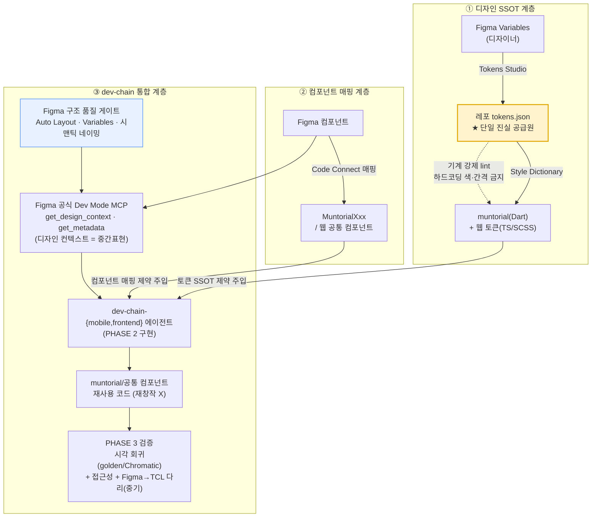

# UI 디자인 → 코드 자동화 전략 (Figma → Flutter / Web) — munto-dev-assistant 통합안

> **목적**: Figma 디자인을 Flutter App / Next.js Web 코드로 *반복 수정 없이* 자동 전환하는 파이프라인을 **munto-dev-assistant 하네스에 녹이는 방법**을 정한다.
> **작성일**: 2026-06-05 · **상태**: 제안 (Draft) · **연관**: TO-BE §3.6(UI 자동화 숙제) · §4.7.9(harness-engineering)

---

## 0. 한 줄 결론

**"Figma to Flutter" 자동화의 마스터 키는 *변환 SaaS 툴*(Builder.io·Locofy)이 아니라, 이미 우리 하네스 안에 있는 AI 에이전트에게 *정제된 제약 3종*을 레포 안에서 주입하는 것이다.**

1. **디자인 토큰 단일 진실 공급원(SSOT)** — Figma Variables ↔ 레포 `tokens.json` ↔ muntorial/웹 토큰을 *한 소스에서 생성*

> **용어 주의 — "토큰" 두 가지**: 본 문서의 *디자인 토큰* 은 *색·간격·타이포 등 UI 값을 이름 붙인 변수*(예: `MuntorialColors.primary`)다. LLM 서비스가 소비하는 **과금·컨텍스트 단위 "LLM 토큰"** 과는 *전혀 다른 개념* — 단어만 같다. 별도 표기가 없으면 "토큰" = 디자인 토큰. LLM 쪽은 §3.4 에서 "LLM 토큰(과금 단위)" 으로 따로 표기한다.
2. **컴포넌트 매핑** — Figma 컴포넌트 ↔ `MuntorialXxx` / 웹 공통 컴포넌트를 *Figma Code Connect* 로 기계 연결
3. **Figma 구조 품질 + 기계 강제** — Auto Layout·Variables·시맨틱 네이밍을 규칙화하고, 토큰 하드코딩을 lint 로 차단

이는 §4.7.9 harness-engineering 원칙(*레포 = 단일 진실 공급원*, *문서 규칙 < 기계 강제*)을 UI 영역에 그대로 적용한 것이다. 외부 변환 툴은 *드리프트·벤더 락인* 때문에 **보조 가속기**로만 둔다.

---

## 1. 문제 정의 — 무엇이 반복 수정을 만드는가

### 1.1 사용자가 겪는 증상

| 영역 | 증상 | 근본 원인 |
|------|------|-----------|
| Flutter App | Figma 디자인 속성이 AI 를 거쳐도 Flutter 로 매끄럽게 안 넘어와 *반복 수정* | ① Figma 레이어 구조 품질 불량(절대좌표·Auto Layout 누락) ② AI 에게 *우리 디자인 시스템 컨텍스트*가 없어 매번 새 코드 생성 |
| Web App | Claude Artifacts 는 괜찮지만 *LLM 토큰(과금 단위) 소모 과다* | 웹 채팅은 *대화가 길어질수록 과거 UI 코드 전체가 컨텍스트에 누적* → LLM 토큰 폭증 + 프로덕션 코드화 간극 |

### 1.2 우리 하네스의 현재 상태 (조사 결과)

> 상세 인용은 부록 A. 핵심만 요약.

- **설계(PHASE 1 Track 2 — UI)**: *자동화 스킬 없음*. Figma·회의로 사람(FE/App 리드)이 진행하고, 스킬은 *"UI 설계가 확정됐는지"만 확인*.
- **구현(PHASE 2)**: Figma MCP 로 **컴포넌트 이름만 추출 → `MuntorialXxx`/웹 공통 컴포넌트에 매핑 → 수동 조립**. *Figma→코드 자동 생성 단계는 없음.*
- **디자인 시스템 자산은 이미 있음**: `muntorial`(Flutter), `문토리얼`(웹), 토큰(`MuntorialColors`·`MuntorialTypography`·SCSS `const`). 규칙도 *하드코딩 금지·muntorial 우선*으로 박혀 있음.
- **검증(PHASE 3)**: UI 는 기능 테스트 일부만. *시각 회귀·접근성·Figma→TCL* 은 TO-BE §3.6 에 **남은 숙제**.
- **갭(즉시 고칠 것)**: 스킬·서브에이전트는 `get_design_context` 를 호출하라고 적혀 있으나, *현재 설치된 MCP 는 서드파티 `figma-developer-mcp`(`get_figma_data`)* — **도구명 불일치**.

**한 줄 진단**: 우리는 *디자인 시스템·매핑 규칙·MCP* 라는 재료를 이미 갖고 있는데, **(a) 토큰이 Figma↔코드로 한 소스에서 흐르지 않고, (b) 컴포넌트 매핑이 기계 연결이 아니라 이름 추측이며, (c) Figma 구조 품질이 강제되지 않아** AI 가 매번 재창작 → 반복 수정이 난다.

---

## 2. 핵심 통찰 — AI/MCP 는 코드를 "생성"하지 않는다

2026 현재 Figma→코드 도구의 실체(검증된 사실):

- **Figma MCP 는 코드 생성기가 아니라 *디자인 컨텍스트 추출기*다.** Figma 의 레이아웃·토큰·컴포넌트 트리를 *중간 표현(reference code, 기본 React+Tailwind)* 으로 내보내고, **실제 변환은 우리 AI 에이전트가 한다.** 즉 *"Figma→프롬프트 엔지니어링"* 이다. [^1][^2][^3]
- 따라서 **결과 품질 = 우리가 에이전트에게 주는 제약의 품질**이다. 절대좌표 디자인은 어떤 툴을 써도 스파게티가 되고, 디자인 시스템 컨텍스트가 없으면 매번 새 토큰을 발명한다.

> **이게 harness-engineering 과 정확히 같은 결이다(§4.7.9)**: *"레포에 없으면 존재하지 않는다"* — 토큰·컴포넌트 매핑·Figma 구조 품질 규칙이 *레포 안에 기계가 읽을 수 있는 형태*로 없으면, AI 에게는 없는 것이고 매번 추측한다. 해법은 *더 똑똑한 SaaS* 가 아니라 *제약을 레포에 박는 것*이다.

---

## 3. 2026 솔루션 지형 (검증된 사실 + 우리 적합성)

### 3.1 Figma 공식 Dev Mode MCP + Code Connect — *우리 파이프라인의 중심 후보*

2025 년 이후 Figma 가 **공식 Dev Mode MCP 서버**를 제공한다(원격 `https://mcp.figma.com/mcp` 권장, 데스크톱판도 존재). VS Code·Cursor·Claude Code·Codex 등 MCP 클라이언트에서 사용. [^3]

핵심 역량:

- `get_design_context` — 선택 노드의 디자인 컨텍스트(레이아웃·토큰·계층)를 *프레임워크 중립 중간 표현*으로 반환(공식적으로 *"reference code"*). `get_metadata` — 노드 ID·이름·좌표 경량 조회. [^3][^4]
- **Code Connect** — *Figma 컴포넌트 ↔ 코드 컴포넌트를 직접 연결*. → **우리 `MuntorialXxx`/웹 공통 컴포넌트를 Figma 컴포넌트에 매핑하면, AI 가 새 위젯을 짜지 않고 우리 컴포넌트를 호출**한다. (반복 수정·파편화의 핵심 해결책) [^3]
- **"코드베이스에 맞춘 디자인 시스템 규칙 생성"** + "라이브 UI 를 Figma 레이어로 캡처" 지원. [^3]

> **우리 적합성: 최상.** 벤더 락인 없음(Figma 구독에 포함), 레포 안에서 동작, Code Connect 가 muntorial 매핑을 *기계화*. **현재 서드파티 MCP 를 공식 Dev Mode MCP 로 교체/병행하면 도구명 불일치(§1.2)도 동시 해소**된다.

### 3.2 디자인 토큰 SSOT — W3C DTCG + Tokens Studio + Style Dictionary

- **W3C 디자인 토큰(DTCG) 명세가 2025.10 첫 안정 버전**에 도달(`$value`/`$type` JSON, 벤더 중립, 테마·P3/Oklch 색·별칭 지원). Style Dictionary·Tokens Studio·Supernova 등이 구현. [^5][^6]
- 파이프라인: **Figma Variables → Tokens Studio 플러그인 → 레포의 `tokens.json`(SSOT) → Style Dictionary → 플랫폼별 출력**(CSS 변수·Tailwind config·**Flutter/Dart**·iOS/Android). [^6][^7][^8]
- 주의: Style Dictionary 의 Flutter `TextStyle` 같은 복합 토큰 지원이 제한적일 수 있어 `figma2flutter`·`tokensync` 같은 브리지를 쓰기도 함. [^8]

> **우리 적합성: 최상.** *Figma 색/간격/타이포 = 코드 토큰* 이 한 소스에서 생성되면, **색·간격·타이포 반복 수정이 구조적으로 사라진다**(가장 흔한 수정 원인). `muntorial` 토큰을 이 출력으로 *생성*하도록 바꾸는 게 목표. "레포 = 단일 진실 공급원" 원칙의 UI 판.

### 3.3 서드파티 변환 SaaS — *보조 가속기로만*

| 툴 | 강점 | 우리 맥락 리스크 | 권고 |
|----|------|------------------|------|
| **Builder.io (Visual Copilot)** | Mitosis 컴파일러+LLM, *기존 디자인 시스템 컴포넌트에 시맨틱 매핑*, Flutter 지원 [^9][^11] | **출력이 Builder SDK 런타임에 결합 = 벤더 락인**(표준 코드로 떼어내기 어려움) [^10][^12] | 코어 파이프라인 ❌ / 신규·실험 화면 가속 △ |
| **Locofy.ai** | 깔끔한 모듈형 Flutter/RN 코드, CSS Modules [^9][^11] | *point-in-time 내보내기(스냅샷)* → 디자인 변경 시 재export, *코드 토큰과 평행 토큰 시스템* 생성(드리프트) [^10][^13] | 디스포저블/랜딩 △ / 프로덕션 코어 ❌ |
| **Anima** | 가장 빠른 프로토타이핑 | *div 수프*(깊은 중첩), 프로덕션 정제 비용 큼 [^10][^13] | 프로토타입/검증용만 △ |
| **Figma Dev Mode MCP** | 락인 없음, 레포 내 동작, Code Connect | (코드 생성 아님 — 에이전트가 변환) | **코어 ✅** |

> **결론**: 서드파티 SaaS 는 모두 *드리프트(스냅샷·평행 토큰)* 또는 *락인(런타임)* 을 동반해 우리 harness 원칙과 충돌한다. **코어는 Figma 공식 MCP + 토큰 SSOT + 우리 에이전트**로 가고, Builder/Locofy 는 *일회성 가속기*로만 선택 사용한다.

### 3.4 Web App — LLM 토큰(과금 단위) 낭비, 이미 우리가 답을 갖고 있다

> 여기서 "토큰"은 *LLM 서비스가 소비하는 과금·컨텍스트 단위*다(§0 용어 주의 — 디자인 토큰과 무관).

Claude Artifacts(웹 채팅)의 LLM 토큰 폭증 원인은 *세션에 과거 UI 코드가 누적*되기 때문. 해법은 **레포 안에서 파일 단위 컨텍스트로 작업하는 IDE 에이전트**(Cursor / Claude Code) + *컨벤션 주입 문서*. [^1]

> **우리는 이미 이 구조다**: Cursor + `AGENTS.md`/`.agents/rules` 로 *in-repo·파일 단위* 작업 중. 추가 레버는 (a) **토큰 SSOT** 로 "정의된 토큰만 쓰게" 제약, (b) 웹 공통 컴포넌트 매핑. 즉 *별도 도구 도입이 아니라 제약 강화*가 답.

---

## 4. munto-dev-assistant 통합 아키텍처 (제안)

세 계층으로 정리:

1. **디자인 SSOT 계층** — 토큰을 한 소스에서 생성(§3.2). *색·간격·타이포 반복수정 제거.*
2. **컴포넌트 매핑 계층** — Code Connect 로 Figma↔코드 컴포넌트 기계 연결(§3.1). *AI 재창작 제거.*
3. **dev-chain 통합 계층** — 설계·구현·검증 스킬에 위 두 계층을 *제약으로 주입* + Figma 구조 품질 게이트 + UI 검증.

---

## 5. 실행 로드맵 — 우리 하네스 어디를 바꾸나

> 원칙: *새 SaaS 도입 최소화 · 레포에 제약을 박고 · 기계로 강제*. 각 항목에 **바꿀 파일/스킬** 명시.

### P0 — 즉시 (이번 분기, 저비용·고효과)

| # | 액션 | 바꿀 위치 |
|---|------|-----------|
| P0-1 | **Figma 공식 Dev Mode MCP 도입/병행** + 스킬·서브에이전트의 `get_design_context`/`get_figma_data` *도구명 정합* | `.cursor/mcp.json` · `dev-chain-mobile`·`dev-chain-frontend` SKILL · `mobile-expert`·`frontend-expert` |
| P0-2 | **Figma 구조 품질 규칙 문서화** — Auto Layout 필수·Variables 사용·컴포넌트화·시맨틱 네이밍을 *handoff 전 게이트*로 | `dev-chain-design` Track 2 + `document/dev-process-guide.md` PHASE 1 |
| P0-3 | **토큰 하드코딩 기계 강제 확인** — 색/간격/타이포 하드코딩 차단 lint 가 제품 레포에 실제 박혀 있는지 점검(없으면 백로그) | `.agents/rules/frontend/nextjs.md`·`mobile/flutter.md` (정책) + 제품 레포 PR(구현) |

### P1 — 단기 (토큰 SSOT 구축)

| # | 액션 | 바꿀 위치 |
|---|------|-----------|
| P1-1 | **`tokens.json`(W3C DTCG) SSOT + Style Dictionary 파이프라인** 구축 → muntorial/웹 토큰을 *생성물*로 전환 | 제품 레포(muntorial·웹) + 파이프라인 스킬 신설 검토 |
| P1-2 | **Code Connect 매핑 테이블** — 주요 Figma 컴포넌트 ↔ `MuntorialXxx`/웹 공통 컴포넌트 연결 | 제품 레포 Code Connect 정의 + `muntorial-mobile` 스킬에 매핑 인덱스 |

### P2 — 중기 (설계·검증 자동화 빈자리 메우기)

| # | 액션 | 바꿀 위치 |
|---|------|-----------|
| P2-1 | **UI writer/reviewer 스킬 신설** — Track 2 의 *자동화 스킬 부재* 해소(화면흐름·컴포넌트 카탈로그 초안+리뷰) | `.agents/skills` 신설 + `dev-chain-design` Track 2 칸 |
| P2-2 | **Figma → TCL 다리** — Figma 변경이 UI 테스트 케이스로 반영(TO-BE §3.6 장기과제 착수) | `unit-tcl-writer` · `dev-chain-verify` |

### P3 — 장기 (UI 검증 자동화)

| # | 액션 | 바꿀 위치 |
|---|------|-----------|
| P3-1 | **시각 회귀** — 웹 Chromatic/Percy, 모바일 golden + Test Lab | `dev-chain-verify` §3.6 |
| P3-2 | **자연어 UI 회귀** — Cursor browser MCP·flutter-driver-mcp 확장(legibility, §4.7.9) | `flutter-driver-mcp` · `dev-chain-verify` |

---

## 6. 의사결정 요약 (권고 + 미채택 사유)

| 결정 | 권고 | 사유 |
|------|------|------|
| Figma→코드 *코어* | **Figma 공식 Dev Mode MCP + Code Connect + 우리 에이전트** | 락인 없음·레포 내 동작·매핑 기계화. harness 원칙 정합 |
| 토큰 관리 | **W3C DTCG `tokens.json` SSOT + Style Dictionary** | Figma↔코드 토큰 한 소스 → 반복수정 구조적 제거 |
| Builder.io / Locofy / Anima | **코어 미채택**, 신규·디스포저블 화면 *선택 가속기* | 벤더 락인(Builder) / 스냅샷·평행 토큰 드리프트(Locofy) / div 수프(Anima) |
| Web LLM 토큰(과금) 낭비 | **현 harness(Cursor + AGENTS.md/rules) 유지 + 디자인 토큰 SSOT 강화** | 이미 in-repo 파일 단위 작업 — 별도 도구 불필요 |

---

## 7. 리스크 · 전제

- **디자이너 협업이 전제다.** Auto Layout·Variables·컴포넌트화·시맨틱 네이밍이 안 되면 어떤 자동화도 스파게티를 만든다. *디자인 구조 품질을 handoff 게이트로 강제*해야 한다(P0-2).
- **드리프트 경계.** 서드파티 스냅샷 export·평행 토큰은 *원본과 어긋남*을 낳는다 → 토큰은 SSOT 한 곳에서만.
- **MCP 는 변환을 자동완성하지 않는다.** 컨텍스트 추출일 뿐, 비즈니스 로직·상태·반응형은 여전히 에이전트+사람 몫.
- **risk-tier 유지.** UI 자동화가 인증·결제 화면을 건드리면 사람 게이트(§4.7.6) 그대로.

---

## 8. Action Items (담당 후보)

1. **Figma 공식 Dev Mode MCP 전환 + 스킬 도구명 정합** — 모바일/프론트 리드 (P0-1)
2. **Figma 구조 품질 handoff 게이트 정의** — 디자이너 + FE/App 리드 (P0-2)
3. **토큰 하드코딩 lint 점검·보강** — 각 제품 레포 담당 (P0-3)
4. **`tokens.json` SSOT + Style Dictionary PoC** — 디자인 시스템 담당 (P1)
5. **Code Connect 매핑 PoC(상위 10개 컴포넌트)** — muntorial 담당 (P1-2)
6. **Flutter vs React Native AI 자동화 PoC 실측** — 모바일 리드 + 아키텍트 (§9) — *차기 그린필드 앱 한정*

> 합의되면 본 보고서를 TO-BE §3.6 보강 + `dev-chain-design`/`dev-chain-mobile`/`dev-chain-frontend` 스킬 반영으로 잇는다.

---

## 9. 프레임워크·도구 중립성 (장기 관점)

> "Figma가 최종 정답이 아니라면 갈아탈 수 있나" + "Flutter가 AI 자동화 걸림돌이면 차기 앱을 React Native(RN)로?" 두 질문에 대한 전략 정리.

### 9.1 Figma는 이미 "교체 가능"하다 — 토큰 SSOT 덕분

진실의 원천을 *Figma가 아니라 레포의 `tokens.json`(W3C DTCG 표준)* 에 두므로(§3.2), Figma는 *현재 쓰는 편집기*일 뿐 갈아끼울 부품이 된다. DTCG는 벤더 중립이라 **Penpot·Sketch·Framer·Figma가 같은 포맷을 공유**한다. [^5][^6]

> **결론**: *Figma에 베팅하지 말고 토큰·컴포넌트 계약 레이어에 베팅한다.* 그러면 더 나은 도구가 나와도 SSOT는 그대로 두고 편집기만 교체할 수 있다(harness 원칙: 레포 = 단일 진실 공급원).

### 9.2 "Flutter = AI 자동화 걸림돌"은 절반만 맞다

**진짜 병목은 프레임워크가 아니라 제약 레이어(토큰 SSOT·컴포넌트 매핑·구조 품질) 부재다**(§1.2). RN으로 바꿔도 이 셋은 그대로 남는다 — "RN 가면 자동화가 풀린다"는 오진.

다만 *실재하는 비대칭*도 분명하다:

| 축 | Flutter / Dart | React Native / TS |
|----|------|------|
| LLM 학습 데이터량 | 적음 → 환각·옛 API 빈번 | **압도적으로 많음** → 정확도↑ |
| Design-to-code 생태계 | 후순위(Builder/Locofy 보조) | **1순위** — 대부분 React 우선 |
| Figma MCP 중간표현 | 변환 필요 | **React+Tailwind가 네이티브**(get_design_context 출력 그대로) [^4] |
| 웹/E2E 도구 공유 | 별도 | RN↔Web 상당 부분 공유 |

→ *"AI 자동화 극대화"* 만 보면 React 계열이 **구조적으로 유리**한 건 사실이다(에이전트가 더 유창한 언어를 환경으로 고르는 것 = 정당한 harness-engineering 판단, §4.7.9).

### 9.3 공짜가 아니다 (RN 전환 비용)

- **muntorial(Flutter 디자인 시스템 패키지) 통째 재구축** — 우리 자동화의 핵심 자산인데 RN엔 못 씀.
- 기존 `dating-mobile`·`munto-mobile` 2개 앱 + 팀 Flutter/BLoC/Riverpod 숙련도 매몰.
- **두 스택 동시 운영 비용**(신규 RN + 기존 Flutter 병행 유지).
- RN 고유 통증(네이티브 모듈 파편화·업그레이드 churn).

### 9.4 권고

1. **기존 앱은 마이그레이션하지 않는다** — ROI 미달. 진짜 병목(토큰·매핑·구조 품질)을 메우면 Flutter에서도 자동화가 크게 개선된다.
2. **차기 그린필드 앱이면 RN 검토는 정당** — 매몰비용이 없어 계산이 달라진다. 단 *감이 아니라 PoC 실측으로 결정*.
3. **무엇을 고르든 토큰 SSOT(DTCG)부터** — 프레임워크 중립이라 어느 쪽도 손해 없고 RN 결정 리스크도 낮춘다.
4. **RN 채택 시 *장기 스택 단일화 로드맵* 동반** — 두 스택 무기한 운영은 운영비 폭증.

### 9.5 PoC 측정 계획 (Action Item 6)

같은 Figma 화면 1~2개를 동일 조건에서 양쪽으로 자동 생성해 *숫자로* 비교한다.

| 항목 | ⓐ Flutter (토큰 SSOT + Code Connect 적용) | ⓑ React Native |
|------|------|------|
| 측정 지표 | 반복 수정 횟수 · 소요 시간 · 코드 품질(리뷰 지적 수) · 디자인 충실도 | 동일 |
| 목적 | *"Flutter가 진짜 병목인가, 제약 레이어 부재였나"* 를 가린다 | |
| 판정 | 델타가 크면 차기 앱 RN, 작으면 Flutter 유지 + 제약 레이어 강화 | |

> **핵심 메시지**: Figma 탈피는 토큰 SSOT로 이미 대비됨. RN은 *기존 앱 이전*엔 ❌, *차기 그린필드 앱*엔 ✅ 검토 가치 — 단 매몰비용·muntorial 재구축·**실측**을 전제로.

---

## 부록 A. 우리 하네스 현황 인용 (요약)

- `dev-chain-design` Track 2: *"Track 2(UI 상위설계)는 현재 자동화 스킬이 없다. Figma·회의·내부 문서로 사람(FE/App)이 진행하며, 본 스킬은 그 확정 여부만 확인한다."*
- `dev-chain-mobile`: *"Figma 링크가 제공된 경우 Figma MCP(`get_design_context`)로 컴포넌트 목록을 먼저 추출 … 디자이너는 `muntorial` 패키지 기반 → Figma 컴포넌트 이름이 `MuntorialXxx` 클래스와 대응."*
- `dev-chain-frontend`: *"Figma MCP 로 컴포넌트 목록 추출 → `components/`·`lib/view/common/` 매핑 → 매핑된 것은 재사용, 안 된 것만 신규."* 토큰: `MuntorialColors`·`MuntorialTypography`·SCSS `const`(하드코딩 금지).
- 설치된 MCP: 서드파티 `figma-developer-mcp` — 도구 `get_figma_data`(디자인 데이터 조회)·`download_figma_images`(에셋). **코드 생성 도구 없음, 스킬이 부르는 `get_design_context` 와 이름 불일치.**
- TO-BE §3.6: 시각 회귀·접근성·자연어 UI 회귀·*Figma→TCL* = **남은 숙제**(단기 시각회귀 → 중기 자연어 회귀 → 장기 Figma→TCL).

---

## 출처

[^1]: Observable Flutter #70 — Figma MCP 는 코드 생성기가 아니라 디자인 토큰/컨텍스트 추출기(에이전트가 코드 작성). <https://www.youtube.com/watch?v=d7qrvytOxSA>
[^2]: figma-flutter-mcp (mhmzdev) — "provides coding agents Figma's design token to write Flutter code". <https://github.com/mhmzdev/figma-flutter-mcp>
[^3]: Figma Learn — Guide to the Figma MCP server(원격 `mcp.figma.com/mcp`, `get_design_context`, Code Connect, 디자인 시스템 규칙 생성). <https://help.figma.com/hc/en-us/articles/32132100833559-Guide-to-the-Figma-MCP-server>
[^4]: "What does Figma MCP's get_design_context return?" — 반환은 *reference code*(중간표현), 타깃 프레임워크 코드 직접 생성 아님. <https://zenn.dev/yokkomystery/articles/932cacd7728188?locale=en>
[^5]: W3C DTCG — Design Tokens 명세 첫 안정 버전(2025.10), 크로스 플랫폼(Flutter 포함). <https://www.w3.org/community/design-tokens/2025/10/28/design-tokens-specification-reaches-first-stable-version/>
[^6]: W3C DTCG 실무 가이드(`$value`/`$type`, Style Dictionary 출력). <https://tasteprofile.io/blog/w3c-dtcg-design-tokens-practical-guide>
[^7]: Tokens Studio — Figma 토큰을 레포 JSON 으로 동기화 → Style Dictionary 변환. <https://docs.tokens.studio/fundamentals/design-tokens>
[^8]: Design Tokens 2026 — `tokens.json` SSOT → Tailwind/CSS/Flutter. <https://www.oneminutebranding.com/blog/design-tokens-2026>
[^9]: AI Figma-to-Code 2026: Builder.io vs Locofy vs Anima. <https://www.sixtythirtyten.co/blog/from-figma-to-code-ai-design-to-dev-workflows-in-2026>
[^10]: Figma to Code 2026 비교(락인·드리프트·평행 토큰 경고). <https://sitegrade.io/en/blog/figma-to-code-2026-tools-comparison-agencies>
[^11]: Locofy vs Builder.io Visual Copilot 비교(Flutter 지원·디자인시스템 매핑). <https://vibecompare.dev/compare/locofy-vs-builder-visual-copilot/>
[^12]: Best Design-to-Code Tools 2026(Builder 런타임 결합·스냅샷 stale). <https://www.subframe.com/tips/best-design-to-code-tools>
[^13]: Locofy vs Builder.io vs Anima(코드 품질·드리프트). <https://sitegrade.io/en/blog/locofy-vs-builder-io-vs-anima-design-to-code-2026/>

---

## 변경 이력

| 날짜 | 내용 |
|------|------|
| 2026-06-05 | 최초 작성 — Figma→Flutter/Web UI 자동화의 munto-dev-assistant 통합 전략. 코어 = Figma 공식 Dev Mode MCP + Code Connect + 토큰 SSOT(W3C DTCG/Style Dictionary) + 우리 에이전트, 서드파티 SaaS 는 보조 가속기. P0~P3 로드맵 + 하네스 변경점 매핑. harness-engineering(§4.7.9) 원칙(레포=SSOT·기계 강제) UI 적용. |
| 2026-06-05 | §9 「프레임워크·도구 중립성(장기)」 신설 — ① Figma는 토큰 SSOT(DTCG) 덕에 교체 가능(편집기 중립). ② "Flutter=AI 자동화 걸림돌"은 절반만 사실: 진짜 병목은 제약 레이어 부재지만 LLM 데이터·design-to-code 생태계는 React/RN이 구조적 우위. ③ 권고: 기존 앱 이전 ❌, 차기 그린필드 앱 RN 검토 ✅(매몰비용·muntorial 재구축·PoC 실측 전제). §8 Action Item 6(Flutter vs RN PoC 실측) 추가. 용어 정리 — 디자인 토큰 vs LLM 토큰(과금 단위) 구분(§0 주의 박스). "위생"→"구조 품질" 순화. §4 아키텍처 다이어그램 Mermaid 전환. |
